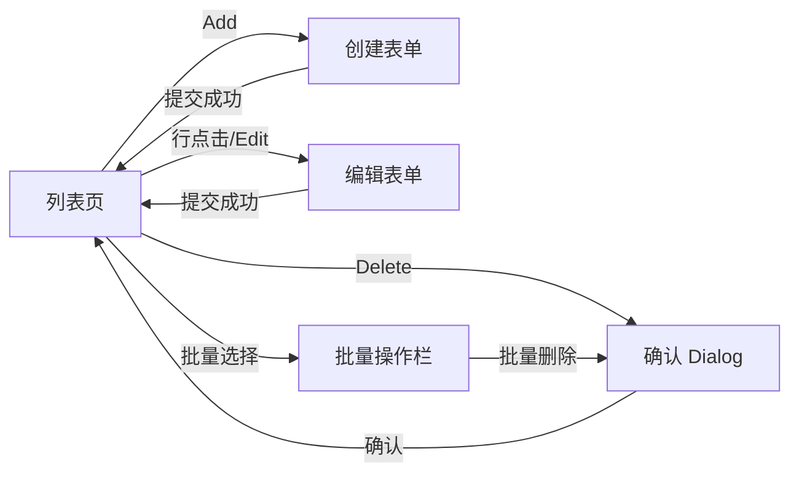

# 布局模式 — CRUD 业务流

典型路由：`/products-list`、`/products/:id/edit`、`/products/new`

关联：`table-list.md`、`form-flow.md`、`feedback-template.md`

## 流程总览



## 1. 列表页（Read）

### 数据流

- 服务端分页：`page`、`pageSize`、`sort`、`filter`
- URL 同步筛选参数（可选）：`?q=&status=&page=1`
- loading：表格区 `Skeleton` 行，保留表头
- empty：居中文案 + primary「Create first」
- error：Alert error + retry Button

### 工具栏

```tsx
<div className="flex flex-col gap-3 sm:flex-row sm:items-center sm:justify-between">
  <Input placeholder="Search..." className="max-w-xs" />
  <div className="flex gap-2">
    <Button variant="outline">Filter</Button>
    <Button variant="primary">Add Product</Button>
  </div>
</div>
```

### 行操作

| 动作 | 组件 | 反馈 |
|---|---|---|
| 编辑 | `Link` 或 `navigate` | — |
| 删除 | `Dialog` + destructive Button | `toast.success("Deleted")` |
| 状态切换 | `Switch` 或 Dropdown | optimistic + rollback on error |

### 批量操作

- 表头 `Checkbox` 全选 / 行选
- 选中 ≥1 时显示浮动 toolbar：`N selected` + outline 操作 + destructive「Delete」
- 批量删除必须二次确认 Dialog

## 2. 创建表单（Create）

### 字段与校验

使用 `react-hook-form` + `zod`：

```tsx
const schema = z.object({
  name: z.string().min(1, "Name is required").max(120),
  price: z.coerce.number().positive("Price must be positive"),
  status: z.enum(["draft", "active", "archived"]),
});
```

### 视觉状态

| 状态 | Input variant | 辅助文案 |
|---|---|---|
| 默认 | `default` | Label `text-gray-700` |
| 校验失败 | `error` | `text-error-500 text-xs mt-1.5` |
| 校验通过（可选） | `success` | `text-success-500 text-xs` |
| 提交中 | 全部 `disabled` | Button 显示 `Loader2` |

### 提交流

1. `onSubmit` → `setIsSubmitting(true)`
2. API 成功 → `toast.success("Product created")` → `navigate("/products-list")`
3. API 失败 → `toast.error("Failed to save")` + 字段级或全局错误
4. 未保存离开 → `beforeunload` 或 Dialog「Discard changes?」

### 权限

- 无创建权限：隐藏 Add 按钮；直接访问路由显示 permission empty
- 只读角色：表单字段 `readOnly` + 隐藏提交

## 3. 编辑表单（Update）

- 预填：`useEffect` + `reset(data)` 或 loader 模式
- 脏检测：`formState.isDirty` 启用 Save；无变更时 Save disabled
- 并发：409 冲突 → toast.warning + 提示刷新
- 部分字段只读：如 `sku` 创建后不可改

## 4. 删除确认（Delete）

```tsx
<Dialog>
  <DialogContent>
    <DialogTitle>Delete product?</DialogTitle>
    <DialogDescription>
      This action cannot be undone. Product &quot;{name}&quot; will be removed.
    </DialogDescription>
    <DialogFooter>
      <Button variant="outline">Cancel</Button>
      <Button variant="destructive" disabled={isDeleting}>
        {isDeleting ? <Loader2 className="animate-spin" /> : "Delete"}
      </Button>
    </DialogFooter>
  </DialogContent>
</Dialog>
```

- 危险操作：destructive 按钮 + 明确对象名称
- 删除中：按钮 loading，禁止关闭 Dialog
- 成功：`toast.success` + 列表 refetch 或乐观移除行

## 5. Toast 反馈（Sonner）

安装 `templates/sonner-theme.tsx` 中的 `TailAdminToaster`。

| 场景 | 调用 |
|---|---|
| 创建成功 | `toast.success("Product created")` |
| 更新成功 | `toast.success("Changes saved")` |
| 删除成功 | `toast.success("Product deleted")` |
| 校验失败 | 字段内联错误，不用 toast |
| 网络错误 | `toast.error("Something went wrong", { description })` |
| 批量完成 | `toast.success("3 items deleted")` |

## 6. 状态矩阵

| 场景 | loading | empty | error | permission |
|---|---|---|---|---|
| 列表 | 表格 Skeleton | 表内居中 empty | Alert + retry | 隐藏操作 + 说明 |
| 表单 | 页面 Skeleton | — | 字段/Alert | readOnly 模式 |
| 删除 | 按钮 Spinner | — | toast.error | 隐藏删除入口 |

## 7. Agent 检查清单

- [ ] 列表 URL/筛选与数据模型一致
- [ ] 表单校验在 blur + submit 触发
- [ ] 提交中禁用重复提交
- [ ] 删除有确认 Dialog 且含对象名
- [ ] 批量操作有选中计数和二次确认
- [ ] 成功/失败有 Sonner 或内联反馈
- [ ] 空态/错误态/权限态不混用
- [ ] 暗色模式完整

## 模板引用

- Input：`templates/ui/input.tsx`
- Button：`templates/ui/button.tsx`
- Toast：`templates/sonner-theme.tsx`
