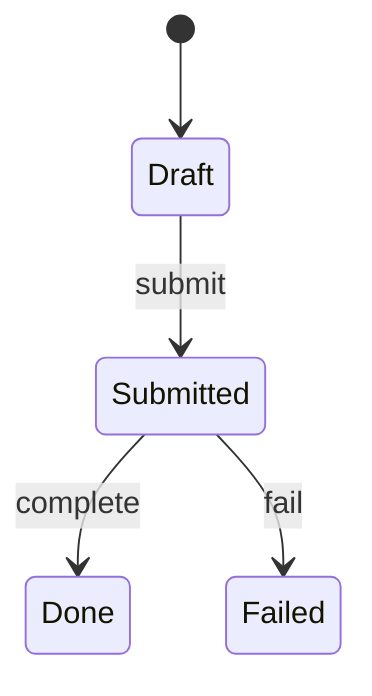

## 3. `docs/domain/<业务流程>.md`

面向：**业务流程测试、QA 用例、跨 API 编排验收**。禁止只有概念散文、无可执行步骤。

```markdown
# 领域 · <业务流程>

（元信息表；consumers 含 process-test / qa）

## 目标与范围
业务要达成什么；**边界外**明确列出（避免测错域）。

## 角色与权限

| 角色 | 类型（人/系统） | 可执行动作 | 权限码/说明 |
|------|-----------------|------------|-------------|
| … | … | … | … |

## 术语

| 术语 | 含义 | 对应对象/表（若有） |
|------|------|---------------------|
| … | … | … |

## 前置条件与夹具（测试用）

| ID | 前置 | 如何准备 | 关联 data/API |
|----|------|----------|---------------|
| FIX-01 | 存在可用租户与管理员 | … | … |
| FIX-02 | … | … | … |

## 主流程（Happy Path）

须达到「别人能照做」的粒度；每步写清 **触发方、动作、API/UI、期望状态**：

| 步 | 角色 | 动作 | API / UI 触点 | 期望结果（状态/数据） |
|----|------|------|---------------|------------------------|
| 1 | … | … | `POST /…`（ORD-01）或页面… | 状态=…；字段… |
| 2 | … | … | … | … |

可用 mermaid `sequenceDiagram` 或 `flowchart` 补充，**不能替代上表**。

## 分支与异常流程

| 分支 ID | 相对主流程何处分叉 | 触发条件 | 步骤摘要 | 期望 | 补偿/人工 |
|---------|-------------------|----------|----------|------|-----------|
| ALT-01 | 步 2 后 | 支付失败 | … | 状态=… | 重试/关单… |
| ALT-02 | … | … | … | … | … |

## 状态机

| 状态 | 含义 | 可迁往 | 触发（谁/什么事件/哪个 API） | 守卫条件 |
|------|------|--------|------------------------------|----------|
| … | … | … | … | … |



非法迁移须写明（客户端/服务端如何拒绝）。

## 业务规则（可测）

每条规则用 **Given / When / Then**，便于直接变测试：

| 规则 ID | Given | When | Then | 优先级 |
|---------|-------|------|------|--------|
| BR-01 | 订单为 Draft 且金额>0 | 调用提交 | 状态变 Submitted；写审计 | P0 |
| BR-02 | … | … | … | … |

## 流程测试场景包（Process Test Pack）

**本章是 domain 可毕业的核心**。每条场景须能手工或自动化执行：

| 场景 ID | 标题 | 覆盖（主/分支/规则） | 步骤（引用步号或写序列） | 期望断言 | 相关 API ID |
|---------|------|----------------------|--------------------------|----------|-------------|
| PT-01 | 主路径下单成功 | Happy + BR-01 | FIX-01 → 主流程 1..n | 终态 Done；… | ORD-01, ORD-02 |
| PT-02 | 支付失败可补偿 | ALT-01 | … | 状态 Failed；可重试 | … |
| PT-03 | 非法状态迁移被拒 | 状态机守卫 | … | 4xx + 业务码… | … |

场景数量：至少覆盖 **1 条主路径 + 主要失败/补偿 + 1 条权限或非法迁移**（域极简单可注明缩减理由）。

## 数据归属与一致性
关键实体归属哪一 `docs/data`；跨聚合一致性（同步/出箱/最终一致）一句话 + ADR 链接。

## SLA / 超时 / 重试
关键等待、超时后状态、重试次数与幂等要求（供测试设 wait/assert）。

## 相关 API / UI / 服务
| 类型 | 链接 | 用途 |
|------|------|------|
| api | `docs/api/…` | 端点详述 |
| ui | `docs/ui/…` | 界面触点 |
| service | `docs/service/…` | 运行依赖 |
```
