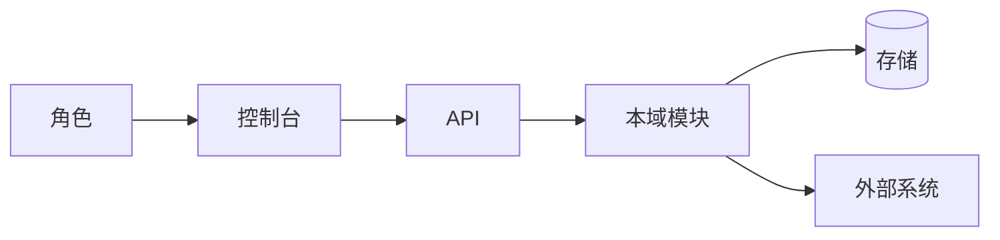
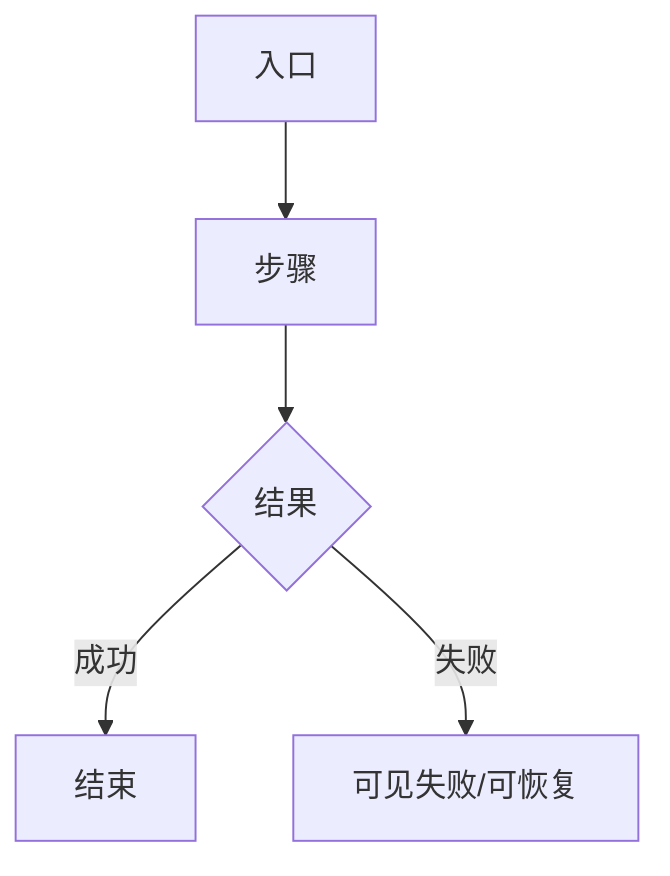

# 成稿模板（蓝图 / audit；spec 见映射）

落盘：

- blueprint：`docs/material/blueprints/<YYYY-MM-DD>-<slug>.md`
- audit：`docs/material/blueprints/<YYYY-MM-DD>-<slug>-audit.md`
- spec：`docs/specs/<slug>.md`（结构按 [spec-map.md](spec-map.md) + go-fast 开工就绪）

**对话确认面 ≠ 本文全文**：确认面只贴 SKILL Phase 5 精简项；本文为完整落盘稿。  
图纪律：[diagrams.md](diagrams.md) · 自检：[self-check.md](self-check.md)

````markdown
# <标题> · <blueprint|audit>

## 元信息

- mode / scope / 日期
- 证据袋路径 · domain_strength
- 智囊团：提纲轮 / 成稿轮 vote 摘要（防演戏：独立 Task）
- 假设状态：用户已确认 | 草稿待确认
- 关联：PRD / arch / 旧 specs / docs/ui 菜谱

## 1. 问题与主任务

（JTBD · 成功 · 最贵失败）

## 2. 架构关系图（强制）



### 2.1 难回退选型约束

| ID | 选题 | 状态 | 证据 | 阻塞 F | 备注 |
|----|------|------|------|--------|------|
| S1 | … | anchored \| researched \| assumed \| open | … | … | …

见 [selection-gate.md](selection-gate.md)。未决不得写成已定主路径。

## 3. 用户场景对照表

（同提纲；偏离须保留理由与 E#）

## 3.1 术语表

| 术语 | 用户向含义 | 勿混淆 |
|------|------------|--------|
| … | … | … |

## 4. 端到端业务流程（先图后文）

### 4.0 核心业务清单（≤5）

| ID | 业务名 | 流程图 | 成功结果 |
|----|--------|--------|----------|
| F1 | … | §4.1 | … |

### 4.1 F1 · <业务名>

#### 流程图（强制）



#### 主路径（与图一致）

每步：操作者 · 动作 · 系统 · 可见反馈 · 数据/外部副作用

#### 例外与逆操作

条件 → 行为 → 用户可见结果 → 审计

### 4.A 附录流程（确认面不展开）

| ID | 业务名 | 摘要 | 图（可选） |
|----|--------|------|------------|
| A1 | … | … | … |

### 4.n 状态与信任

列表/详情/外部世界如何一致；禁止假成功表述

## 5. 文字版页面设计说明（有 UI）

**边界**：有 `docs/ui/` 时先引用壳/菜谱/设计锚，只写本页相对基准的差异与字段；**禁止**重发明整套导航壳。

对每个关键页：

| 项 | 内容 |
|----|------|
| 路由 | … |
| 引用 | docs/ui 菜谱名 / 标杆页（若有） |
| 页头 | 标题/说明/主CTA |
| 布局 | **一层**主表面；工具栏→表→分页同层；**禁止**外卡套表格内框 |
| 主区域 | 字段/表列/操作（行操作 ghost；删除红） |
| 空态/错误/权限不足 | 用户向文案 |
| 关键交互 | Dialog/Sheet/独立页 |

纯后端：写「无 Console 页」及操作入口。

## 6. 角色 · 权限 · 审计

- RBAC/ABAC 与菜单/API 对齐
- 审计事件清单
- 合规保留期（若有）

## 7. 外部依赖与验收诚实

| 依赖 | 用途 | 真实验收路径 | 失败语义 | 证据 |
|------|------|--------------|----------|------|
| … | … | 非 mock | … | E# |

## 8. 可观察验收（生产级）

1. 在 <角色/入口>，当 <操作>，则 <业务可见结果>（真实依赖）
2. 关键失败/拒绝至少一条
3. 审计/权限各至少一条（若适用）

## 9. 假设清单

（未裁定；难回退选型假设须标 S# /「难回退」）

## 10. 偏航对照（blueprint+PRD） / 缺口严重度（audit）

blueprint：

| ID | 分片主张 | 蓝图/业内 | 偏航 | 建议 | 建议回写 PRD？ |
|----|----------|-----------|------|------|----------------|

audit：见 [spec-map.md](spec-map.md) P0/P1/P2 表。

## 11. 范围外与非目标

## 12. 交接

- [ ] 用户已确认（确认面；含架构图 + 核心 F 流程图 + 选型状态）
- [ ] （可选）点名回写 PRD
- [ ] （可选）`mode=spec` 或交 go-fast（`open`/`未确认 assumed` 选型不得交）
- [ ] （可选）待调研 → integration-research
- [ ] （可选）product-reviewer 打分
````

## spec 追加

见 [spec-map.md](spec-map.md)。成稿后**必须** `go-fast-spec-gate`；硬门槛未清 → 不得提示可 go-fast。  
`spec` 建议在「补充说明」保留架构图与核心 F 流程图。
