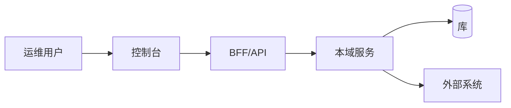
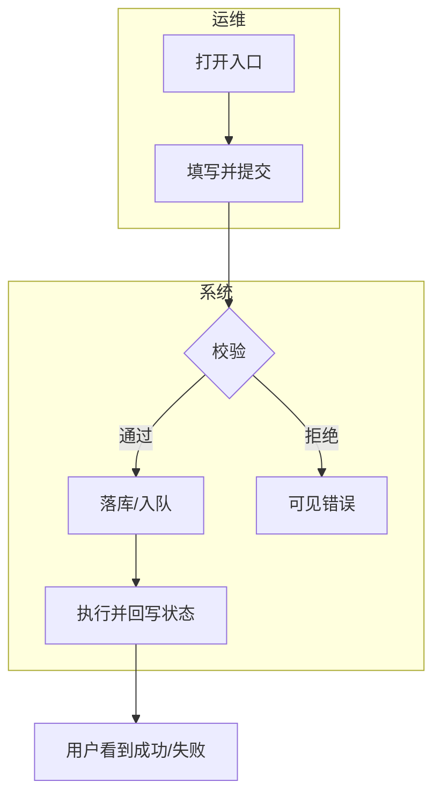

# 流程图纪律（降低确认包认知负荷）

给用户看的提纲 / 成稿 / **对话确认面** **必须**含图，禁止只丢长段落让人脑补。  
默认 **Mermaid**；用户点名才改 PlantUML / 外链图床。

篇幅校准见 [example-mini.md](example-mini.md)。

## 强制图（缺一不得「请确认」）

| 图 | 何时 | 内容 | 推荐类型 |
|----|------|------|----------|
| **架构关系图** | 提纲 + 成稿各 1 张 | 本 scope：角色、Console/API、核心域模块、外部系统、存储；箭头=调用或数据方向 | `flowchart`（C4Context 风格） |
| **业务流程源图** | **每个核心 F** 各 1 张 | 入口→成功；菱形分支；≥2 角色用 subgraph 泳道 | `flowchart` 竖向；跨系统握手多用 `sequenceDiagram` |

## 核心 F 预算（强制）

| 规则 | 说明 |
|------|------|
| **核心 F ≤5** | 进入确认面、须附图的独立主业务闭环最多 5 条 |
| **附录** | 第 6 条起进「附录流程」：落盘可写文字±图，**确认面默认不展开** |
| **命名** | 用户能单独叫出名字的闭环（如「策略创建」「首次备份」「容灾切换演练」） |
| **禁碎拆** | 子步骤不要拆成十几张碎图；单图节点建议 ≤15，过大则「总览 + 子流程」且子流程优先附录 |
| **智囊团** | 核心 F>5 未进附录 → 产品/终端用户至少 `revise` |

「独立主业务流程」≠ 每个按钮一张图。

## 可选图（复杂时加）

| 图 | 何时加 |
|----|--------|
| 状态机图 | 实体 ≥4 个业务状态 |
| 权限/审批序列 | 多角色交接或双人确认 |
| 页面跳转图 | ≥3 个关键页且深链不直观 |

## 画图规则

1. **先图后文**（确认面顺序见 SKILL Phase 5）。  
2. **一张图一个问题**：架构图不画到函数；业务图不塞部署拓扑。  
3. **节点用人话**：禁包名/表名当主标签（脚注可写技术锚点）。  
4. **与正文一致**：图↔主路径步骤双向覆盖。  
5. **失败路径**：每张核心业务图 ≥1 条关键失败/驳回出口。  
6. **`audit`**：强制 as-is；改造建议另附 to-be 或同图注释。  
7. **选型**：人+系统步骤主用 flowchart；纯系统间请求/响应密集用 sequenceDiagram。

## 骨架示例

### 架构关系

````markdown

````

### 单条业务（泳道）

````markdown

````
