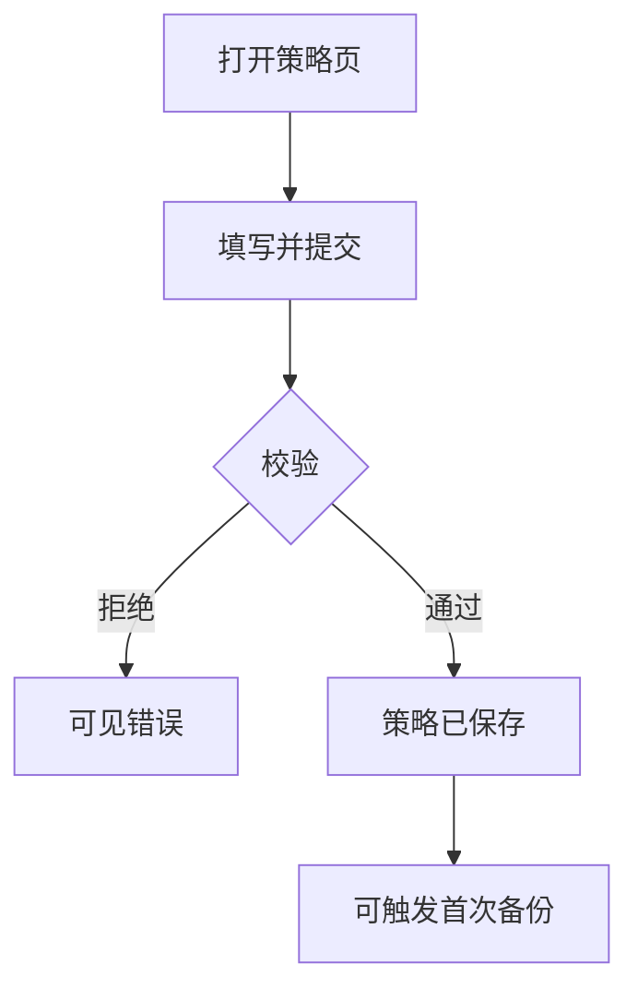

# 金标迷你样例（校准篇幅与确认面）

虚构 scope：`backup-policy-run`（备份策略创建并首次跑通）。用于对齐「提纲宜短 / 确认面先图 / 核心 F≤5」。**勿**复制业务内容到真实仓。

## 提纲篇幅感

- 主任务 + 场景对照表 3～6 行  
- 架构图 1 张（≤10 节点）  
- 核心 F：**2** 张业务图（F1 建策略、F2 首次备份任务）  
- 假设 2～4 条；硬决策 0～1；**选型约束**至少显式一行（本例 S1=anchored 或 assumed）

### 选型约束（示意）

| ID | 选题 | 状态 | 证据 |
|----|------|------|------|
| S1 | 备份对象落在已登记的对象存储适配器 | anchored | docs/arch.md §存储 |

### 架构图（示意）


### F1 流程图（示意）



## 对话确认面（应长这样短）

```text
## 请确认 · backup-policy-run

**JTBD**：运维要能创建备份策略并看到首次任务成功/失败（非「页面能开」）。
**最贵失败**：显示成功但存储侧无对象 / 无法重试。

### 架构关系
（贴 Mermaid）

### 核心业务
**F1 创建策略** — （贴流程图）
**F2 首次备份** — （贴流程图）

### 难回退选型
- S1：对象存储适配器 — **anchored**（arch）

### 假设（须整包接受或改）
- H1：目标存储凭据已在 .dev 登记变量名 …
- H2：…

### 成稿
docs/material/blueprints/2026-07-28-backup-policy-run.md

回复：确认 | 改 H1=… | 改 F2=… | 改 S1=…（将按 revision L0/L1/L2 处理）
```

完整逐步说明、页面字段表、审计清单**只在落盘稿**，确认面不贴墙。

## 成稿目录感（相对提纲）

提纲章节保留并加厚：§4 每 F「图 + 逐步 + 例外」；§5 一页策略列表+详情说明；§6～8 权限审计与验收句；术语表 5～10 词。核心 F 仍 2，不拆成 12 张碎图。
