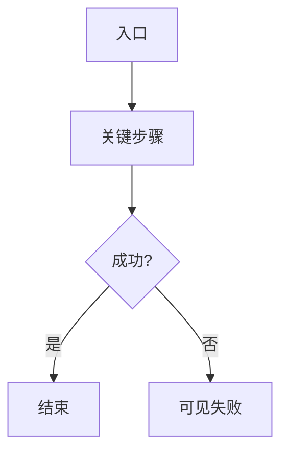

# 提纲模板（智囊团阶段① · 宜短）

路径建议：`docs/material/blueprints/<date>-<slug>-outline.md`  
图纪律 / F 预算：[diagrams.md](diagrams.md) · 证据袋：[evidence-bag.md](evidence-bag.md) · 篇幅：[example-mini.md](example-mini.md)

````markdown
# 提纲 · <scope>

- mode: blueprint | spec | audit
- 日期 / 证据袋：<路径或 E1… 列表> / domain_strength: strong|mixed|weak

## 1. 主任务

- **JTBD**：谁在什么情境下要完成什么
- **成功**：业务结果（非「页面打开」）
- **最贵失败**：做错/做不成的代价

## 2. 用户场景对照表（强制）

| 真实情境（运维/业务） | 本方案步骤 | 业内常见做法 | 跟随/有意偏离 | 依据 |
|----------------------|------------|--------------|---------------|------|
| … | … | … | 跟随 \| 偏离：理由 | E# 或路径 |

无行或全是实验室步骤 → 领域席应否决。

## 2.1 难回退选型约束（强制；无则写「无」）

| ID | 选题 | 状态 | 证据 | 阻塞的核心 F | 动作 |
|----|------|------|------|--------------|------|
| S1 | … | anchored \| researched \| assumed \| open | E# / ADR / 简报 | F1… | none \| ask \| research \| assume |

纪律见 [selection-gate.md](selection-gate.md)：`open` 不得画成已定；`assumed` 须进 §9 并标难回退。

## 3. 架构关系图（强制 · Mermaid）


## 4. 核心主业务（≤5）+ 流程图

| ID | 业务名 | 入口 | 成功结果 | 确认面 |
|----|--------|------|----------|--------|
| F1 | … | … | … | 核心 |
| F2 | … | … | … | 核心 |

### F1 · <业务名>



文字要点（极短）：例外/逆操作 · 审计点

### 附录流程（确认面不展开；可选）

| ID | 业务名 | 为何附录 |
|----|--------|----------|
| A1 | … | 非主闭环 / 低频 |

## 5. 术语表（强制，除非极简 N/A）

| 术语 | 用户向含义 | 勿混淆 |
|------|------------|--------|
| … | … | … |

须覆盖图中主标签。

## 6. 角色与权责

| 角色 | 可做什么 | 不可做什么 | 审批/背锅 |
|------|----------|------------|-----------|

## 7. 页面清单（有 UI 时）

| 路由/名称 | 主任务 | 关键控件 | 空态/错误 | 备注 |
|-----------|--------|---------|-----------|------|
| … | … | … | … | 一层表面；有 docs/ui 则引用菜谱名 |

无 UI：写操作面在哪（CLI/API/告警）。

## 8. 权限 · 配置 · 外部依赖

- 权限模型要点
- 外部系统（真实验收路径一句）+ 证据 E#
- 配置/凭据：env 名，不写值

## 9. 假设（未裁定）

| ID | 假设 | 依据 | 若推翻的影响 | 难回退选型? |
|----|------|------|--------------|-------------|
| H1 | … | E# / S# | … | 是 \| 否 |

## 10. 硬决策结论

| 决策 | 结论 | 来源 |
|------|------|------|

含已问过的选型裁定；与 §2.1 状态对齐。

## 11. 范围外

## 12. 对照 PRD（若有）

| 分片 ID | 蓝图覆盖？ | 疑似偏航 | 建议 |
|---------|------------|----------|------|
````
