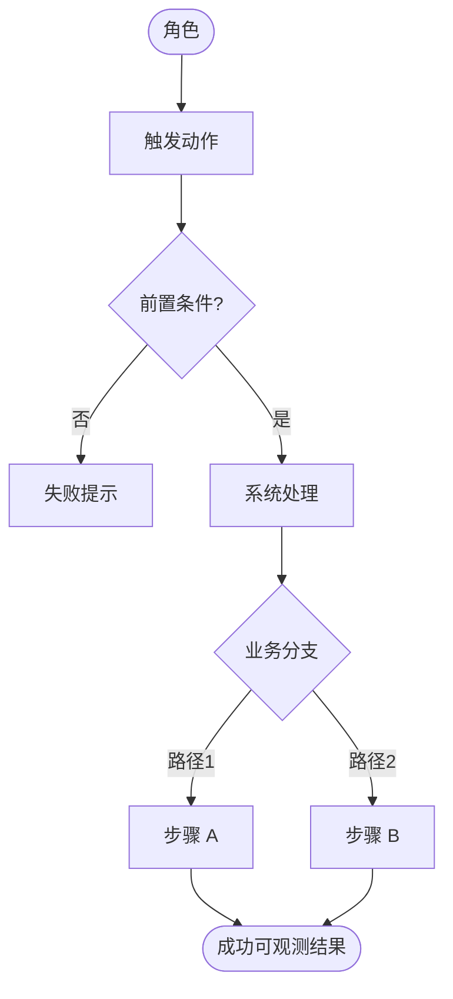
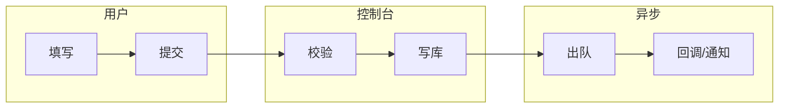

# 业务场景流程图规范

白皮书 E 区的竞争力来自**可演讲的详细流程图**，不是装饰性箭头。

## 硬性要求

1. 每个主场景至少 1 张**端到端总览图**（≥6 个节点）。  
2. 详解页把总览拆成子流程或泳道，**节点名用产品 UI/角色语言**（「点击创建项目」），不用内部函数名当主标签。  
3. 必须出现：触发者、系统动作、关键决策分支（菱形）、成功终点；有权限时加「拒绝」支路。  
4. 源文件：`diagrams/<scenario>-<view>.mmd`（Mermaid）。  
5. HTML deck 必须渲染该图（见 render-paths）；不能只写「见图」而无图。

## 推荐图种

| 用途 | Mermaid | 说明 |
|------|---------|------|
| 端到端业务 | `flowchart TB` 或 `LR` | 默认 |
| 多角色协作 | `flowchart` + subgraph 泳道 | 场景 A/B 至少一张泳道 |
| 系统调用链 | `sequenceDiagram` | 场景 B「系统交互」页 |
| 状态变迁 | `stateDiagram-v2` | 订单/审批/任务生命周期 |

## 节点命名

- ✅ `管理员` / `提交审批` / `平台校验权限` / `通知申请人`  
- ❌ `handleSubmit` / `POST /api/v1/...` / `AuthMiddleware` / Cookie 名作主标签  

内部 ID 可用 mermaid id；展示标签必须是角色或业务动作。工程名只允许出现在 Agent 自用注释，不进成品图。

## 模板：端到端



## 模板：泳道



## 详解页文案结构

每页流程详解建议固定四行（可进 slides.md）：

1. **目标**：用户要完成什么  
2. **前置**：角色/权限/数据  
3. **步骤**：3–7 步，与图节点一一对应  
4. **成功标准**：屏幕上可确认的结果  

异常页：列 3–5 个真实失败态（对照错误处理代码或 PRD），各一行「症状 → 系统行为 → 用户下一步」。

## 反模式

- 只有 3 个框：开始 → 处理 → 结束  
- 一张图塞两个不相关场景  
- 用架构部署图冒充业务场景图  
- 节点全是微服务名、无用户动作  
- **五步正文完全一样**（复制「鉴权 / 写 JOB / 发 MQ」糊满每一列）  
- **底部价值条也复制同一句**（五格都写「失败可定位…」）  
- 步骤详解页用基建黑话当每步主句，听众听不出差异  
- 场景总览用假 % 进度条代替真实阶段名  
- **用排位赛 / bump-rank / `ranks` 图讲作业步骤**（脚注还会露出「估值口径，1=最高」）  

## 填 props 前自检（场景详解）

对 `steps` / `panels` / `topics` / `stats` / `phases` 等数组：

```text
unique(正文) == len(数组)   → 通过
unique(正文) < len(数组)-1 → 复制粘贴，重写后再渲染
props 含 ranks 或文案含「估值口径」→ 换 layout，禁止渲染
```

每步至少回答一个**不同**问题：选谁？拦什么？谁批准？谁执行？证据落哪？

