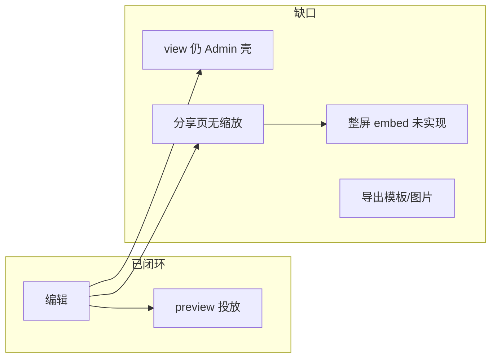

# 数据大屏 Phase 2.5 · 功能缺口需求说明

| 项 | 值 |
|----|-----|
| 文档类型 | 需求说明（Requirements） |
| 日期 | 2026-07-17 |
| 状态 | **已实现**（Wave A–D + Phase 2.6 视口；见 [master gap-fill](../../feature-design/2026-07-29-data-screen-master-gap-fill.md)） |
| 前置 | [Phase 1 表面分化](./2026-07-17-data-screen-de-surface-phase1.md) ✅ · Phase 2 素材/模板/刷新 ✅ |
| 执行计划 | [Phase 2.5 执行计划](./archive/2026-07-17-data-screen-phase25-execute.md) |
| PRD 锚点 | `F07-DASH` DASH-002 companion · `F06-VIZ` VIZ-006 演化 |
| 对标 | [DataEase 数据大屏基础功能](https://dataease.cn/docs/v2/user_manual/panel_basicfunctions/) · [其他组件/素材](https://dataease.cn/docs/v2/user_manual/other_module/panel_style_module/) |

## 1. 背景与问题陈述

Phase 1/2 已交付「编辑 → 预览」主链路：独立 IA、`surfaceKind` 分化、1920×1080 画布、缩放投放预览、基础图层/素材/模板/刷新。

**缺口**：对外投放与 DataEase 工作台能力仍不完整——用户可在大屏编辑并全屏预览，但 **查看/分享/embed 未统一投放模型**；嵌入仅支持单图表；模板生态仅内置 + 导入，无导出与整屏外链。

## 2. 目标

| 目标 | 说明 |
|------|------|
| **G1 投放闭环** | view / share / embed 与 `preview` 共用 `DataScreenPresenter` 投放语义（缩放 + 图表级刷新） |
| **G2 整屏嵌入** | 签发 token 后可 iframe 嵌入**整张大屏**（非逐 chart 链接） |
| **G3 编辑深化** | 图层锁定覆盖缩放；Tab 预览轮播；布局 JSON 导出 |
| **G4 模板流转** | 编辑页导出 JSON；组件/大屏导出图片（替换占位） |
| **G5 DE 可扩展** | 画布比例预设、标题装饰素材；为多屏轮播留 schema 挂点 |

## 3. 非目标（本阶段不做）

| 项 | 理由 |
|----|------|
| 模板市场 / 在线模板中心 | 需运营与存储域，超出 Phase 2.5 |
| 视频 / 流媒体 / 跑马灯 / 网页组件 | DE 有但依赖外链与媒体栈；单列 Phase 3 |
| 图层组合 / 分组 | DE 有，复杂度高；Phase 3 |
| 多屏轮播投放 | Phase 3 规划项，本阶段仅预留配置字段 |
| 外部传参 UI | DE「外部传参设置」；与 embed query 契约一并 Phase 3 |
| 仪表板移动端 adapter | 与大屏正交（Phase 1 计划 Phase 3） |
| 新建 `data-screens` 后端域 | 违反同引擎 + `surfaceKind` 架构决策 |

## 4. 用户故事

### 4.1 投放与分享（P0）

| ID | 角色 | 故事 | 验收要点 |
|----|------|------|----------|
| US-A1 | 分析师 | 在列表点「查看」时，我希望看到与预览一致的 16:9 缩放大屏，而不是 Admin 办公壳里的窄画布 | `/admin/data-screens/:id` view 模式 chromeless 或默认跳转 preview |
| US-A2 | 分析师 | 在分享页我希望看到缩放后的大屏全貌，并复制**整屏**嵌入链接 | `DashboardSharePage` 大屏分支用 `DataScreenPresenter`；展示 `/embed/screen/:id` |
| US-A3 | 集成方 | 通过 embed token 嵌入整张大屏到 OA/Wiki | `POST /embed/token` 的 `dashboardId` 生成 `/embed/screen/...`；页面 chromeless + 缩放 |
| US-A4 | 分析师 | 分享页与预览页刷新行为一致 | `refreshIntervalSec` 触发图表 `executeKey` 刷新，非整页 reload |

### 4.2 编辑与图层（P1）

| ID | 角色 | 故事 | 验收要点 |
|----|------|------|----------|
| US-B1 | 编辑者 | 锁定图层后不能拖拽也不能缩放 | `PixelShape` resize 路径尊重 `widget.locked` |
| US-B2 | 编辑者 | Tab 在预览态按间隔轮播页签 | `tabsConfig.carousel` + 仅 view/preview/embed 生效 |
| US-B3 | 编辑者 | 从编辑页导出当前布局 JSON | 大屏配置区「导出 JSON」下载 |
| US-B4 | 编辑者 | 放大图表后可导出 PNG | `WidgetEnlargeDialog` 真实导出（html2canvas 或 ECharts `getDataURL`） |

### 4.3 素材与配置（P1–P2）

| ID | 角色 | 故事 | 验收要点 |
|----|------|------|----------|
| US-C1 | 编辑者 | 素材库有标题装饰条 | 新增 `screen-title-bar` 素材插入 |
| US-C2 | 编辑者 | 可选 21:9 画布 | `styleConfig` / 大屏配置增加 `1920×1080` / `2560×1080` 预设 |
| US-C3 | 浏览者 | 列表卡片缩略图比例正确 | `DashboardListCardPreview` 大屏走缩放预览 |

### 4.4 模板（P2）

| ID | 角色 | 故事 | 验收要点 |
|----|------|------|----------|
| US-D1 | 编辑者 | 将当前大屏导出为模板 JSON 文件 | 与导入对称的「导出模板」 |
| US-D2 | 管理员 | 列表导入/导出形成闭环 | 文档登记模板 JSON schema 版本字段 |

## 5. 功能需求清单（FR）

### FR-A · 投放统一（Wave A）

| FR | 描述 | 优先级 |
|----|------|--------|
| FR-A1 | 大屏 **view** 路由：默认进入 chromeless 投放（复用 `DataScreenPreviewPage` 或等价壳层），Admin 内保留「返回编辑」 | P0 |
| FR-A2 | **分享页**大屏分支：`DataScreenPresenter` + `useScreenAutoRefresh`；提供「打开全屏预览」与整屏 embed URL | P0 |
| FR-A3 | **整屏 embed 路由** `GET /embed/screen/:dashboardId`（+ token query）；校验 `surfaceKind=data-screen` | P0 |
| FR-A4 | **embed token 路径修正**：`dashboardId` 签发 URL 为 `/embed/screen/{id}`，非 `/embed/chart/{id}` | P0 |
| FR-A5 | embed 页校验大屏 ACL + origin 白名单；`theme=dark` 默认 | P0 |
| FR-A6 | 列表卡片预览：识别 `data-screen` 时使用固定比例缩略 | P1 |

### FR-B · 编辑深化（Wave B）

| FR | 描述 | 优先级 |
|----|------|--------|
| FR-B1 | `locked` 禁止八向缩放与多选变形 | P1 |
| FR-B2 | `tabsConfig.carousel?: { enabled, intervalSec }`；预览/embed 轮播 | P1 |
| FR-B3 | 编辑页「导出布局 JSON」 | P1 |
| FR-B4 | 图表导出 PNG（放大对话框） | P1 |
| FR-B5 | 图层 Panel 展示 Tab 内子组件（扁平列表 + 缩进） | P2 |

### FR-C · 素材与画布（Wave C）

| FR | 描述 | 优先级 |
|----|------|--------|
| FR-C1 | 素材：标题装饰条（HTML 标记 + 专用展示组件） | P1 |
| FR-C2 | 大屏配置：画布比例预设 16:9 / 21:9 | P2 |
| FR-C3 | 素材：第二套边框样式（可选） | P2 |

### FR-D · 模板生态（Wave D）

| FR | 描述 | 优先级 |
|----|------|--------|
| FR-D1 | 编辑页/列表「导出为模板」 | P2 |
| FR-D2 | 模板 JSON 增加 `templateVersion: 1` 元字段 | P2 |

### FR-E · Phase 3 挂点（Wave E，可选收尾）

| FR | 描述 | 优先级 |
|----|------|--------|
| FR-E1 | `styleConfig.screenPlaylist?: { screenIds, intervalSec }` 仅 schema + 文档 | P3 |
| FR-E2 | embed query `?filter.*=` 外部传参设计文档 | P3 |

## 6. DataEase 对标矩阵（缺口 → FR）

| DataEase 能力 | VitalSpan 现状 | Phase 2.5 FR |
|---------------|----------------|--------------|
| 预览 / 全屏投放 | preview ✅ | FR-A1 view 对齐 |
| 分享 + 嵌入 | 仅 per-chart | FR-A2–A5 |
| 刷新配置 §7.4 | preview ✅；share reload | FR-A4 |
| 图层锁定 | 仅挡拖拽 | FR-B1 |
| Tab 轮播 | ❌ | FR-B2 |
| 素材：时钟/边框 | ✅ 基础 | FR-C1/C3 |
| 导出 PDF/图片/模板 | ❌ / 占位 | FR-B4、FR-D1 |
| 模板市场 | ❌ | Out |
| 21:9 画布 | ❌ | FR-C2 |
| 多屏轮播 | ❌ | FR-E1 |

## 7. 技术约束

| 项 | 约定 |
|----|------|
| 存储 | 继续 `dashboards` + `layoutJson`；新字段走 `styleConfig` / `tabsConfig` 扩展 |
| 地图 | GEO-IRON-01 不变 |
| 嵌入 | 复用 `ChartEmbedConfig.dashboardId` + `issue_embed_token`；修正 path |
| 刷新 | 大屏统一 `globalChartRefreshKey` + `refreshIntervalSec`；禁止 share 页整页 reload（大屏） |
| 文件体量 | fe 单文件 ≤300 行；超出拆 `screen/` 子包 |

## 8. 验收总表

| Wave | 用户可见结果 | 自动化 |
|------|--------------|--------|
| A | 分享/embed 可投放整屏大屏；view 与 preview 一致 | embed smoke · share smoke · token path 单测 |
| B | 锁定可靠；Tab 轮播；导出 JSON/PNG | vitest · 可选 Playwright preview |
| C | 标题条素材；21:9 可选 | preset 单测 |
| D | 模板导出/导入 round-trip | templates round-trip test |

## 9. 文档同步（实现后）

| 变更 | 文档 |
|------|------|
| embed 整屏路由 | `docs/api/README.md` |
| view/share/embed 行为 | `docs/ui/layout.md` |
| 域边界 embed | `docs/services/viz.md` · `docs/services/dashboard.md` |
| PRD companion | `docs/automate/prd/F07-DASH.md` DASH-002 |
| VIZ-006 演化 | `docs/automate/prd/F06-VIZ.md` |
| 组件登记 | `fe/src/components/README.md` |

## 10. 风险

| 风险 | 缓解 |
|------|------|
| embed token 已错误指向 `/embed/chart/{dashboardId}` | Wave A 优先修正 + 回归测试 |
| view 改 chromeless 影响「办公态查看」习惯 | 保留 edit 入口；view 重定向 preview 或双模式 query |
| 导出 PNG 跨浏览器差异 | 优先 ECharts `getDataURL`；失败降级提示 |
| Tab 轮播与编辑态冲突 | 编辑态强制关闭轮播（对标 DE） |
