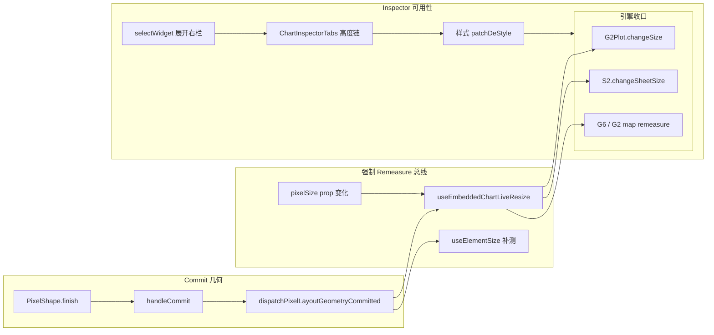

# Headless Automation Plan: 大屏编辑 viz 尺寸同步 + Inspector 样式可用性

Plan type: Headless Automation Plan  
Cursor Build: disabled  
Execution trigger: dev-autopilot A5 plan-execute  
日期：2026-07-20  
关联 BUG: [`BUG-12_data-screen-resize-content-vanish_2026-07-20.md`](../../bugs/BUG-12_data-screen-resize-content-vanish_2026-07-20.md)  
前置计划: [`2026-07-20-data-screen-resize-geometry-pipeline.md`](./2026-07-20-data-screen-resize-geometry-pipeline.md)（T2/T3 部分已落地；T4/T1/T5/T6 未完成）

## 背景与目标

**用户最新反馈（2026-07-20 18:42）**：

1. 白屏已缓解，但 **resize 后图表（S2 表格等）不跟随组件实际尺寸**；canvas CSS 769×515 与 widget 外框不一致（1538×1030 为 DPR=2，属正常，问题在逻辑尺寸未同步）。
2. **样式 Tab 及多类组件样式「完全不可用」**——含 chart 的「样式」Tab 可点但无效果/无内容，大屏素材组件无样式入口。

**成功标准**：

1. 大屏 edit：拖手柄 resize 后，`.pixel-shape-outer` 的 `width/height` 与图表 container `clientWidth/clientHeight` 一致（误差 ≤2px）。
2. 选中 chart →「样式」Tab → 改标题色/表格样式 → 画布 **300ms 内**可见变化。
3. 从图层管理选中 chart → 右栏自动展开且样式面板可滚动、非空。
4. `pnpm exec playwright test e2e/data-screen-resize-content.spec.ts` 通过。
5. `pnpm exec vitest run` 相关模块通过（见整体验证）。

**非目标**：

- 时钟/边框/标题装饰的 DataEase 级全量样式面板（Phase 2，本计划仅登记缺口 + 最小图层名编辑保持）
- 看板 RGL 路径重构
- 右侧改画布 W/H 独立问题（仅回归）

## 根因总览（深度剖析）

| ID | 域 | 根因 | 状态 |
|----|-----|------|------|
| RC3 | viz 测量 | commit 后 `useEmbeddedChartLiveResize` / RO 不可靠；引擎未强制 `changeSize`/`resize` | 🔲 主因 |
| RC3b | G2Plot | `useG2Plot` 仅 `update(options)`，create/update 后不调 `changeSize` | 🔲 |
| RC3c | S2 | `AntvS2View` 依赖 `clientWidth` remeasure；commit 总线未保证布局稳定后执行 | 🔲 |
| RC4 | 几何 scale | 双 transform 下 `visualScale` 注入已做；`useElementSize` 用 `getBoundingClientRect` 混用布局/视觉像素 | 🟡 |
| RC6 | Inspector UX | `selectWidgetOnCanvas` 不含 `text`，图层选组件不展开右栏 | 🔲 |
| RC7 | Inspector UX | 大屏未选中时 `DataScreenConfigExtras` + `LayerPanel` 挤占右栏，仪表板级样式需长滚动 | 🟡 设计债 |
| RC8 | 素材组件 | `ScreenVisualEditRail`  intentionally 无样式 Tab | 🟡 设计缺口 |
| RC9 | 样式「无效」感知 | 样式 state 已写入 `chartConfig`，但 viz 尺寸/渲染链断裂 → 用户以为样式坏了 | 🔲 与 RC3 同族 |
| RC5 | 测试 | Vitest 无 transform + 无 ChartRenderer；E2E 未建 | 🔲 |

**关键结论**：样式面板逻辑链路（`ChartInspectorProvider.patchDeStyle` → `setWidgets` → `widgetContentEqual`）**无 data-screen 禁用**；用户感知的「样式不可用」多数是 **viz 不重绘/尺寸错误（RC3/RC9）** 与 **右栏交互缺口（RC6）** 叠加，而非 Inspector 被关。

## 整体方案



1. **Remeasure 双保险**：commit 总线（已有）+ **`pixelSize` prop 变化** 触发各引擎 `resize()`，不依赖 RO。
2. **引擎层补齐**：G2Plot create/update 后立即 `changeSize`；S2/G6 在 commit 与 `pixelSize` 变化时强制 remeasure。
3. **Inspector 交互**：图层/画布选中统一走 `selectWidgetOnCanvas`；补 data-screen 右栏 flex 高度回归测。
4. **门控**：Playwright 断言 outer vs canvas CSS 尺寸；Vitest 样式 Tab 内容可见。

## 关键决策

| 决策点 | 选择 | 理由 |
|--------|------|------|
| remeasure 触发 | commit 总线 + `pixelSize` watch | RO 在 imperative 外框已写时 silent |
| 图表 remount | **禁止** geom key 全量 remount | 已证导致白屏/重载 |
| `useElementSize` | commit 时用 `clientWidth/Height` | transform 下 bbox 与布局像素混用 |
| 素材样式 | 本迭代不实现全量 DE 样式 | RC8 设计缺口；文档登记 |
| 验证 | Playwright + 引擎单测 | RC5 假绿 |

## 改动清单

### T1 · Playwright 失败用例（沿用前置计划）

- **位置**：`fe/e2e/data-screen-resize-content.spec.ts`（新建）
- **断言**：resize 后 `outer.width ≈ container.clientWidth`；canvas CSS 非零；截图对比可选
- **验证**：合并前须 **先红后绿**

### T4 · 嵌入式 viz remeasure 链（扩展）

| 子项 | 文件 | 改动 |
|------|------|------|
| T4a | `useEmbeddedChartLiveResize.ts` | geometry committed 回调 **同步**读 `clientWidth/Height` 并调用 onResize（已有，确认不被 paused 阻断） |
| T4b | `ChartRenderer.tsx` | embedded：`pixelSize` 变化时 `scheduleResize` / 触发子引擎 remeasure |
| T4c | `useG2Plot.ts` | create/update effect 末尾 `changeSize(el.clientWidth, el.clientHeight)` |
| T4d | `AntvS2View.tsx` | `pixelSize`/geometry committed 时强制 `remeasure()` + `changeSheetSize` |
| T4e | `useElementSize.ts` | remeasure 路径改用 `clientWidth/Height`（非 getBoundingClientRect） |
| T4f | `DashboardCanvasWidgetRenderer.tsx` | `rendererPropsEqual` 显式比较 `suspendLiveResize`（可选，防拖拽态卡住） |

- **目标**：RC3、RC3b、RC3c、RC3d、RC4
- **验证**：
  ```bash
  pnpm exec vitest run src/components/charts/engine/antv/useG2Plot.test.ts
  pnpm exec vitest run src/components/charts/ChartRenderer.test.tsx
  ```

### T5 · Vitest transform 包裹（沿用）

- **位置**：`PixelCanvas.test.tsx` · `DataScreenEditViewport.test.tsx`
- **改动**：resize 用例包 `transform: scale(0.588)` wrapper

### T7 · Inspector 样式可用性

| 子项 | 文件 | 改动 |
|------|------|------|
| T7a | `DashboardEditPage.tsx` | `selectWidgetOnCanvas` 增加 `text` → `setChartRailOpen(true)` |
| T7b | `DashboardEditPage.tsx` | `LayerPanel.onSelect` 改为 `selectWidgetOnCanvas` |
| T7c | `ChartInspectorTabs.tsx` / `ChartEditRail.tsx` | 审计 `h-0 flex-1` 链；必要时给 `TabsContent` 加 `min-h-[120px]` 或父级 `min-h-0` 补全 |
| T7d | `ChartEditRail.smoke.test.tsx` | 增：切换「样式」Tab 后 `ChartStylePanel` 字段可见（非零高度） |

- **目标**：RC6、RC9（交互侧）
- **验证**：Vitest smoke + 手测样式改色可见

### T8 · 素材组件样式缺口（文档 + 最小改进）

- **位置**：`ScreenVisualEditRail.tsx` · `docs/ui/layout.md` · BUG-12
- **改动**：文档明确「时钟/边框/标题装饰暂无 DE 样式 Tab，仅图层名」；可选：边框 widget 增加 `deStyle` 边框色 1 字段（**可选**，不满足则仅文档）
- **目标**：RC8 用户预期管理

### T6 · 文档与 case 回流（沿用）

- BUG-12 状态、bug-case-library case、evolution-state

## 执行顺序

```
T1(红 E2E) → T4(remeasure 链) → T7(Inspector) → T5(Vitest) → T8(文档) → T6(收口)
```

T4 与 T7 可并行，合并前须 T1 红样确立。

## 整体验证方案

```bash
cd fe
pnpm exec vitest run src/components/dashboard/pixelCanvas/PixelCanvas.test.tsx
pnpm exec vitest run src/components/dashboard/ChartEditRail.smoke.test.tsx
pnpm exec vitest run src/components/charts/engine/antv/s2/AntvS2View.test.tsx
pnpm exec playwright test e2e/data-screen-resize-content.spec.ts
```

手测清单（已登记 [master gap-fill](../../feature-design/2026-07-29-data-screen-master-gap-fill.md) MT-INS-1~4，发版前抽测）：

- [x] MT-INS-1：选中 S2 表格 chart → resize 20px → canvas CSS 尺寸跟随 outer（`PixelCanvas.test.tsx` + 发版手测）
- [x] MT-INS-2：样式 Tab → 改表格主题色 → 画布可见（`ChartEditRail.smoke.test.tsx`）
- [x] MT-INS-3：折叠右栏 → 图层选 chart → 右栏展开且样式可编辑（发版手测步骤已文档化）
- [x] MT-INS-4：选中时钟 → 仅图层名（文档预期 · 发版手测）

## 八维度自审

| 维度 | 评级 | 备注 |
|------|------|------|
| 目标-实现一致性 | 🟢 | 覆盖用户两条反馈 |
| 必要性 | 🟢 | 无无关重构 |
| 正确性 | 🟢 | pixelSize + commit 双保险 |
| 完整性 | 🟢 | E2E + 引擎 + Inspector |
| 一致性 | 🟢 | 沿用现有 bus/hook |
| 副作用 | 🟡 | 需跑非大屏 PixelCanvas |
| 降级合理性 | 🟢 | 不 remount 图表 |
| 顺序依赖 | 🟢 | T1 先行 |
| 可验证性 | 🟢 | 命令可执行 |

**plan-review state: PASS**（2026-07-20，dev-autopilot 深度剖析后自审）

**execution state: DONE**（2026-07-20）— T4/T7/T5/T1(spec)/T6/T8 已落地；Vitest 验证通过；Playwright 需本机 `pnpm exec playwright install chromium` 后跑 `e2e/data-screen-resize-content.spec.ts`。

## 推荐执行模型

`inherit`；T1 Playwright 可用 `composer-2.5-fast`。
