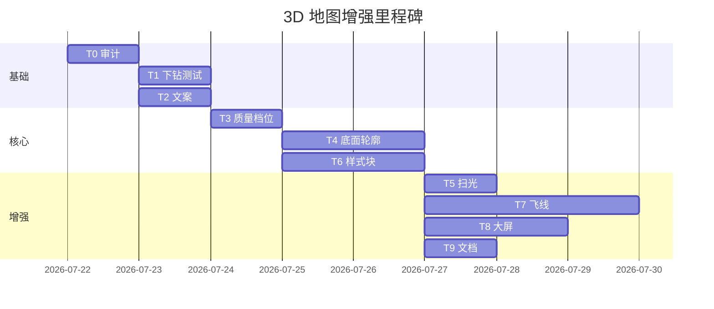

# 3D 离线中国地图增强与全国省市区下钻 — 执行计划书

> **Plan type**: Headless Automation Plan  
> **Cursor Build**: disabled  
> **Execution trigger**: dev-autopilot A5 plan-execute（或人工按 Task 分批合并）  
> **状态**：**M1+M2 DONE**（2026-07-22 plan-execute）· M3（飞线/大屏）未纳入本批  
> **触发**：产品诉求 — 对标 sc-datav 的 3D 区域地图观感，同时保留 VitalSpan BI 的**全国 → 省 → 市 → 区县**离线行政区下钻与真实数据绑定  
> **前置已完成**：[`2026-07-21-map-3d-code-review-fixes.md`](./2026-07-21-map-3d-code-review-fixes.md)（诚实 WebGL 降级 · visualMap · Inspector 门控）  
> **并行计划**：[`2026-07-22-chart-style-tab-de-parity.md`](./2026-07-22-chart-style-tab-de-parity.md) P2「map-3d geo 扩展」与本计划 **T6 合并实施**，避免 `ChartGeoStyle` 双轨  
> **参考仓库**：`sc-datav`（桌面克隆，仅借鉴离线 Three.js 特效实现思路，**禁止**引入其在线依赖或单省写死架构）

---

## 0. 评审摘要

### 0.1 产品定位澄清（必读）

| 用户心智 | 是否支持 | 说明 |
|----------|:--------:|------|
| **百度/高德式**滚轮无限放大、瓦片街道级 | ❌ | 违反 GEO-IRON-01；不在范围 |
| **DataEase 式**点击省 → 换市级 GeoJSON + 数据过滤 | ✅ | 已实现（`map` / `map-3d` 共用 drill 链） |
| **sc-datav 式**3D 挤出 + 飞线/扫光/镜面 | ⚠️ 部分 | 挤出/光照/Orbit 已有；特效层待建 |
| 全国 + 全省市 + 部分区县离线边界 | ✅ | 资产已入库；下钻懒加载 |

**一句话**：我们要做的是 **「BI 行政区点击下钻 + 可选 sc-datav 风 3D 装饰」**，不是在线 GIS 底图。

### 0.2 现状实扫（2026-07-22）

| 能力 | `map`（2D） | `map-3d` | 代码锚点 |
|------|:-----------:|:--------:|----------|
| 全国省级 choropleth | ✅ | ✅ | `china-provinces.json` · `VS_REGIONS_MAP_ID` |
| 33 省市级 GeoJSON 懒加载 | ✅ | ✅ | `geoMapLevels.ts` · `cities/*.json` |
| 331 市区县级 GeoJSON | ✅ | ✅ | `districts/*.json` |
| 点击下钻 + drill 面包屑 | ✅ | ✅（共用） | `ChartRenderer` · `geoMapDrill.ts` |
| roam（缩放/平移/旋转） | d3.zoom 0.4–4x | OrbitControls | `renderChoropleth.ts` · `threeGeoOrbit.ts` |
| 指标挤出高度 | — | ✅ 统一薄底板 | `buildGeoFlatPlateMesh.ts` |
| 离线 hillshade 地形贴图（diffuse+normal+displacement） | — | ✅ | `fe/src/assets/geo/terrain/` · `chinaTerrainLoader.ts` · `build:geo-terrain` |
| WebGL 降级横幅 | — | ✅ | `geoMapRenderResult.ts` |
| 区域名称标签 | ✅ `showRegionLabel` | ❌（刻意不做，见 map-3d CR 计划） | — |
| 飞线/扫光/镜面/轮廓 Shader | — | ❌ | sc-datav `Demo2/map/*` |
| 按 drill depth 性能档位 | — | ❌ | — |
| map-3d 下钻专项回归测试 | 2D 有 | ⚠️ 薄弱 | `geoMapDrill.test.ts` 仅 `map` |
| 样式 Tab 3D 特化项 | 部分 | 部分 | `ChartGeoStylePanel.tsx` 仅 roam/visualMap |

**资产统计**：`cities/` 33 文件 · `districts/` 331 文件 · 台湾省无市级资产（代码已有 `missingAsset` 提示）。

### 0.3 目标与成功标准

1. **`map-3d` 与 `map` 在下钻语义上完全等价**：全国 → 省 → 市 → 区县（直辖市跳市级槽位）；点击触发换图 + 数据过滤，滚轮仅 roam。
2. **3D 视觉达到「大屏可演示」水准**：在省级/全国视图可开关 sc-datav 风格装饰（挤出、底面、轮廓光、可选扫光）；市/区县自动降级保帧率。
3. **配置可交付**：Inspector「地图样式」扩展 3D 块（挤出强度、质量档位、装饰开关），写入 `deStyle.geo3d` 并到达 renderer。
4. **诚实边界**：无 WebGL、缺资产、台湾省等场景有明确 UI 文案；禁止静默假绿。
5. **验收门禁**：`pnpm run test:chart-catalog` 全绿；新增 geo-3d 专项测试；手测清单 §8 全勾。

### 0.4 非目标（本次不做）

- 在线瓦片 / 百度高德 / Mapbox / 经纬度散点底图（GEO-IRON-01）
- 滚轮放大自动进入下一行政区（可作为远期交互，本计划不实现）
- 3D 区域文字标签挤出（可读性差 + 与 2D 标签能力重复）
- 引入 `@react-three/fiber` 全量重构（保持命令式 Three + 动态 import 纪律）
- 世界地图 / 境外行政区
- Playwright WebGL 像素截图基线（CI 无 GPU）

---

## 1. 交互模型（设计真理源）

### 1.1 双通道交互

```
┌─────────────────────────────────────────────────────────┐
│  roam 通道（查看）                                        │
│  · 2D: d3.zoom 缩放/平移，双击复位                         │
│  · 3D: OrbitControls 旋转/缩放/平移，双击复位               │
│  · 不改变 drillStack，不切换 GeoJSON 层级                  │
└─────────────────────────────────────────────────────────┘
┌─────────────────────────────────────────────────────────┐
│  drill 通道（下钻）— 仅预览态 + 配置 drill 链时             │
│  · 单击区域 → push drillStack → 换 mapId → 过滤/聚合数据    │
│  · 面包屑 pop → 回上一层                                   │
│  · 与百度地图「瓦片变精细」无关，是「换一张行政区面图」       │
└─────────────────────────────────────────────────────────┘
```

### 1.2 下钻数据契约（不变）

| drillDepth | mapId | 展示字段 | 点击字段（下一层） |
|:----------:|-------|----------|-------------------|
| 0 | `vs-regions` | `province` | `province` |
| 1 | `vs-geo-{省adcode}` | `city`（直辖市为 `district`） | `city` / `district` |
| 2 | `vs-geo-{市adcode}` | `district` | —（最后一层） |

配置要求：`dimensions` 含 `province` / `city` / `district`（至少省 + 指标）；参考 `ChartMapSalesGeoSetup` · `v_sales_geo`。

### 1.3 3D 质量档位（新增）

| 档位 | 触发条件 | 3D 行为 |
|------|----------|---------|
| `high` | 全国/省级 且 容器短边 ≥ 320px | 全特效：挤出 + 阴影 + 可选扫光/底面 |
| `medium` | 市级 或 容器偏小 | 挤出 + 简化光照，关后处理 |
| `low` | 区县级 或 feature 数 > 80 或 FPS < 30 | 自动降级 2D choropleth + 横幅「已切换 2D 以保障流畅度」 |
| `auto`（默认） | 按 drillDepth + feature 数推断 | 上表规则 |

---

## 2. 架构设计

### 2.1 分层（在现有 ChartEngine 上扩展）

```
ChartRenderer / D3GeoMapView（不变入口）
  ├─ useGeoMapLevel → mapId + knownRegionNames + drillDepth
  ├─ buildD3DispatchPayload → Choropleth config
  └─ map-3d 分支
       ├─ resolveGeo3dQuality(config, drillDepth, featureCount, size)  [新]
       ├─ quality === "low" → renderD3Choropleth（诚实 engine 标记）
       └─ else → renderThreeChoroplethChart
            ├─ core: extrude + materials + orbit（已有）
            ├─ layers/threeGeoGround.ts      [新] 底面/镜面
            ├─ layers/threeGeoOutline.ts     [新] 轮廓高亮
            ├─ layers/threeGeoBeam.ts        [新] 扫光（可选）
            └─ layers/threeGeoFlyLine.ts     [新] 飞线（P3，需流向数据）
```

**目录纪律**（`common.mdc`）：

```
fe/src/components/charts/engine/three/
├── renderThreeChoropleth.ts      # 编排 ≤200 行，委托 layers
├── geoToThreeShapes.ts           # 已有
├── threeGeoOrbit.ts              # 已有
├── threeGeoVisualMap.ts          # 已有
├── geo3dQuality.ts               # 新：档位解析
└── layers/                       # 新子目录（≤6 文件）
    ├── threeGeoGround.ts
    ├── threeGeoOutline.ts
    ├── threeGeoBeam.ts
    └── threeGeoFlyLine.ts
```

### 2.2 样式契约扩展

在 `ChartGeoStyle` 旁增 **类型块** `geo3d`（仅 `map-3d` 消费；与 `2026-07-22-chart-style-tab-de-parity` §6.2 对齐）：

```typescript
// fe/src/lib/chartDeStyle.ts（拟增）
export type ChartGeo3dStyle = {
  /** 挤出高度系数 0–1，映射 maxExtrude */
  extrudeIntensity?: number;
  /** auto | high | medium | low */
  quality?: "auto" | "high" | "medium" | "low";
  /** 装饰层总开关 */
  effectsEnabled?: boolean;
  groundMirror?: boolean;
  outlineGlow?: boolean;
  beamScan?: boolean;
  /** P3：飞线，需流向字段 */
  flyLines?: boolean;
};
```

**纪律**：Inspector 可见字段 ⊆ schema ⊆ renderer；`flyLines` 无流向数据时 UI 禁用并说明。

### 2.3 sc-datav 借鉴映射（实现参考，非复制）

| sc-datav 文件 | 借鉴点 | VitalSpan 落点 | 注意 |
|---------------|--------|----------------|------|
| `map/base.tsx` | Extrude + 法线贴图 | `geoToThreeShapes` 材质增强 | 全国勿用法线贴图逐省（包体） |
| `map/flyLine.tsx` | 贝塞尔 + 贴图动画 | `threeGeoFlyLine.ts` | 需 from/to 维度，非单指标 |
| `map/beamLight.tsx` | 锥形扫光 | `threeGeoBeam.ts` | 默认关，大屏开 |
| `map/mirror.tsx` | 反射地面 | `threeGeoGround.ts` | 简化 MeshStandard 即可 |
| `map/boundary.tsx` | 轮廓线 | `threeGeoOutline.ts` | 复用 outline GeoJSON（按省生成） |
| `shaderMaterial.tsx` | 侧边扫光 Shader | P2 可选 | 文件拆小，禁超 300 行 |

---

## 3. 改动清单（Task）

### T0 · 基线审计与缺口登记（0.5d）

| 项 | 内容 |
|----|------|
| **位置** | 新建 `fe/src/components/charts/engine/geo/geoMap3d.audit.test.ts`；更新 `docs/automate/plans/2026-07-21-chart-per-type-verification.md` §4.8 |
| **改动** | ① 断言 `listBundledCityProvinceAdcodes().length === 33`；② `map-3d` + mock drillStack 调用 `resolveGeoMapLevelContext` 覆盖 depth 0/1/2；③ 记录台湾/缺 district 的 `missingAsset` 用例；④ Dev 页手测脚本：粤→深→南山 |
| **验证** | `pnpm vitest run geoMap3d.audit.test.ts` |
| **产出** | 《缺口表》写入本计划 §7 |

### T1 · map-3d 下钻 parity 测试闭环（1d）

| 项 | 内容 |
|----|------|
| **位置** | `geoMapDrill.test.ts` · `charts.smoke.test.tsx` · `map-3d.smoke.spec.ts` |
| **改动** | 复制 `map` drill 用例为 `map-3d`；smoke 中断言 drill 后 `data-testid=three-map-chart` 且 `mapId` 变化（mock `useGeoMapLevel` 或集成 `resolveGeoMapLevelContext`）；E2E 点击省后面包屑可见 |
| **验证** | `pnpm run test:chart-catalog` |
| **依赖** | T0 |

### T2 · 交互文案与 Inspector 说明（0.5d）

| 项 | 内容 |
|----|------|
| **位置** | `ChartGeoStylePanel.tsx` · `ChartMapSalesGeoSetup.tsx` · `geoMapDrill` 错误文案 |
| **改动** | `map-3d` 帮助文案明确：**点击下钻换层级，滚轮仅旋转/缩放当前层**；与 `map` 共用下钻配置说明；最后一层点击提示「已是最后一层」与 2D 一致 |
| **验证** | `ChartGeoStylePanel` 快照或 RTL 断言文案 |
| **依赖** | 无 |

### T3 · `geo3dQuality` 档位引擎（1d）

| 项 | 内容 |
|----|------|
| **位置** | 新建 `three/geo3dQuality.ts`；改 `D3GeoMapView.tsx` · `renderThreeChoropleth.ts` |
| **改动** | 实现 §1.3 规则；`featureCount` 来自 join 后 features；`size` 来自 `readChartPaintSize`；`low` 时走 `d3Fallback(..., "quality-degraded")` 并横幅；`GeoMapRenderEngine` 扩展 reason 枚举 |
| **验证** | `geo3dQuality.test.ts`：depth0→high、depth2→low、81 features→low |
| **依赖** | T1 |

### T4 · 离线地形贴图（hillshade 三件套）— **DONE 2026-07-22**

| 项 | 内容 |
|----|------|
| **位置** | `fe/scripts/build-china-terrain-assets.mjs` · `fe/src/assets/geo/terrain/` · `three/geo/chinaTerrainLoader.ts` · `buildGeoFlatPlateMesh.ts` · `applyGeoTerrainSurface.ts` |
| **改动** | L0 全国 + 下钻 L1 省级（粤/川/京/沪试点）懒加载 `diffuse/normal/displacement` WebP；UV 按 `meta.bounds` 经纬度；`displacementScale` 驱动起伏（非按省拔高）；删除 Canvas 程序化手绘河线；**无**背景装饰层 |
| **验证** | `chinaTerrainLoader.test.ts` · `applyGeoTerrainSurface.test.ts` · `pnpm run test:chart-catalog` |
| **依赖** | T3 |

### T4b · 3D 装饰层 Phase A — 底面 + 轮廓光（2d，**已废弃**）

| 项 | 内容 |
|----|------|
| **位置** | ~~`three/layers/threeGeoGround.ts`~~ |
| **说明** | 产品决策：3D 地图透明背景，不渲染镜面底面/扫光；保留省界 `LineSegments` 于 `buildGeoFlatPlateMesh` |

### T5 · 3D 装饰层 Phase B — 扫光（1d，可选本里程碑）

| 项 | 内容 |
|----|------|
| **位置** | `three/layers/threeGeoBeam.ts` |
| **改动** | 锥形光带绕 Y 轴慢速旋转；`prefers-reduced-motion` 时静止；仅 `quality===high` |
| **验证** | 手测 + 动画帧 requestAnimationFrame 不泄漏（dispose 取消） |
| **依赖** | T4 |

### T6 · Inspector `geo3d` 样式块（1–2d）

| 项 | 内容 |
|----|------|
| **位置** | `chartDeStyle.ts` · `chartDeStyleBlocks.ts` · `ChartGeoStylePanel.tsx` 或新建 `ChartGeo3dStyleSection.tsx` · `buildRenderConfig.ts` · `applyChartStyleChain` |
| **改动** | UI：挤出强度 slider、质量档位 select、装饰开关；`map-3d` 注册 section；`map` 不展示 geo3d；与 chart-style-tab P2 合并时以 **profile 驱动** |
| **验证** | `applyChartStyleChain.test.ts` geo3d 键到达 payload；`chartStyleSectionRegistry.test.ts` |
| **依赖** | T3、T4 |

### T7 · 飞线流向层（P3，2–3d）

| 项 | 内容 |
|----|------|
| **位置** | `three/layers/threeGeoFlyLine.ts` · `buildChartRenderModel.ts` · field rules |
| **改动** | **数据模型**：在 `dimensions[1]`/`dimensions[2]` 作为 from/to 区域名，或新增 optional `flow` 槽（需 PRD 条）；渲染：省会/市中心点连线，QuadraticBezier + 贴图 UV 动画；无流向数据时隐藏且 Inspector 禁用 |
| **验证** | 单测：两点 fly line 曲线；手测：粤→京流向 demo 数据 |
| **依赖** | T4；**需 PRD 评审**是否扩 fieldRule |
| **风险** | 字段语义膨胀 → 建议先做「装饰飞线」（固定省会→首都）demo 模式，再绑数据 |

### T8 · 大屏预览模式（P4，2d，可选）

| 项 | 内容 |
|----|------|
| **位置** | `DashboardWidget.tsx` 全屏预览 · 新建 `useDataScreenAutofit.ts` |
| **改动** | 借鉴 `autofit.js` 思路：全屏时 scale 整个 widget 至 1920×1080 设计稿；不改变 ChartEngine 内部坐标；仅 `map`/`map-3d` 或 dashboard 级开关 |
| **验证** | 手测 1080p/4k；E2E 全屏按钮 |
| **依赖** | T4 |

### T9 · 文档与 PRD 同步（0.5d）

| 项 | 内容 |
|----|------|
| **位置** | `docs/automate/prd/F06-VIZ.md` VIZ-003 · `docs/services/viz.md` · `chart-per-type-verification.md` |
| **改动** | 追加验收：全国省市区下钻 + map-3d 质量档位 + 装饰开关；明确非百度瓦片；代码锚点更新 |
| **验证** | prd-sync 自检表 |
| **依赖** | T1–T6 合并前 |

---

## 4. 执行顺序与里程碑



### 推荐合并批次

| 批次 | Tasks | 交付物 | 工期 |
|------|-------|--------|------|
| **M1 下钻可信** | T0 + T1 + T2 + T9（部分） | 全国省市下钻测试绿 + 文案 | 2d |
| **M2 3D 可用** | T3 + T4 + T6 | 质量档位 + 底面轮廓 + Inspector | 4–5d |
| **M3 大屏炫效** | T5 + T7 + T8 | 扫光/飞线/全屏（可选） | 5–7d |

**门禁（每批合并前）**：

```bash
cd fe && pnpm run test:chart-catalog
cd fe && pnpm run build
cd fe && pnpm run check:chart-engine
```

---

## 5. 风险与缓解

| 风险 | 概率 | 影响 | 缓解 |
|------|------|------|------|
| 全国 3D 挤出卡顿 | 高 | 大屏演示失败 | T3 强制省级以下降级；几何 simplify（`geoProjection.prepareOfflineGeoGeometry`） |
| 飞线字段语义不清 | 中 | 配置难用 | T7 拆两期：装饰 demo → 正式流向槽 |
| 与 chart-style-tab 冲突 | 中 | 重复 schema | T6 明确 owner：`geo3d` 本计划，`geo` 通用项共享 |
| three 包体增大 | 低 | 首屏 | 保持 dynamic import；layers 懒载 |
| 区县资产缺失 | 中 | 下钻失败 | 已有 `missingAsset`；T0 产出完整清单 |
| sc-datav Shader 移植超 300 行 | 中 | 违反 fe-ui | 按 layer 拆文件 |

**回退**：`quality` 默认 `auto` 且区县强制 2D；关闭 `effectsEnabled` 回到当前 renderThreeChoropleth 行为。

---

## 6. 测试策略

| 层 | 文件 | 断言 |
|----|------|------|
| 资产 | `geoMap3d.audit.test.ts` | 33 省 · adcode 索引完整 |
| 下钻 | `geoMapDrill.test.ts` | `map-3d` 同 `map` 字段链 |
| 档位 | `geo3dQuality.test.ts` | depth/feature 边界 |
| 渲染 | `renderThreeChoropleth.test.ts` | engine/dispose/layers |
| Smoke | `charts.smoke.test.tsx` | `data-render-engine` |
| E2E | `map-3d.smoke.spec.ts` | 路由 + drill 面包屑 |
| 手测 | §8 清单 | 粤深南山 · 台湾 · 无 WebGL |

---

## 7. 资产缺口表（T0 填充，初稿）

| 类型 | 状态 | 处理 |
|------|------|------|
| 全国 34 省级面 | ✅ `china-provinces.json` | — |
| 33 省市级 | ✅ `cities/{adcode}.json` | 台湾 710000 无文件 → `missingAsset` |
| 区县级 | ⚠️ 331/约 2800+ 不完全 | 无资产时停留市级 + 提示 |
| 省轮廓 outline | ❌ 未单独存 | T4 可从省级 GeoJSON 外环生成，无需 sat-hunter |

---

## 8. 手测验收清单

- [ ] **G1** 新建 `map-3d`，接入 `v_sales_geo`，全国省图有挤出与色带
- [ ] **G2** 点击「广东省」→ 市级图 + 面包屑；数据仅广东
- [ ] **G3** 点击「深圳市」→ 区县图（有资产时）
- [ ] **G4** 滚轮放大广东省图 **不** 自动进入市级；仅视角变化
- [ ] **G5** 面包屑返回全国，mapId 恢复 `vs-regions`
- [ ] **G6** 区县视图自动 2D 或简化 3D（quality banner）
- [ ] **G7** 关闭 WebGL → 2D + 横幅（回归 map-3d CR）
- [ ] **G8** 台湾省点击 → `missingAsset` 友好提示
- [ ] **G9** Inspector 改挤出/装饰，刷新后生效
- [ ] **G10** `map` 与 `map-3d` 同数据同 drill 链，仅渲染引擎不同

---

## 9. 与 PRD / 铁律关系

| 文档 | 变更 |
|------|------|
| `prd/F06-VIZ.md` VIZ-003 | 增「3D 全国下钻 + geo3d 样式」验收子条 |
| `docs/services/viz.md` | 地图边界：行政区下钻 ≠ 在线 GIS |
| `docs/arch.md` ADR-12 | 无变更（仍离线 GeoJSON） |
| `.cursor/rules/geo-map-offline-china.mdc` | 无变更 |

---

## 10. plan-review 检查表（待填）

| 检查项 | 预期 |
|--------|------|
| 目标与非目标清晰 | ✅ §0 |
| 不违反 GEO-IRON-01 | ✅ |
| 文件体量可拆分 | ✅ §2.1 layers |
| 与并行 plan 冲突 | ⚠️ T6 需与 chart-style-tab P2 对齐 |
| 可验证性 | ✅ §6 §8 |
| 回退策略 | ✅ §5 |

---

## 11. 决策待定（实施前请确认）

| ID | 问题 | 选项 | 建议 |
|----|------|------|------|
| D1 | 区县默认 3D 还是 2D | A) 全 3D B) auto 降级 C) 用户选 | **B** auto |
| D2 | 飞线数据槽 | A) 装饰无数据 B) 双维度 from/to C) 独立 flow 槽 | **A→C 分期** |
| D3 | 是否引入 R3F | A) 保持命令式 B) 新场景 R3F | **A** |
| D4 | 大屏 autofit 范围 | A) 仅 map-3d B) 整 Dashboard | **B** 远期 |

---

## 12. 八维度自审（计划态）

| 维度 | 评级 | 说明 |
|------|------|------|
| 目标-实现一致性 | 🟢 | Task 覆盖下钻 + 3D 炫效 + 配置 |
| 必要性 | 🟢 | M1 必做；M3 可选 |
| 正确性 | 🟢 | 复用现有 drill 链，不另起炉灶 |
| 完整性 | 🟢 | 含资产缺口、测试、文档、回退 |
| 一致性 | 🟡 | T6 与 chart-style-tab 需协调 |
| 副作用 | 🟡 | GPU 占用；T3 缓解 |
| 降级合理性 | 🟢 | 延续 map-3d CR 诚实降级 |
| 可验证性 | 🟢 | 门禁 + §8 手测 |

**计划状态**：**待产品确认 D1–D4 后进入 M1 执行**。
