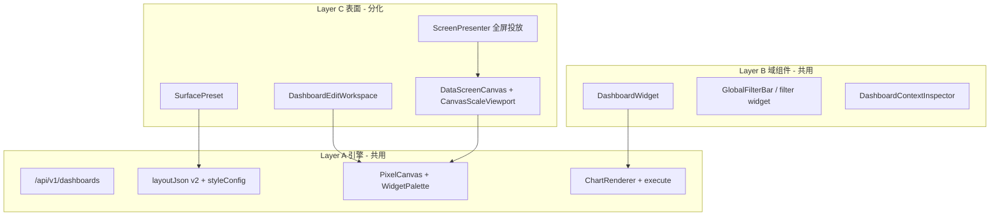

# 数据大屏 DE 表面分化 · Phase 1 执行计划

Plan type: Headless Automation Plan  
Cursor Build: disabled  
Execution trigger: dev-autopilot A5 plan-execute（或人工按 Task 推进）  
日期：2026-07-17

> **前置**：侧栏入口与列表已交付（`/admin/data-screens` · `surfaceKind: data-screen` · 复用 `DashboardEditPage`）。  
> **调研结论**：DataEase v2 将仪表板与数据大屏作为**同一类可视化资源**的两套**表面模式**——共用图表/数据集/出数/分享，差异在布局规则、画布规格与投放壳层。VitalSpan 应采用 **同引擎 + `surfaceKind` 分化**，避免独立后端域或第二套编辑器。

## 目标（Phase 1）

在**不新建后端域**的前提下，完成数据大屏与仪表板的**表面体验分化**：大屏具备固定 16:9 画布、深色主题、缩放预览与全屏投放入口；仪表板保持现有办公分析体验。引擎层（PixelCanvas、Widget、ChartRenderer、execute）继续共用。

## 架构决策



| 项 | 约定 |
|----|------|
| 存储 | 继续 `dashboards` 表；`layoutJson.styleConfig.surfaceKind` 区分 |
| 路由 | 仪表板 `/admin/dashboards/*`；大屏 `/admin/data-screens/*` |
| 默认画布 | 仪表板 1440×≥900；大屏 1920×1080 |
| 地图 | GEO-IRON-01：仅离线中国 GeoJSON |
| 不复用 | 独立 `data-screens` API、大屏场景 React 整页模板（`ds-0x` 仅作 layout JSON 参考） |

## 范围

| In（Phase 1） | Out（后续 Phase） |
|---------------|-------------------|
| `SurfacePreset` 抽象与创建/载入默认值 | 图层管理 Panel（置顶/锁定/组合） |
| `DataScreenCanvas` + `CanvasScaleViewport` | 素材组件（边框/时钟/跑马灯） |
| 大屏全屏预览/投放路由 | 模板市场 / 从模板新建大屏 |
| `ChartSurfaceTheme` 大屏深色皮肤 | 仪表板移动端独立布局 |
| 编辑页 `surfaceKind` 分支（文案/默认配置/工具栏） | ~~列表 API `?surfaceKind=`~~（**2026-07-17 已实现**：`GET /dashboards?surfaceKind=` + `docs/api/README.md`） |
| vitest smoke + `layout.md` 更新 | 轮播多屏、自动刷新调度 |

## Phase 0（已完成）

- [x] 侧栏「数据大屏」→ `/admin/data-screens`
- [x] `DataScreenListPage` 列表/新建/过滤 `surfaceKind`
- [x] `buildDefaultDataScreenLayout()` · 后端 `DashboardStyleConfig.surfaceKind`
- [x] `DashboardEditPage` 大屏路径返回链接
- [x] `DashboardListPage` 排除大屏项

## Phase 1 任务清单

### T1 · SurfacePreset 抽象

**文件**

- 新建 `fe/src/lib/surfacePreset.ts`
- 重构 `fe/src/lib/dataScreenLayout.ts`（导出复用 preset，避免双份默认值）
- `fe/src/lib/surfacePreset.test.ts`

**内容**

```ts
export type SurfaceKind = "dashboard" | "data-screen";

export type SurfacePreset = {
  kind: SurfaceKind;
  canvas: { width: number; height: number };
  defaultStyle: Partial<DashboardStyleConfig>; // colorScheme, gap, scaleMode, surfaceKind
};

export function getSurfacePreset(kind: SurfaceKind): SurfacePreset;
export function buildDefaultLayoutForSurface(kind: SurfaceKind): DashboardLayoutV2;
```

- `dashboard` preset：1440×900、`colorScheme: light`、现有 gap 策略
- `data-screen` preset：1920×1080、深色、`gapPreset: none`、`scaleMode: canvas`

**验收**

- [ ] 单元测试覆盖两种 preset 的 canvas 尺寸与 `surfaceKind`
- [ ] `DataScreenListPage` 创建流程改调 `buildDefaultLayoutForSurface("data-screen")`

---

### T2 · 编辑页 surface 分支强化

**文件**

- `fe/src/pages/admin/dashboard/DashboardEditPage.tsx`
- `fe/src/components/dashboard/DashboardEditWorkspace.tsx`（若需传 `surfaceKind`）
- `fe/src/pages/admin/dashboard/dashboard.smoke.test.tsx`（补大屏路径 smoke）

**内容**

| 分支 | 仪表板 | 数据大屏 |
|------|--------|----------|
| 默认载入无 layout | `buildDefaultLayoutForSurface("dashboard")` | 已有 data-screen preset |
| 页眉文案 | 返回看板列表 | 返回大屏列表（已有） |
| 工具栏 | 完整 DE 工具栏 | 同工具栏；隐藏/灰显不适用的「移动端」类占位（若有） |
| 右栏默认 | 仪表板配置 | 同 inspector；默认展开「整体配置」且主题为 dark |
| 预览按钮 | `/dashboards/:id` view | 跳转 `/data-screens/:id/preview`（T3） |

**验收**

- [ ] 从 `/admin/data-screens/:id/edit` 进入时画布为 1920×1080 深色
- [ ] 从 `/admin/dashboards/:id/edit` 行为与改前一致
- [ ] smoke：大屏编辑路由可挂载且不报错

---

### T3 · DataScreenCanvas + CanvasScaleViewport

**文件**

- 新建 `fe/src/components/dashboard/screen/DataScreenCanvas.tsx`
- 新建 `fe/src/components/dashboard/screen/CanvasScaleViewport.tsx`
- 新建 `fe/src/components/dashboard/screen/CanvasScaleViewport.test.ts`
- 参考：`.agents/skills/.../layout-patterns/bi-data-screen.md` · `templates/bi/data-screen-canvas.tsx`

**内容**

- `CanvasScaleViewport`：根据容器尺寸对固定画布做 `transform: scale()` 居中（`transform-origin: center top`）
- `DataScreenCanvas`：包装 `DashboardLayoutPreview` 或 view 模式 `PixelCanvas`（readonly）
- props：`layoutJson`、`scaleMode: "fit" | "width" | "none"`（初版实现 `fit`）
- 可选页眉 slot：`title`、时钟占位（静态即可，Phase 2 再做动态）

**验收**

- [ ] 1920×1080 布局在 1280×720 容器内完整可见、无裁切
- [ ] vitest：scale 计算在边界宽高下 > 0 且 ≤ 1

---

### T4 · 全屏预览 / 投放路由

**文件**

- 新建 `fe/src/pages/admin/data-screens/DataScreenPreviewPage.tsx`
- `fe/src/routes.tsx`：`/admin/data-screens/:id/preview`
- `fe/src/lib/admin-layout-routes.ts`：preview 纳入 fill-height / chromeless
- `fe/src/layouts/AdminLayout.tsx`：preview 隐藏侧栏或走 minimal chrome
- `DashboardEditPage` / `DashboardListCard`：大屏卡片增加「预览」链到 preview

**内容**

- preview 页：全视口 `DataScreenCanvas` + `scaleMode: fit`
- 顶栏仅保留：返回编辑、全屏（`document.documentElement.requestFullscreen`）、可选刷新
- 权限：`dashboard:read`（与列表一致）

**验收**

- [ ] `/admin/data-screens/:id/preview` 可只读展示已保存 layout
- [ ] 编辑页「预览」跳转正确
- [ ] `DataScreenListPage.smoke.test.tsx` 或新 `data-screen-preview.smoke.test.tsx` 通过

---

### T5 · ChartSurfaceTheme 大屏皮肤

**文件**

- 扩展 `fe/src/lib/chartSurfaceTheme.ts` 或新建 `fe/src/lib/screenChartTheme.ts`
- `fe/src/components/charts/ChartRenderer.tsx`（传入 `surfaceKind` 或 effective preset）
- 参考：`templates/bi/screen/theme/chart-theme-screen-dark.ts`

**内容**

- 当 `surfaceKind === "data-screen"` 时：
  - ECharts grid 线 `opacity` 降低
  - 轴标签/图例浅色
  - KPI 字号阶梯加大（通过现有 `KpiCard` variant 或 styleConfig 子字段）
- 禁止在 scenario 页内联裸色；经统一 theme 函数注入

**验收**

- [ ] 大屏 preview 下图表轴/图例可读（深色底）
- [ ] 仪表板 view 模式视觉无回归
- [ ] vitest：theme 函数对 screen/dashboard 返回不同 token 指纹

---

### T6 · 文档与导航

**文件**

- `docs/ui/layout.md`：补 `/data-screens/:id/preview`、投放模式表
- `fe/src/components/README.md`：登记 `DataScreenCanvas` · `CanvasScaleViewport`

**验收**

- [ ] layout.md 路由树与壳层模式表含 preview
- [ ] README 组件索引已更新

---

## Phase 2（2026-07-17 已交付核心）

| Task | 说明 | 状态 |
|------|------|------|
| ~~T7~~ | ~~后端 `GET /dashboards?surfaceKind=` 筛选 + 测试~~ | ✅ 已提前交付 |
| T8 | `LayerPanel`：z-index、锁定、隐藏 | ✅ |
| T9 | `VisualAssetWidget`：边框/时钟（素材菜单） | ✅ 基础版 |
| T10 | 模板 JSON 导入 / 从模板新建大屏 | ✅ 内置模板 + 导入 |
| T11 | 自动刷新倒计时 + `RefreshStatusBadge` | ✅ preview 页 |

> **缺口与后续**：见 [Phase 2.5 需求说明](./2026-07-17-data-screen-phase25-requirements.md) · [执行计划](./2026-07-17-data-screen-phase25-execute.md)（投放闭环、整屏 embed、Tab 轮播、导出等）。

## Phase 3（规划）

- 仪表板移动端布局 adapter（DE 仪表板独有，与大屏正交）
- 大屏轮播 / 多屏投放
- embed token 目标类型显式 `data-screen`

## 验证命令（Phase 1 收口）

```bash
cd fe
npx vitest run src/lib/surfacePreset.test.ts src/components/dashboard/screen src/pages/admin/data-screens src/lib/resolve-nav.test.ts
npx tsc --noEmit
```

手动走查：

1. 侧栏 **仪表板** / **数据大屏** 分列，列表互不混排  
2. 新建大屏 → 编辑 → 预览 → 全屏，16:9 无裁切  
3. 仪表板编辑/查看无视觉与行为回归  

## PRD / 文档同步评估

| 变更 | 文档 | 状态 |
|------|------|------|
| 大屏 preview 路由、表面分化行为 | `docs/ui/layout.md` | ✅ 2026-07-17 |
| 新增用户可见能力（全屏预览） | `docs/automate/prd/F07-DASH.md` DASH-002 companion | ✅ 2026-07-17 |
| `surfaceKind` 域边界 | `docs/services/dashboard.md` | ✅ 2026-07-17 |
| 列表 `?surfaceKind=` + 画布尺寸契约 | `docs/api/README.md` | ✅ 2026-07-17 |
| FE 组件登记 | `fe/src/components/README.md` | ✅ 2026-07-17 |

## 八维度自审（摘要）

| 维度 | 结论 |
|------|------|
| 范围 | FE 表面层；后端复用 dashboards |
| 风险 | 中低；主要回归点在 ChartRenderer 主题 |
| 依赖 | DASH-002 像素画布、DASH-003 组件库已具备 |
| 测试 | 单元 + smoke；无 Playwright 要求 |
| 对标 DE | 对齐精确定位 + 缩放预览；图层/素材留 Phase 2 |
| 体量 | 新文件 ≤4；单文件 ≤300 行（fe-ui） |

## 参考

- [DataEase 技术白皮书 · 工具](https://whitepaper.dataease.cn/tool)（仪表板挤压 vs 大屏重叠）
- [DataEase 快速入门](https://dataease.io/docs/v2/quick_start/)（工作台分模块）
- VitalSpan：`fe/src/lib/dataScreenLayout.ts` · `docs/ui/layout.md`
- 设计规范：`.agents/skills/b-design-system-tailadmin-radix/references/layout-patterns/bi-data-screen.md`
