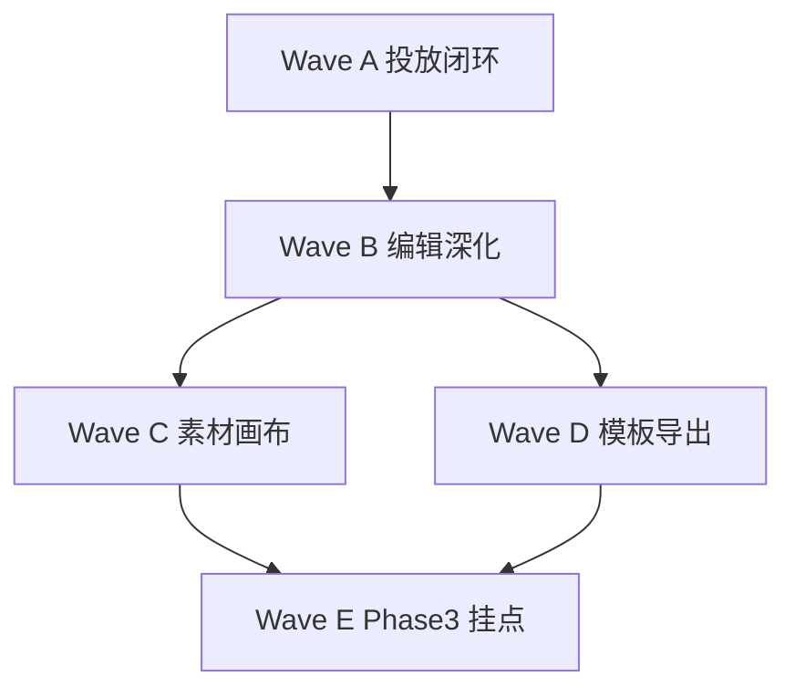

# 数据大屏 Phase 2.5 · 执行计划

| 项 | 值 |
|----|-----|
| Plan type | Headless Automation Plan |
| Cursor Build | disabled |
| Execution trigger | dev-autopilot A5 plan-execute（或人工按 Wave 推进） |
| 日期 | 2026-07-17 |
| 状态 | **已实现**（2026-07-17 归档） |
| 需求真理源 | [Phase 2.5 需求说明](../2026-07-17-data-screen-phase25-requirements.md) |

> **摘要**：补齐「对外投放闭环」与 DE 工作台高频能力。优先 Wave A（view/share/embed），再 Wave B（编辑深化），C/D 可并行。

## 依赖与顺序



| Wave | 预估 | 可独立验收 |
|------|------|------------|
| A | 2–3d | ✅ |
| B | 2d | ✅ |
| C | 1–2d | ✅ |
| D | 1d | ✅ |
| E | 0.5d | 文档 only |

---

## Wave A · 投放闭环（P0）

### A1 · view 路由与 preview 对齐

**需求**：FR-A1

**文件**

- `fe/src/routes.tsx`
- `fe/src/pages/admin/data-screens/DataScreenViewPage.tsx`（新建，或复用 `DataScreenPreviewPage` + `showEditChrome` prop）
- `fe/src/lib/dataScreenLayout.ts`（`dataScreenViewPath` 若需调整）

**内容**

- 方案 **推荐**：`/admin/data-screens/:id` → 重定向 `/admin/data-screens/:id/preview`（保留 edit 走 `/edit`）
- 备选：独立 `DataScreenViewPage` 与 preview 共用 presenter，顶栏仅「编辑」无缩放控件
- 列表卡片「查看」链到 preview 或新 view

**验收**

- [x] 从列表进入查看为 chromeless 16:9 投放
- [x] 仪表板 `/admin/dashboards/:id` 行为无回归

---

### A2 · 分享页大屏投放

**需求**：FR-A2、FR-A4（刷新）

**文件**

- `fe/src/pages/admin/dashboard/DashboardSharePage.tsx`
- `fe/src/components/dashboard/screen/DataScreenSharePanel.tsx`（新建，从 SharePage 拆出）

**内容**

- `isDataScreenLayout` 分支：
  - 布局预览区改用 `DataScreenPresenter` + `useScreenAutoRefresh`
  - 移除大屏分支的 `setInterval(load)` 整页 reload
- 新增卡片：**整屏嵌入链接** `origin/embed/screen/{dashboardId}`
- 保留 per-chart 链接（次要），标注「单组件嵌入」

**验收**

- [x] 大屏分享页缩放预览与 preview 视觉一致
- [x] 配置 `refreshIntervalSec=30` 时图表刷新、页面不闪白
- [x] smoke：`DashboardSharePage` data-screen fixture（`DashboardSharePage.smoke.test.tsx` A2 · 2026-07-29）

---

### A3 · 整屏 embed 路由与页面

**需求**：FR-A3、FR-A5

**文件**

- `fe/src/embed/EmbedScreenPage.tsx`（新建）
- `fe/src/routes.tsx` — `path="screen/:dashboardId"`
- `fe/src/embed/EmbedLayout.tsx`（若需深色默认）

**内容**

- chromeless：`DataScreenPresenter` + `presentationMode=fit` + 可选 URL `?mode=fitWidth`
- 鉴权：公开路径加入 embed 白名单（对齐 `EmbedChartPage` token 校验链）
- 加载失败：origin 拒绝 / 非 data-screen 布局 → 错误页

**验收**

- [x] `/embed/screen/{uuid}` iframe 可展示整屏
- [x] 非 data-screen dashboard 返回明确错误

---

### A4 · embed token 路径修正

**需求**：FR-A4

**文件**

- `backend/app/integration/embed_token.py`
- `backend/app/integration/embed_resolve.py`（若有 path 解析）
- `tests/test_embed_token.py` 或现有 embed 测试

**内容**

- `dashboard_id` 签发：`embed_path = f"/embed/screen/{payload.dashboard_id}?token={token}"`
- `chart_id` 保持 `/embed/chart/{chart_id}?token=...`
- 回归：`EMBED_MISSING_TARGET` / `EMBED_TARGET_CONFLICT` 不变

**验收**

- [x] `POST /api/v1/embed/token` body `{ dashboardId }` 返回的 `embedUrl` 含 `/embed/screen/`
- [x] 后端单测通过

---

### A5 · 列表缩略图比例

**需求**：FR-A6

**文件**

- `fe/src/components/dashboard/DashboardListCardPreview.tsx`
- 可选 `fe/src/components/dashboard/screen/DataScreenThumbPreview.tsx`

**内容**

- `isDataScreenLayout` 时外包 `aspect-video` + `CanvasScaleViewport` 缩略 scale

**验收**

- [x] 大屏列表卡片预览无拉伸变形

---

## Wave B · 编辑深化（P1）

### B1 · 图层锁定覆盖缩放

**需求**：FR-B1

**文件**

- `fe/src/components/dashboard/pixelCanvas/PixelShape.tsx`
- `fe/src/components/dashboard/pixelCanvas/PixelCanvas.tsx`（多选 resize 入口）

**内容**

- 所有 resize / 多选变形入口：`if (widget.locked) return`
- 锁定态视觉：已有 opacity 可选加强边框提示

**验收**

- [x] 锁定后拖拽与八向手柄均无效
- [x] vitest：`PixelCanvas` locked 用例（2026-07-29 Wave B 验收闭合）

---

### B2 · Tab 预览轮播

**需求**：FR-B2

**文件**

- `fe/src/components/dashboard/layoutUtils.ts` — `TabsWidgetConfig.carousel?`
- `fe/src/components/dashboard/TabsWidget.tsx`
- `fe/src/components/dashboard/TabsEditRail.tsx` — 轮播开关 + 间隔
- `backend/app/dashboard/schemas.py` — tabs config 扩展（若后端校验 tabs）

**内容**

- `carousel: { enabled: boolean; intervalSec: number }`，默认关闭
- `mode === "edit"` 不轮播；`view` / `preview` / `embed` 启用
- `intervalSec` 下限 3s

**验收**

- [x] 预览态 Tab 自动切换
- [x] 编辑态不切换（`TabsWidget.test.tsx` · 2026-07-29）

---

### B3 · 导出布局 JSON

**需求**：FR-B3

**文件**

- `fe/src/components/dashboard/DashboardContextInspector.tsx` 或大屏配置区
- `fe/src/lib/exportLayoutJson.ts`（下载 helper）

**内容**

- 按钮「导出布局」：`JSON.stringify(layout, null, 2)` + 文件名 `{slug}-layout.json`
- 仅 `canSave` 时可用

**验收**

- [x] 导出文件可被列表「导入 JSON」成功创建（`exportLayoutJson.test.ts` · `DataScreenConfigExtras` · 2026-07-29）

---

### B4 · 图表导出 PNG

**需求**：FR-B4

**文件**

- `fe/src/components/dashboard/widget-actions/WidgetEnlargeDialog.tsx`
- `fe/src/components/dashboard/widget-actions/exportChartImage.ts`（新建）

**内容**

- 图表 widget：ECharts `getDataURL`；非图表隐藏按钮
- 移除 `toast.message("导出图片将在后续版本提供")` 占位

**验收**

- [x] 放大对话框下载 PNG 成功（`WidgetEnlargeDialog.test.tsx` · 2026-07-29）

---

### B5 · 图层 Panel Tab 子项（P2）

**需求**：FR-B5

**文件**

- `fe/src/components/dashboard/LayerPanel.tsx`

**内容**

- 扁平列表：`parentTabsId` 子组件缩进显示
- 子项仅选中，不提供排序（或仅排序同页签内）

**验收**

- [x] Tab 内图表在图层列表可见（`LayerPanel.test.tsx` · 2026-07-29）

---

## Wave C · 素材与画布（P1–P2）

### C1 · 标题装饰条素材

**需求**：FR-C1

**文件**

- `fe/src/lib/screenVisualAssets.ts` — `SCREEN_TITLE_BAR_MARKER` · `createScreenTitleBarWidget`
- `fe/src/components/dashboard/screen/ScreenTitleBarDisplay.tsx`
- `fe/src/components/dashboard/TextWidget.tsx`
- `fe/src/components/dashboard/CanvasEditToolbar.tsx` — 素材菜单项

**内容**

- 对标 DE 顶部装饰：居中标题槽 + 两侧渐变线（纯 CSS）
- 专用 `ScreenVisualEditRail` 分支或复用

**验收**

- [x] 素材菜单可插入标题条（`screenVisualAssets.test.ts` C1 · 2026-07-29）
- [x] 图层显示 `素材 · 标题装饰`（`screenVisualAssets.test.ts` · 2026-07-29）

---

### C2 · 画布比例预设 21:9

**需求**：FR-C2

**文件**

- `fe/src/lib/surfacePreset.ts` — `DATA_SCREEN_CANVAS_21_9`
- `fe/src/lib/canvasPersistPolicy.ts` — 持久化 min height 随比例
- `fe/src/components/dashboard/dashboardOverallConfigPanel.tsx` — 大屏可见的比例选择

**内容**

- 预设：`1920×1080`（16:9）、`2560×1080`（21:9）
- 切换时提示「仅影响新布局基准，不自动缩放已有组件」

**验收**

- [x] 新建/切换 21:9 保存成功（height≥900）（`surfacePreset.test.ts` C2 · 2026-07-29）
- [x] preview 仍等比适配（`DataScreenPresenter` + `CanvasScaleViewport` 已有 · 2026-07-29）

---

## Wave D · 模板导出（P2）

### D1 · 导出为模板

**需求**：FR-D1、FR-D2

**文件**

- `fe/src/lib/dataScreenTemplates.ts` — `exportDataScreenTemplate(layout)`
- `fe/src/pages/admin/dashboard/DashboardEditPage.tsx` 或 `DataScreenListPage`

**内容**

- 导出 JSON 包装：
  ```json
  { "templateVersion": 1, "kind": "data-screen", "name": "...", "layout": { ... } }
  ```
- 导入端 `parseImportedDataScreenLayout` 兼容 `layout` 嵌套

**验收**

- [x] 导出 → 导入 round-trip 布局一致（`dataScreenTemplates.test.ts` · 2026-07-29）
- [x] `dataScreenTemplates.test.ts` 覆盖（`round-trips template export wrapper` · 2026-07-29）

---

## Wave E · Phase 3 挂点（可选）

### E1 · 多屏轮播 schema

**需求**：FR-E1

**文件**

- `fe/src/components/dashboard/dashboardStyleConfig.ts`
- `docs/automate/plans/2026-07-17-data-screen-de-surface-phase1.md` Phase 3 节

**内容**

- 仅类型 + 文档；不实现播放逻辑

**验收**

- [x] `DataScreenPlaylistConfig` + `screenPlaylist?` 已存在于 `dashboardStyleConfig.ts`（2026-07-29）
- [x] `dashboardStyleConfig.test.ts` schema round-trip（2026-07-29）

---

## 验证命令（收口）

```bash
# Wave A
cd fe && npx vitest run src/pages/admin/data-screens src/embed src/pages/admin/dashboard/DashboardSharePage
cd backend && python -m pytest tests/ -k embed -q

# Wave B–D
cd fe && npx vitest run src/components/dashboard/pixelCanvas src/lib/dataScreenTemplates.test.ts src/lib/screenVisualAssets.test.ts
cd fe && npx tsc --noEmit
```

手动走查：

1. 大屏列表 → 查看/预览 → 16:9 无壳  
2. 分享页 → 整屏 embed 链接 → iframe 打开  
3. `POST /embed/token` + `dashboardId` → URL 正确  
4. 锁定图层 → 不能拖也不能缩  
5. Tab 轮播仅在预览生效  
6. 导出 JSON → 导入新建成功  

## PRD / 文档同步（Wave A 完成后必做）

| 完成 Wave | 更新 |
|-----------|------|
| A | `layout.md` · `api/README.md` · `F07-DASH` companion · `viz.md` |
| B | `F07-DASH` DASH-007 Tab 轮播子项 |
| C–D | `fe/src/components/README.md` |
| 全部 | 本计划 Status → implemented |

## 八维度自审

| 维度 | 结论 |
|------|------|
| 范围 | FE 为主；embed path 小改 BE |
| 风险 | 中：embed 路径变更为破坏性修复，需回归 chart token |
| 依赖 | Phase 1/2 presenter、token 链已存在 |
| 测试 | 单测 + smoke；Pointer QA 仍属 DASH-002 债 |
| 对标 DE | Wave A 闭合投放；B/C 覆盖高频编辑能力 |
| 体量 | 新建文件约 6–8；超 300 行须拆 |
