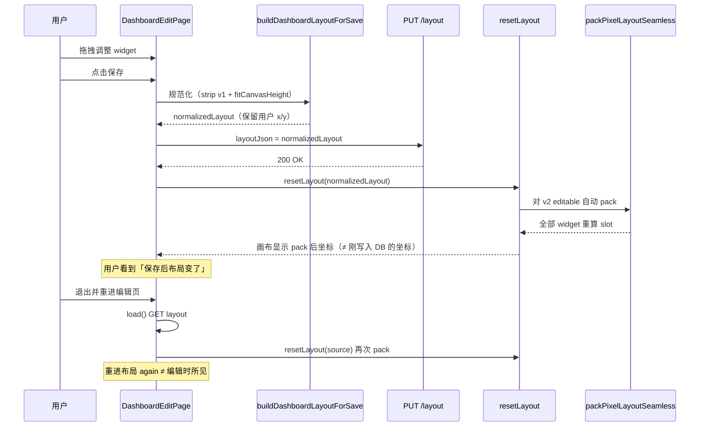

# BUG-6 看板保存/重载后布局漂移

> 发现日期：2026-07-15  
> 状态：**fixed**（2026-07-15 A5 执行）  
> 优先级：**P0**  
> 影响域：fe / dashboard edit / pixel canvas v2

---

## 问题总览

| 根因 ID | 描述 | 状态 | 优先级 |
|---------|------|------|--------|
| RC-1 | `resetLayout` 对 v2 持久化布局无条件执行 `packPixelLayoutSeamless`，重排全部 widget 坐标 | ✅ 已修复 | P0 |
| RC-2 | `load()` 调用 `resetLayout(source)` 而非 `resetLayout(prepared.layout)`，加载/指纹/侧栏 widget 源不一致 | ✅ 已修复 | P0 |
| RC-3 | 保存/指纹/内存 hydration 三条管线不对称（save 不 pack、fingerprint 可能 pack、resetLayout 必 pack） | ✅ 已修复 | P0 |
| RC-4 | v1 几何字段经 chart 编辑回写 pixel widget（已通过 `stripV1LayoutGeometry` 缓解 422，但不解决视觉漂移） | 🟡 部分缓解 | P1 |

---

## 1. 现象还原（用户视角）

| 项 | 描述 |
|----|------|
| 操作 | 在 Dashboard 编辑页调整像素画布上组件位置/尺寸 → 点击保存 → 画布立即变化；退出编辑页再进入，布局与保存前所见不一致 |
| 期望 | 保存后所见即所得；刷新/重进后布局与最后一次保存一致 |
| 实际 | 保存瞬间组件位置跳动；重进后布局再次变化，与保存前编辑态不同 |
| 频率 | v2 像素画布 + `VITE_DASHBOARD_PIXEL_CANVAS` 非 `false` 时**必现**（只要 widget 不在 pack 算法的「从零装箱」结果上） |
| 关联线索 | 此前 PUT layout 422（v1 字段混入）已单独修复；本 BUG 侧重**保存成功后的几何漂移** |

---

## 2. 失败时序（L1 代码路径）



| Seq | 动作 | 结果 | 证据 |
|-----|------|------|------|
| 1 | 用户保存 | PUT body 含用户 x/y | `DashboardEditPage.tsx` L615–636 |
| 2 | 保存成功回调 | `resetLayout(normalizedLayout)` | L638 |
| 3 | resetLayout v2 分支 | 调用 `packPixelLayoutSeamless(loaded)` | `useDashboardCanvasState.ts` L103–108 |
| 4 | pack 算法 | 按 y/x/order/id 排序后 `findNextOpenSlot` 从零放置 | `collisionLayout.ts` L193–215 |
| 5 | 重进 load | `resetLayout(source)` 非 prepared | `DashboardEditPage.tsx` L236–240 |
| 6 | fingerprint | 也可能 pack，与 DB 存盘不一致 | `dashboardCanvasMode.ts` L167–172 |

**分水岭**：Seq 3 — 持久化写入的是用户坐标，内存展示却被 pack 覆盖。

---

## 3. 根因分析

### RC-1：`resetLayout` 自动 pack 破坏 WYSIWYG 🔲 待修复

**代码证据**（L1）：

```103:108:fe/src/hooks/useDashboardCanvasState.ts
        if (editable && loaded.version === 2) {
          try {
            const normalized = packPixelLayoutSeamless(loaded);
            if (pixelLayoutFingerprint(normalized) !== pixelLayoutFingerprint(loaded)) {
              pixel.setLayout(normalized);
```

**机制**：`packPixelLayoutSeamless` 不是「仅解决重叠」，而是按排序**从零装箱**到 `(0,0)` 起的最左上方空位。任意非紧凑布局（例如用户故意留白、横向并排）都会被整体重排。

**影响**：保存后（Seq 2→3）、重进加载（load→resetLayout）均触发，100% 导致视觉漂移。

**修复方向**：持久化 hydration 禁止 auto-pack；pack 仅用于用户显式「整理布局」或插入新组件时的可选动作。

---

### RC-2：`load()` 使用 raw `source` 而非 `prepared.layout` 🔲 待修复

**代码证据**（L1）：

```236:260:fe/src/pages/admin/dashboard/DashboardEditPage.tsx
      const prepared = prepareDashboardLayout(
        source,
        mode === "edit" ? pixelEnabled : false,
      );
      resetLayout(source);
      ...
      setSavedFingerprint(
        dashboardPersistFingerprint(
          prepared.layout,
```

**机制**：

- v1 布局 + pixelEnabled：`prepared.layout` 已是迁移后的 v2，但 `resetLayout(source)` 仍收到 v1，内部再次 `prepareDashboardLayout` 虽可兜底，但与 `setWidgets`/`fingerprint` 使用的 `prepared.layout` 不同源。
- v2 布局：`source === prepared.layout`，但侧栏 `setWidgets` 走 `pixelWidgetToLayoutWidget(prepared)` 而 canvas 走 `resetLayout(source)`，若中间 style/sync 改写 widget，双轨状态可能分叉。

**修复方向**：统一 `resetLayout(prepared.layout)`；widgets/fingerprint 同源。

---

### RC-3：save / fingerprint / resetLayout 管线不对称 🔲 待修复

| 阶段 | 是否 pack | 是否 fitCanvasHeight | 是否 strip v1 |
|------|-----------|---------------------|---------------|
| `buildDashboardLayoutForSave` | 否 | 是 | 是 |
| `dashboardPersistFingerprint` | **可能** | 是（经 save 构建） | 是 |
| `resetLayout`（hydrate） | **是** | 间接（pack 内 growCanvasHeight） | 经 prepare 间接 |

**代码证据**（L1）：

```160:177:fe/src/components/dashboard/dashboardCanvasMode.ts
export function dashboardPersistFingerprint(
  ...
  if (canonical.version === 2 && pixelEnabled) {
    try {
      const packed = packPixelLayoutSeamless(canonical);
```

注释写「与保存 + resetLayout 后内存态一致」，但 save 写入 DB 的是 **未 pack** 的 `normalizedLayout`，造成：

1. 保存后 fingerprint 若 pack → 与 DB 不一致 → `isDirty` 异常或二次保存
2. 用户所见（pack 后）与 DB（未 pack）永久分叉

**修复方向**：抽取单一 `canonicalizeLayoutForPersistence(layout, style)`；save、fingerprint、post-save hydrate **共用且禁止 pack**。

---

### RC-4：chart 编辑回写 v1 几何字段 🟡 部分缓解

**代码证据**：`mergeLayoutWidgetIntoPixel` 已剥离 colSpan/gridX 等；`buildDashboardLayoutForSave` 用 `stripV1LayoutGeometry` 防止 422。

**残留风险**：内存态 pixel widget 仍可能携带 v1 字段，若其他路径序列化 widget 可能再次污染。纳入 canonical pipeline 统一 strip。

---

## 4. 改进建议（优先级）

| 优先级 | 动作 | 预期效果 |
|--------|------|----------|
| P0 | 移除 `resetLayout` hydrate 路径的 auto-pack | 保存/重进不再跳动 |
| P0 | `load()` 改用 `prepared.layout` | 加载单源真相 |
| P0 | 统一 canonical pipeline；fingerprint 去掉 pack | save↔memory↔fingerprint 一致 |
| P1 | 新增 round-trip 单测（save 序列 → hydrate → 坐标不变） | 回归门禁 |
| P2 | 可选「整理布局」按钮显式调用 pack | 保留 DE 式紧凑能力但不默认 |
| P2 | bug-case-library 登记 | 防止再引入 auto-pack on load |

---

## 5. 修复记录

| 日期 | 变更 | 状态 |
|------|------|------|
| 2026-07-15 | 移除 hydrate auto-pack；fingerprint 去 pack；load 用 prepared.layout | fixed |

---

## 6. 关联

- Plan: `docs/automate/plans/2026-07-15-dashboard-layout-roundtrip-drift.md`
- Case: `.agents/skills/bug-case-library/cases/fe-dashboard-layout-roundtrip-drift.md`
- 相关（已修复）: CASE-2026-07-13-002 热更新 wipe；v1 字段 422 strip
