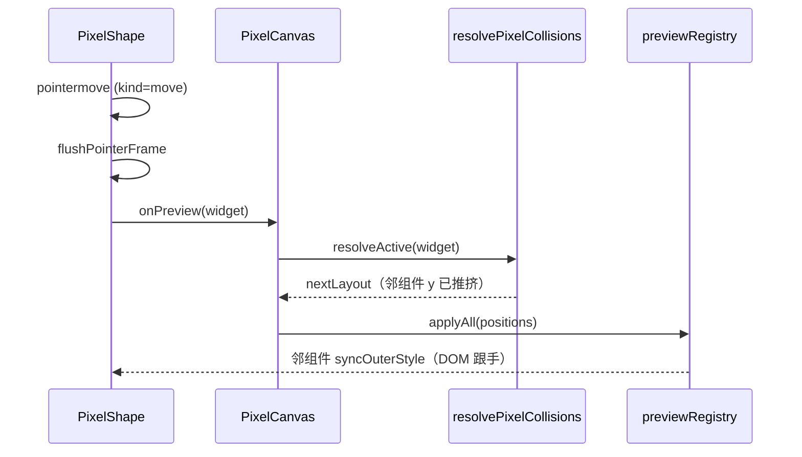
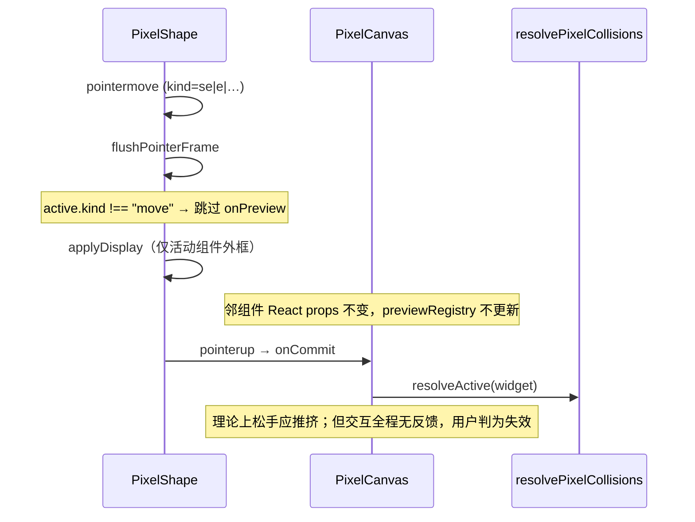

# BUG-7：像素画布缩放时不与邻组件碰撞推挤

> 最近更新：2026-07-15

| 字段 | 值 |
|------|-----|
| 状态 | 🧪 代码修复完成，待真实浏览器 Pointer QA |
| 优先级 | P0 |
| 发现日期 | 2026-07-15 |
| 影响范围 | Dashboard 编辑画布 v2 · `PixelShape` / `PixelCanvas` · DASH-002 |
| 数据来源 | 用户反馈（L2）；源码取证（L1） |
| 关联 | BUG-2 · `2026-07-14-dashboard-canvas-ux-de-complete.md` C3（错误决策） |

---

## 问题总览

| # | 根因 | 状态 | 说明 |
|---|------|------|------|
| RC-1 | `PixelShape.flushPointerFrame` 仅在 `move` 时调用 `onPreview`，resize 整条 preview 管线被跳过 | ✅ 已修复 | resize 与 move 共用 `onPreview` |
| RC-2 | `2026-07-14-dashboard-canvas-ux-de-complete.md` C3 将「resize 禁止 onPreview」列为已做目标，与 DE 交互语义冲突 | ✅ 计划勘误 | 见 headless plan |
| RC-3 | `resolvePixelCollisions` 仅垂直 `pushDown`，横向扩宽不推挤侧邻组件 | 🟡 设计债 | 与 DE 部分场景不一致，单独立项 |
| RC-4 | 缺少 resize 级联推挤自动化测试（仅有 drag 用例） | ✅ 已补 | `PixelCanvas.test.tsx` + `collisionLayout.test.ts` |

---

## 现象描述

[用户反馈] 编辑页选中漏斗图（`PixelShape`，`#shape-id-dc28e66f-…`）八向缩放时，外框尺寸变化，但**下方/周围组件不跟随让位**，表现为「叠在一起」或「无交互感」。

| 项 | 描述 |
|----|------|
| 期望 | 与 DataEase / 拖拽行为一致：缩放导致重叠时，邻组件实时被推挤（至少松手后必须无重叠） |
| 实际 | 缩放过程中邻组件纹丝不动；用户感知为「不会和其他组件交互」 |
| 对比 | 同画布**拖拽**组件时，下方组件会随 `onPreview` 级联下移（已有单测） |
| 触发 | 编辑模式 · v2 像素画布 · 多组件布局 · 任意 resize 手柄 |

---

## 失败时序（L1）

### 拖拽（正常路径）



### 缩放（缺陷路径）



| Seq | 动作 | 拖拽 | 缩放 |
|-----|------|------|------|
| 1 | `flushPointerFrame` | 调用 `onPreview` | **不调用** |
| 2 | `handlePreview` | `resolvePixelCollisions` + `applyAll` | 未进入 |
| 3 | 邻组件 DOM | `registerPreviewSync` 即时更新 | 冻结在旧坐标 |
| 4 | `pointerup` | `handleCommit` → `resolveActive` | 同左（但用户已在前序步骤判定失败） |

**分水岭**：`PixelShape.tsx` L303–305 — `if (active.kind === "move")` 门控。

---

## 根因 1：resize 未接入 preview 管线 🔲

**代码证据（L1）**：

```303:305:fe/src/components/dashboard/pixelCanvas/PixelShape.tsx
    if (active.kind === "move") {
      onPreview?.(withRect(widget, next));
    }
```

`PixelCanvas` 侧 preview 负责碰撞与邻组件 DOM 同步：

```263:275:fe/src/components/dashboard/pixelCanvas/PixelCanvas.tsx
  const flushPreview = useCallback(
    (widget: PixelLayoutWidget) => {
      if (!onLayoutChange) return;
      previewThrottleRef.current = Date.now();
      pendingPreviewRef.current = null;
      const nextLayout = resolveActive(widget);
      const positions = new Map(
        nextLayout.widgets.map((item) => [item.id, widgetRect(item)] as const),
      );
      previewRegistryRef.current.applyAll(positions);
      syncPreviewStageMetrics(nextLayout);
    },
```

已有单测仅覆盖 **drag** 级联，无 resize 对应用例：

```64:106:fe/src/components/dashboard/pixelCanvas/PixelCanvas.test.tsx
  it("previews cascade push-down on neighbors while dragging", async () => {
    // … fireEvent.pointerDown 拖动组件 …
    expect(blockerShape).toHaveStyle({ top: "400px" });
  });
```

**影响量化**：凡 resize 导致与邻组件矩形重叠的场景，**100%** 在手势过程中无邻组件反馈（拖拽同场景有反馈）。

### 修复方向

- 将 `onPreview` 扩展至 resize（`isResizeInteraction`），复用同一 `handlePreview` + `resolvePixelCollisions` + `previewRegistry` 路径。
- 保持 `PIXEL_PREVIEW_THROTTLE_MS`（32ms）节流，避免每帧 React 重渲染。
- 活动组件仍走 `applyDisplay` + `pixel-shape-live-resize`（图表跟手），邻组件仅 `syncOuterStyle`（与 drag 一致）。

---

## 根因 2：计划文档将缺陷固化为「目标」🔲

**代码证据（L1）**：

`docs/automate/plans/2026-07-14-dashboard-canvas-ux-de-complete.md` §2 架构图与 Phase C3：

```text
resize 期间: 不 onPreview（move 才 preview）
…
C3 | resize **禁止** onPreview（已做，单测锁定）
```

该决策初衷是减少 resize 期间邻组件/图表重绘（性能），但：

1. 与 DASH-002「拖缩放对标 DE」冲突；
2. 与 BUG-2 用户验收目标冲突；
3. 未用单测锁定「禁止 preview」，却用文档锁定错误方向。

**修复**：在新 headless plan 中**显式反转 C3**；`2026-07-14-dashboard-canvas-ux-de-complete.md` 追加勘误，避免执行队列继续强化缺陷。

---

## 根因 3：碰撞模型仅垂直推挤 🟡

**代码证据（L1）**：

`collisionLayout.ts` 的 `pushDown` 只调整 `y`，`cascadeFromBlocker` 从活动组件出发向下推：

```73:86:fe/src/components/dashboard/pixelCanvas/collisionLayout.ts
function pushDown(
  positions: Map<string, PixelRect>,
  moverId: string,
  blockerId: string,
  gap: number,
): boolean {
  // …
  positions.set(moverId, { ...mover, y: Math.round(nextY) });
```

**[推断]** 用户若横向扩宽与左右邻组件重叠，即使修复 RC-1 也不会侧向让位。需产品确认是否对标 DE「仅纵向流式」或补 `pushRight` 二维碰撞。

**优先级**：P2（本 BUG 主诉为缩放无交互，纵向推挤即可覆盖漏斗图向下变高场景）。

---

## 根因 4：测试缺口 🔲

| 已有 | 缺失 |
|------|------|
| drag preview 级联 | resize SE 向下增高 → 下方组件 preview 下移 |
| keyboard resize 仅断言活动组件尺寸 | resize commit 后 `layoutsOverlap === false` |
| `collisionLayout` 单元测 | 端到端 pointer resize 路径 |

---

## 改进优先级汇总

| 优先级 | 动作 | 对应根因 |
|--------|------|----------|
| P0 | `PixelShape` resize 走 `onPreview`；补 vitest | RC-1、RC-4 |
| P0 | 新 headless plan 执行 + completion-gate | RC-1 |
| P1 | 反转 `dashboard-canvas-ux-de-complete` C3 文档 | RC-2 |
| P1 | 手工 Pointer QA：缩放推挤 4 场景（§ plan） | 验收 |
| P2 | 评估横向碰撞 / DE 对标 | RC-3 |

---

## 修复记录

| 轮次 | 日期 | 内容 | 结果 |
|------|------|------|------|
| R0 | 2026-07-15 | 根因剖析 + headless plan | 计划 PASS |
| R1 | 2026-07-15 | `PixelShape` resize 接入 `onPreview`；补 vitest 2 项 | 34 vitest 绿；tsc 绿；待手测 |

---

## 验收标准（修复后）

1. 两组件上下相邻，上方 SE 向下拉高：下方组件**跟手**下移，松手后无重叠。
2. 与 drag 用例对称：`PixelCanvas.test.tsx` 新增 resize 级联用例绿。
3. `layoutsOverlap(resolvedLayout) === false` 对 commit 结果成立。
4. resize 期间无 `POST /api/v1/charts/render-spec` 风暴（沿用 paused live resize）。
5. 手工 QA：漏斗/饼图/表格三种 widget 各测 1 次缩放推挤。
