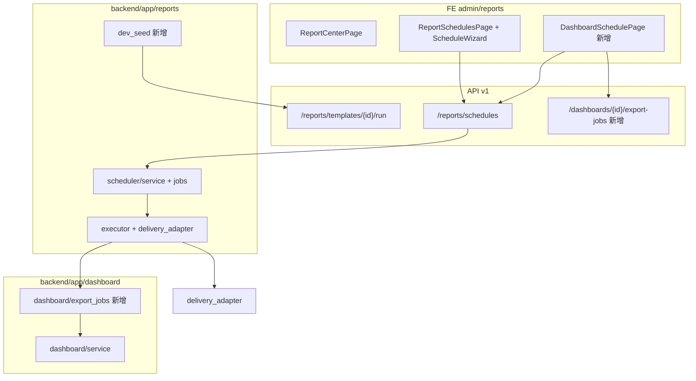

# Feature Land Design: 报表模块对标 DataEase — 投递 + 可跑通 + 看板定时报告

| 字段 | 值 |
|------|-----|
| 日期 | 2026-07-30 |
| 调研对象 | M6 报表子系统 · 消费 Hub + 模板调度 + 预制分析（`/admin/reports/*`） |
| 状态 | **handed-off**（P0a–P1 核心已实现 · 2026-07-31） |
| **用户确认范围** | **G3, G1, G2, G5** |
| 成功标准 | dev 空库可跑通 17 条手测主路径；调度可配接收人并邮件投递；创建调度可用日/周/月向导；可选 Dashboard/大屏作为定时报告源并 PDF/Excel 附件投递 |
| 非目标 | G4 模板线真实 PDF/Word 排版；G6 另存为/手工执行；G7 WYSIWYG；G8 统一导出中心；IM 渠道（企微/钉钉/飞书）二期 |
| 启用维度 | `persist` · `contract` · `async` · `integrate` · `ui-vertical` · `docs-sync` · `regression` |

## 1. 问题与意图

- **现有功能锚点**：报表中心 IA 与 UX 已闭合（2026-07-30）；后端 RPT-001~007 L1/companion 已交付；调度 semi-real 执行 + SMTP 适配器已有，但 **无接收人**、**裸 Cron**、**仅绑 catalog 模板**。
- **用户任务（一句话）**：在保留 VitalSpan Word/PDF 模板线的前提下，**对标 DataEase「定时报告」的投递体验**，并补齐 **看板/大屏定时推送** 主路径；同时让 dev 环境能跑通消费主链。
- **用户原话摘要**：
  - 「这个功能真的这么重要吗？DataEase 和 Superset 都有吗？」→ 方案采用 **分期 + 复用现有调度域**，G5 与 Superset Alerts 部分重叠但 DE 政企签单刚需；不扩 Jasper 大全套。
  - 「/feature-land-design 帮我对标 DataEase 去做和完善」→ 本方案。
  - 门禁 A 确认：**G3 + G1 + G2 + G5**（含看板定时，全量 DE 主路径）。
- **Must**：G3 dev 种子；G1 接收人 + 邮件；G2 日/周/月向导；G5 Dashboard/大屏选源定时报告。
- **Nice**：调度页「立即执行」入口；执行历史展示接收人摘要；G5 支持「展示数据 vs 全部数据」范围（DE 有，P1 可简化为当前过滤器快照）。
- **Out**：在线地图；IM  webhook 生产级；模板 WYSIWYG；独立导出任务中心；重写 Hub IA。
- **约束**：GEO-IRON-01；零 Superset/DataEase 运行时依赖；调度仍走 `reports/scheduler/` 域，G5 通过 **多源 schedule** 扩展而非新建平行系统。

## 2. 现状审计

| 区域 | 已有 | 缺口/可优化 | 证据 |
|------|------|-------------|------|
| 消费 Hub | 授权模板网格、搜索/格式筛选、预制预览 | 空库无 demo 数据，手测 8 条阻塞 | `ReportCenterPage.tsx` · `report-center-manual-test-cases.md` |
| 模板 run | `POST .../templates/{id}/run` + extension→query | 缺 `dataSourceId` → `RPT_ENGINE_DATASOURCE_REQUIRED` | `engine/execute.py` |
| 预制 run | `prefab/seed.py` 2 条 binding | `equipment` 无物理表 → `RPT_PREFAB_ENTITY_NOT_READY` | `prefab/run.py` |
| 调度 FSM | draft→scheduled→paused/cancelled；APScheduler cron | **无 recipients**；channels 写死 `["email","webhook"]` | `scheduler/schemas.py` · `executor.py` L106 |
| 调度 UI | `SchedulePanel` / `ReportSchedulesPage` 裸 Cron 输入 | 无日/周/月向导；无接收人表单 | `SchedulePanel.tsx` L59-60 |
| 邮件投递 | `delivery_adapter.py` SMTP；固定 subject | 无 To/Cc、无附件名、无按接收人拆分 | `delivery_adapter.py` |
| 看板定时报告 | **无** | DE 主路径：选 Dashboard → 定时 PDF/Excel | `docs/services/reports.md` · 无 dashboard schedule API |
| Dashboard 导出 | 缩略图 capture；模板 `export_envelope` | **无** Dashboard 实例 PDF/Excel 渲染管线 | `dashboard/thumbnails.py` · `dashboard/templates/service.py` |

## 3. 外部调研（DataEase）

| 对标点 | 参考 | 可观察行为 | 启示 | 不采纳 |
|--------|------|------------|------|--------|
| 定时报告入口 | [DE 定时报告](https://dataease.cn/docs/v2/xpack/sys_management_report/) | 组织管理中心独立任务列表 | G5 入口可并列「模板调度」与「看板定时报告」 | 1:1 复制 DE 菜单名 |
| 选源 | DE 定时报告 | 选仪表板/数据大屏 | G5 `sourceType=dashboard\|data_screen` | 在线地图底图 |
| 接收人 | DE | 角色/组织/外部邮箱 | G1 `recipients[]` | 一期 IM |
| 频率 | DE | 日/周/月/自定义 | G2 向导 → cron | 复杂组合 cron UI（远期） |
| 附件 | DE | PDF/Excel | G5 依赖 Dashboard 导出 | Word 模板引擎（G4 范围外） |
| 立即执行 | DE | 手动触发 + 任务日志 | 复用 `POST .../execute` | — |
| 数据范围 | DE | 展示数据/全部数据 | G5 P1 简化为 layout 快照 + 当前全局过滤 | 完整 filter 回放（P2） |

**关键认知**：DataEase「定时报告」主路径是 **Dashboard 推送**；VitalSpan M6 另有一条 **Jasper 式模板线**。本方案 **两条并存**：模板调度（已有）+ 看板定时（G5 新增）。

## 4. 候选清单与确认记录

### 4.1 曾提出的候选

| ID | 类型 | 标题 | 优先级建议 | 用户确认 |
|----|------|------|------------|----------|
| G3 | optimize | dev 可跑通种子 | P0 | ✅ |
| G1 | align | 调度接收人/邮件投递 | P0 | ✅ |
| G2 | align | 日/周/月调度向导 | P0 | ✅ |
| G5 | add | 看板/大屏定时报告 | P0/P1 | ✅ |
| G4 | optimize | 真实 PDF/Word 导出 | P1 | ❌ 范围外 |
| G6 | align | 另存为 + 手工执行 | P2 | ❌ 范围外 |
| G7 | optimize | 模板 WYSIWYG/预览 | P2 | ❌ 范围外 |
| G8 | add | 统一导出/任务中心 | P2 | ❌ 范围外 |
| G9 | out | 不做看板定时 | — | ❌ 用户明确要 G5 |

**确认时间 / 用户原话摘要**：2026-07-30 — 用户选「默认 P0（G3+G1+G2）+ G5 看板/大屏定时报告」。

### 4.2 范围外（未做）

- **G4**：模板线真实排版引擎（与 G5 Dashboard PDF 分离；G5 MVP 可用截图/PDF 壳）。
- **G6–G8**：PRD companion 项，不阻塞 DE 定时报告对标。
- **IM 渠道**：企微/钉钉/飞书 webhook 登记为 P2 `integrate` 扩展点。

## 5. 方案比选（仅确认项）

### 推荐：统一「多源调度」模型（G1/G2/G5 共用）

- **做法**：扩展 `ScheduleCreate` / 存储行：`sourceType` + `sourceId` + `recipients` + `attachmentFormats`；`catalogNodeId` 保留为 `sourceType=template` 的别名兼容。
- **G5 产物**：新增 `dashboard_export/` 子模块（或 `integration/dashboard_export.py`）— 异步 job：layout → render spec → PDF/Excel bytes → artifact → `dispatch_artifact`。
- **G3**：`reports/dev_seed.py` 幂等：demo 数据源 + catalog 模板 + extension（含 `dataSourceId`）+ equipment 实体表 + prefab seed + 1 条模板调度 demo。
- **覆盖 ID**：G3, G1, G2, G5

### 备选 A：G5 独立「Dashboard 订阅」域

- 与 `reports/scheduler` 平行新建 `dashboard/subscriptions/`。
- **拒绝**：重复 FSM/cron/delivery/history；与 RPT-005 漂移。

### 备选 B：G5 MVP 仅邮件链接（无 PDF 附件）

- 定时发送 Share 链接而非附件。
- **拒绝**：不满足 DE「PDF/Excel 附件」可观察行为；用户已选全量 G5。

## 6. 架构与边界

- **落点**：
  - G3：`backend/app/reports/dev_seed.py` · `backend/app/main.py` lifespan（`DEV_REPORT_SEED=1`）· 可选 `scripts/seed-reports-dev.ps1`
  - G1/G2：`backend/app/reports/scheduler/schemas.py` · `service.py` · `delivery_adapter.py` · `fe/.../SchedulePanel.tsx` · 新增 `ScheduleWizard.tsx`
  - G5：`backend/app/dashboard/export_jobs.py` · `backend/app/api/v1/dashboards/export.py` · `fe/src/pages/admin/reports/DashboardSchedulesPage.tsx`（或扩展 `ReportSchedulesPage` Tab）
- **依赖**：`auth`（角色/用户解析收件人）、`dashboard`（layout 读取）、`query`（widget 数据，G5 PDF 内容）、现有 SMTP 配置。
- **不碰**：`engine/` 模板 render 核心、Hub UX 已闭合项、Dataset M13。

## 7. 数据与契约 / 体验路径

### 7.1 `persist` — 调度行扩展（内存 store → 可迁移 JSON/DB）

| 字段 | 类型 | 说明 |
|------|------|------|
| `sourceType` | `template \| dashboard \| data_screen` | 默认 `template` 兼容旧数据 |
| `sourceId` | UUID | 模板 catalog 节点 / dashboard id |
| `recipients` | `{ type: role\|user\|email, value: string }[]` | G1 |
| `attachmentFormats` | `pdf \| excel`[] | G5；模板调度默认 `pdf` |
| `cron` / `timezone` / `status` | 既有 | 不变 |

### 7.2 `contract` — API 变更要点

| 方法 | 路径 | 变更 |
|------|------|------|
| POST | `/api/v1/reports/schedules` | body 增 `sourceType`/`sourceId`/`recipients`/`attachmentFormats`；`catalogNodeId` deprecated 别名 |
| GET | `/api/v1/reports/schedules` | 响应含 `sourceLabel`（模板名或看板名） |
| POST | `/api/v1/dashboards/{id}/export-jobs` | **新增** `{ format: pdf\|excel, layoutRevision? }` → jobId |
| GET | `/api/v1/dashboards/export-jobs/{id}` | **新增** 轮询 status + downloadUrl |

错误码新增：`RPT_SCHEDULE_RECIPIENT_REQUIRED` · `RPT_SCHEDULE_SOURCE_NOT_FOUND` · `DASH_EXPORT_NOT_READY`。

### 7.3 `async` — G5 执行时序

1. APScheduler tick → `semi_real_execute_schedule`
2. 若 `sourceType=dashboard`：创建 export job → 等待 ready（同步 MVP ≤30s / 异步 P1b）
3. `dispatch_artifact` 附 PDF/Excel → SMTP 多收件人
4. 写 execution history（已有 `_HISTORY`）

### 7.4 `integrate` — SMTP

- 复用 `delivery_adapter.py`；扩展 `EmailMessage`：`To` 来自 `recipients` 解析（role → 用户表 email；email → 直填）。
- 未配 SMTP：保持 **诚实失败** `semi_real_delivery_degraded`（已有行为）。

### 7.5 `ui-vertical` — G2 向导

| 层 | G2 设计 |
|----|---------|
| 数据 | 用户选 frequency + time + weekday/dayOfMonth |
| domain | `cronFromWizard({ frequency, ... })` 纯函数 |
| API | POST schedule 仍只收 `cron` 字符串 |
| FE | `ScheduleWizard` 表单项 → 预览 cron 中文描述 |
| 渲染 | `ReportSchedulesPage` 列表展示「每天 08:00」而非 `0 8 * * *` |

### 7.6 G3 dev 种子内容（最小集）

| 资产 | 内容 |
|------|------|
| 数据源 | 指向 dev SQLite/Postgres demo 表 |
| 实体 | `equipment` 物理表 + 若干行 |
| Catalog | 1 folder + 1 PDF 模板节点 |
| Extension | metrics + **`dataSourceId`** |
| Prefab | 复用 `seed_builtin_prefab_bindings` |
| Schedule | 1 条 draft 模板调度（便于 6.x 用例） |

## 8. 分期落地（仅确认项）

| 期 | ID | 范围 | 验收深度 | 可验收结果（工程） | truth 期望 |
|----|-----|------|----------|-------------------|------------|
| **P0a** | G3 | dev 种子脚本 + env 开关 | **CHAIN** | pytest seed 幂等；手测 2.2/3.1 API run 200 | 手测 Case 2.2/3.1 由阻塞→通过 |
| **P0b** | G1 | recipients schema + SMTP To + FE 表单 | **UI+CHAIN** | pytest 创建 schedule 无 recipient 422；vitest 表单提交 | 调度执行 history 含投递步骤 |
| **P0c** | G2 | ScheduleWizard + cron 预览 | **UI** | vitest 向导生成预期 cron；列表中文频率 | 裸 Cron 输入降级为「高级」 |
| **P1a** | G5 | 多源 schedule model + API + 列表 UI | **CHAIN** | pytest template/dashboard 两源创建；vitest Tab 切换 | 非 REAL 全链路 |
| **P1b** | G5 | Dashboard export job（PDF MVP） | **CHAIN** | pytest export job ready + bytes；executor 附 artifact | PDF 可下载 |
| **P1c** | G5 | 定时 tick 端到端 + 邮件附件 | **BROWSER** | MailHog/ mock SMTP 收到附件；手测 1 条 DE 路径 | feature-truth 登记 CHAIN |

**依赖顺序**：P0a 可与 P0b 并行 → P0c → P1a → P1b → P1c。

## 9. 风险与回滚

| 风险 | 缓解 |
|------|------|
| G5 Dashboard PDF 无 headless 渲染 | P1b MVP：`layout` JSON → 简化 HTML/PDF（reportlab/weasyprint 或 FE capture 上传）；附件可先「最小合法 PDF + 缩略图」 |
| recipients 角色解析无 email | 跳过无 email 用户并写 delivery step `skipped`；Admin 提示 |
| 调度 schema 变更破坏旧测试 | `catalogNodeId` 别名 + 默认 `sourceType=template` |
| G5 与 Superset Alerts 重复建设 | 文档明确：VitalSpan 统一在 reports 调度域；Dashboard 侧仅 export job |
| dev seed 污染生产 | 仅 `DEV_REPORT_SEED=1` 或 CLI 显式触发 |

## 10. 验收清单（仅确认项）

- [ ] **G3（CHAIN）**：`DEV_REPORT_SEED=1` 后 `POST .../templates/{id}/run` 与 prefab run 返回 sections；手测 2.2/3.1 通过
- [ ] **G1（UI+CHAIN）**：创建调度必须 ≥1 recipient；SMTP 模式 To 正确；history `deliverySteps` 含 per-recipient
- [ ] **G2（UI）**：向导选「每周一 08:00」→ cron `0 8 * * 1`；列表显示中文频率
- [ ] **G5-P1a（CHAIN）**：可创建 `sourceType=dashboard` 调度；列表区分模板/看板
- [ ] **G5-P1b（CHAIN）**：`POST .../dashboards/{id}/export-jobs?format=pdf` → downloadUrl 可下
- [ ] **G5-P1c（BROWSER）**：激活看板调度 → 执行 history success → MailHog 收到 PDF 附件

> implement 收据可闭合 GATE/CHAIN；**产品 REAL** 须 `feature-truth-verify` §3d。

## 11. 审批与交接

| 决策 | **已批准**（2026-07-31 · 用户「批准」） |
| 交接 implement | P0a（G3）→ P0b（G1）→ P0c（G2）→ P1（G5）；或用户指定「先 G3」 |
| 文档同步（`docs-sync`） | 批准后更新：`docs/services/reports.md` · `docs/api/README.md` · `F08-RPT.md` companion 条 · `report-center-how-to.md` |

---

**门禁 B**：✅ 已批准（2026-07-31）。下一步：切换 **Agent 模式** 并说「开始实现」以执行 P0a（G3 dev 种子）。
