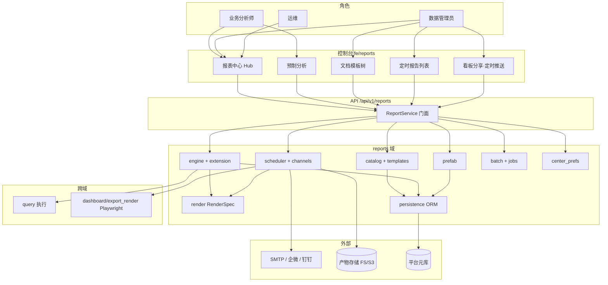
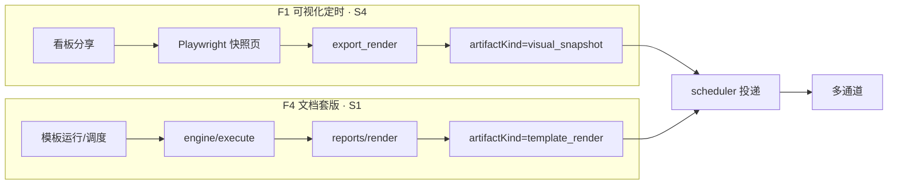
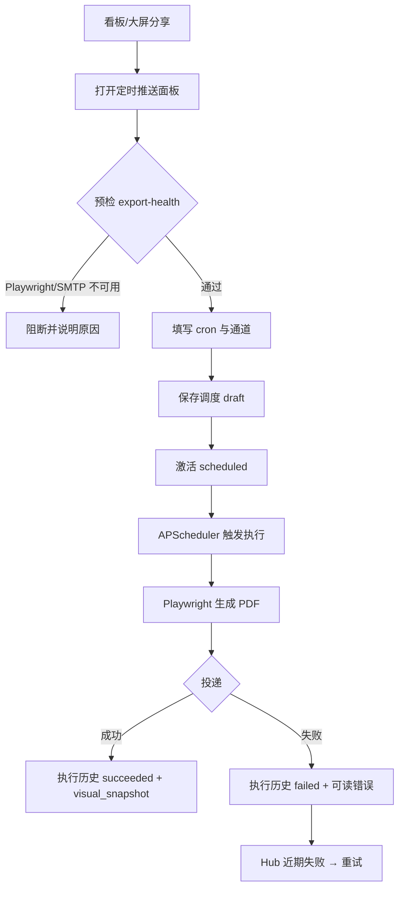
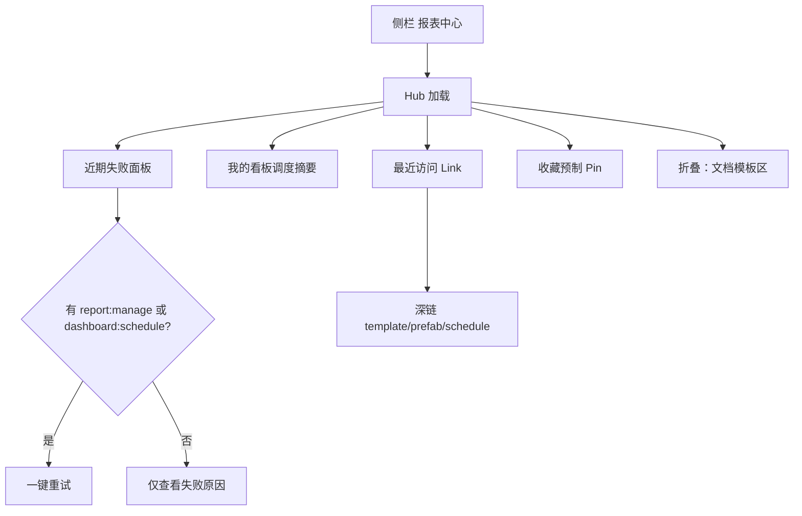
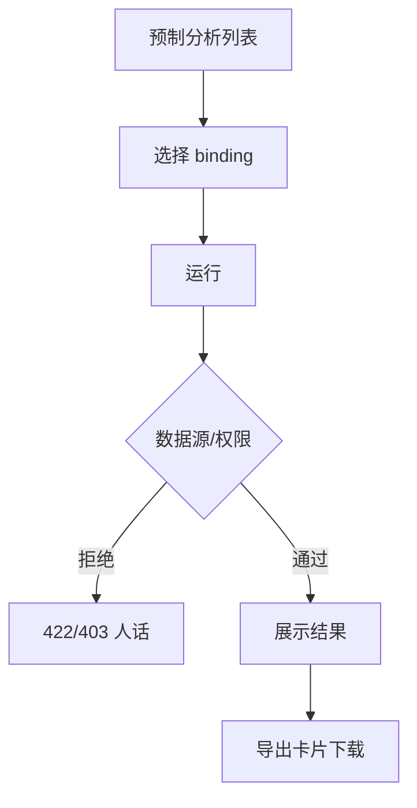
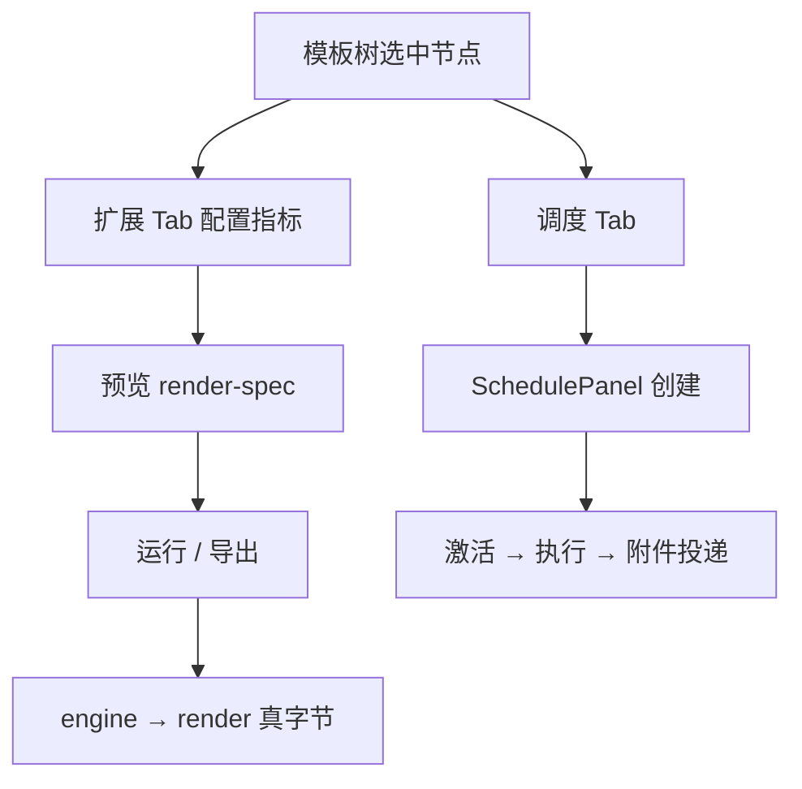
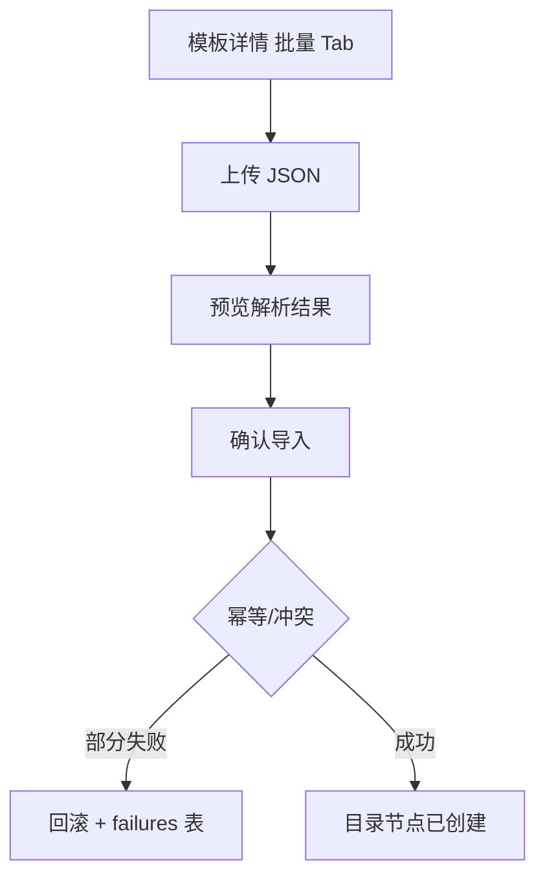

# 报表中心 · 业务蓝图

## 元信息

| 项 | 值 |
|----|-----|
| mode | blueprint |
| scope | 报表中心全模块（Hub · 预制 · 文档模板 · 定时报告 · 看板定时推送） |
| 日期 | 2026-08-09 |
| 证据袋 | [2026-08-09-report-center-evidence.md](./2026-08-09-report-center-evidence.md) |
| domain_strength | **strong** |
| 假设状态 | **用户已确认**（2026-08-09） |
| 关联 PRD | [F08-RPT](../automate/prd/F08-RPT.md) RPT-001～007 |
| 关联 arch | ADR-09 · ADR-19 · ADR-20 · G5 `export_render` |
| 关联 UI | [layout.md](../ui/layout.md) §报表 · `reportCenterNav.ts` |
| 关联评审 | [product-reviewer r2](../material/product-reviewer/2026-08-09-report-center-r2.md) 77/100 |

### 智囊团

| 轮次 | 出席 | 结论 |
|------|------|------|
| 提纲① | product · plan · architecture · ops_audit · end_user · domain（6 独立 Task） | 全席 `revise` → 已吸收 must_fix |
| 成稿② | product + plan（增量） | product pass · plan revise→已吸收 §8/F4/F5 锚点 |

---

## 1. 问题与主任务

**JTBD**：业务分析师在统一工作台找到预制/文档模板并运行导出；数据管理员配置看板定时报告或文档模板调度、维护模板目录；运维关注投递失败并能重试、核对产物类型。

**成功**：

- 打开报表中心即知「近期哪次投递失败、点一下能重试」
- 看板分享页能创建定时报告，预检不过则阻断并说明原因
- 文档模板能配置扩展、运行、导出 PDF/Word/Excel，并在模板详情配置调度
- 两条产品线边界清晰：**可视化定时**（主路径）与**文档套版**（次路径但已可用）不说「后续能力」

**最贵失败**：

- 宣称「最终形态」但页面点不通（最近访问、收藏、重试假入口）
- 投递 silent 假成功（PDF 实为布局清单却标 PDF）
- 文档与 UI 叙事分裂，用户不敢押生产

---

## 2. 架构关系图

### 2.1 双 PDF 管线（强制分叉）

**纪律**：F1 **禁止**走 RenderSpec；F4 **禁止**走 Playwright。

### 2.2 难回退选型约束

| ID | 选题 | 状态 | 证据 | 阻塞 F | 备注 |
|----|------|------|------|--------|------|
| S1 | 自研 RenderSpec 四格式（禁 Jasper） | **anchored** | ADR-09 · E4/E8 | F4 | |
| S2 | 调度 DB 持久化 + 多通道投递 | **anchored** | ADR-19 · E9 | F1, F2 | |
| S3 | 元数据 DB 持久化 | **anchored** | ADR-20 · E5 | F3, F4, F5 | |
| S4 | G5 Playwright 可视化 PDF | **anchored** | E10/E11 | F1 | 创建态须诚实披露产物类型 |
| S5 | 双线并列叙事（非「后续能力」） | **assumed** | E12/E13 | F2, F4 | **确认面请裁定**是否升格文档模板为并列主路径 |
| S6 | 批量 dry-run API | **anchored** | E14 · `batch/dry_run.py` | A1 | 2026-08-09 闭环 B-18 |

### 2.3 F ↔ S 阻塞矩阵

| F | S1 | S2 | S3 | S4 | S5 | S6 |
|---|----|----|----|----|----|-----|
| F1 | — | ✓ | — | ✓ | — | — |
| F2 | — | ✓ | — | — | ✓ | — |
| F3 | — | — | ✓ | — | — | — |
| F4 | ✓ | ✓ | ✓ | — | ✓ | — |
| F5 | — | — | ✓ | — | — | — |
| A1 | — | — | ✓ | — | — | ✓ |

---

## 3. 用户场景对照表

| 真实情境 | 本方案步骤 | 业内常见做法 | 跟随/偏离 | 依据 |
|----------|------------|--------------|-----------|------|
| 周一晨检：昨天邮件是否发出 | 报表中心 → 近期失败 → 一键重试 | DataEase X-Pack 定时报告运维台 | **跟随** | E7 · E12 B-8 |
| 看板负责人配周报 PDF 邮件 | 看板分享 → 定时推送 → 预检 → 保存调度 | Superset scheduled reports / DE 快照 | **跟随**（Playwright 快照） | E10 · F08 RPT-005 |
| 财务月报 Word 套版填数 | 文档模板树 → 扩展指标 → 运行 → 导出 Word | 帆软/润乾套版 + 调度 | **偏离**：自研 RenderSpec，**非** WYSIWYG 设计器 | S1 · E8 |
| 文档模板定时发 Excel 附件 | 模板详情 → 调度 Tab → 激活 → 等待执行 | 同行「报表模板 + 定时任务」 | **跟随**（次路径但已可用） | E7 TemplateDetailPanel |
| 分析师查生命周期分布 | 预制分析 → 选绑定 → 运行 | 内置分析报表（政企扩展） | **跟随** | E2 RPT-002 |
| 批量迁 50 个模板节点 | JSON 上传 → 预览 → 确认导入 | ETL/目录批量迁移工具 | **跟随**（dry-run 冲突预检已闭合 B-18） | E14 |
| SMTP 未配置就建调度 | delivery-health / export-health 告警 | 投递前置检查 | **跟随** | E9 ScheduleDeliveryHealthAlert |
| 投递失败追责 | 执行历史 + artifactKind + 通道错误 | 运维看失败队列 + 重试 | **跟随**；**偏离**：调度写操作未进平台审计表 | E9 · ops 席 |

---

## 3.1 术语表

| 术语 | 用户向含义 | 勿混淆 |
|------|------------|--------|
| 报表中心 | 统一工作台 Hub，聚合定时运维、预制、文档模板入口 | 不等于「只有预制报表」 |
| 定时报告 | 已配置的调度任务及其执行历史（看板或文档模板来源） | 不等于「预制分析」 |
| 看板定时推送 | 从看板/大屏分享创建的可视化 PDF 定时报告（**推荐主路径**） | 不等于文档模板调度 |
| 文档模板 | 固定版式 Word/Excel/PDF 套版，扩展填数后导出/调度 | 不等于「可视化模板」（viz-templates） |
| 预制分析 | 内置 entity×analysis 绑定，点运行即出结果 | 不需要自建模板树 |
| 可视化快照 | Playwright 渲染的看板 PDF 产物（`visual_snapshot`） | 不等于布局清单 PDF |
| 执行历史 | 每次调度运行的状态、产物、投递记录 | 不等于平台合规审计日志 |

### 3.2 两条产品线决策指引（S5）

| 我要… | 走哪条路 | 入口 |
|--------|----------|------|
| 把现有看板/大屏定期发 PDF 邮件 | **看板定时推送**（主路径） | 看板分享 Dialog |
| 固定版式月报/台账 Word/Excel | **文档模板**（次路径·已可用） | Hub 展开「文档模板」或 `/admin/reports/templates` |
| 快速看标准分析 | **预制分析** | Hub 快捷区或 `/admin/reports` |

---

## 4. 端到端业务流程

### 4.0 核心业务清单（≤5）

| ID | 业务名 | 流程图 | 成功结果 | 验收锚点 |
|----|--------|--------|----------|----------|
| F1 | 看板/大屏定时报告创建与投递 | §4.1 | 调度激活后产生真实 PDF 附件或诚实降级标注 | `pytest -k dashboard_visual_export` · `test_report_dashboard_schedule` |
| F2 | 报表中心工作台运维 | §4.2 | 失败可见、可重试、最近访问可点通 | `vitest run src/pages/admin/reports/report-center.smoke.test.tsx` |
| F3 | 预制分析运行与导出 | §4.3 | binding 运行返回结果并可导出 | `vitest run src/pages/admin/reports/prefab-reports.smoke.test.tsx` · `pytest tests/test_m9_rpt_theme_r233.py -k RPT-002` |
| F4 | 文档模板配置·运行·调度·导出 | §4.4 | RenderSpec 真导出 + 模板 Tab 调度 | `pytest tests/test_report_template_real_export.py` · `vitest run src/pages/admin/reports/report-templates.smoke.test.tsx` |
| F5 | 批量模板目录导入 | §4.5 | 幂等批量创建 + 部分失败回滚 | `vitest run src/pages/admin/reports/components/BatchImportPanel.smoke.test.tsx` · `pytest tests/test_rpt_gov_meta_conn_r54.py -k batch` |

### 4.1 F1 · 看板/大屏定时报告创建与投递

#### 流程图

#### 主路径

| 步 | 操作者 | 动作 | 系统 | 可见反馈 |
|----|--------|------|------|----------|
| 1 | 分析师/管理员 | 看板分享 → 定时推送 | 预检组件非空、export-health | 不通过则禁用保存并说明 |
| 2 | 同上 | 配置日/周/月 cron、收件人 | scheduler FSM | draft 可编辑 |
| 3 | 同上 | 激活 | transition API | 状态 scheduled |
| 4 | 系统 | 到期执行 | export_render → 投递 | 执行历史 + artifactKind |

#### 例外与逆操作

| 条件 | 行为 | 用户可见 | 审计 |
|------|------|----------|------|
| Playwright 不可用 | 预检失败，禁止创建 | export-health 文案 | — |
| legacy 布局摘要 PDF | 执行成功但 artifactKind=layout_inventory | 历史 Badge 诚实标注 | 执行历史 |
| 激活后改配置 | 不可 PATCH；复制配置新建 | SchedulePanel 提示 | revisionSnapshot |
| 投递失败 | POST retry | 新 execution 关联 parent | 执行历史（非平台 audit 表） |

### 4.2 F2 · 报表中心工作台运维

#### 流程图

#### 主路径

单入口 `/admin/reports/center`；侧栏仅「报表中心」（深链 schedules/templates/prefab 保留）。

#### 例外

| 条件 | 行为 |
|------|------|
| SMTP 未配 | delivery-health Alert |
| report:read 无 manage | 失败面板可见但重试按钮隐藏或禁用 |
| 文档模板区默认折叠 | 页内说明 +「展开文档模板」CTA |

**B-19（P2）**：创建定时报告时前置说明「可视化快照 vs 布局摘要」——列入 polish，不阻塞 F2 签收。

### 4.3 F3 · 预制分析运行与导出

### 4.4 F4 · 文档模板配置·运行·调度·导出

**与 F1 边界**：F4 调度对象=文档模板节点；产物走 RenderSpec，**不走** Playwright。

### 4.5 F5 · 批量模板目录导入

异步导出：`POST /batch/export` → job 轮询 → 下载（companion，非 F5 主路径）。

### 4.A 附录流程

| ID | 业务名 | 摘要 | 阻塞 |
|----|--------|------|------|
| A1 | 批量 dry-run | `POST /batch/dry-run` 预览冲突行 | **S6 anchored** · B-18 verified |

### 4.n 状态与信任

- 执行历史 `artifactKind` 区分 visual_snapshot / template_render / layout_inventory
- placeholder 无数据源时诚实展示，不误报「导出成功」
- center preferences 服务端为收藏/最近唯一真源

---

## 5. 页面设计说明（引用 docs/ui）

**壳层锚**：`docs/ui/layout.md` §报表 · AdminLayout · ListKit `table-list` / `master-detail`

| 路由 | 引用范式 | 页头/主区要点 | 空态/错误 |
|------|----------|---------------|-----------|
| `/admin/reports/center` | hub 卡片 | 失败队列、调度摘要、最近访问 Link、折叠模板区 | onboarding + 双线说明（`reportCenterNav.ts`） |
| `/admin/reports` | table-list | 预制 binding 列表 + 运行区 | PrefabReportsEmptyPreview |
| `/admin/reports/view/:id` | 运行+导出 | readiness Badge、ReportExportCard | placeholder 诚实 |
| `/admin/reports/templates` | master-detail | 树 + TemplateDetailPanel Tabs | 双线产品线说明，**禁**「后续能力」 |
| `/admin/reports/schedules` | table-list | 全量调度 + 执行历史 | 模板空态链到模板调度 Tab |
| 看板分享 Dialog | Sheet/Dialog | DashboardSchedulePanel + Precheck | export-health 阻断 |

**导航**：侧栏仅「报表中心」；`docs/ui/layout.md` · `docs/services/reports.md` · 演示手册已 sync 双线叙事（B-21 verified）。

---

## 6. 角色 · 权限 · 审计

| 能力 | 可见 | 可写/执行 | 典型角色 |
|------|------|-----------|----------|
| `report:read` | Hub、预制、运行、下载 | — | analyst, viewer |
| `report:manage` | 模板树、全量调度、批量导入 | 模板/调度/batch 写 | admin |
| `dashboard:schedule` | 本人看板分享定时 | 创建/管理本人看板调度 | analyst（授权时） |

| 操作 | API 门控 | 平台 audit 表 | 说明 |
|------|----------|---------------|------|
| 调度 create/transition/retry | manage 或 dashboard:schedule+owner | **未接入** | 执行历史可追溯；**非** AUTH-008 合规审计 |
| 模板/extension 写 | report:manage + catalog ACL | 未接入 | extension revision 链 |
| 预制 run | report:read + prefab scope | — | |

**已知风险（分期）**：viewer 可读他人 schedule 列表（scheduler ACL）；Hub 重试按钮须与 API 门控一致（B-14 已修 Link；重试门控待对齐 ops 席建议）。

---

## 7. 外部依赖与验收诚实

| 依赖 | 用途 | 真实验收 | 失败语义 | 阻塞 F |
|------|------|----------|----------|--------|
| SMTP | 邮件附件 | staging MailHog | 执行 failed + 通道错误 | F1（UNVERIFIED） |
| 企微/钉钉 webhook | 消息投递 | staging 凭证 | 同上 | F1（UNVERIFIED） |
| Playwright + Chromium | G5 PDF | `test_dashboard_visual_export` mock 绿；真机 E2E | export-health 阻断创建 | F1 |
| FS / S3 artifact | 产物存储 | pytest 本地 FS；S3 staging | 下载 404 诚实 | F1,F4 |
| 平台元库 | 调度/元数据 | `RPT_METADATA_STORE=db` pytest | 5xx 信封 | 全部 |

### UNVERIFIED 边界（不阻塞 F1–F5 主链签收）

| 项 | 归属流 | 补证环境 | 阻塞？ |
|----|--------|----------|--------|
| MailHog PDF 附件 | F1 | staging SMTP | 否（单测 mock） |
| 企微/钉钉 | F1 | staging 凭证 | 否 |
| Playwright 真 PDF | F1 | FE+Chromium E2E | 否（mock 绿） |
| MinIO round-trip | F4/F5 | `ARTIFACT_STORAGE_BACKEND=s3` | 否 |

---

## 8. 可观察验收（生产级）

1. **F2**：在 `report:read` 角色打开 `/admin/reports/center`，最近访问条目可点击并到达对应深链（`vitest run src/pages/admin/reports/report-center.smoke.test.tsx`）。
2. **F1**：在看板分享创建定时报告，export-health 失败时保存按钮不可用（`SchedulePrecheckPanel` / `test_report_dashboard_schedule`）。
3. **F3**：预制 binding 运行返回结果区非空，导出卡片可触发下载（`prefab-reports.smoke.test.tsx`）。
4. **F4**：文档模板 run 导出 PDF 含中文标题非全黑块（`test_report_pdf_cjk_font` / `test_report_template_real_export`）。
5. **F5**：批量 JSON 导入部分失败时返回 failures 索引且 rolledBackCount>0（`test_rpt_gov_meta_conn_r54` batch 用例）。
6. **失败语义**：调度执行 failed 时 Hub 近期失败面板展示且 manage 角色可重试（API 200 + 新 execution）。
7. **权限**：`report:read` 无 manage 时不可 PUT 模板（403 `RPT_*_FORBIDDEN`）。

---

## 9. 假设清单

| ID | 假设 | 依据 | 若推翻的影响 | 难回退？ |
|----|------|------|--------------|----------|
| H1 | 文档模板长期为「次路径但已可用」，不升格为与看板定时并列的一级导航 | S5 · product-reviewer 开放问题 #1 | 需改 IA / layout.md | 否 |
| H2 | 调度写操作分期接入 `auth_audit_events`；当前以执行历史为运维追溯 | ops 席 | 等保抽查需补审计 | 否 |
| H3 | analyst 不单独授予 `report:manage` 子集（仅能管自己的模板调度） | PRD 开放问题 #2 | 需新 RBAC 模型 | 是 |
| H4 | 批量 dry-run（S6）已实现 `POST /batch/dry-run` + BatchImportPanel 预检 | B-18 verified 2026-08-09 | — | 否 |

---

## 10. 偏航对照（PRD）

| ID | PRD 主张 | 蓝图/现状 | 偏航 | 建议 | 回写 PRD？ |
|----|----------|-----------|------|------|------------|
| RPT-005 | 看板定时为主路径 | 已收敛 IA + G5 | 无 | — | 否 |
| RPT-003 | WYSIWYG companion | 块编辑器非全量 WYSIWYG | 有意偏离 | 保持 companion | 否 |
| RPT-007 | 批量 FR-6.4 | dry-run 已闭合 | 无 | — | 已回写 F08-RPT |
| docs/services | 四入口 + 「后续能力」 | 单入口+双线文案已 sync | 无 | — | verified B-21 |
| F08 L84 | 文档模板降级后续能力 | UI+PRD 已改双线并列 | 无 | 已更新演化建议 | 是 |

---

## 11. 范围外与非目标

- Jasper / 全量 WYSIWYG 设计器
- 新导出格式、Hub 卡片视觉统一（B-6 → ui-ux-reviewer）
- 组合调度粒度枚举（companion）
- 跨租户投递 SLA 大盘
- 本蓝图**不**包含 staging 真机补证执行本身

---

## 12. 交接

- [x] **用户已确认**（确认面；含架构图 + 核心 F 流程图 + 选型状态 · 2026-08-09）
- [ ] 同步 `docs/services/reports.md` · `docs/ui/layout.md` 侧栏单入口与双线叙事
- [ ] 可选：点名回写 F08-RPT RPT-005 演化建议
- [ ] 可选：`mode=spec` → `go-fast-spec-gate`（S6 open 不得作硬门槛）
- [ ] 可选：A1 → integration-research 或 go-fast 小 PR
- [ ] 可选：product-reviewer 复评（目标 ≥82 认知维）
- [ ] 可选：browser-reviewer 真机（分享 Dialog、邮件附件）
