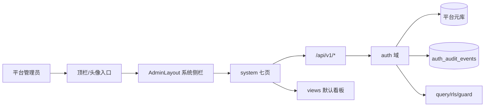
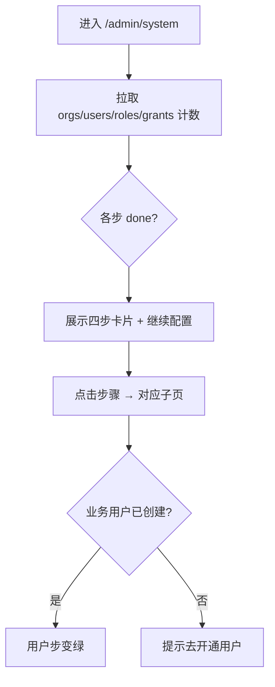
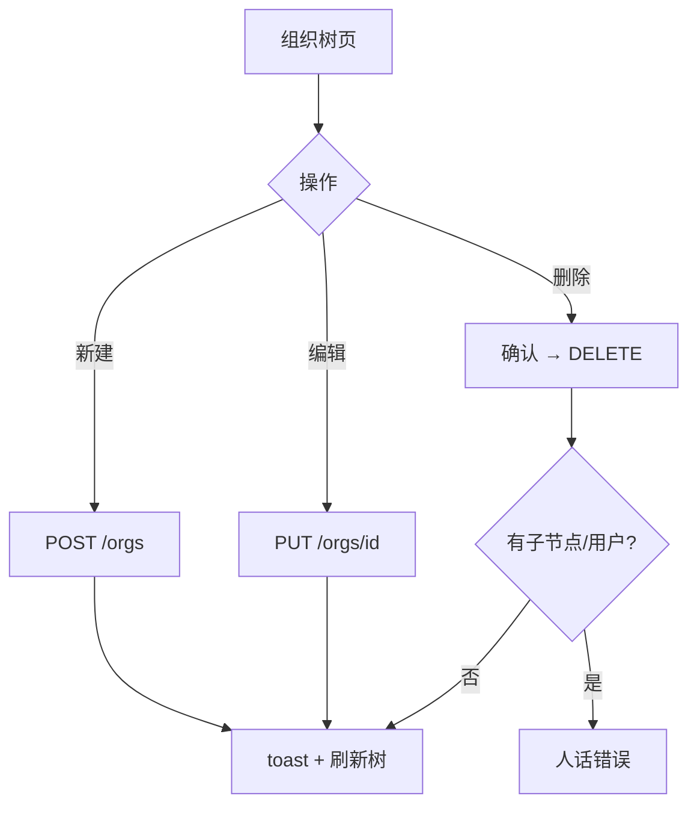
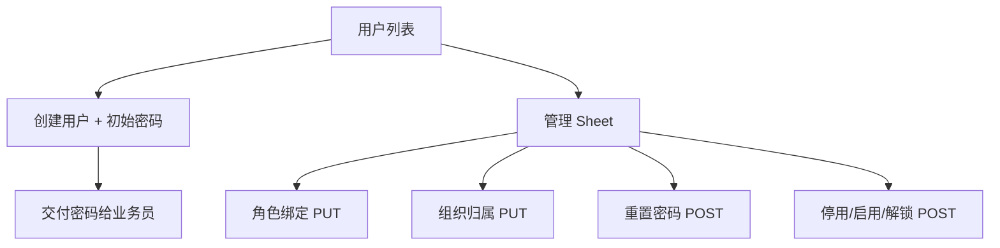
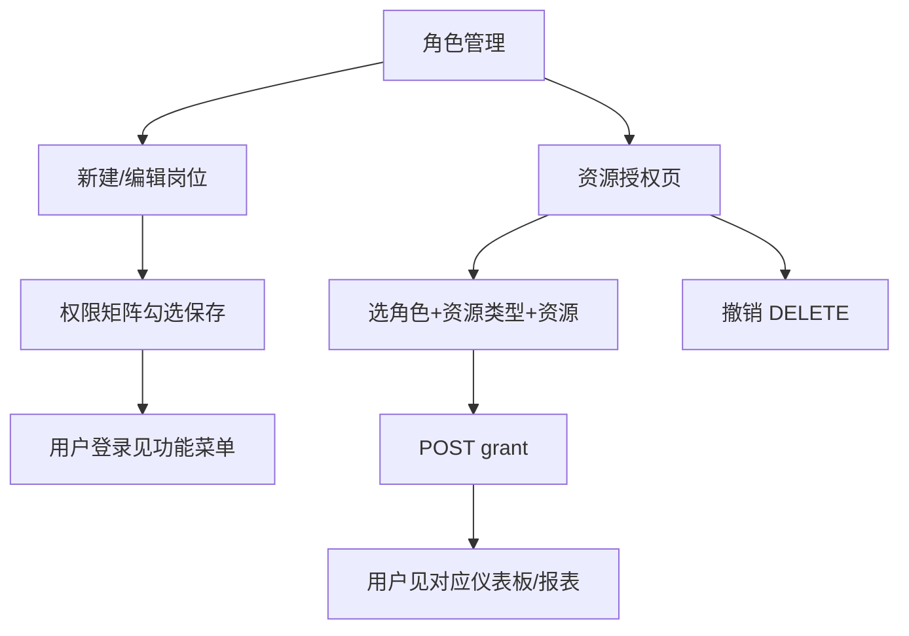
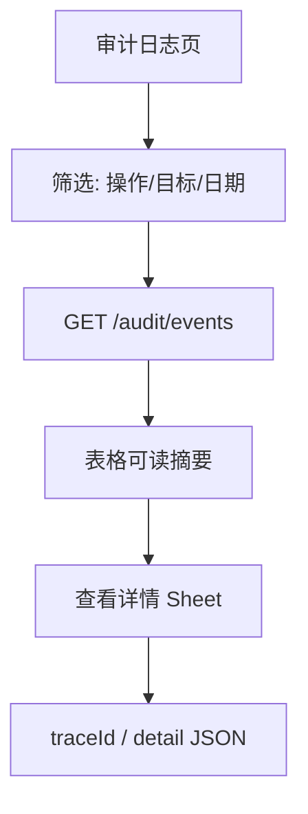

# 后台管理（`/admin/system/*`）· audit

## 元信息

| 字段 | 值 |
|------|-----|
| mode | **audit**（现状体检 + 业务蓝图） |
| scope | 头像/顶栏「系统管理」→ `/admin/system` 及 `{orgs,users,roles,grants,rls,audit}` |
| 日期 | 2026-08-09 |
| 证据袋 | `docs/material/blueprints/2026-08-09-system-admin-evidence.md` |
| domain_strength | **strong** |
| 假设状态 | **用户已确认**（2026-08-09） |
| 关联 PRD | `docs/automate/prd/F02-AUTH.md` AUTH-001～008 |
| 关联评审 | `docs/material/product-reviewer/2026-07-31-system-admin-r3.md`（75/100） |
| 关联验真 | `docs/feature-truth/2026-08-07-system-admin-truth-audit.md`（修复后 40 smoke 绿） |
| UI 锚 | `docs/ui/layout.md` §后台管理 · `fe/src/config/system-admin-nav.tsx` |

**智囊团（缩席）**：依据 E7/E8/E1/E3/E4 合并 product+plan+domain 视角；未重跑六席独立 Task（`theater_ok: false`）→ 状态 `DONE_WITH_CONCERNS`。

---

## 1. 问题与主任务

**JTBD**：平台管理员（租户 IT）在首部署或组织变更时，按业务顺序完成「组织 → 岗位角色 → 用户 → 资源授权」，必要时配置行级权限，并能审计追溯。

**成功长什么样**：

- 配置向导四步进度可信（非假绿）
- 业务人员能登录、看到被授权仪表板/报表
- 组织/权限变更有审计记录；离职可停用账号

**最贵失败**：

- 向导显示完成但用户无法登录或看不到资源
- 误删组织/角色无恢复路径且无审计
- 侧栏/入口误导（多选高亮、找不到后台）

---

## 2. 架构关系图（as-is）

### 2.1 难回退选型约束

| ID | 选题 | 状态 | 证据 | 阻塞 F | 备注 |
|----|------|------|------|--------|------|
| S1 | 路由/菜单 `system:*` 粗粒度守卫 | **anchored** | E3, E4, layout.md | F1 | M1 既定；细粒度分期 |
| S2 | 细粒度 `system:role.read` 拆菜单 | **assumed** | E12 | — | 规划中有，UI 未拆 |
| S3 | 无自动预置岗位包 | **anchored** | E2, goal G4 | F1 | 模板仅可选导入 |

---

## 3. 用户场景对照表

| 真实情境 | 本方案步骤 | 业内常见做法 | 跟随/偏离 | 依据 |
|----------|------------|--------------|-----------|------|
| 新租户首日上线 | 向导：组织→角色→用户→授权 | IdP/目录同步 + 角色模板 | **偏离**：无 LDAP 自动同步；**跟随**：分步向导 | E1, E2 |
| 业务员离职 | 用户 Sheet 停用账号 | SCIM 停用或 AD 禁用 | **跟随**（手动停用） | E6, E8 |
| 岗位调整 | 角色权限矩阵 + 资源授权 | RBAC + 资源 ACL | **跟随** | E1 AUTH-001/004 |
| 数据按处室过滤 | RLS 维度分组 + 角色绑定 | ABAC/RLS 策略 | **跟随**（高级可选） | E4 AUTH-006/007 |
| 等保审计抽查 | 审计日志筛选 + 详情 | 不可变审计 + SIEM | **部分跟随**：平台内查询，无外链 SIEM | E1 AUTH-008 |
| 管理员找不到入口 | 顶栏齿轮 + 头像菜单 | 独立「管理控制台」域名 | **偏离**：入口仍偏藏；已加顶栏 | E3, E7 B-7 |

---

## 3.1 术语表

| 术语 | 用户向含义 | 勿混淆 |
|------|------------|--------|
| 配置向导 | 首租户四步 checklist | 不是安装向导/许可证激活 |
| 岗位角色 | 功能权限集合（如分析员） | 不是组织节点 |
| 资源授权 | 某角色可看哪些仪表板/报表/数据源 | 不是功能权限点本身 |
| 行级权限 RLS | 查询结果按组织/维度过滤 | 不是「谁能进后台」 |
| 组织树 | 处室/部门层级 | 不是角色树 |
| 审计日志 | 敏感写操作追溯 | 不是应用访问日志 |

---

## 4. 端到端业务流程（as-is）

### 4.0 核心业务清单（≤5）

| ID | 业务名 | 流程图 | 成功结果 |
|----|--------|--------|----------|
| F1 | 首租户配置向导 | §4.1 | 四步进度正确，可跳转各模块 |
| F2 | 组织架构维护 | §4.2 | 组织树可增删改，用户可归属 |
| F3 | 人员与岗位 | §4.3 | 用户可创建、绑角色/组织、改密、停用 |
| F4 | 岗位权限与资源 | §4.4 | 角色功能权限 + 资源授权生效 |
| F5 | 审计追溯 | §4.5 | 敏感操作可筛可查 |

**附录**（确认面不展开）：A1 行级权限（RLS）高级配置

---

### 4.1 F1 · 首租户配置向导

**主路径**：管理员从顶栏/头像进入 → 向导展示四步 → 点击「建立组织架构」等链接 → 完成各子模块操作 → 返回向导见进度更新。

**例外**：授权步标记「可选」；仅内置管理员时用户步不变绿（2026-08-07 修复：排除当前登录人计数）。

**审计**：向导本身不写审计；子操作走各域 hook。

**实现锚点**：`SystemAdminHomePage.tsx` · smoke 4 条。

---

### 4.2 F2 · 组织架构维护

**主路径**：新建处室 → 编辑名称/上级 → 删除空节点。

**例外**：删除有子节点或挂载用户时 API 拒绝 + `mapOrgError`。

**审计**：org 写操作记入 `auth_audit_events`（AUTH-008）。

**实现锚点**：`OrgTreePage.tsx` · `orgs.smoke.test.tsx` 4 passed。

---

### 4.3 F3 · 人员与岗位

**主路径**：创建用户 → 绑岗位角色 → 绑组织 → 交付初始密码。

**例外**：停用需二次确认；锁定显示「解除锁定」；错密不改会话（改密在 account 域）。

**审计**：`user.roles.replace` 等（AUTH-003/008）。

**实现锚点**：`UserListPage` · `UserManageSheet` · `users.smoke.test.tsx` 7 passed。

---

### 4.4 F4 · 岗位权限与资源授权

**主路径**：定义岗位 → 勾功能权限 → 必要时加资源授权 → 用户绑该角色后生效。

**例外**：超级管理员角色 `isRoot` 跳过矩阵；资源授权可跳过（角色权限已够时）。

**审计**：grant/role 写操作审计。

**实现锚点**：`RoleListPage` · `RolePermissionsPanel` · `GrantsPage` · smoke 6+5 条。

---

### 4.5 F5 · 审计追溯

**主路径**：按时间窗与操作类型筛选 → 打开详情核对操作者/目标。

**例外**：无记录时空态；筛选 debounce 300ms。

**实现锚点**：`AuditLogPage.tsx` · `audit.smoke.test.tsx` 5 passed。

---

### 4.A 附录 · A1 行级权限（高级）

| 摘要 | 维度类型/分组 CRUD → 角色绑定 PUT 全量替换 → 查询层 RLS 谓词 |
|------|----------------------------------------------------------------|
| 锚点 | `RlsAdminPage.tsx` · `RlsRoleBindingPanel.tsx` · AUTH-005~007 |
| 验真 | rls smoke 3 + binding panel 2 |

---

## 5. 页面设计说明（引用 UI 锚，不重发明壳）

壳层：`AdminLayout` + `SYSTEM_ADMIN_NAV_SECTIONS`（`layout.md` · list-page-kit / crud-flow）。

| 页面 | 路由 | 模式 | 相对基准差异 |
|------|------|------|--------------|
| 配置向导 | `/admin/system` | dashboard-cards | 四步进度卡 + 侧栏概览数字 |
| 组织架构 | `/admin/system/orgs` | crud-flow | 树形行内编辑/删除 |
| 用户管理 | `/admin/system/users` | table-list + Sheet | 三 Tab：角色 / 组织与安全 |
| 角色管理 | `/admin/system/roles` | table-list + Dialog Tabs | 基本信息 / 权限矩阵分组 |
| 资源授权 | `/admin/system/grants` | table-list | 客户端筛选分页 |
| 行级权限 | `/admin/system/rls` | form-composition | Tab：维度 / 分组 / 绑定 |
| 审计日志 | `/admin/system/audit` | table-list | 时间窗 + 详情 Sheet |

**2026-08-09 修复**：侧栏仅最长路径一项 active（`nav-active.ts` + `app-sidebar.tsx`），消除「配置向导 + 子页同时高亮」。

---

## 6. 权限与审计（摘要）

| 角色 | 可做什么 | 不可做什么 |
|------|----------|------------|
| 平台管理员 `system:*` | 全部后台页写操作 | — |
| 其他角色 | 无后台入口（M1） | 进入 `/admin/system/*` |
| 安全审计员（规划） | 只读审计 | 未拆细粒度菜单 |

审计：auth 域写路径 `write_hooks` → `GET /api/v1/audit/events`；UI 人话映射 `audit-display.ts`。

---

## 7. 现状缺口（audit）

| 优先级 | ID | 缺口 | 建议 |
|--------|-----|------|------|
| P1 | G1 | 无真机首租户走查 | `scenario-playbook` 从向导到业务登录看板 |
| P1 | G2 | 岗位模板未做（B-7 partial） | 向导空库「一键演示岗位」可选按钮 |
| P2 | G3 | 细粒度 RBAC 菜单未拆 | 按 E12 分期；security_admin 角色 |
| P2 | G4 | 运营队列缺失 | 「无组织用户」「无权限角色」列表提示 |
| P2 | G5 | LDAP/OAuth 管理入口 | PRD 分期，非本模块阻塞 |
| — | G6 | ~~侧栏多选高亮~~ | **已修复** 2026-08-09 |

**已闭合（2026-08-07～09）**：B-6 角色筛选服务端化 · B-8~B-12 用户生命周期/RLS/授权布局 · truth-verify P1 smoke 补强 · 向导 done 逻辑。

---

## 8. PRD 偏航对照（要点）

| PRD | 状态 | 备注 |
|-----|------|------|
| AUTH-001 角色 | ✅ UI+API | smoke 6 条 |
| AUTH-002 组织 | ✅ | org smoke 4 |
| AUTH-003 用户绑定 | ✅ | 含生命周期 |
| AUTH-004 资源授权 | ✅ | 含筛选 smoke |
| AUTH-005~006 RLS 元数据 | ✅ | 高级附录 |
| AUTH-007 RLS 谓词 | ✅ 后端 | 后台仅配置面 |
| AUTH-008 审计 | ✅ | 筛选+详情 |
| 岗位模板（演化） | ⏳ open | 非 PRD 硬验收 |

---

## 9. 假设清单（待确认）

| ID | 假设 | 类型 |
|----|------|------|
| H1 | 首租户场景以「手动配置」为主，暂无 LDAP 同步 | 场景 |
| H2 | M1 继续 `system:*` 粗粒度门禁，细粒度菜单下一里程碑 | **难回退选型 S2** |
| H3 | 岗位模板为可选导入，不自动写入生产 | 产品 |
| H4 | 真机走查未做，smoke 40 条代表当前质量下限 | 验真 |

---

## 10. 验收句（生产姿态）

- [ ] 平台管理员可完成 F1～F4 主路径且无假成功 toast
- [ ] 停用用户无法登录；启用/解锁可恢复
- [ ] 资源授权后绑定角色用户可见对应仪表板/报表（需集成环境）
- [ ] 组织/角色/授权写操作可在审计页检索
- [ ] 侧栏同一时刻仅一项 active

---

## 11. 下一步交接

| 动作 | 技能/负责人 | 状态 |
|------|-------------|------|
| 确认本 audit 草稿 | 用户 | **✅ 已确认 2026-08-09** |
| 真机首租户走查 | scenario-playbook | 待办 P1 |
| 八维再评（可选） | product-reviewer | 可选 |
| 岗位模板 | go-fast 切片（B-7） | 待办 P1 |
| 开工规格 | `docs/specs/system-admin.md`（mode=spec） | 按需触发 |
