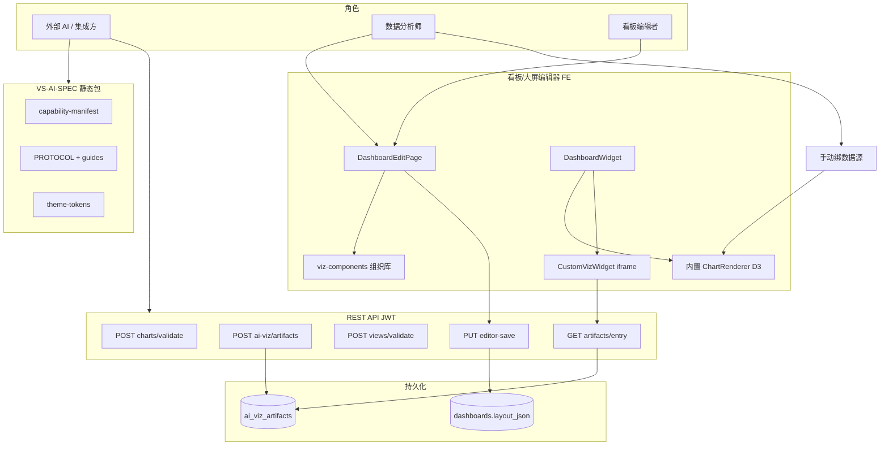
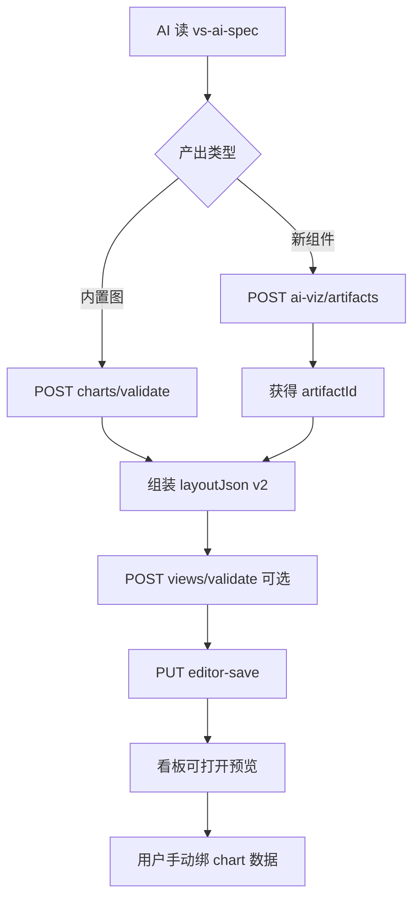
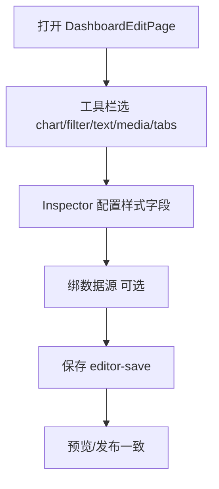
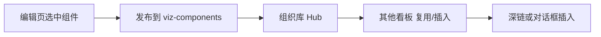
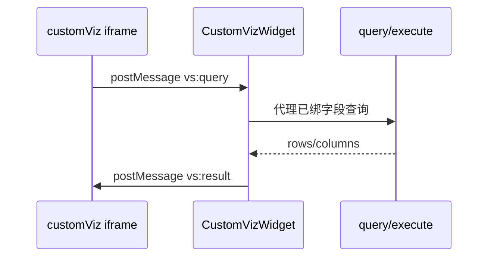
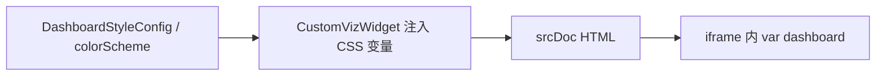

# VS-AI 添加新组件与大屏 · blueprint

## 元信息

- **mode**: blueprint
- **scope**: 人类用户 + 外部 AI 添加新可视化组件（内置 chart / customViz）并组装看板/数据大屏
- **日期**: 2026-08-12
- **证据袋**: [2026-08-12-vs-ai-add-component-screen-evidence.md](./2026-08-12-vs-ai-add-component-screen-evidence.md)
- **domain_strength**: strong
- **智囊团**: 本稿为证据驱动单稿；**独立六席 Task 未展开**（待用户确认后可补 council 轮）
- **假设状态**: 草稿待确认
- **关联**: [F17-AIVIZ](../../automate/prd/F17-AIVIZ.md) · [vs-ai-spec](../../api/vs-ai-spec/README.md) · [F07-DASH](../../automate/prd/F07-DASH.md) · [ai-viz.md](../../services/ai-viz.md)

---

## 1. 问题与主任务

### JTBD

当业务或 AI 需要 **新形态可视化** 或 **快速拼大屏** 时，平台应提供：

1. **不改动主引擎发版** 即可挂载新组件（customViz）
2. **与现有 49 种内置图、筛选器、素材** 混排在同一画布
3. **人类** 在编辑器内可完成常规添加；**AI** 通过 VS-AI-SPEC + REST 自动落库
4. **数据与权限** 仍由人在产品内绑定，AI 不自动生成 SQL

### 成功标准

- AI 或集成方：读规范 → validate/register → editor-save → 打开看板可见混排结果
- 人类：工具栏/组件库添加内置组件；M2 后可在 UI 选用 customViz artifact
- 安全：不可信 bundle 仅在 iframe 沙箱运行

### 最贵失败

- 为追求「不用沙箱」把上传 HTML 塞进主 DOM → 安全事故
- AI 直连 query 写 SQL → 越权与数据治理失控
- 只做 API、不做编辑器产品化 → 人类无法运维 AI 产物

---

## 2. 架构关系图

### 2.1 难回退选型约束

| ID | 选题 | 状态 | 证据 | 阻塞 F | 备注 |
|----|------|------|------|--------|------|
| S1 | 混合方案 C（内置 + customViz + layout） | **anchored** | E1–E3 | F1–F3 | F17 PRD |
| S2 | iframe 沙箱执行 customViz | **anchored** | E4–E6 | F1 | 禁主 DOM |
| S3 | 数据人绑、AI 不写 SQL | **anchored** | E1, E7 | F1, F4 | goal Out of Scope 问数 |
| S4 | postMessage 数据桥协议 | **open** | E8 | F4 | M2 须 integration-research 定契约 |
| S5 | M2 主题 CSS 注入 iframe | **assumed** | E9–E10 | F5 | 确认面默认采用 |
| S6 | SM2 artifact 验签 | **open** | — | A2 | 官方市场阶段再做 |

---

## 3. 用户场景对照表

| 场景 | 业内/产品惯例 | VitalSpan 现状 | 目标态 |
|------|---------------|----------------|--------|
| AI 生成新异形组件 | 插件市场 / 受控脚本 | API 注册 + iframe | M2 UI 可选 + 组件库 |
| AI 拼大屏 | 布局 JSON / DSL | layoutJson v2 + editor-save | 可选 orchestrate（远期） |
| 分析师加内置图 | 拖拽 + 属性面板 | ✅ 工具栏 49 种 + Inspector | 保持 |
| 组织内复用组件 | 组件库 | ✅ viz-components（4 类） | M2 含 customViz |
| 大屏装饰素材 | 素材库 | ✅ ScreenMaterialPicker | 保持 |
| 新组件接真实数据 | 字段绑定 + query | 内置 ✅；customViz M1 静态 | M2 postMessage |
| 全局主题一致 | 设计 token | 内置 ✅；customViz 部分 | M2 主题注入 |

---

## 3.1 术语表

| 术语 | 用户向含义 | 勿混淆 |
|------|------------|--------|
| 内置 chart | 平台 D3 引擎渲染的 49 种图 | 不是 customViz |
| customViz | 沙箱 iframe 里的自定义 HTML 组件 | 不是第 50 种 chartType |
| artifact | 注册后的 bundle 实例 ID | 不是 viz-component |
| layoutJson | 看板/大屏 widget 布局与配置 | 不是 chartConfig 单条 |
| 数据大屏 | surfaceKind=data-screen，1920 画布 | API 与看板共用 editor-save |
| manual 数据绑定 | 先存草稿，稍后人绑数据源 | 不是 AI 自动 SQL |

---

## 4. 端到端业务流程

### 4.0 核心业务清单（≤5）

| ID | 业务名 | 流程图 | 成功结果 |
|----|--------|--------|----------|
| F1 | 外部 AI 注册新组件并写入大屏 | §4.1 | artifactId + layout 混排可预览 |
| F2 | 人类在编辑器添加内置组件并保存 | §4.2 | editor-save 后刷新一致 |
| F3 | 组织组件库复用（人类） | §4.3 | 从库插入到看板/大屏 |
| F4 | customViz 接平台数据（M2） | §4.4 | 绑字段后沙箱内刷新 |
| F5 | 看板主题作用于 customViz（M2） | §4.5 | 改主题 iframe 内同步 |

### 4.1 F1 · 外部 AI 注册新组件并写入大屏

#### 流程图

#### 主路径

| 步骤 | 操作者 | 动作 | 系统 | 可见反馈 |
|------|--------|------|------|----------|
| 1 | AI | 读 manifest / PROTOCOL / theme-tokens | — | — |
| 2a | AI | POST artifacts（bundle） | 扫描 + 入库 | artifactId 或 422 |
| 2b | AI | POST charts/validate | schema 校验 | 通过 / fields 错误 |
| 3 | AI | 构造 widgets：chart + customViz 坐标 | — | — |
| 4 | AI | PUT editor-save | 事务写 layout_json | 200 / 回滚 |
| 5 | 用户 | 打开看板 | FE 渲染 D3 + iframe | 混排可见 |
| 6 | 用户 | 绑 chart 数据源 | query/execute | 内置图出数 |

#### 例外

| 条件 | 行为 | 用户可见 |
|------|------|----------|
| bundle 超 512KB / 外链 script | 422 AIVIZ_* | 错误 message |
| 无 dashboard:edit | 403 | 鉴权失败 |
| layout 缺 artifactId | validate 失败 | VIEW/layout 错误 |
| customViz 期望实时数据 M1 | 仅静态 demo | 「数据待手动绑定」 |

### 4.2 F2 · 人类在编辑器添加内置组件并保存

#### 流程图

- **看板 vs 大屏**：同页同 API；大屏额外素材栏 + 1920 画布（`surfaceKind=data-screen`）
- **customViz 缺口**：当前 **无** 工具栏入口；layout 含 customViz 时可渲染但难编辑

### 4.3 F3 · 组织组件库复用

- 支持类型：**chart / filter / text / media**（不含 customViz、tabs）
- 与 F1 关系：AI 产物 M2 应能 **发布进库**，供人类复用

### 4.4 F4 · customViz 接平台数据（M2 · 协议 open）

- **前置**：S4 须 [integration-research](../../../.cursor/skills/integration-research/SKILL.md) 锁定消息 schema、超时、错误信封
- **权限**：仅已绑 dataSource + 字段槽位；禁任意 SQL 字符串

### 4.5 F5 · 看板主题注入 customViz（M2 · assumed）

- M1：bundle 手动引用 theme-tokens.json
- M2：平台注入 + bundle 约定 `var(--dashboard-*)`

### 4.A 附录流程

| ID | 业务名 | 摘要 |
|----|--------|------|
| A1 | layout/orchestrate 自动排版 | F17 Out；AI 手算 x/y |
| A2 | SM2 官方 artifact 验签 | 跨租户组件市场 |
| A3 | 原生 chartType 插件发版 | 不用沙箱、深度集成 |

---

## 5. 文字版页面设计说明

**壳层引用**：[`docs/ui/layout.md`](../../ui/layout.md) · 看板/大屏共用 `DashboardEditPage`，不重发明导航。

| 页面 | 现状 | 建议增量（M2 产品化） |
|------|------|------------------------|
| 看板/大屏编辑页 | 工具栏 + Inspector + 保存 | 增加 **「自定义组件」**：选 artifact / 上传 bundle（调 API） |
| customViz 选中态 | 无专用 Inspector | **CustomVizInspector**：artifactId、manual 提示、预览刷新 |
| viz-components Hub | 四类型 | 支持 **customViz** 发布/插入（AIVIZ-006） |
| 大屏列表 | 创建/模板 | 与现有一致；AI 仍写 layoutJson |

---

## 6. 实施分期建议

### Phase A · 现已可用（M1）

| 角色 | 怎么做 |
|------|--------|
| **AI** | vs-ai-spec → artifacts + validate + editor-save |
| **人类** | 工具栏加内置组件；viz-components 复用；模板建大屏 |
| **平台** | 混排渲染；manual 占位 |

### Phase B · 编辑器产品化（M2a，优先）

1. CustomViz Inspector + 工具栏/复用对话框选 artifact  
2. iframe **主题变量注入**（F5）  
3. viz-components 扩展 customViz（F3 延伸）

**验收**：人类可不调 API 挂载 AI 已注册 artifact；改看板主题 customViz 内颜色跟随。

### Phase C · 数据桥（M2b，依赖 S4 调研）

1. 定 postMessage 协议文档（vs-ai-spec 新章）  
2. CustomVizWidget Host 桥 + 字段槽 fieldSlots  
3. 与 manual → connected 状态机衔接  

**验收**：绑字段后沙箱组件显示 query 结果；失败可见错误，禁假成功。

### Phase D · 治理与效率（远期）

- layout/orchestrate（降 AI 排版成本）  
- SM2 验签 + 官方组件市场（S6）  
- 高频 customViz 沉淀为原生 chartType（可选）

---

## 7. 权限、审计、依赖

| 项 | 要求 |
|----|------|
| 鉴权 | artifacts 写 `dashboard:edit`；读 `dashboard:read`；owner 隔离 |
| 审计 | M2+ 记录 artifact 创建/引用/layout 保存（对齐 production 敏感写） |
| 依赖 | dashboard 域 · auth · query（M2） · viz-components（M2） |
| 红线 | GEO-IRON-01 · 禁外链 script · AI 不写 SQL · 零第三方 BI 运行时 |

---

## 8. PRD 偏航建议（仅建议，未改 PRD）

| 项 | 建议 |
|----|------|
| F17 | 增 AIVIZ-009 编辑器 UI、AIVIZ-010 主题注入（或并入 006/007 分片） |
| F07-DASH | 组件库范围扩展 customViz 时同步 DASH-010 |
| goal | 维持 AI 问数 Out of Scope；VS-AI 可视化单独叙事 |

---

## 9. 自检

| 检查项 | 结果 |
|--------|------|
| 架构图 + 核心 F 流程图 | ✅ |
| 核心 F ≤5 | ✅ F1–F5 |
| 选型门禁 S4/S6 open 未写成已定 | ✅ |
| 生产姿态（非 MVP stub） | ✅ |
| 独立六席 Task | ⚠️ 未执行 |

---

## 10. 下一步交接

| 用户确认后 | 动作 |
|------------|------|
| 认可 M2 分期 | `mode=spec` 出 `docs/specs/vs-ai-m2-editor-bridge.md` |
| 需定 postMessage 契约 | handoff **integration-research**（S4） |
| 开工实现 | handoff **go-fast**（spec 门通过后） |
