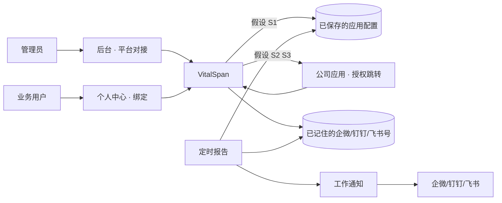
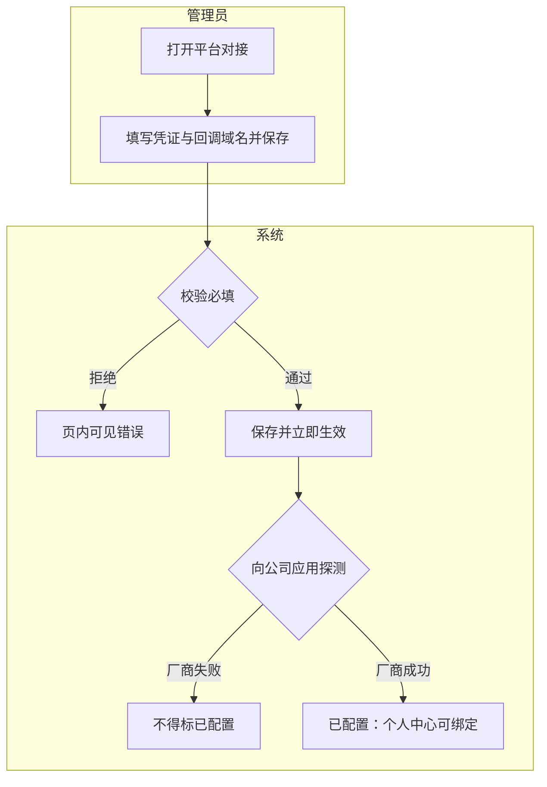
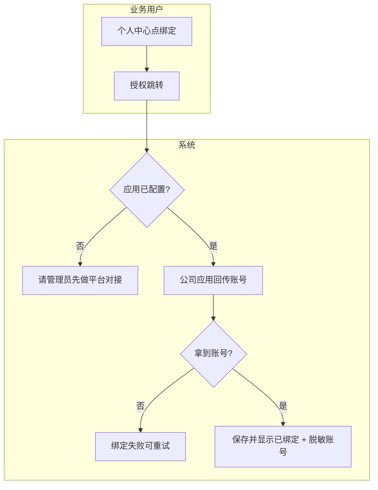
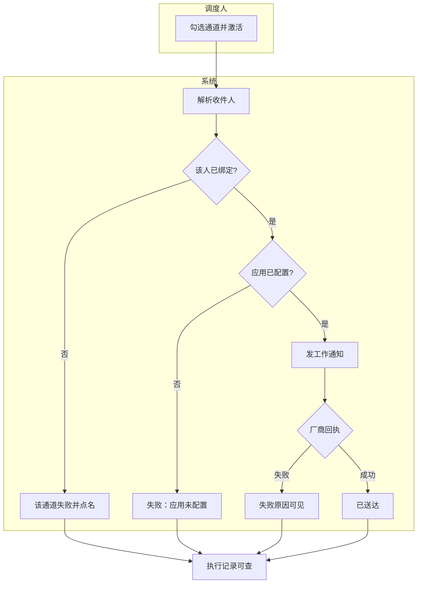

# 提纲 · IM 后台配置 + 自助绑定（轮次 2）

- mode: blueprint
- 日期：2026-08-13 / 证据袋：`docs/material/blueprints/2026-08-13-im-app-config-self-bind-evidence.md` / domain_strength: mixed
- 提纲轮次：2（吸收六席 revise，无 veto）
- 图中带「假设」的边依赖 S1–S3，用户未整包确认前不得当已定交 spec

## 0. 轮次 1 吸收

| 席 | vote | 已吸收 |
|----|------|--------|
| product | revise | 已绑定≠可投递；绑定成功须亮脱敏账号；手改来源必见；探测/投递以厂商回执为准 |
| plan | revise | F1 成功不含「已投递」；清空后 env 不得救活；绑定须开放平台回传后入库 |
| architecture | revise | 域归属脚注；S1–S3 图上标假设；S3 开工前 integration-research，蓝图不写死协议 |
| ops_audit | revise | 清空=禁用忽略 env；写权限锁定新码；配置写审计 |
| end_user | revise | 图用人话；禁「绑号」；个人中心三态 |
| domain | revise | 拿号机制不标跟随 DataEase 文档；绑定主路径用授权跳转而非扫码；补回调域名 |

## 1. 主任务

- **JTBD**：管理员在后台配好公司应用后，业务用户自己点一次「绑定」，系统自动记住其企微/钉钉/飞书号，之后定时报告能发到本人——不必改服务器环境变量，也不必抄对方账号。
- **成功**：平台对接已保存且脱敏可见、探测通过；个人中心显示已绑定并亮出脱敏账号；调度勾选该通道后，工作通知到达该账号（厂商回执成功）。
- **最贵失败**：显示已绑定但账号是错的 / 应用未配却显示可绑定 / 未绑定或厂商拒绝却当成功（含回落群假装发出）。

## 2. 用户场景对照表（强制）

| 真实情境 | 本方案步骤 | 业内常见做法 | 跟随/有意偏离 | 依据 |
|----------|------------|--------------|---------------|------|
| 实施把 VitalSpan 接到本公司企微 | 后台「平台对接」填应用凭证 + **回调域名**，保存后热生效 | DataEase 系统设置-平台对接（含回调域名） | 跟随入口与字段；保存后入库为假设 S1 | E8 H1 |
| 分析师要在企微收定时看板 | 个人中心点绑定 → **已登录状态下授权跳转** → 开放平台回传账号 → 自动保存并亮脱敏号 | DataEase：个人信息处绑定第三方（须先平台对接） | **入口跟随 E8**；拿号机制为假设 S2，不标跟随 E8/E9 | E8 S2 |
| 新同事被管理员建号 | 账号先空着；本人登录后再绑定 | 建号不会自动知道 IM 号 | 跟随事实；偏离「注册即填号」 | E6 E15 |
| 用户想用企微扫码进 VitalSpan | 本轮不做 | DataEase 另提供扫码/免密登录 | **有意偏离**：登录仍 JWT | E2 E9 E15 |
| 定时跑批发给已绑定的人 | 工作通知；没绑定或应用已清空则失败点名 | 对标产品绑后才按人发；群组另开 | 跟随（已落地 S4） | E2 E4 E5 |

## 2.1 难回退选型约束

| ID | 选题 | 状态 | 证据 | 阻塞的核心 F | 动作 |
|----|------|------|------|--------------|------|
| S1 | 应用凭证 SoR=管理面 DB（SM4）。**从未保存过**才允许 env 回落；**一旦保存或清空**则以库为准，清空=该通道禁用且**忽略 env**（禁止静默救活） | assumed | E2 E3 H1 | F1 F3 | assume |
| S2 | 认人=已登录用户授权跳转绑定，自动写入绑定表；不替代登录；创建用户不猜号 | assumed | E15 H2 | F2 | assume |
| S3 | 三厂商授权/发信契约不写死 URL；开工前须 integration-research 简报 | assumed | H3 | F2 | assume |
| S4 | 投递=工作通知 + 禁回落群 | anchored | E2 E4 | F3 | none |
| S5 | Secret 走 SM4，API 不回明文 | anchored | E2 | F1 | none |

## 3. 架构关系图（人话；假设边已标注）

脚注（非图主标签）：配置存 **core 运行时配置端口**（SM4）；绑定与授权回跳属 **auth** outbound；发信属 **reports** 只读配置端口 + 工作通知。禁止报表域存 Secret，禁止页面直连开放平台。

管理面须标明凭证来源：**库内** / **环境变量回落（从未保存过）**。

## 4. 核心主业务（≤5）+ 流程图

| ID | 业务名 | 入口 | 成功结果 | 确认面 |
|----|--------|------|----------|--------|
| F1 | 配置平台应用 | 后台 · 平台对接 | 已保存脱敏可见 + 探测通过（厂商可达）+ 个人中心可发起绑定。**不含**消息已送达 | 核心 |
| F2 | 自助绑定 | 个人中心 | 开放平台回传账号并入库后，显示已绑定并亮脱敏账号 | 核心 |
| F3 | 定时发到已绑定账号 | 看板定时推送 | 厂商工作通知回执成功 | 核心 |

### F1 · 配置平台应用

例外与逆操作：

- **清空通道** = 禁用该通道，**忽略 env**，F3 必须失败点名「应用未配置」。
- 改 Secret 后须重新探测通过才保持已配置。
- 审计：操作者 + 通道 + save/rotate/clear，无明文 Secret。
- 探测成功 **不得** 标 delivered。

### F2 · 自助绑定

图注：B/D 为假设 S2/S3，协议不在本图写死。主路径标签是「授权跳转」不是「扫码」（避免与「用 IM 登录本系统」混淆）。

例外：解绑回到未绑定（逆操作）；同一外部号不可绑两个平台用户（冲突可见）；管理员手改必须显示来源「管理员手改」，本人打开资料能看见，禁止静默覆盖。授权临时码不作发信令牌。禁止仅前端勾选冒充已绑定。

个人中心三态（须写在页上）：

1. 应用未配置 → 绑定按钮不可用，说明请管理员先做平台对接  
2. 已配置未绑定 → 可点绑定；不绑定则定时报告发不到本人  
3. 已绑定 → 亮脱敏账号；可解绑；若应用已清空则另提示「通道暂不可投递」（已绑定 ≠ 可投递）

### F3 · 定时发到已绑定账号

禁止回落群机器人冒充成功（S4）。群 webhook 仅「同时发到群」。本地保存/入队不得标已送达。

### 附录流程

| ID | 业务名 | 为何附录 |
|----|--------|----------|
| A1 | 管理员手改对方的企微/钉钉/飞书号 | 兜底；须来源可见 |
| A2 | 用扫码登录 VitalSpan | 有意不做 |

## 5. 术语表

| 术语 | 用户向含义 | 勿混淆 |
|------|------------|--------|
| 平台对接 | 管理员配置公司应用，让平台能发信、能发起绑定 | 不是群机器人 |
| 绑定 | 用户授权后系统自动记住其企微/钉钉/飞书号 | 不是用它们登录本系统 |
| 已绑定 | 系统已记住该通道账号 | 不等于现在发得出（还要应用已配置） |
| 可投递 | 已绑定且应用已配置 | 不等于已送达 |
| 已配置 | 平台对接保存且探测通过 | 不等于已绑定 |
| 工作通知 | 发到个人的应用消息 | 不是群公告 |
| 授权跳转 | 绑定过程中去公司应用确认身份 | 不是登录页扫码进 VitalSpan |
| 执行记录 | 这次定时发成功或失败的说明 | — |
| 探测 | 保存后向公司应用确认凭证能用 | 不是消息已送达 |
| 脱敏账号 | 已绑定后显示的部分遮盖账号 | 不是完整 Secret |
| 已送达 | 公司应用回执成功 | 不是本机保存成功；厂商回执失败则未送达 |
| 应用凭证 | CorpId/Secret/AgentId 与回调域名 | 只出现在管理员页 |

全文禁止用「绑号」当用户向词。

## 6. 角色与权责

| 角色 | 可做什么 | 不可做什么 | 审批/背锅 |
|------|----------|------------|-----------|
| 管理员 | 配/改/清空平台对接；看已配置与来源；手改他人账号（来源可见） | 看不到 Secret 明文 | 配错/清空导致全员发不出 |
| 业务用户 | 绑定/解绑自己的号 | 改平台应用；改他人绑定 | 未绑定则收不到 |
| 调度执行 | 按已记住的号发工作通知 | 猜号、回落群、无回执标成功 | 失败写执行记录 |

## 7. 页面清单

| 路由/名称 | 主任务 | 关键控件 | 空态/错误 | 备注 |
|-----------|--------|---------|-----------|------|
| `/admin/system` 配置向导 | 「平台对接」步骤 | 入口卡片 | 未配则未完成 | 沿用配置向导 E10 |
| `/admin/system/im-connect`（建议） | 填三通道凭证+回调域名 | 保存、清空、已配置、来源 | 未填/探测失败 | form-composition |
| `/admin/account/profile` | 绑定/解绑 | 「绑定企业微信」等 | 三态见 F2 | 现有个人资料扩展 |
| `/admin/system/users` 组织与安全 | 兜底手改 | IM 栏 + 来源 | 手改后本人可见 | A1 |
| 看板定时弹窗 | 勾通道 | 已有 | 预检：未配置 / 未绑定 / 不可投递 | 不改主 IA |

## 8. 权限 · 配置 · 外部依赖

- **写平台对接**：锁定 `system:im_connect.manage`（H4 待确认，**禁止**把 Secret 写权限挂到 `system:user.manage`）
- A1 手改他人绑定仍用 `system:user.manage`
- 登录用户可读「该通道是否已配置」布尔（无 Secret），供个人中心与预检
- 绑/解绑自己：登录即可，AUTH-008 审计
- 配置写：AUTH-008 或同等，detail=通道+save/rotate/clear，无明文
- 外部：企微/钉钉/飞书开放平台。验收走真应用或官方沙箱的**真实授权与工作通知 API**；禁止 mock 标 delivered / 已配置
- env 名（仅「从未保存过」回落）：`WECOM_CORP_ID` `WECOM_SECRET` `WECOM_AGENT_ID` `DINGTALK_APP_KEY` `DINGTALK_APP_SECRET` `DINGTALK_AGENT_ID` `FEISHU_APP_ID` `FEISHU_APP_SECRET`；根密钥 `CREDENTIAL_SM4_KEY`
- 开工前 handoff：`integration-research` 出三厂商授权+工作通知简报（S3），蓝图不编造 URL

## 9. 假设（未裁定）

| ID | 假设 | 依据 | 若推翻的影响 | 难回退选型? |
|----|------|------|--------------|-------------|
| H1 | 凭证入库为 SoR；从未保存才 env 回落；清空禁用且忽略 env | S1 E3 | 只改 .env 则无后台配置；若清空后仍读 env 则值班无法解释 | 是 |
| H2 | 绑定=已登录授权跳转；创建用户不自动填号 | S2 E15 | 通讯录同步须另开调研 | 是 |
| H3 | 不写死三厂商 URL；spec/开工前补 integration-research | S3 | 未出简报不得把协议当已定实现 | 是 |
| H4 | 写平台对接用 `system:im_connect.manage`，不挂 user.manage | E13 | 权责过宽 | 否 |
| H5 | 本轮三通道一起做绑定 | E4 | 可先只做企微 | 否 |

## 10. 硬决策结论

未向用户单独提问；S1–S3 + H4 以假设呈请整包确认。

## 11. 范围外

- 用企微/钉钉/飞书扫码登录 VitalSpan（替代 JWT）
- 通讯录全量同步、按邮箱自动匹配
- IM 内嵌 PDF（仍文字+下载链接；邮件继续带附件）
- 群机器人当按人投递
- 多企业应用路由

## 12. 对照 PRD

| 分片 ID | 蓝图覆盖？ | 疑似偏航 | 建议 |
|---------|------------|----------|------|
| RPT-005 | 投递消费不变；认人从「管理员填」扩成「自助绑定」 | 验收仍写管理员填写 | 确认后补自助绑定验收 |
| F02 账户自服务 | 个人中心增加绑定 | 无独立功能 ID | 挂自服务追溯 |
| AUTH-003 | 管理员手改降附录 | 无 | 须来源可见 |
| docs/services/auth.md | 将含授权绑定适配 | 现写「非 OAuth」 | 确认后改边界 |
| arch §7.2 | 凭证从纯 env 改为 DB SoR | 与现行 env 表冲突 | 确认后扩 ADR-19 或新 ADR |
