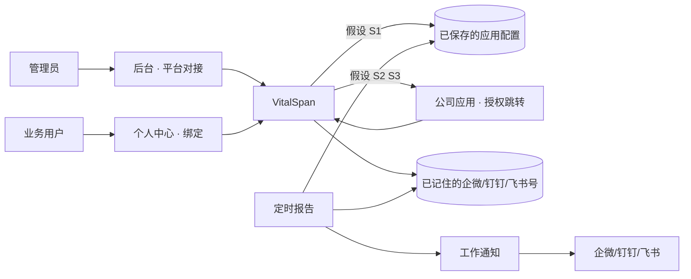
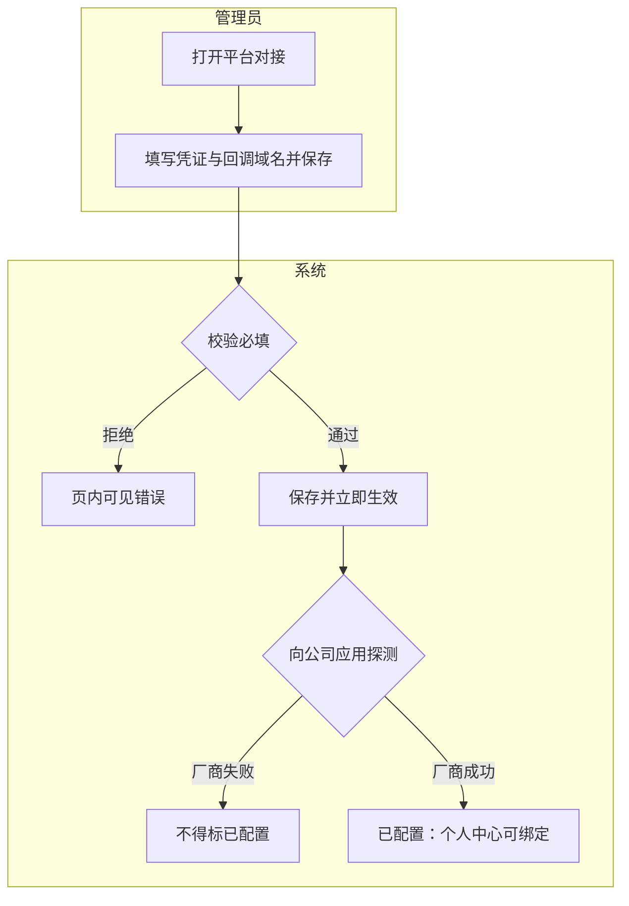
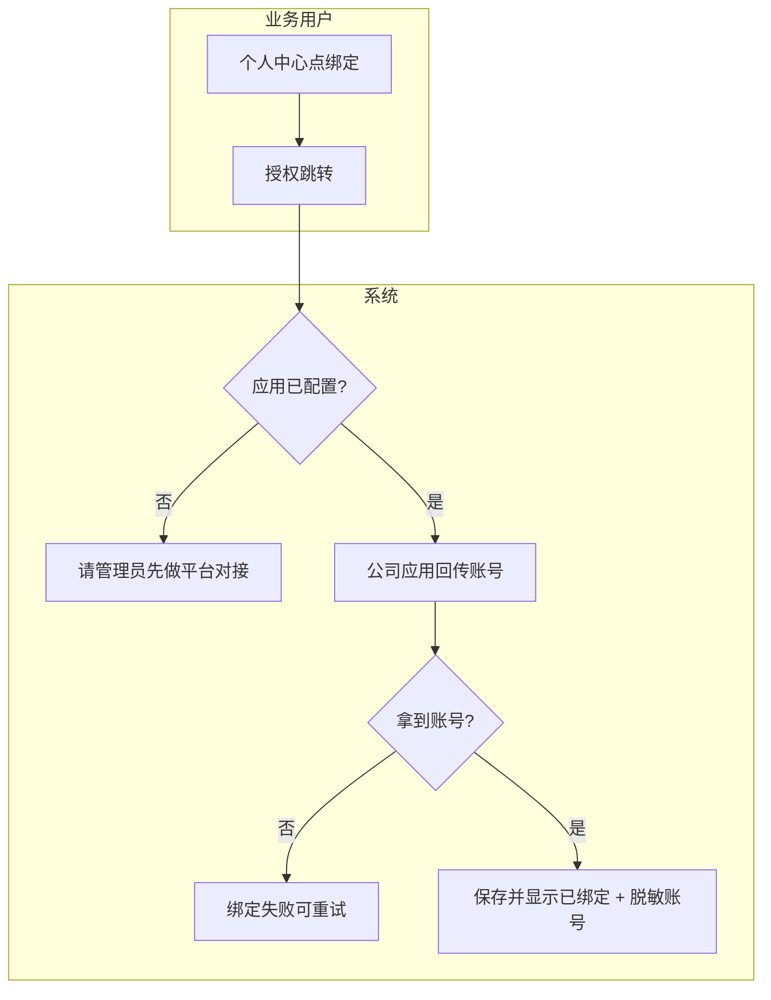
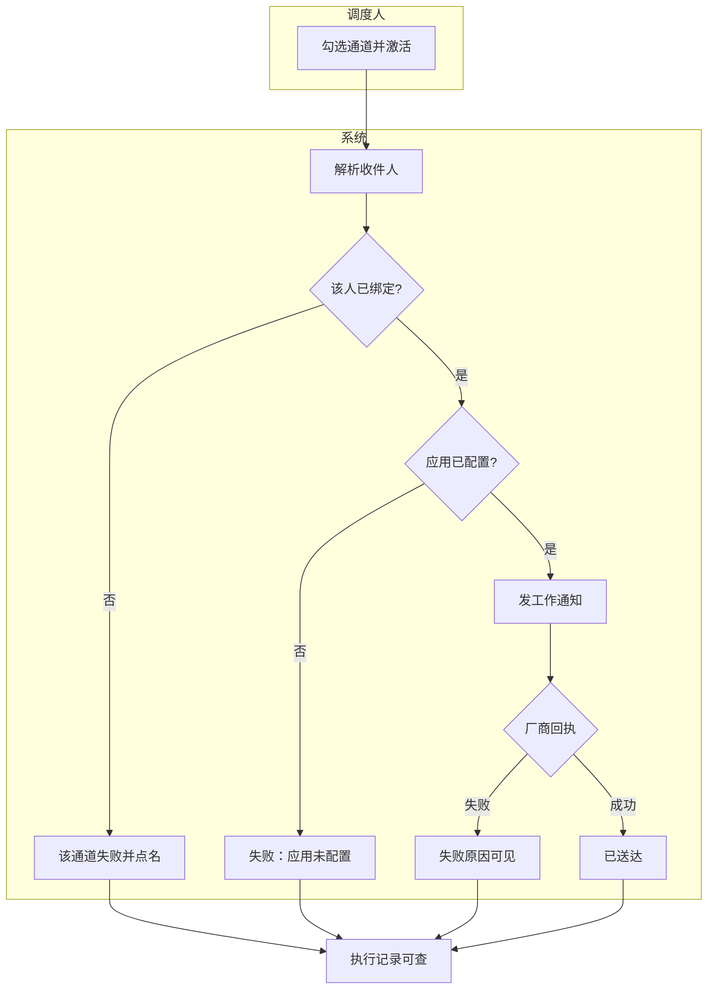

# IM 后台配置 + 自助绑定 · blueprint

## 元信息

- mode: blueprint · scope: `im-app-config-self-bind` · 日期: 2026-08-13
- 证据袋: [2026-08-13-im-app-config-self-bind-evidence.md](./2026-08-13-im-app-config-self-bind-evidence.md) · domain_strength: mixed
- 提纲: [2026-08-13-im-app-config-self-bind-outline.md](./2026-08-13-im-app-config-self-bind-outline.md)
- 智囊团：提纲① 六席独立 Task 轮1 全 revise → 轮2 五席 pass + 终端用户小 revise 已吸收；成稿② product revise（§8 负向验收）已吸收，plan/end_user/ops_audit pass；architecture/domain 成稿轮 skipped（相对提纲主路径/选型未变）
- 假设状态: **用户已确认**（2026-08-13 整包接受 H1–H5 / S1–S2）。S3 已有简报 `docs/integrations/im-platform-connect.md`（researched，可行性 B）。
- 关联: RPT-005 · F02 账户自服务 · ADR-06/19 · `docs/ui/layout.md` 个人中心/后台管理

## 1. 问题与主任务

管理员不愿改服务器环境变量；业务用户不愿抄企微/钉钉/飞书账号。要对齐 DataEase「系统设置平台对接 + 个人信息绑定」，同时**有意不做**用 IM 扫码登录 VitalSpan。

- **JTBD**：后台配好公司应用后，用户自己点一次绑定，系统自动记住其号，定时报告发到本人。
- **成功**：对接已保存且脱敏可见、探测通过；个人中心已绑定并亮脱敏账号；调度后工作通知厂商回执成功。
- **最贵失败**：显示已绑定但账号错误 / 未配置却可绑定 / 未绑定或厂商拒绝却当成功（含回落群）。

## 2. 架构关系图（强制）

脚注：配置 → core 运行时配置端口（SM4）；绑定与授权回跳 → auth outbound；发信 → reports 只读配置 + 工作通知。禁止报表域存 Secret，禁止页面直连开放平台。

### 2.1 难回退选型约束

| ID | 选题 | 状态 | 证据 | 阻塞 F | 备注 |
|----|------|------|------|--------|------|
| S1 | 凭证 SoR=管理面 DB（SM4）。从未保存才 env 回落；保存或清空后以库为准，清空=禁用且忽略 env | assumed | E3 H1 | F1 F3 | 难回退 |
| S2 | 认人=已登录授权跳转绑定；不替代 JWT 登录；建用户不猜号 | assumed | E15 H2 | F2 | 难回退 |
| S3 | 三厂商契约不写死 URL；httpx 官方 REST | researched | docs/integrations/im-platform-connect.md | F2 | — |
| S4 | 工作通知 + 禁回落群 | anchored | E2 E4 | F3 | — |
| S5 | Secret SM4，API 不回明文 | anchored | E2 | F1 | — |

## 3. 用户场景对照表

| 真实情境 | 本方案步骤 | 业内常见做法 | 跟随/有意偏离 | 依据 |
|----------|------------|--------------|---------------|------|
| 实施接到本公司企微 | 后台平台对接填凭证+回调域名，热生效 | DataEase 系统设置-平台对接 | 跟随入口与字段；入库为 S1 | E8 H1 |
| 分析师要在企微收定时看板 | 个人中心绑定 → 授权跳转 → 回传账号 → 保存并亮脱敏号 | DataEase 个人信息绑定（须先对接） | 入口跟随 E8；拿号为 S2 | E8 S2 |
| 新同事被管理员建号 | 先空着，本人登录后再绑定 | 建号不会自动知道 IM 号 | 偏离「注册即填号」 | E6 E15 |
| 想用企微扫码进 VitalSpan | 本轮不做 | DataEase 扫码/免密登录 | 有意偏离，登录仍 JWT | E2 E9 E15 |
| 定时发给已绑定的人 | 工作通知；未绑定或已清空则失败点名 | 绑后按人发；群组另开 | 跟随 S4 | E2 E4 E5 |

### 3.1 术语表

| 术语 | 用户向含义 | 勿混淆 |
|------|------------|--------|
| 平台对接 | 管理员配置公司应用 | 不是群机器人 |
| 绑定 | 授权后系统记住其企微/钉钉/飞书号 | 不是用它们登录本系统 |
| 已绑定 | 已记住该通道账号 | 不等于现在发得出 |
| 可投递 | 已绑定且应用已配置 | 不等于已送达 |
| 已配置 | 保存且探测通过 | 不等于已绑定 |
| 工作通知 | 发到个人的应用消息 | 不是群公告 |
| 授权跳转 | 去公司应用确认身份 | 不是登录页扫码进 VitalSpan |
| 执行记录 | 这次定时成功或失败的说明 | — |
| 探测 | 保存后向公司应用确认凭证能用 | 不是消息已送达 |
| 脱敏账号 | 已绑定后部分遮盖的账号 | 不是 Secret |
| 已送达 | 公司应用回执成功 | 本机保存成功不算 |
| 应用凭证 | CorpId/Secret/AgentId 与回调域名 | 只出现在管理员页 |

全文禁止「绑号」作用户向词。

## 4. 端到端业务流程（先图后文）

### 4.0 核心业务清单（≤5）

| ID | 业务名 | 流程图 | 成功结果 |
|----|--------|--------|----------|
| F1 | 配置平台应用 | §4.1 | 已保存脱敏可见 + 探测通过 + 可发起绑定（不含已送达） |
| F2 | 自助绑定 | §4.2 | 回传账号入库，显示已绑定 + 脱敏账号 |
| F3 | 定时发到已绑定账号 | §4.3 | 厂商工作通知回执成功 |

### 4.1 F1 · 配置平台应用

#### 流程图

#### 主路径

| 步 | 操作者 | 动作 | 系统 | 可见反馈 | 副作用 |
|----|--------|------|------|----------|--------|
| 1 | 管理员 | 打开后台平台对接 | 读配置（无明文 Secret） | 表单；来源=库内或环境变量回落 | — |
| 2 | 管理员 | 填凭证+回调域名并保存 | 校验 → SM4 入库 | 保存成功或页内错误 | 审计 save |
| 3 | 系统 | 向公司应用探测 | 真实厂商 API | 已配置 / 不得标已配置 | 探测失败保持未配置 |

#### 例外与逆操作

| 条件 | 行为 | 用户可见 | 审计 |
|------|------|----------|------|
| 清空通道 | 禁用，**忽略 env** | 未配置；定时失败点名「应用未配置」 | clear |
| 改 Secret | 须再探测通过 | 探测失败则不是已配置 | rotate |
| 从未保存过 | 允许 env 回落 | 来源标明环境变量回落 | — |

### 4.2 F2 · 自助绑定

#### 流程图

图注：B/D 为假设 S2/S3。主路径是「授权跳转」不是「扫码」。

#### 主路径

| 步 | 操作者 | 动作 | 系统 | 可见反馈 | 副作用 |
|----|--------|------|------|----------|--------|
| 1 | 用户 | 个人中心点绑定 | 查已配置布尔 | 三态之一 | — |
| 2 | 用户 | 在公司应用确认 | auth outbound 回跳（协议待调研） | 失败可重试 | 临时码不作发信令牌 |
| 3 | 系统 | 写入绑定表 | 冲突则拒绝 | 已绑定 + 脱敏账号 | AUTH-008 |

#### 例外与逆操作

| 条件 | 行为 | 用户可见 | 审计 |
|------|------|----------|------|
| 解绑 | 清空该通道绑定 | 回到未绑定 | unbind |
| 外部号已被他人绑定 | 拒绝 | 冲突说明 | — |
| 管理员手改 | 覆盖，来源=管理员手改 | 本人资料可见，禁静默 | user.update |
| 应用已清空 | 仍显示已绑定 | 另提示通道暂不可投递 | — |

个人中心三态：① 应用未配置 → 按钮不可用；② 已配置未绑定 → 可绑定，不绑则收不到；③ 已绑定 → 脱敏账号，可解绑。

### 4.3 F3 · 定时发到已绑定账号

#### 流程图

#### 主路径 / 例外

沿用已落地工作通知（S4）。未绑定、未配置、厂商失败均写入执行记录。禁止回落群冒充成功。入队不得标已送达。

### 4.A 附录流程

| ID | 业务名 | 摘要 |
|----|--------|------|
| A1 | 管理员手改对方账号 | 兜底；来源可见；权限 `system:user.manage`；须写审计 |
| A2 | 扫码登录 VitalSpan | 有意不做 |

### 4.n 状态与信任

| 状态 | 含义 | 不得假装 |
|------|------|----------|
| 已配置 | 库内（或从未保存的 env 回落）且探测通过 | 格式校验通过 |
| 已绑定 | 绑定表有账号 | 前端勾选 |
| 可投递 | 已绑定 ∧ 已配置 | 仅已绑定 |
| 已送达 | 厂商回执成功 | mock / 入队 |

## 5. 文字版页面设计说明

壳层引用：`docs/ui/layout.md` 后台管理 + 我的/用户资料；`docs/ui/anchor.md` 系统管理。菜谱：配置向导卡片、form-composition、个人资料现有页。禁止重发明导航壳。

### 5.1 配置向导入口

| 项 | 内容 |
|----|------|
| 路由 | `/admin/system` |
| 引用 | 现有配置向导卡片 |
| 差异 | 增加步骤「平台对接」：未配任何通道则未完成 |
| 空态 | 「还没接公司应用，绑定后也发不出工作通知」 |

### 5.2 平台对接页

| 项 | 内容 |
|----|------|
| 路由 | `/admin/system/im-connect`（建议） |
| 引用 | form-composition |
| 页头 | 平台对接 · 配好后，同事可在个人中心绑定 |
| 主区域 | 企微/钉钉/飞书三块：凭证字段、回调域名、保存、清空、已配置、来源 |
| 空态/错误 | 未填、探测失败人话；权限不足 |
| Secret | 只写不回；已保存显示占位 |

### 5.3 个人资料 · 绑定

| 项 | 内容 |
|----|------|
| 路由 | `/admin/account/profile` |
| 引用 | 现有用户资料页 |
| 差异 | 增加三通道绑定/解绑；三态文案见 §4.2 |
| 主 CTA | 绑定企业微信 / 钉钉 / 飞书 |

### 5.4 用户管理兜底

| 项 | 内容 |
|----|------|
| 路由 | `/admin/system/users` 组织与安全 |
| 引用 | 现有 IM 栏 |
| 差异 | 显示来源：自助绑定 / 管理员手改；手改后本人可见 |

### 5.5 定时预检

现有看板定时弹窗：预检增加未配置 / 未绑定 / 不可投递。不改主 IA。

## 6. 角色 · 权限 · 审计

| 操作 | 权限 | 审计事件 | detail（无密钥） |
|------|------|----------|------------------|
| 保存/轮换/清空平台对接 | `system:im_connect.manage`（H4） | `im_connect.save` / `rotate` / `clear` | 通道、动作、来源 |
| 读已配置布尔 | 登录即可 | 无 | — |
| 自助绑定/解绑 | 登录（本人） | `im_bind` / `im_unbind` | 通道、脱敏账号 |
| 手改他人绑定 | `system:user.manage` | 现有 user.update + 来源=admin | 通道、来源 |

禁止把 Secret 写权限挂到 `system:user.manage`。审计可在 AUTH-008 查询页按时间窗检索上述事件。

## 7. 外部依赖与验收诚实

| 依赖 | 用途 | 真实验收路径 | 失败语义 | 证据 |
|------|------|--------------|----------|------|
| 企微/钉钉/飞书开放平台 | 授权跳转 + 工作通知 + 探测 | 真应用或官方沙箱真实 API | 页内/执行记录人话失败 | E5 E8 E16 H3 |
| 元数据库 | 配置与绑定 | Alembic 可重放 | 迁移失败不得假绿 | E6 |
| SM4 根密钥 | 加密 Secret | `CREDENTIAL_SM4_KEY` | 缺密钥拒绝保存 | S5 |

禁止 mock 标已配置 / 已送达。S3 契约见 `docs/integrations/im-platform-connect.md`。

## 8. 可观察验收（生产级）

1. 管理员在平台对接保存企微并探测通过后，个人中心出现可点的「绑定企业微信」（真实应用）。
2. 未配置或探测失败时：该通道不得标已配置；个人中心绑定按钮不可点，并说明请管理员先做平台对接。
3. 用户完成授权跳转后，资料显示已绑定且有脱敏账号；绑定表有记录。
4. 调度勾选企业微信发给该用户，执行记录为已送达当且仅当厂商回执成功。
5. 未绑定用户该通道失败并点名，不出现群 webhook 成功。
6. 清空企微通道后，即使用户已绑定且 env 仍有旧值，执行失败「应用未配置」。
7. 无 `system:im_connect.manage` 者保存对接返回 403；审计可查 save/clear。

## 9. 假设清单

| ID | 假设 | 依据 | 若推翻 | 难回退? |
|----|------|------|--------|---------|
| H1 | 入库为 SoR；从未保存才 env 回落；清空忽略 env | S1 | 无后台配置或值班无法解释 | 是 |
| H2 | 绑定=已登录授权跳转；建用户不自动填号 | S2 | 通讯录同步另开 | 是 |
| H3 | 不写死 URL；spec 前 integration-research | S3 | 未简报不得实现协议 | 是 |
| H4 | 写对接用 `system:im_connect.manage` | E13 | 权责过宽 | 否 |
| H5 | 三通道一起做绑定 | E4 | 可先企微 | 否 |

## 10. 偏航对照（blueprint+PRD）

| ID | 分片主张 | 蓝图/业内 | 偏航 | 建议 | 建议回写 PRD？ |
|----|----------|-----------|------|------|----------------|
| RPT-005 | 管理员填写 IM 账号 | 主路径改为自助绑定 | 验收过时 | 确认后补自助绑定验收 | 是（点名才写） |
| F02 自服务 | 资料/改密 | 个人中心加绑定 | 无功能 ID | 挂自服务追溯 | 否除非立项 |
| AUTH-003 | 用户管理 | 手改降附录且来源可见 | 轻 | 文档边界 | 否 |
| auth.md | 管理员填写，非 OAuth | 将含授权绑定适配 | 边界句过时 | 确认后改 | 域附录 |
| arch §7.2 | IM 应用凭证为 env | DB SoR + env 仅从未保存回落 | 与 S1 | 确认后扩 ADR-19 | 架构 |

## 11. 范围外与非目标

- 用企微/钉钉/飞书扫码登录 VitalSpan
- 通讯录同步、按邮箱自动匹配
- IM 内嵌 PDF（文字+下载链接；邮件继续带附件）
- 群机器人当按人投递
- 多企业应用路由

## 12. 交接

- [x] 用户已确认（确认面；含架构图 + 核心 F 流程图 + 选型状态 + 假设整包）— 2026-08-13
- [ ] （可选）点名回写 PRD / auth.md / ADR-19
- [x] 确认后 `mode=spec` 前先跑 **integration-research**（S3）— 简报已落盘
- [x] 未确认 assumed 不得交 go-fast（已确认假设；无凭据不得宣称已对接）
- [ ] （可选）product-reviewer 打分
