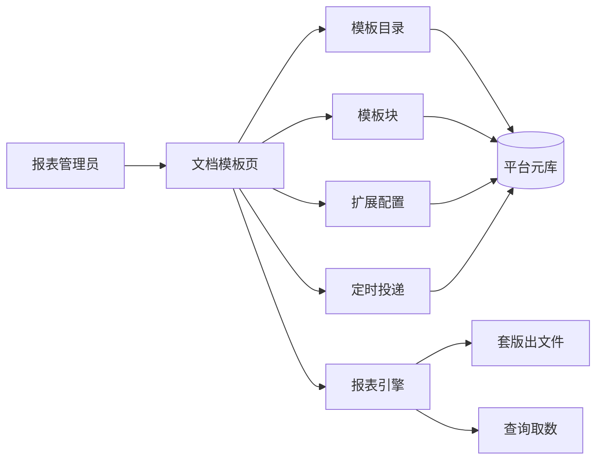
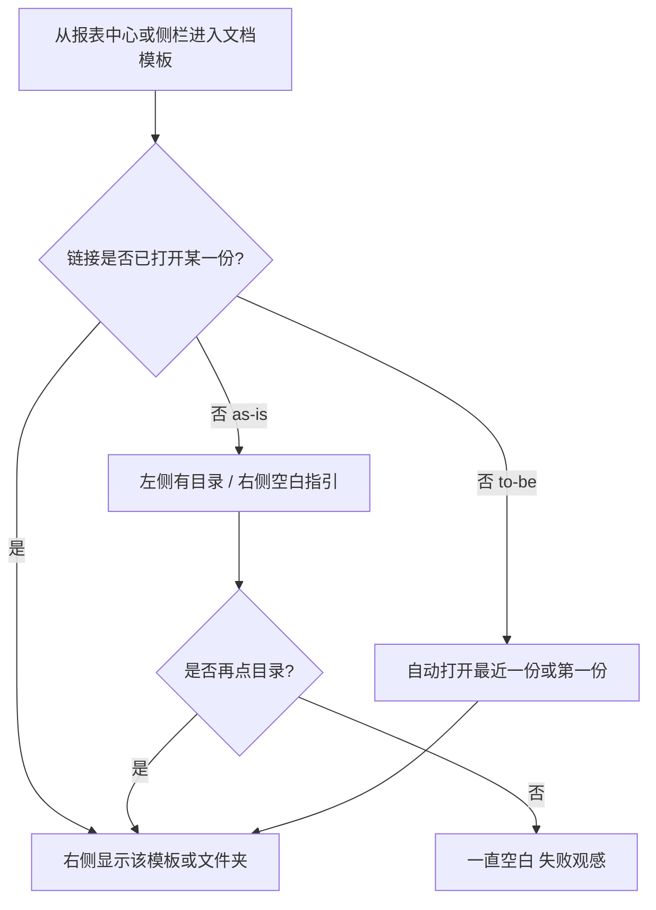
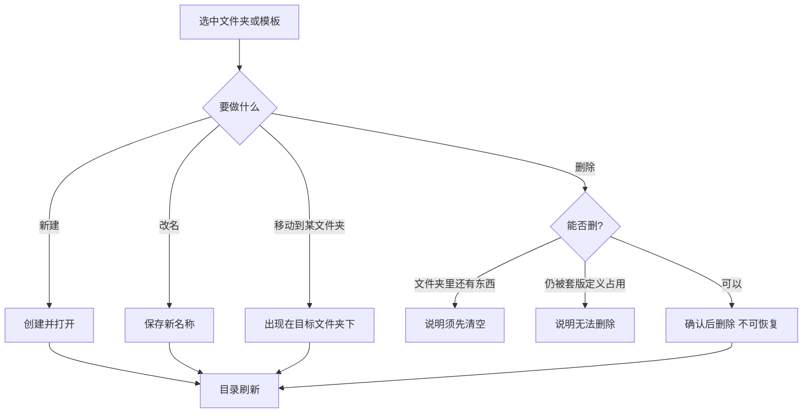
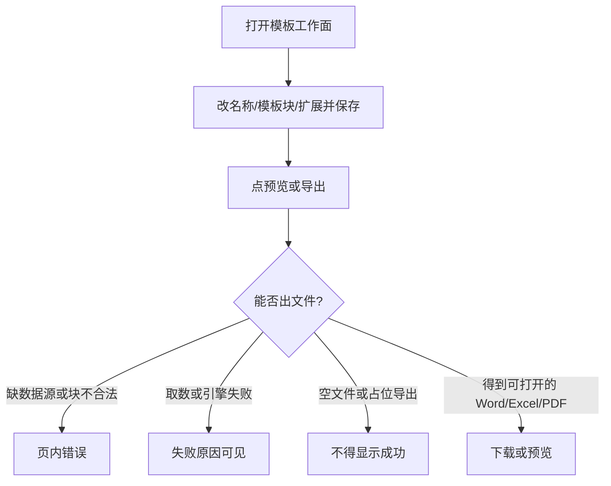
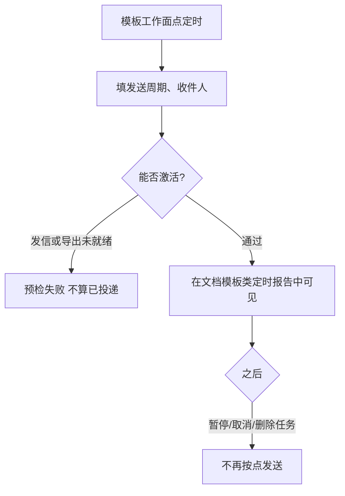

# 文档模板管理 · audit

## 元信息

- mode: audit · scope: 文档模板管理 · 日期: 2026-08-14
- 证据袋：`docs/material/blueprints/2026-08-14-doc-template-mgmt-evidence.md` · domain_strength: mixed
- 智囊团：提纲轮六席 revise 已吸收；成稿轮 product/plan/architecture/ops_audit pass；end_user/domain revise（术语对齐 + E10 专页）已吸收，未重开第三轮
- 假设状态：**用户已于 2026-08-14 确认**
- 关联：F08-RPT RPT-003/004/001/005 · ADR-09/20 · `docs/services/reports.md` · `docs/ui/layout.md` master-detail

## 1. 问题与主任务

**JTBD**：报表管理员维护固定版式月报/台账（Word/Excel/PDF 套版），进页就能打开一份具体模板：改内容、导出文件、或挂定时发送。

**成功**：有目录时右侧不是空白；能新建/改名/移动/删除（删除不可恢复、有确认）；预览/导出是可打开的真实文件；该模板的定时任务出现在「文档模板」调度里。

**最贵失败**：目录有模板、工作区空白，像功能没做完；删了找不到还赖不了账；和「可视化模板」搞混；界面显示导出成功但没有真实文件。

## 2. 架构关系图（as-is；人话标签）

脚注（不进确认面主标签）：目录 CRUD = `catalog` 节点 id；套版块 = `templateKey`；扩展/调度挂 `catalogNodeId`；出文件 = RenderSpec（ADR-09）。禁止把块 JSON 写进目录服务。

### 2.1 难回退选型约束

| ID | 选题 | 状态 | 证据 | 阻塞 F | 备注 |
|----|------|------|------|--------|------|
| S1 | 自研套版渲染，不做 Jasper 画布 | anchored | E1 | F3 | 已定 |
| S2 | 文档模板与看板快照并列 | anchored | E2 E3 | F1 F4 | 已定 |
| S3 | 目录节点身份 + 块走 templateKey | anchored | E1 E8 | F2 F3 F4 | 双键，见上图脚注 |

## 3. 用户场景对照表

| 真实情境 | as-is | 业内 | 跟随/偏离 | 依据 |
|----------|-------|------|-----------|------|
| 固定版式月报/台账，不是看板截图 | 文档模板树 + 套版块填数导出 | DataEase 定时报告推仪表板/大屏；FineReport 模板导出 Word/Excel/PDF | 跟随分线；无画布设计器是有意偏离 S1 | E2 E10；[FineReport 导出](https://help.fanruan.com/finereport/doc-view-4775.html) |
| 打开「我的报表」想接着改 | 进页右侧空态，必须再点树 | 文件管理常见「记住上次打开」；**非强业内基线** | to-be：默认选中最近或第一份（H2） | E4；H2 |
| 整理目录：挪/删 | 悬停「…」才有移动/删除 | 树常驻更多菜单（可发现性，非强基线） | 能力已有；to-be 常驻 | E5 E8；H4 |
| 定期发套版 PDF | 详情「调度」Tab | 可视化定时 ≠ 套版定时 | 跟随 S2 | E2 E11 |
| 管理员当场导出一份 | 预览 Tab / 导出卡片藏得深 | 列表「运行/下载」 | 本轮只把导出提成详情主按钮，不做独立运行器 | E3 E6；H3 |
| 红头水印/带参导出 | 未做 | FineReport 常见水印/文件保护 | **有意偏离，范围外** | FineReport 帮助；§11 |

## 3.1 术语表

| 术语 | 用户向含义 | 勿混淆 |
|------|------------|--------|
| 文档模板 | 固定版式 Word/Excel/PDF 套版 | 可视化模板（看板组件） |
| 模板目录 | 左侧文件夹树 | 数据集目录 |
| 文件夹 / 模板 | 树上的两类条目 | 勿对用户说「节点」 |
| 模板块 | 套版里的 SQL/表/图占位 | 看板组件 |
| 扩展配置 | 挂到模板的指标和筛选 | 平台对接 |
| 预览/导出 | 生成可打开的文件 | 内部 RenderSpec |
| 定时投递 | 按周期把该模板发出去 | 看板可视化定时 |

侧栏入口现名「我的报表」，**硬决策**：与页标题统一为「文档模板」。

## 4. 端到端业务流程

### 4.0 核心业务清单

| ID | 业务名 | 流程图 | 成功结果 |
|----|--------|--------|----------|
| F1 | 打开并进入工作面 | §4.1 | 右侧是某模板或文件夹 |
| F2 | 维护目录 | §4.2 | 建/改名/移/删落库且可见 |
| F3 | 配块并导出 | §4.3 | 可打开的真实文件 |
| F4 | 挂定时投递 | §4.4 | 出现在文档模板调度列表 |

### 4.1 F1 · 打开并进入工作面

**as-is（实线）与 to-be（注释）**

例外：目录为空 → 才显示「去新建」。链接指向已删条目 → 「不存在，请重选」。

### 4.2 F2 · 维护目录

- 删除无回收站。确认框已有。
- 目录删除：非空文件夹拒绝（`RPT_CATALOG_HAS_CHILDREN`）。套版定义删除占用：`RPT_TEMPLATE_IN_USE`。调度**不**挡删文件夹/模板（as-is）→ 删后定时任务可能悬空；to-be 删除前应提示「仍有定时报告」或阻止（H5）。
- to-be：选中行常显「更多/删除」，不靠鼠标悬停。

### 4.3 F3 · 配块并导出

主按钮 = 预览/导出。批量导入退出主 Tab，放进更多或附录。界面禁止出现 RenderSpec / placeholder。

### 4.4 F4 · 挂定时投递

看板可视化定时列表里出现同名项 **不算** 本 F 验收（S2）。

### 4.A 附录

| ID | 业务名 | 摘要 |
|----|--------|------|
| A1 | 批量导入 | 低频，移出主 Tab |
| A2 | 扩展修订历史 | 扩展配置可追溯；**不等于**目录删除审计 |

### 4.n 状态与信任

列表、详情、磁盘上的文件三者一致。空响应、布局清单、占位 hook **禁止**当导出成功。

## 5. 文字版页面设计说明

引用：`docs/ui/layout.md` **master-detail**；壳层 AdminLayout。禁止重发明导航。

### 文档模板页 `/admin/reports/templates`

| 项 | 内容 |
|----|------|
| 页头 | 标题「文档模板」；说明固定版式套版；返回报表中心；新建文件夹/模板 |
| 布局 | 左树右工作面一层；禁止再套外卡 |
| 主区域 | 树：名称 + 常驻更多（移动/删除）。未选中且有数据时自动选中。选中模板：页内主按钮预览/导出 + Tabs（基本信息、模板块、扩展、定时）。选中文件夹：子项列表 + 在此新建 |
| 空态 | 仅当目录为零：引导新建。禁止「有树仍显示从目录选择」 |
| 错误 | 节点丢失、删除被拒、导出失败：人话 + 可重试 |
| 权限不足 | 无 `report:manage` 不进本页 |

行操作 ghost；删除用错误色 + 确认。

## 6. 角色 · 权限 · 审计

**两层权限（as-is）**

| 层 | 规则 |
|----|------|
| 页面 | `/admin/reports/templates` 需 `report:manage`。analyst/viewer **默认进不了** |
| 节点 | catalog ACL：admin 旁路；创建者可删叶；viewer 禁写 |

§1 的「当场导出」操作者 = 有 `report:manage` 的管理员，不是业务员。

**审计（诚实）**

| 写操作 | as-is | 说明 |
|--------|-------|------|
| 目录建/移/删 | **未**写入 AUTH-008 平台审计 | 不可按审计页追误删；只能靠结构化日志（若有） |
| 扩展配置 | 有修订历史 | 不等于目录审计 |
| 调度执行 | 有执行历史 | 不等于模板删除审计 |

本轮 UX 改造不假装误删可追责。P1：目录敏感写补审计或明确「无回收、无审计」。

**配置（只列名）**：`RPT_SMTP_*` · `RPT_METADATA_STORE` · `RPT_SCHEDULE_STORE` · `ARTIFACT_STORAGE_*`。导出失败应对上请求 `traceId`。

## 7. 外部依赖与验收诚实

| 依赖 | 用途 | 真实验收 | 失败语义 | 证据 |
|------|------|----------|----------|------|
| 查询/数据集 | 套版取数 | 绑定真实源后导出可打开的文件 | 缺源/超时可见失败 | E1 E3 |
| 邮件 SMTP | 定时投递 | 真实收件箱 | 预检失败不算投递 | E2 |
| 产物存储 | 附件 | 下载字节非空且可打开 | 存储失败可见 | arch ADR-20 |

## 8. 可观察验收（生产级）

1. 目录非空时打开文档模板页（不带 id），右侧出现某一份模板或文件夹工作面，不再是「从目录选择模板」。
2. 不悬停也能看到删除；确认后条目从树消失；非空文件夹删除被拒绝并说明原因。
3. 预览/导出得到可打开的 Word/Excel/PDF；空文件或占位内容不得提示成功。
4. 在该模板上激活定时后，**文档模板**调度列表可见；仅出现在看板定时列表不算通过。
5. 无 `report:manage` 无法进入本页。
6. 删除模板后，不得在产品文案中声称「可从审计找回」（as-is 无 AUTH-008）。

## 9. 假设清单

| ID | 假设 | 依据 | 若推翻 | 难回退? |
|----|------|------|--------|---------|
| H2 | 默认选中「最近访问」，否则第一份模板 | E4 | 改为默认根文件夹 | 否 |
| H3 | 本轮不做独立手工执行页 | E3 | 升为核心 F | 否 |
| H4 | 常驻「更多」即可，不做右键菜单 | E5 | 加右键 | 否 |
| H5 | 删除仍有调度的模板时先警告，本轮可不硬拦 | F2 缝 | 改为系统直接拒绝删除 | 否 |

H1 已升硬决策：侧栏改名「文档模板」。

## 10. 缺口严重度（audit）

| ID | 缺口 | 严重度 | as-is 证据 | 建议 | 接力 |
|----|------|--------|------------|------|------|
| G1 | 有目录时右侧空白，主路径像没完成 | P0 | E4 截图 | 默认选中 + 禁止该空态 | go-fast 后改 FE |
| G2 | 删除/移动仅悬停可见 | P1 | E5 | 选中或常驻更多 | go-fast |
| G3 | 侧栏「我的报表」名词漂移 | P1 | E9 | 改为文档模板 | go-fast 文案 |
| G4 | 导出藏在 Tab；假成功风险 | P1 | E6；F3 | 主 CTA；拒绝占位成功 | go-fast + 导出校验 |
| G5 | 六 Tab 含批量导入，认知过载 | P2 | E6 | 批量降附录 | go-fast |
| G6 | 目录 CRUD 无平台审计、无回收站 | P1 | AUTH-008 未覆盖 reports | 补审计或产品声明不可追 | 架构/AUTH |
| G7 | 删目录不管调度占用 | P1 | F2 | 警告或拦截 | go-fast |
| G8 | 无画布/水印/带参红头 | P2 | S1 §11 | 保持范围外 | 不改 |

## 11. 范围外与非目标

- Jasper/FineReport 画布设计器、红头水印、文件保护、带参导出
- 把文档模板并入看板编辑器
- 另存为、独立手工执行器页面（PRD 非阻塞）
- 组合调度粒度
- 本轮不新增 ADR

## 12. 交接

- [x] 用户已确认（2026-08-14）
- [ ] 不自动改代码/PRD
- [ ] 确认后可 `mode=spec` 再交 go-fast（G1–G5 优先）
- [ ] 可选 `/product-reviewer scope=文档模板`
