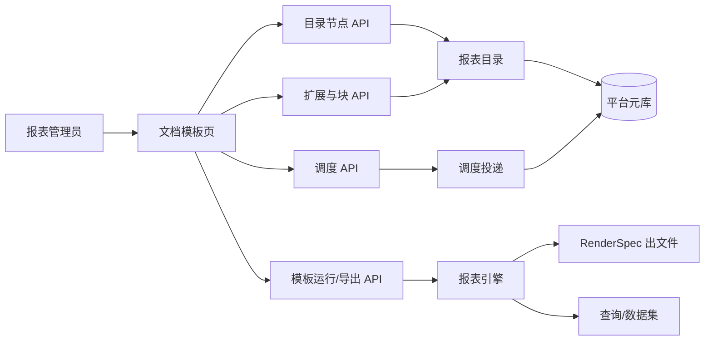
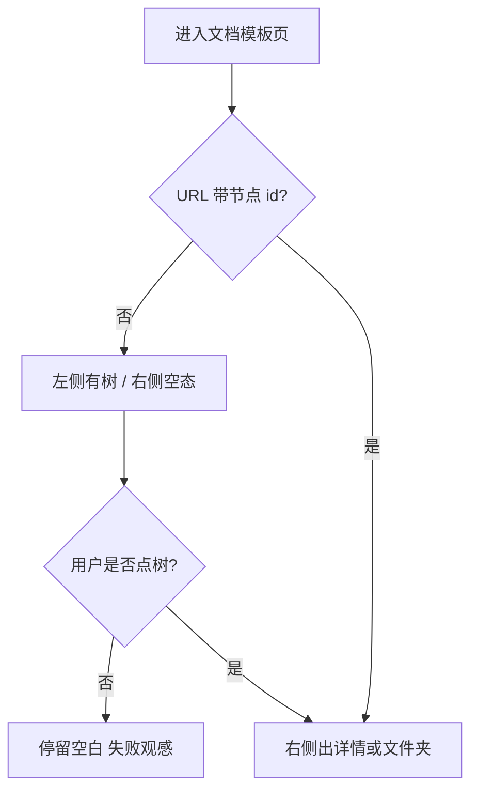
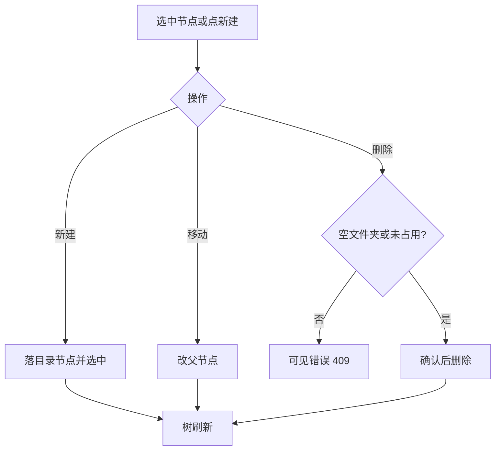
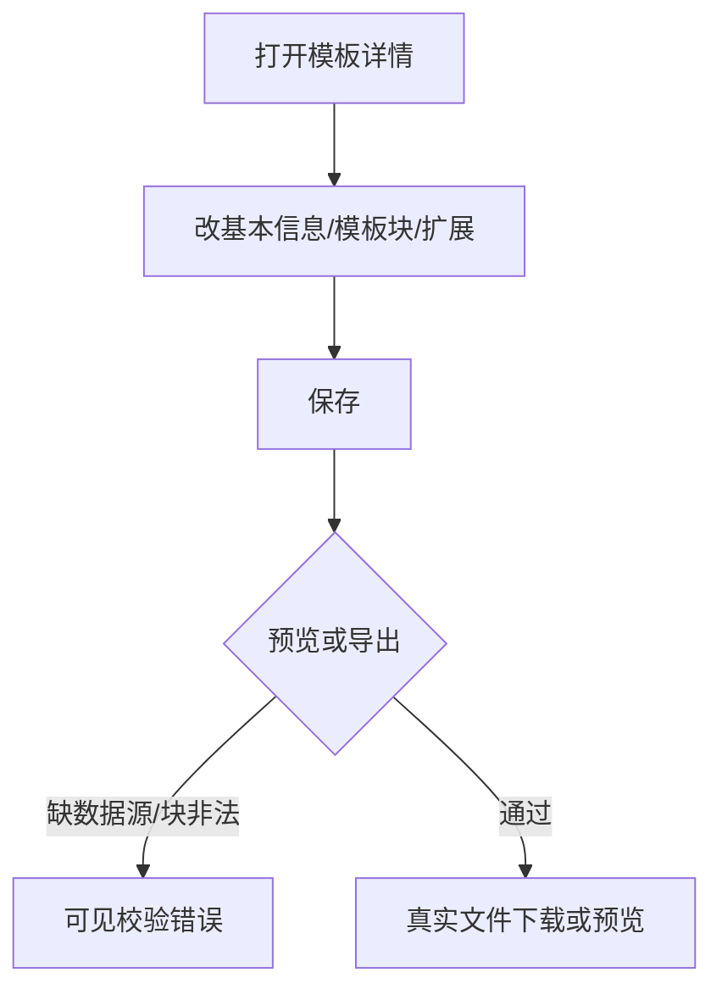
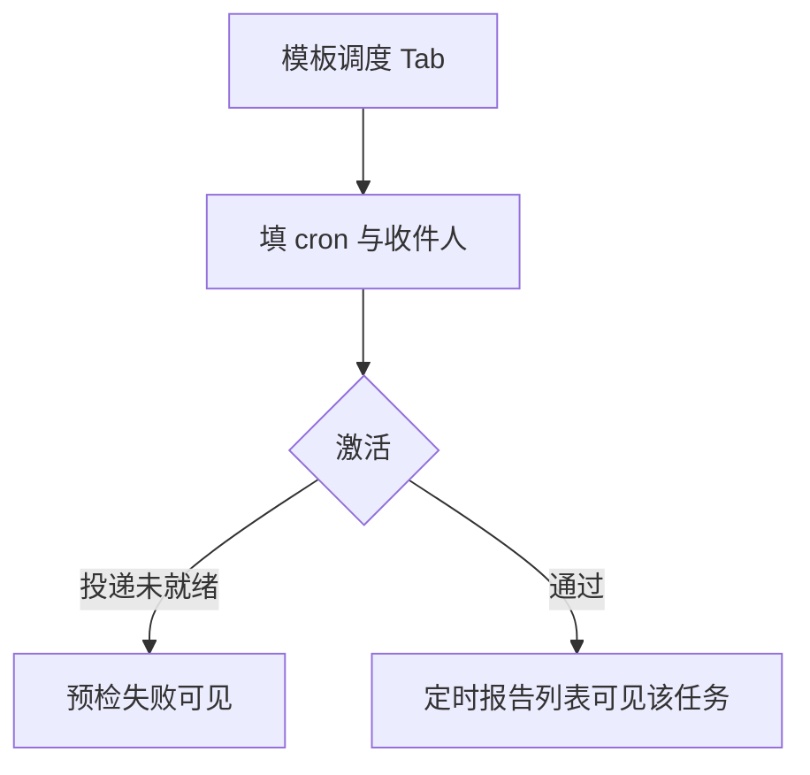

# 提纲 · 文档模板管理

- mode: audit
- 日期 / 证据袋：docs/material/blueprints/2026-08-14-doc-template-mgmt-evidence.md / domain_strength: mixed

## 1. 主任务

- **JTBD**：报表管理员要维护固定版式月报/台账模板（Word/Excel/PDF），能立刻打开一份模板改块、出数导出或挂定时，而不是面对空白工作区猜要不要点目录。
- **成功**：进入页即看到一份具体模板的工作面（或明确的文件夹内容）；能新建/改名/移动/删除；能预览或导出真实字节；能挂调度。
- **最贵失败**：目录里明明有模板，右侧空白像没做完；删除找不到；用户把「可视化模板」和「文档模板」当成同一件事；导出看起来成功但无真实文件。

## 2. 用户场景对照表（强制）

| 真实情境（运维/业务） | 本方案步骤（as-is） | 业内常见做法 | 跟随/有意偏离 | 依据 |
|----------------------|-------------------|--------------|---------------|------|
| 政企要固定版式月报（红头/台账），不是看板截图 | 文档模板树 + RenderSpec 块填数 | FineReport/积木：模板+数据集填数导出 | 跟随产品线拆分；偏离：无拖拽画布设计器（ADR-09） | E1 E2 E10 |
| 管理员打开「我的报表」想接着改昨天的模板 | 打开 `/templates` 右侧空态，须再点左侧树 | 资源管理器/网盘：进页默认选中上次或第一项 | as-is 偏离；to-be 跟随默认选中 | E4 |
| 整理目录：删错模板、挪文件夹 | 悬停「…」才有移动/删除；详情也有元数据删除 | 树节点常驻 overflow 菜单或右键；删除二次确认 | 能力已有；可发现性偏离 | E5 E8 |
| 定期把套版 PDF 发邮箱 | 模板详情「调度」Tab | DataEase 定时报告偏可视化；Office 套版走独立报表调度 | 跟随本仓两条产品线 | E2 E11 |
| 业务员只要跑一次导出 | 预览 Tab / ReportExportCard；PRD 手工执行未勾 | 列表行「运行/下载」 | 有意未做独立运行器；to-be 至少在详情主 CTA 暴露导出 | E3 E6 |

## 2.1 难回退选型约束

| ID | 选题 | 状态 | 证据 | 阻塞的核心 F | 动作 |
|----|------|------|------|--------------|------|
| S1 | 自研 RenderSpec，不做 Jasper WYSIWYG | anchored | E1 | F3 | none |
| S2 | 文档模板与看板快照并列，不合并入口 | anchored | E2 E3 | F1 F4 | none |
| S3 | catalog 节点为模板 of record | anchored | E1 E8 | F2 F3 F4 | none |

## 3. 架构关系图（as-is）

## 4. 核心主业务（≤5）+ 流程图

| ID | 业务名 | 入口 | 成功结果 | 确认面 |
|----|--------|------|----------|--------|
| F1 | 打开并进入模板工作面 | 侧栏「我的报表」/ Hub | 右侧是某模板或文件夹，不是空白指引 | 核心 |
| F2 | 维护目录（建/移/删） | 树 + 顶栏新建 | 节点落库；删除确认；占用则拒绝 | 核心 |
| F3 | 配块、出数、导出 | 详情 Tabs | 预览/下载真实 PDF/Excel/Word | 核心 |
| F4 | 给该模板挂定时投递 | 详情「调度」 | 调度出现在定时报告列表 | 核心 |

### F1 · 打开并进入模板工作面

**as-is**

**to-be（建议）**：无 id 时自动选中最近访问或第一份模板/根文件夹；空目录才显示「去新建」。

### F2 · 维护目录

例外：viewer 只读；文件夹非空不可删。to-be：操作按钮常驻或选中即显，不依赖 hover。

### F3 · 配块、出数、导出

不引入画布设计器（S1）。主 CTA 应是「预览/导出」，不是六个平权 Tab 里藏导出。

### F4 · 给该模板挂定时投递

### 附录流程

| ID | 业务名 | 为何附录 |
|----|--------|----------|
| A1 | 批量导入模板节点 | 低频管理 |
| A2 | 扩展修订历史 | 审计向，非主闭环 |

## 5. 术语表

| 术语 | 用户向含义 | 勿混淆 |
|------|------------|--------|
| 文档模板 | 固定版式 Word/Excel/PDF 套版 | 可视化模板（看板组件布局） |
| 我的报表 | 侧栏入口，实际是文档模板目录 | 不是全部报表类型的首页 |
| 模板目录 | 左侧文件夹树 | 不是数据集目录 |
| 模板块 | SQL/表格/图在套版里的占位 | 看板 widget |
| 扩展配置 | 指标/筛选挂到模板 | 不是平台对接 |
| RenderSpec | 引擎内部契约 | 用户界面不出现此词 |

## 6. 角色与权责

| 角色 | 可做什么 | 不可做什么 | 审批/背锅 |
|------|----------|------------|-----------|
| admin / report:manage | 目录 CRUD、配块、导出、调度 | 改查询引擎本身 | 误删模板 |
| analyst | 视权限；常走看板定时 | 无 manage 则不能进本页 | — |
| viewer | 只读树（若有读权限） | 新建/删/调度写 | — |

## 7. 页面清单

| 路由/名称 | 主任务 | 关键控件 | 空态/错误 | 备注 |
|-----------|--------|---------|-----------|------|
| `/admin/reports/templates` | 目录 + 工作面 | 树、新建、详情 Tabs | 无节点才空；有节点禁止右侧空白 | 菜谱 master-detail E7 |
| `/admin/reports/templates/:id` | 深链选中 | 同上 | 节点丢失文案 | as-is 已有 |
| `/admin/reports/view/:id` | 查看运行 | 导出卡片 | — | Hub 最近访问跳这里 |

## 8. 权限 · 配置 · 外部依赖

- `report:manage` 写目录；viewer 禁写（E8）
- 导出依赖查询数据源/Dataset；调度依赖 SMTP（已有预检）
- 无新外部契约

## 9. 假设（未裁定）

| ID | 假设 | 依据 | 若推翻的影响 | 难回退选型? |
|----|------|------|--------------|-------------|
| H1 | 侧栏文案最终应改成「文档模板」，与页标题对齐 | E9 | 只改 nav 文案 | 否 |
| H2 | 进页默认选中「最近访问的模板」，没有则第一份模板 | E4 业内文件管理 | 改成默认根文件夹也行 | 否 |
| H3 | 不在本轮做独立「手工执行器」页面，只把导出提升为主 CTA | E3 未勾验收 | 若要做则升附录 A 为核心 F | 否 |

## 10. 硬决策结论

| 决策 | 结论 | 来源 |
|------|------|------|
| 渲染底座 | 保持 RenderSpec | S1 anchored |
| 产品线 | 保持与看板定时并列 | S2 anchored |
| 本轮改造 | 可发现性 + 默认选中 + 主 CTA，不换架构 | 审计范围 |

## 11. 范围外

- Jasper/FineReport 级画布设计器
- 把文档模板并入看板编辑器
- 组合调度粒度枚举

## 12. 对照 PRD

| 分片 ID | 蓝图覆盖？ | 疑似偏航 | 建议 |
|---------|------------|----------|------|
| RPT-003 | 是 | FE 元数据页已有但工作面空态伤害完成感 | 补默认选中与主 CTA |
| RPT-004 | 是 | 增删改查 API 全；树操作不可发现 | 常驻行操作 |
| RPT-004 另存为/手工执行 | 未做 | PRD 标非阻塞 | 本轮不升核心 |
| RPT-001 | 是 | 导出在 Tab 深处 | 详情页主按钮 |
| IA 两条产品线 | 是 | 侧栏「我的报表」漂移 | 改名 |
