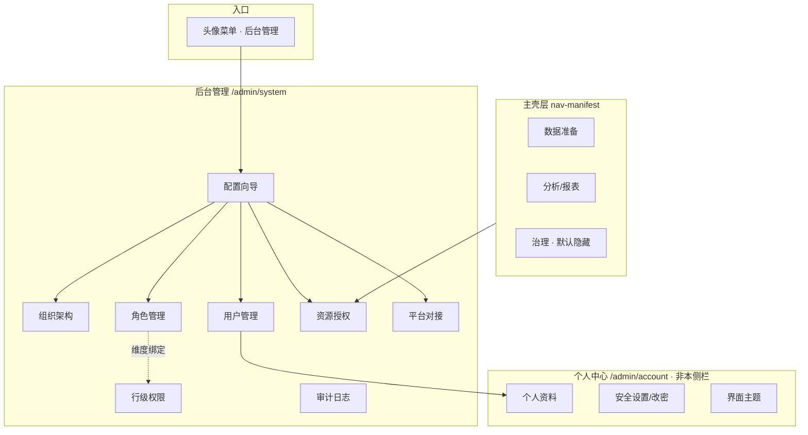

# 后台管理 IA 体检 · as-is / 缺口 / 优化

> **mode**: audit · **scope**: `/admin/system/*` 侧栏与配置向导 · **date**: 2026-08-14  
> **证据**: `system-admin-nav.tsx` · `layout.md` §3 · `F02-AUTH` · `SystemAdminHomePage.tsx` · `docs/services/auth.md` · `im-app-config-self-bind.md`（延期）

## 1. JTBD

| 角色 | 想完成的事 | 成功信号 | 最贵失败 |
|------|-----------|----------|----------|
| 租户管理员 | 从零配好组织、角色、用户与资源可见性 | 业务用户登录后只见授权 Dashboard/报表，越权查询被 RLS 挡住 | 配错权限却以为已生效；审计查不到谁改的 |
| 实施/运维 | 对接企业 SMTP/IM，不改服务器 env | 平台对接保存即热生效，探测失败有明确阻断 | 显示已配置其实发不出去 |
| 安全审计 | 追溯权限变更 | 审计日志可按时间/操作筛选 | 非 auth 域写操作无记录 |

## 2. as-is 架构关系

## 3. 与 PRD / 业内对照

### 3.1 侧栏项 vs AUTH-001～008

| 侧栏项 | PRD | 实现状态 | 说明 |
|--------|-----|----------|------|
| 配置向导 | 无独立 ID（体验层） | 已实现 | 5 步进度卡 + 快捷入口 |
| 组织架构 | AUTH-002 | 已实现 | 树表 + 行内操作（2026-08-14 精致化） |
| 用户管理 | AUTH-003 | 已实现 | 列表 + Sheet：角色/组织/重置密码/IM 账号 |
| 角色管理 | AUTH-001 | 已实现 | CRUD + 功能权限 + 默认 Dashboard |
| 资源授权 | AUTH-004 | 已实现 | 角色×资源类型×资源 ID |
| 平台对接 | 邮件 spec · IM spec（延期） | **部分** | 仅 SMTP QQ/163；IM 三通道按 spec 延期 |
| 行级权限 | AUTH-005～007 | 已实现 | 维度/分组/角色绑定三 Tab |
| 审计日志 | AUTH-008 | 已实现 | auth 域写操作为主 |

**结论（合同视角）**：相对 **M7 / AUTH-001～008 一期验收**，后台管理 **菜单覆盖完整**，不缺 PRD 强制项。

### 3.2 vs DataEase「系统设置」惯例（场景锚 E8）

| DataEase 惯例 | VitalSpan | 判定 |
|---------------|-----------|------|
| 平台对接（IM/邮件） | 同入口，IM 未上线 | 跟随中 |
| 组织 + 行权限 | 组织 + RLS 分栏 | 对齐 |
| 系统参数/外观 | 外观→个人中心主题；参数→env/DB | **有意拆分**，非缺失 |
| LDAP/SSO 登录 | 未实现，PRD 分期 | **计划外（M1）** |
| 备份恢复 UI | 脚本 `backup-databases.py` | **运维向**，未进 Admin |

## 4. 缺口分级

### P0 — 影响交付诚实性或主路径

| ID | 缺口 | 证据 | 建议 |
|----|------|------|------|
| G-P0-1 | 平台对接页文案/IA 写「IM」，实际仅邮件 | `PlatformConnectPage` · IM spec 延期注记 | 页内诚实横幅「IM 通道下一迭代」；恢复 IM 时同页扩 Tab，**不新增侧栏** |
| G-P0-2 | 配置向导未链到 RLS/平台对接完整性 | `SystemAdminHomePage` steps | 向导补「平台对接」完成态（已有 email）；RLS 保持侧栏「高级」卡，可选第 6 步（可选） |

### P1 — 体验/效率（现有页优化）

| ID | 缺口 | 建议 |
|----|------|------|
| G-P1-1 | 角色权限 vs 资源授权 vs RLS 三者边界对管理员不直观 | 配置向导与各页顶 **Info 条**：「谁能进菜单→角色权限」「谁能看哪张报表→资源授权」「查询行过滤→RLS」 |
| G-P1-2 | 资源授权按资源名筛选/批量仍偏工程向 | 强化 `ResourceGrantPicker` 名称搜索；考虑「从角色页一键跳授权」 |
| G-P1-3 | RLS 三 Tab 学习曲线陡 | 空态链到向导；组织维度场景给**模板示例**（只读） |
| G-P1-4 | 组织树 >500 节点 picker 限制 | 文档注明或懒加载树 API（工程项） |
| G-P1-5 | 审计仅 auth 域为主 | AUTH-008 演化：数据源/报表删除等写入同一浏览页 |

### P2 — 分期/可选增强

| ID | 能力 | 何时加侧栏 |
|----|------|------------|
| G-P2-1 | LDAP/OIDC 登录配置 | 单独立项「认证集成」或并入平台对接 |
| G-P2-2 | IM 自助绑定（用户侧） | 个人中心，非后台新菜单 |
| G-P2-3 | MFA / 找回密码 / 会话踢出 | 安全设置扩展 |
| G-P2-4 | 平台健康/备份/日志留存策略 | 运维专区或「系统维护」分组（M8+） |
| G-P2-5 | Playwright 后台 E2E | 质量门禁，非 IA |

## 5. 是否新增侧栏项？

| 决策 | 说明 |
|------|------|
| **M1 不建议新增** | 8 项已覆盖 AUTH 全栈 + 对接 + 审计；新增易造成与「个人中心」「主 IA」重复 |
| **建议新增（将来）** | 仅当 LDAP/OIDC 立项：**认证集成**（1 项）；或 **系统维护**（健康检查/备份，运维合同要求时） |
| **不建议** | 「用户资料」「改密」进后台；「数据源管理」进后台（应在数据准备） |

## 6. 现有页优化优先级（实施顺序）

1. **配置向导**：统一术语与三步主路径（组织→角色→用户）+ 可选（邮件、资源授权、RLS）  
2. **平台对接**：诚实态 + IM 恢复时同页扩展  
3. **角色/授权/RLS**：页顶边界说明 + 交叉深链  
4. **组织架构**：树 UX（本轮已做）  
5. **审计**：扩大写钩子覆盖面 + 筛选预设（今日/本周）

## 7. 假设（非裁定）

| ID | 假设 | 依据 |
|----|------|------|
| A1 | 单租户政企交付，管理员即 `system:*` 能力持有者 | goal G4 · layout.md |
| A2 | IM 按人投递恢复前，邮件为定时报告主通道 | im spec 延期 |
| A3 | LDAP 登录不在当前里程碑 | production.mdc 分期 |

## 8. 选型门禁

| ID | 主题 | 状态 |
|----|------|------|
| S1 | 后台 IA 独立于主 nav-manifest | anchored · layout.md |
| S2 | IM 对接协议 | researched · integrations/im-platform-connect.md（实现延期） |
| S3 | LDAP/OIDC | open · 无 PRD 立项 |

---

**下一步（需你确认后）**  
- L1：仅文案/向导/页顶说明（go-fast 小步）  
- L2：IM 平台对接按 `docs/specs/im-app-config-self-bind.md` 恢复  
- L3：LDAP 立项 → 先 blueprint/spec 再开发
