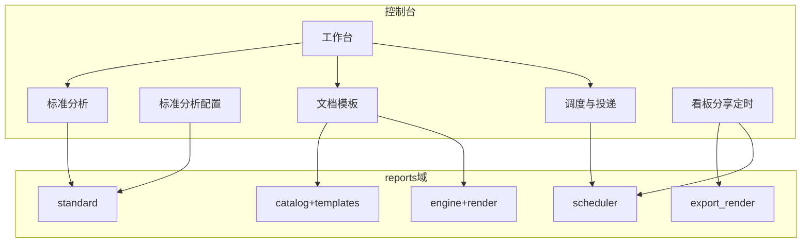

# 报表中心 · 行业蓝图 audit（VitalSpan as-is）

## 元信息

- mode: audit · scope: 报表中心 IA 与域边界 · 日期: 2026-08-17
- 蓝图真理源：[2026-08-17-report-center-industry-blueprint.md](./2026-08-17-report-center-industry-blueprint.md)
- domain_strength: strong
- 假设状态：**用户已于 2026-08-17 确认多入口 IA 为长期目标**

## 1. 审计范围

对照行业蓝图 §3～§5，评估 VitalSpan 当前实现（`nav-manifest.tsx` · `ReportCenterPage` · `StandardAnalysis*` · `ReportTemplatesPage` · `ReportSchedulesPage` · `backend/app/reports/`）。

## 2. 架构 as-is（人话标签）

## 3. 对齐项（已符合蓝图）

| 蓝图要求 | VitalSpan as-is | 证据 |
|----------|-----------------|------|
| 多入口侧栏：工作台 / 标准分析 / 文档模板 / 调度与投递 | `nav-manifest.tsx` 四子项 | E1 |
| 标准分析消费与配置分离 | `StandardAnalysisPage` vs `StandardAnalysisConfigPage` | E2 |
| 配置页快照 vs 投递分层文案 | `StandardAnalysisConfigForm` 周期快照 + 折叠「定时投递（可选）」 | E3 |
| 工作台轻量入口卡片，非完整列表 | `ReportCenterHubEntryCards` + 失败摘要 + 最近访问 | E4 |
| 看板定时 PDF 创建主路径在分享页 | `DashboardSchedulePanel` | E5 |
| 统一调度 FSM + 多产物 | `scheduler/service.py` + `artifactKind` | E6 |
| 标准分析支持 Dataset 绑定 | `dataset_binding.py` + `datasetId` 字段（物理表兼容） | E7 |
| 周期快照 job 与投递调度分离 | `standard/jobs.py` vs `scheduler/jobs.py` | E8 |

## 4. 缺口严重度

| ID | 缺口 | 严重度 | as-is | 建议 | 接力 |
|----|------|--------|-------|------|------|
| G1 | 域文档仍写「单入口」叙事 | P1 | `reports.md` §前端消费 IA | 已同步多入口（本 PR） | docs |
| G2 | `layout.md` 工作台描述为「授权模板网格」 | P1 | layout §5 路由表 | 改为「入口卡片 + 运维摘要」 | docs |
| G3 | 产品线叙事仅两条（缺标准分析并列） | P2 | `reports.md` 两条产品线表 | 扩为三条并列 | docs |
| G4 | 快照保留上限（H2）未实现 | P2 | `standard/snapshot.py` 无 retention | 配置页增加保留策略或后台 job 清理 | companion |
| G5 | 标准分析配置页「快捷创建投递」未闭环 | P2 | 配置表单有投递折叠，链到调度页弱 | 保存后 CTA「去调度页创建」带 pack 预填 | go-fast |
| G6 | 文档模板页默认选中/空态（前序 audit G1） | P1 | doc-template-mgmt-audit G1 | 独立迭代，非本蓝图阻塞 | go-fast |
| G7 | 物理表绑定仍为兼容路径，Dataset 应为主叙事 | P2 | seed + 旧包可能仅 physicalTable | 迁移提示 + 配置 UI 默认 Dataset | PRD companion |

## 5. 场景对照（as-is vs 蓝图）

| 情境 | 蓝图 | VitalSpan as-is | 判定 |
|------|------|-----------------|------|
| 多入口 IA | 四子项 + 配置深链 | 已恢复四子项 | ✅ |
| 快照≠投递 | UI 分层 | 配置表单已分层 | ✅ |
| 三条产品线并列叙事 | A/B/C 均可见 | 文档偏两条线；标准分析在侧栏但未写入产品线表 | ⚠️ G3 |
| 工作台不铺完整 CRUD | 卡片 + 摘要 | HubEntryCards 已实现 | ✅ |
| 运维统一失败面 | Hub + Schedules | `ScheduleRecentFailuresPanel` + `ReportSchedulesPage` | ✅ |
| Dataset 为主绑定 | researched S2 | 双路径并存 | ⚠️ G7 |

## 6. 难回退选型对照

| ID | 蓝图状态 | VitalSpan | 备注 |
|----|----------|-----------|------|
| S1 统一调度 FSM | researched | anchored | `scheduler/` 已实现 |
| S2 Dataset 绑定 | researched | mixed | 新增 datasetId；物理表兼容 |
| S3 看板 Playwright PDF | researched | anchored | `export_render.py` |
| S4 RenderSpec | researched | anchored | ADR-09 |
| S5 多入口 | assumed→采纳 | anchored | 2026-08-17 恢复多入口 |

## 7. 可观察验收（对照蓝图）

1. 侧栏「报表中心」展开可见：工作台、标准分析、文档模板、调度与投递 — **通过**（admin/analyst/viewer 按 capability 过滤 manage 项）
2. 标准分析页无 cron/SMTP 表单 — **通过**
3. 配置页「周期快照」与「定时投递（可选）」分区可见 — **通过**
4. 工作台无完整模板树/分析包 CRUD 列表 — **通过**
5. 看板分享可创建定时 PDF — **通过**
6. 调度页可看重试执行历史 — **通过**
7. 快照保留 N 期自动清理 — **未实现**（G4）

## 8. PRD 偏航建议（不自动改 PRD）

| 项 | 建议 |
|----|------|
| RPT-002 演化建议 | 补充「Dataset 为主路径、物理表 deprecated」与快照保留策略 |
| F08 产品线叙事 | Hub 文档与 PRD 索引统一为三条产品线 |
| IA | 明确拒绝单入口 Tab 为默认（记录于蓝图 §9） |

## 9. 证据索引

| ID | 路径 |
|----|------|
| E1 | `fe/src/config/nav-manifest.tsx` |
| E2 | `fe/src/pages/admin/reports/StandardAnalysisPage.tsx` · `StandardAnalysisConfigPage.tsx` |
| E3 | `fe/src/pages/admin/reports/components/StandardAnalysisConfigForm.tsx` |
| E4 | `fe/src/pages/admin/reports/ReportCenterPage.tsx` · `ReportCenterHubEntryCards.tsx` |
| E5 | `fe/src/pages/admin/reports/components/DashboardSchedulePanel.tsx` |
| E6 | `backend/app/reports/scheduler/` |
| E7 | `backend/app/reports/standard/dataset_binding.py` |
| E8 | `backend/app/reports/standard/jobs.py` |

## 10. 总结

**总体判定**：`DONE_WITH_CONCERNS` — IA 与消费/配置/运维分层已与行业蓝图对齐；文档叙事与快照保留策略、Dataset 主路径推广为后续 P1/P2。

**建议接力**：docs 同步（本批）→ companion 快照 retention → 配置页投递快捷链。
