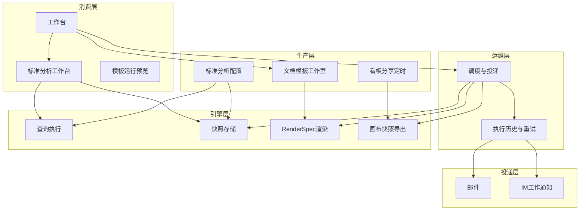
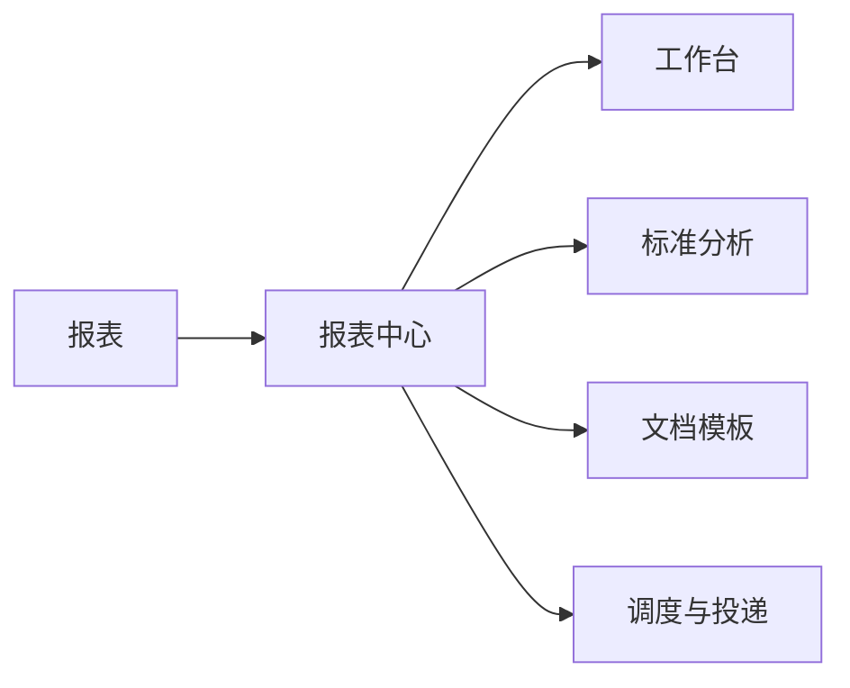
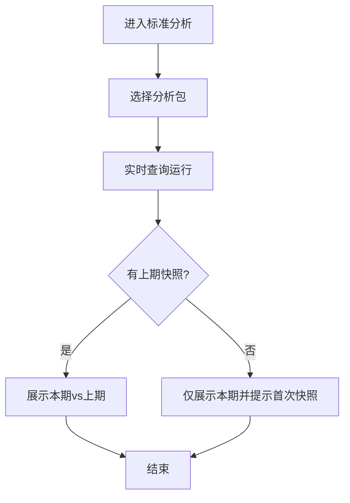
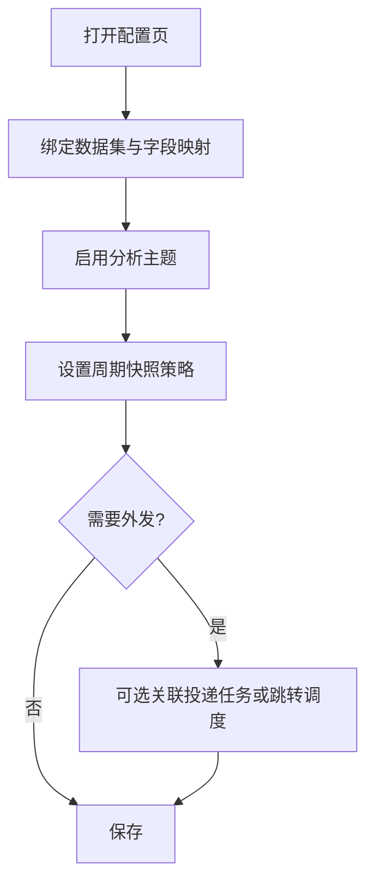
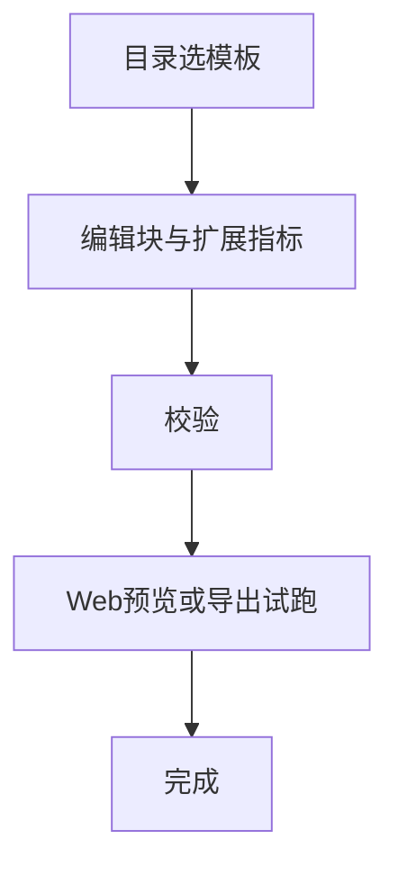
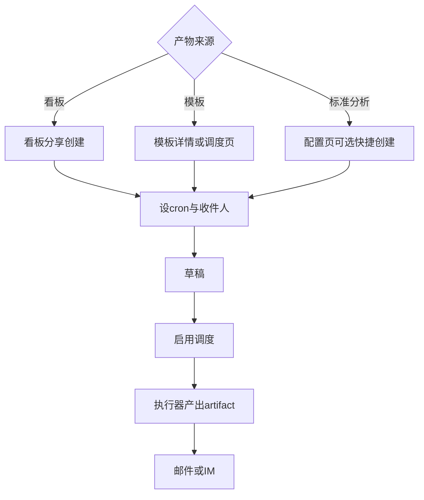
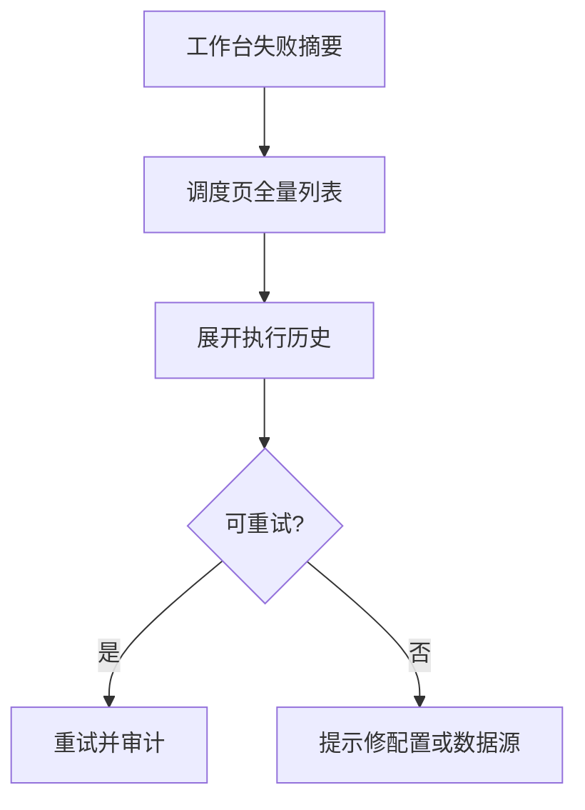

# 报表中心模块 · 产品蓝图（行业视角）

## 元信息

| 项 | 值 |
|----|-----|
| mode | blueprint |
| scope | 报表中心 IA 与域边界（消费 / 生产 / 运维三层） |
| 日期 | 2026-08-17 |
| domain_strength | **strong**（政企 BI + DataEase/Superset 惯例） |
| 假设状态 | **用户已确认**（2026-08-17：多入口 IA + 三条产品线 + 快照/投递分层为长期目标） |
| 关联 PRD | [F08-RPT](../../automate/prd/F08-RPT.md) RPT-001～007 |
| 关联域文档 | [reports.md](../../services/reports.md) · [layout.md](../../ui/layout.md) |
| 对照 audit | [2026-08-17-report-center-industry-audit.md](./2026-08-17-report-center-industry-audit.md) |
| 前序蓝图 | [2026-08-09-report-center.md](./2026-08-09-report-center.md)（VitalSpan 实例化；本稿为行业抽象层） |

### 智囊团（单轮合并）

| 席位 | 立场 |
|------|------|
| 产品 | 快照≠投递，配置≠消费；三条线入口要鲜明 |
| 规划 | 统一调度 FSM 先锁，再扩 artifact 类型 |
| 架构 | Dataset 绑定 + RenderSpec + 执行历史横切 |
| 领域 | 对象工作台 + 周期对比是政企卖点，别做成第四套 Explore |
| 安全 | 配置/调度 manage 分离；投递失败不泄露 SQL |
| 体验 | 工作台只摘要；创建跟场景、运维跟调度页 |

**Vote**：`PASS_WITH_NOTE` — S5 侧栏形态可按租户规模再选；VitalSpan 采纳多入口为长期 IA。

---

## 1. 问题与主任务

**JTBD**：数据团队把「可重复消费的决策视图」和「可投递的固定版式产物」交给业务方；业务方要能**看数、比上期、收报告**，管理员要能**配一次、跑很久、失败可追**。

**成功**：

- 业务用户 30 秒内找到「该看的分析」并完成本期 vs 上期对比
- 管理员配好分析包/模板后，定时任务稳定产出且失败有告警、可重试
- 三条产品线边界清晰，用户不会把「快照」当成「邮件报告」

**最贵失败**：

- IA 混用「配置 / 消费 / 运维」，用户在同一页既绑表又设 cron，导致快照与投递概念坍塌
- 工作台变成第四份完整列表，与深链入口重复、维护成本翻倍
- 调度层各产物各自为政，运维看不到统一失败面

---

## 2. 架构关系图

**铁律**：快照是**数据冻结**（对比用）；调度是**作业+投递**（触达用）。二者可关联（快照后顺带通知），但**概念与 UI 必须分层**。

---

## 3. 三条产品线（并列）

| 产品线 | 用户问题 | 业内对标 | 主入口 |
|--------|----------|----------|--------|
| **A. 看板/大屏定时 PDF** | 「这张大屏每周一发给领导」 | DataEase 定时报告、Superset Alerts | **看板分享页**（创建主路径） |
| **B. 文档模板套版** | 「固定 Word/Excel 版式填数」 | 传统报表 / DataEase 报表模板 | **文档模板** |
| **C. 标准分析** | 「这个业务对象本月怎么样、比上期呢」 | 对象分析工作台（政企扩展） | **标准分析** + 独立**配置** |

工作台只做**导航与运维摘要**，不做第四条产品线。

---

## 4. 侧栏 IA（多入口 + 鲜明职责）

| 入口 | 一句话职责 | 权限倾向 | 禁止出现 |
|------|------------|----------|----------|
| **工作台** | 最近访问、失败告警、快捷卡片 | read+ | 完整 CRUD 列表、绑数据集表单 |
| **标准分析** | 选包 → 实时看数 → 对比上期快照 | read | 字段映射、cron、SMTP |
| **标准分析配置** | 绑数据集、主题、周期快照策略、可选挂载投递 | manage | 大图表消费 UI |
| **文档模板** | 目录树、块编辑、扩展指标、手动运行 | manage | 全局执行历史（应链到调度） |
| **调度与投递** | 跨三类产物的 cron、历史、重试、通道 | manage | 「分析逻辑」配置 |

配置深链：`/admin/reports/standard/config` — 业内 Explore vs Settings 分离的变体。

---

## 5. 核心主业务（≤5）

### F1 · 标准分析消费（看数 + 比上期）

- 成功：指标可读、对比维度一致、无快照时有明确空态
- 例外：数据集变更导致字段缺失 → 可见错误 + 引导去配置页

### F2 · 标准分析配置（绑数 + 快照策略）

- **分层 UI**：数据源 → 分析主题 → **周期快照**（折叠）→ **定时投递**（折叠，文案写清「外发通知，非对比数据来源」）
- 绑定对象：**数据集**（现代 BI 惯例），物理表仅作兼容/迁移路径

### F3 · 文档模板 authoring + 手动运行

### F4 · 创建定时投递（多源统一 FSM）

- **创建入口跟场景走**（看板在分享页），**运维入口统一**（调度与投递页）

### F5 · 运维闭环（失败可见、可重试）

---

## 6. 场景对照表

| 真实情境 | 本方案 | 业内常见 | 跟随/偏离 |
|----------|--------|----------|-----------|
| 领导每周要大屏 PDF | 看板分享 → 定时 | DataEase/Superset 从 Dashboard 订阅 | **跟随** |
| 财务要固定 Excel 月报 | 文档模板 + 调度 | 传统 C 报表 / BO | **跟随** |
| 业务要看「客户健康度比上月」 | 标准分析 + 周期快照对比 | Dataset+Metric；对象工作台较少 | **有意扩展** |
| 运维追查昨晚邮件失败 | 调度页历史 + 工作台摘要 | Superset Report 执行 log | **跟随** |
| 分析师临时改 SQL 看一眼 | 不应进标准分析配置 | Superset Explore | **偏离**：强调「包」而非 ad-hoc |

---

## 7. 难回退选型

| ID | 选题 | 推荐状态 | 说明 |
|----|------|----------|------|
| S1 | 统一调度 FSM + 多 artifactKind | researched | 一套 cron/历史/重试，产物类型分支执行 |
| S2 | 标准分析绑 Dataset 而非裸表 | researched | 与 Superset/Power BI 语义层一致 |
| S3 | 看板 PDF 用无头浏览器快照 | researched | 与 DataEase 可视化投递同类 |
| S4 | 模板输出契约 RenderSpec | researched | 解耦编辑态与渲染引擎 |
| S5 | 侧栏多入口 vs 单入口 Tab | **assumed（VitalSpan 采纳多入口）** | 单入口适合移动端或极简租户 |

---

## 8. 假设清单

| ID | 假设 | 若推翻 |
|----|------|--------|
| H1 | 标准分析「包」数量可控（<50），不以自由 Explore 为主路径 | 需独立 Explore 入口 |
| H2 | 快照保留策略有上限（如按月保留 N 期） | 需存储治理与归档 |
| H3 | 投递通道以邮件 + 企业 IM 为主 | 扩展短信/打印需新通道域 |
| H4 | 看板定时 PDF 仍是主推叙事 | 文档模板与标准分析并列不降级 |
| H5 | viewer 只看工作台 + 标准分析；manage 才能碰模板/调度/配置 | 需细粒度 capability 拆分 |

---

## 9. 与单入口 Tab 对比

| 维度 | 多入口（本蓝图推荐） | 单入口 + 页内 Tab |
|------|----------------------|-------------------|
| 心智模型 | 与职责一一对应 | 省侧栏项但页内仍要分 Tab |
| 深链/收藏 | 每入口可书签 | 需 `?tab=` 约定 |
| 权限 | 可按入口藏 manage 项 | Tab 内仍要权限守卫 |
| 适用 | 政企多角色、多产品线 | 极简 SaaS 或移动端 |

---

## 10. 术语表

| 术语 | 用户向含义 | 勿混淆 |
|------|------------|--------|
| 周期快照 | 平台内冻结指标，供「比上期」 | 定时邮件报告 |
| 定时投递 | 按 cron 生成产物并外发 | 周期快照 |
| 标准分析包 | 面向业务对象的预置分析主题集合 | 文档模板 |
| 文档模板 | 固定版式 Word/Excel/PDF 套版 | 看板截图定时 |
| 工作台 | 报表中心概览与快捷入口 | 第四套完整列表 |

---

## 11. 交接

- **VitalSpan 实例对照**：见 [audit](./2026-08-17-report-center-industry-audit.md)
- **可选 spec**：`docs/specs/report-center-ia.md`（开工规格，未创建）
- **默认不改 PRD**；偏航建议见 audit §10
