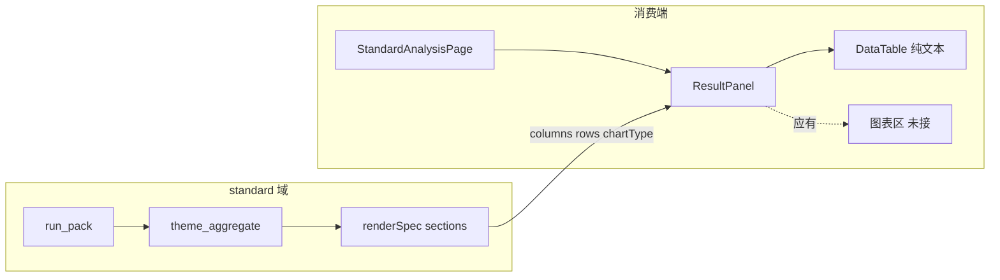
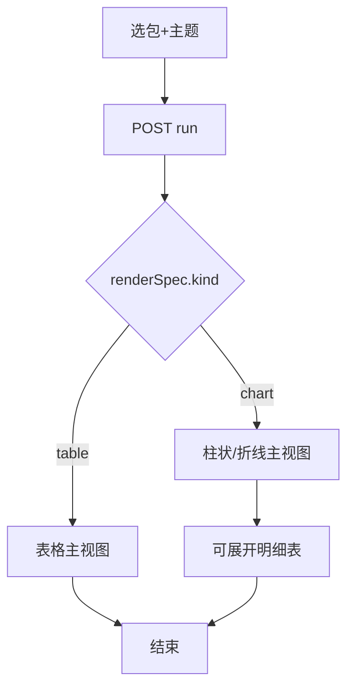
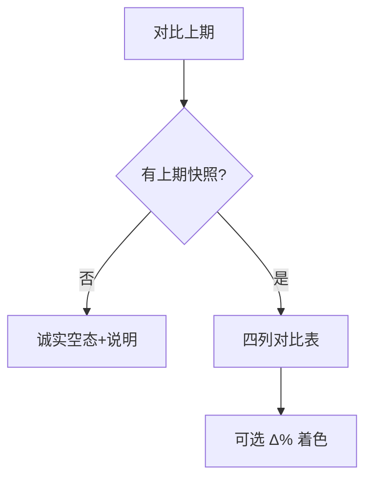
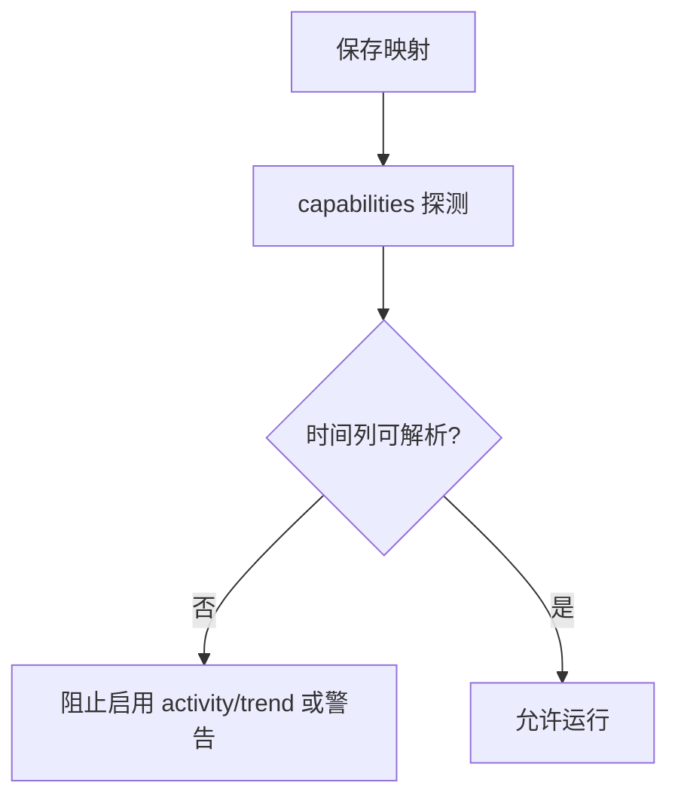

# 标准分析结果展现 · audit

## 元信息

| 项 | 值 |
|----|-----|
| mode | audit |
| scope | 标准分析消费端：实时/对比结果的展现形态（表格 vs 图表） |
| 日期 | 2026-08-18 |
| 证据袋 | 仓内走查：`F08-RPT` · `report-center-industry-blueprint` · `standard/service.py` · `StandardAnalysisResultPanel.tsx` · `theme_aggregate.py` · 用户截图 |
| domain_strength | strong |
| 假设状态 | **草稿待确认** |
| 关联 | RPT-002 · `docs/material/blueprints/2026-08-17-report-center-industry-blueprint.md` §F1 |

## 1. 问题与主任务

**用户问**：标准分析结果是否就应该像现在这样，全部以文字表格展示（`dim`/`cnt`、`d`/`cnt`）？

**JTBD**：分析师打开分析包，快速看懂「对象在各维度/时间上的分布与变化」，并在有快照时对比上期。

**成功**：一眼看出重点区域/趋势；对比时看清增减；字段映射错误时有明确提示而非 `1970-01-01`。

**最贵失败**：用户以为平台坏了或数据错了，回 Excel 手搓透视表/折线图。

**结论（先给答案）**：

> **不该长期只做纯文字表格。**  
> 当前 FE **只实现了表格 MVP**，与后端 `renderSpec` 契约 **不一致**。  
> 业内对象分析工作台惯例是：**图表主读 + 表格备查/导出**；**对比上期**则 **表格为主** 合理。

---

## 2. 架构关系图

### 2.1 难回退选型约束

| ID | 选题 | 状态 | 证据 | 阻塞 F | 备注 |
|----|------|------|------|--------|------|
| S1 | 标准分析图表走**平台内置 chart 引擎**（ECharts/AntV 已有管线），不走 customViz / iframe | **anchored** | `docs/arch.md` · `fe/src/components/charts/` · `renderSpec.kind=chart` | F1 | 与看板图表同栈，避免第二套渲染 |
| S2 | 对比上期以**表格增减**为主，不强行折线双轴 | **researched** | Superset/Power BI 对象对比常见为表+条件格式；蓝图 F1 | F2 | 图表可作辅助，非 P0 |
| S3 | 生命周期（状态分布）默认**表或条形**均可 | **assumed** | 类目少时表可读；>8 类建议 bar | F1 | 可配置默认 |

---

## 3. 用户场景对照表

| 场景 | 业内惯例 | VitalSpan as-is | 偏离 |
|------|----------|-----------------|------|
| 区域/类目分布（你的 27 城） | 柱状/条形图 + 可下钻表 | 仅 `dim`/`cnt` 表 | **缺图** |
| 时间趋势/活跃度 | 折线/面积 + 日期轴 | 仅 `d`/`cnt` 表；映射错 → `1970-01-01` | **缺图 + 映射门禁弱** |
| 生命周期状态分布 | 条形或饼（类目少） | 表 | 可接受 MVP，非终态 |
| 本期 vs 上期 | 对比表（维度/本期/上期/Δ%） | 对比表（已改诚实空态） | **对齐** |
| 管理例会扫一眼 | 图优先 | 需读整表 | **体验债** |

---

## 3.1 术语表

| 术语 | 用户向含义 | 勿混淆 |
|------|------------|--------|
| 实时 | 当前查库聚合结果，非快照 | 对比模式里的「本期」 |
| 主题 | 生命周期/区域分布/活跃度/趋势 | 不是图表类型 |
| `dim`/`cnt` | 维度值与计数（内部列名） | 不应原样暴露给用户 |
| `renderSpec` | 后端返回的可渲染结构 | FE 应消费 `kind`+`chartType` |

---

## 4. 核心业务（≤5）

| ID | 业务名 | 流程图 | 成功结果 |
|----|--------|--------|----------|
| F1 | 实时看数（含可视化） | §4.1 | 分布/趋势一眼可读 |
| F2 | 对比上期 | §4.2 | 增减表 + 空态诚实 |
| F3 | 配置字段映射 | §4.3 | 错映射拦截，不出伪日期 |
| F4 | 周期快照 | （已有） | 自动/手动捕获 |
| F5 | 定时投递 | （已有） | PDF 外发，非对比数据源 |

### 4.1 F1 · 实时看数（应有形态）

| 主题 | 后端 chartType | **应有主视图** | 表格角色 |
|------|----------------|----------------|----------|
| 区域分布 | `bar` | 横向/纵向柱状图 | 明细备查 |
| 活跃度/趋势 | `line` | 折线图（日期轴） | 明细备查 |
| 生命周期 | —（table） | 条形图或表 | 主视图可二选一 |

**主路径（目标态）**：analyst 选「区域分布」→ 见 **上海市/广州市…柱状图** → 可切换「查看数据表」。

**as-is**：仅 `DataTable` 展示 `dim`/`cnt` 字符串（`StandardAnalysisResultPanel.tsx` L187-197）。

### 4.2 F2 · 对比上期

**判定**：对比模式 **继续以表格为主** 符合产品形态；不必强行上图。

### 4.3 F3 · 字段映射门禁

**as-is 问题**：`createdAt` 误绑 `amount` → pandas 解析出 `1970-01-01` → 用户以为展示坏了。

---

## 5. as-is vs to-be 差距

| 优先级 | 缺口 | 说明 | 建议 |
|--------|------|------|------|
| **P0** | FE 未消费 `chartType` | 后端已标 `kind:chart`，FE 当纯表 | 结果页接平台 `ChartRenderer`（小步：bar/line 两型） |
| **P0** | 列名技术化 | 用户看到 `dim`/`cnt`/`d` | 展示层映射：「维度」「数量」「日期」 |
| **P1** | 映射错误无门禁 | `1970-01-01` 类伪数据 | 配置保存 + 运行前校验日期列 |
| **P1** | 摘要条信息弱 | 「结果行数 27」对决策帮助有限 | 保留摘要，但以图为主后降级为次要 |
| **P2** | 图/表切换 | 政企常要导出明细 | 「图表 / 数据表」分段切换即可 |
| — | 对比模式表格 | 已对齐 | 维持 |

---

## 6. 不应怎么做

| 方向 | 原因 |
|------|------|
| 长期纯文字表 | 违背对象分析工作台定位；与后端契约不一致 |
| 引入 customViz / D3 沙箱 | 过重；S1 已锚定内置 chart |
| 对比模式默认双折线 | 本期=实时、上期=快照，口径混合，双轴易误导 |
| 在标准分析重做 Explore | 偏离蓝图「预制包」边界 |

---

## 7. 智囊团摘要（缩席 · 独立判断）

| 席 | 投票 | 一句 |
|----|------|------|
| 产品 | 改 | 表-only 是工程半成品，不是产品终态 |
| 计划 | 改 | 后端契约已有，FE 补接为 1～2 迭代切片 |
| 架构 | 改 | 复用 `components/charts`，禁新渲染栈 |
| 领域 | 改 | 分布/趋势无图不符合 BI 用户心智 |
| 安全 | 过 | 只读展现，无新增风险 |
| 运维 | 过 | 无 |

**outline_pass / draft_pass**: true（缩席审计）  
**theater_ok**: true（窄 scope 未开六路 Task）

---

## 8. 假设清单（待确认）

| ID | 假设 | 依据 |
|----|------|------|
| H1 | 实时模式默认 **图主表辅** | 行业蓝图 F1「指标可读」+ 后端 chartType |
| H2 | 对比模式 **表主** 不强制上图 | 快照对比表是主场景 |
| H3 | 不新增第 5 种「自由选图表类型」 | 标准分析=预制主题，非 Explore |
| H4 | 首版只接 `bar`+`line`，lifecycle 可仍用表 | 最小切片 |

---

## 9. 与 PRD 关系

| 文档 | 关系 |
|------|------|
| RPT-002 | 未写死「仅表格」；验收「实时运行与对比」— **图表是可读性的合理延伸**，建议 companion 补一句「Web 展现含主题缺省图」 |
| 行业蓝图 F1 | 未禁止表；强调可读 — **不冲突** |

**默认不改 PRD**；确认后可记 RPT-002 companion 一条。

---

## 10. 推荐实施切片（确认后交 go-fast，本文不自动开工）

1. **切片 A**：`StandardAnalysisResultPanel` 读 `section.kind`+`chartType`，分布/趋势渲染柱状/折线（复用现有 chart 组件）
2. **切片 B**：列名用户化 + 图/表 Tab 切换
3. **切片 C**：配置页 `activity`/`trend` 映射日期列校验（消灭 `1970-01-01`）
4. **对比模式**：维持表；已有 Δ% 可保留

---

## 11. 开放问题（配额外 · 可后补）

1. 生命周期主题默认条形还是保持表？（建议条形，非阻塞）
2. 导出 CSV 是否从表视图提供？（建议 P2）

---

## 12. 下一步

- [ ] 用户确认 H1～H4 假设
- [ ] 可选：RPT-002 companion 补「Web 主题缺省图」
- [ ] 确认后 `go-fast` 切片 A（不接 customViz）
- [ ] 产品打分仍走 [product-reviewer](../product-reviewer/2026-08-18-standard-analysis-compare.md) 已覆盖的对比空态债
