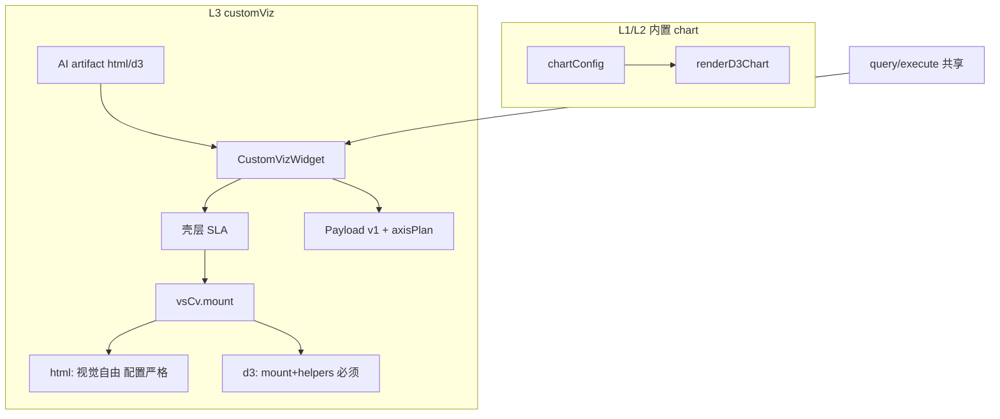

# customViz 平台底座 SLA 蓝图

> 确认日期：2026-08-19  
> 模式：product-blueprint · audit → 用户确认 → spec  
> PRD 锚：F17-AIVIZ · AIVIZ-016 已部分落地

## JTBD

外部 AI 通过 API 将 HTML 制品存入库，看板侧由**唯一 Base**（`CustomVizWidget`）异步加载并挂载。用户期望与内置 chart **同级的基础体验**：resize 跟随、轴抽稀、大行数采样提示、空错未绑态、查看数据——AI 专注配置与定制视觉，不必在每个 artifact 重复引擎常识。

**最贵失败**：平台声称 L3 可用，但制品普遍出现轴标签重叠、拖大不变、超大数据无提示——用户归因 VitalSpan 产品缺陷。

## 架构关系（已定）

**结论**：「一个 Base + API 存库 + PUT 更新」架构**已成立**（非方向错误）；缺口为 **平台 SLA 未完成** + **L3 与内置引擎刻意分离**（F17 Out）。

## 核心流程（≤5）

| ID | 名称 |
|----|------|
| F1 | 制品入库（POST/PUT + lint） |
| F2 | 看板挂载与壳层 SLA（cap/layout/truncated/mount） |
| F3 | d3 渲染纪律（mount + axisPlan + helpers） |
| F4 | html 渲染纪律（mount + 配置严格） |
| F5 | 用户绑数与画布交互（查看数据 parity） |

## 难回退选型

| ID | 选题 | 状态 | 证据 |
|----|------|------|------|
| S1 | `vsCv.mount` 统一 lifecycle | **assumed（用户已确认）** | 本蓝图 + spec |
| S2 | 不走 renderD3Chart / 不动态 chartType | **anchored** | F17 Out · D3-OPTIONAL.md |
| S3 | html=配置严格 / d3=底座必须+参考可选 | **assumed（用户已确认）** | 本蓝图 |
| S4 | d3 可选 draw.* 参考 API | **assumed** | Phase 2 |

## 假设（用户整包接受）

- H1：html 视觉自由下，平台只保证数据/配置/生命周期，不保证任意 DOM 自动美观。
- H2：老 artifact 须 PUT 升级；d3 无 mount 入库 lint 将 warn/error。
- H3：Phase 1 不做 chart 代理（renderAs bar）。
- H4：标准柱/线优先 L1/L2 chartConfig，非 customViz。

## 偏航建议（PRD，未改）

- 建议 F17 增 AIVIZ-017：mount + 壳层 truncated + 查看数据 + 入库 lint。
- PROTOCOL §渲染能力边界：从「bundle 责任为主」改为「平台 SLA + bundle 分轨」。

## 缺口摘要

| 严重度 | 缺口 |
|--------|------|
| P0 | 无 `vsCv.mount` |
| P0 | 壳层无 truncated 横幅 |
| P1 | 无 PLATFORM-SLA / HANDOFF 双轨 |
| P1 | 入库无 mount lint |
| P1 | customViz 无查看数据 |
| P2 | d3 可选 draw.* API |

## 下一步

→ [`docs/specs/customviz-platform-sla.md`](../../specs/customviz-platform-sla.md) · go-fast Phase 1
