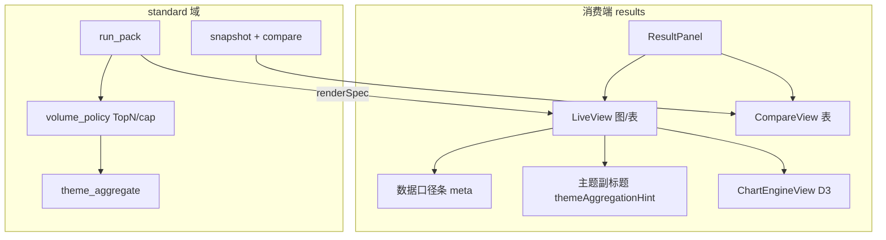
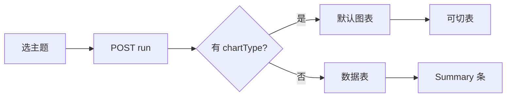
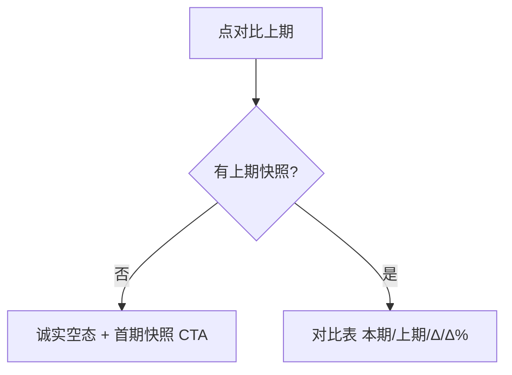

# 标准分析结果区 · audit（sss1 截图复核）

## 元信息

| 项 | 值 |
|----|-----|
| mode | audit |
| scope | `/admin/reports/standard/results` 右侧结果区：实时图/表、对比上期、快照可观测 |
| 日期 | 2026-08-19 |
| 证据袋 | 用户 DOM 截图（sss1 · 区域分布 · 图表模式）+ 仓内走查 `StandardAnalysisLiveView` · `StandardAnalysisResultPanel` · `theme_aggregate` · `volume_policy` · product-reviewer `2026-08-18-standard-analysis-compare.md` · 可视化 audit `2026-08-18` |
| domain_strength | strong |
| PRD 锚 | RPT-002 |

---

## 1. JTBD 与最贵失败

| | |
|---|---|
| **JTBD** | 分析师选分析包与主题，**一眼读懂**区域/趋势分布，并在有快照时理解「本期 vs 上期」增减。 |
| **成功** | 图主读数（省名 + 数量可读）；口径说明可见；对比语义不误导；映射/快照异常有下一步。 |
| **最贵失败** | 柱图 tooltip 显示 `value`、副标题显示 `province`，用户认为「平台半成品」；对比上期全 `—` 以为坏了。 |

**截图 as-is 判断**：图主表辅 **已落地**（相对 08-18 可视化 audit）；M1 口径条 **已落地**。剩余主要是 **可读性抛光** + **对比/快照信任链**（product-reviewer B 系列）。

---

## 2. 架构关系图

### 2.1 难回退选型

| ID | 选题 | 状态 | 证据 |
|----|------|------|------|
| S1 | 实时图走平台 `ChartEngineView`，不走 customViz | anchored | `StandardAnalysisSectionChart.tsx` · arch |
| S2 | 对比上期以表格增减为主 | anchored | 可视化 audit S2 · CompareView |
| S3 | M1 样本聚合 + `renderSpec.meta` 脚注 | anchored | `volume_policy.py` · `standardAnalysisDataMeta.ts` |
| S4 | M2 库内 GROUP BY 全量聚合 | open | 步长蓝图 H4；**不阻塞**本 audit P0 |

---

## 3. 场景对照（截图 vs 业内）

| 场景 | 业内惯例 | VitalSpan as-is（截图） | 偏离 |
|------|----------|-------------------------|------|
| 区域分布扫读 | 横向条形 + 省名 + **数量**标签 | 柱图 tooltip 显示 **「数量」**（R1） | ✅ R1 |
| 口径说明 | 样本行数 / Top N / 步长 | 顶部灰色脚注（M1 已加） | 对齐 |
| 主题含义 | 「按省份计数」人话 | 副标题 **「按省份计数」**（`themeAggregationHint`） | ✅ R1 |
| 图模式 KPI | 合计 / Top1 / 维度数 | Summary 条 **图/表均展示**（R1） | ✅ R1 |
| 对比上期 | 无快照时诚实空态 + 引导 | 诚实空态 + 期次说明行（B 系列） | 对齐 |
| 多主题 Tab | 不可用主题灰显+原因 | capabilities 禁用 Tab + `title` reason | ✅ R1 |

---

## 4. 核心 F 与缺口

### F1 · 实时看数（图主表辅）— 截图所在

| 优先级 | 缺口 | 状态（R1） |
|--------|------|------------|
| **P0** | 图表轴/系列人话 | ✅ `buildStandardSectionChartConfig` + `standardAnalysisFieldLabels` |
| **P0** | 副标题字段名 | ✅ `themeAggregationHint` 人话 |
| **P1** | 图模式缺 KPI | ✅ `LiveSummaryStrip` 图/表均展示 |
| **P1** | Top「其他」桶 | 脚注已覆盖；图上视觉区分仍 open |
| **P2** | 柱序/排名 | open |

### F2 · 对比上期

| 优先级 | 缺口 | 状态（R1） |
|--------|------|------------|
| **P0** | 本期/上期定义不可见 | ✅ 对比语义条 |
| **P0** | 无上期仍像「坏表」 | ✅ 诚实空态 + 隐藏增减列 |
| **P1** | `deltaPct` 未展示 | ✅ 对比表「变化率」列 |
| **P1** | 对比无图 | open |

### F3 · 快照可观测

| 优先级 | 缺口 | 状态（R1） |
|--------|------|------------|
| **P0** | 不知何时能对比 | ✅ `StandardAnalysisSnapshotStrip`（实时页） |
| **P1** | 快照列表不可见 | open（历史抽屉） |

### F4 · 主题与映射可信

| 优先级 | 缺口 | 状态（R1） |
|--------|------|------------|
| **P1** | 启用但不可用主题 | ✅ Tab/ThemeGrid disabled + 保存校验 |
| **P1** | 时间主题 1970 | ✅ 配置页 capabilities 强校验 |

### F5 · 绑定信息展示

| 优先级 | 缺口 | 建议 |
|--------|------|------|
| **P2** | Badge 显示 `demo-sales-wide` | analyst 看 `displayName`；技术 id 放 tooltip |

---

## 5. 智囊团摘要（缩席 · 基于既有评审）

| 席 | 投票 | 一句 |
|----|------|------|
| 产品 | 通过带保留 | 图已上线，但 **人话层**未跟上；对比信任链仍是最贵失败源 |
| 规划 | 通过 | P0 建议 1 个迭代包（可读性+对比语义），不扩新主题 |
| 领域 | 通过 | 对象工作台惯例：图+口径+对比表；当前差在标签与快照状态 |
| 架构 | 通过 | 不改 S1/S3；P0 仅 FE 映射 + 轻量 compare 文案 |
| 安全 | N/A | 无新增权责 |
| 运维 | 关注 | 快照 job 健康应进消费端可观测（F3） |

**vetoes**：无  
**theater_ok**：缩席合成（未另开 Task）

---

## 6. 建议实施顺序（R1 已完成 · 2026-08-19）

| 批次 | 内容 | 状态 |
|------|------|------|
| **R1** | 人话化；capabilities 灰显；实时快照条；图模式 KPI；`?theme=` + localStorage 偏好 | ✅ 已交付 |
| **R2** | 历史快照抽屉；对比增减小图 | open |
| **R3** | Top「其他」柱图样式；柱序降序 | open |
| **R4** | M2 库内聚合 | 独立立项 |

---

## 7. PRD 偏航（仅建议，未改稿）

| 项 | 建议 |
|----|------|
| RPT-002 验收 | R1 已覆盖人话/tooltip、对比期次说明、快照可观测；可回写 `prd/F02-RPT.md` 勾选 |
| 可视化 audit | 标 F1 **R1 完成**（图已接且人话达标） |

---

## 8. 假设（须整包接受）

- **H1**：sss1 绑定 `demo-sales-wide`，区域字段映射为 `province`（截图副标题印证）。
- **H2**：用户主路径为 **实时图**；对比上期次之。
- **H3**：M1 meta 脚注已在截图区域上方展示（若未看到，查 run 响应是否带 `renderSpec.meta`）。
