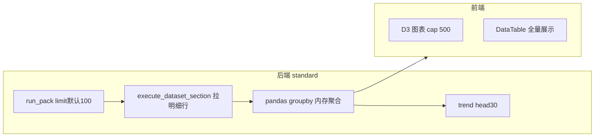
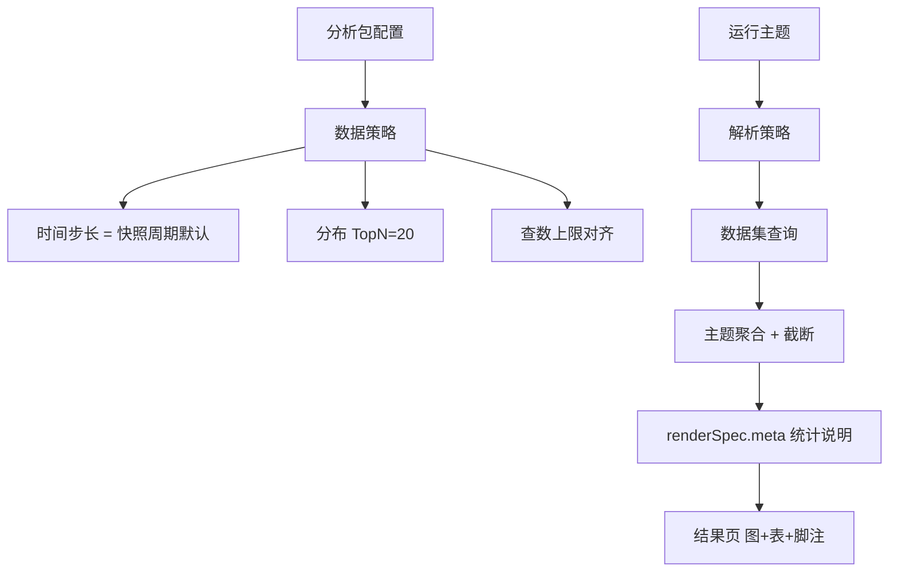
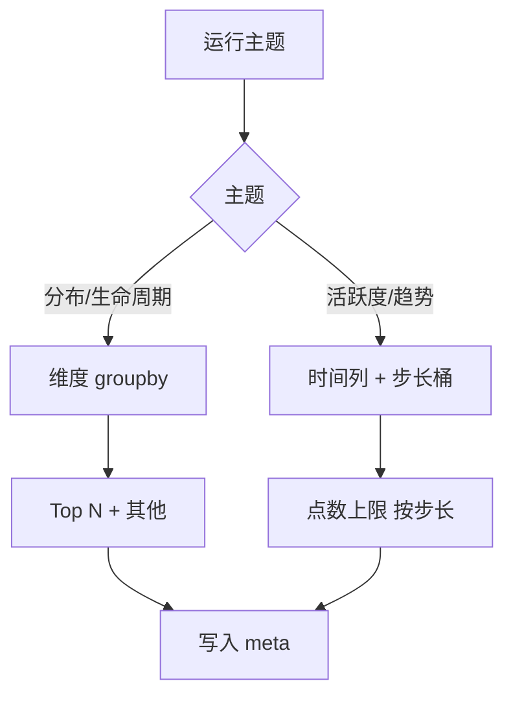
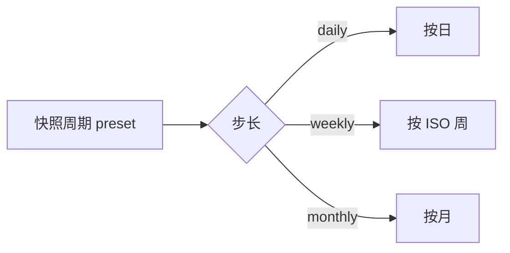
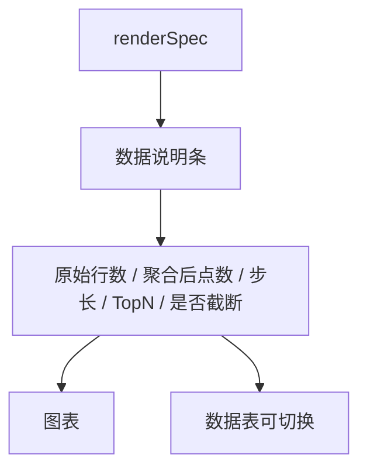

# 标准分析 · 步长与数据量蓝图

## 元信息

| 项 | 值 |
|----|-----|
| mode | blueprint |
| scope | 标准分析预制包：查数上限、时间步长、维度截断、结果页诚实说明 |
| 日期 | 2026-08-19 |
| PRD 锚 | RPT-002 · `docs/automate/prd/F08-RPT.md` |
| 关联 | `2026-08-18-standard-analysis-visualization-audit.md` · `2026-08-18-standard-analysis-compare.md` |
| domain_strength | strong |
| 假设状态 | **草稿待确认** |

---

## 1. JTBD

**数据管理员**配置分析包后，**分析师**打开结果页应看到**可信、可读**的分布/趋势，不因百万行拖垮页面，也不因默认抽 100 行产生误导。

| | |
|---|---|
| **成功** | 27 城分布一眼可读；一年趋势自动按周/月聚合；页脚说明「基于全量聚合 / 样本」 |
| **最贵失败** | 用户拿错误样本当经营决策；或 500 城柱图卡死、无解释 |

---

## 2. 现状 as-is（证据）

| 主题 | 步长 | 数据量处理 | 问题 |
|------|------|-----------|------|
| 区域分布 | — | 明细 limit 100 → groupby，**无 Top N** | 大表统计偏差；城多柱图挤 |
| 活跃度 | **固定按天** | 无点数上限 | 样本跨多天时点过多 |
| 趋势 | 按天 | **仅保留 30 点** | 与活跃度不一致；非「最近 30 天」语义 |
| 生命周期 | — | 无维度上限 | 类目多时可读性差 |
| 前端 | — | 图表 500 点采样 | 用户不知被截断 |

**代码锚点**：`theme_aggregate.py` · `schemas.RunIn.limit` · `dataset_binding limit:1000` · `ADVANCED_CHART_ROW_CAP=500`

---

## 3. 难回退选型

| ID | 选题 | 状态 | 建议 |
|----|------|------|------|
| S1 | 聚合算子落点：**库内 GROUP BY** vs **拉样本内存聚合** | **assumed** | **分期**：M1 先统一 limit + 步长 + Top N + 说明条；M2 推 SQL/数据集侧聚合（与 query 域对齐） |
| S2 | 步长策略：**跟快照周期对齐** vs **按时间跨度自动** vs **用户手选** | **researched** | **默认跟快照周期**（日/周/月）；高级包可选手选（P2） |
| S3 | 分布截断：**Top N + 其他** vs **全量** | **anchored** | Top 20 +「其他」— 与看板图表惯例一致 |

---

## 4. 目标架构（to-be）

**原则**：

1. **诚实优先**：结果页必须展示「怎么算的」  
2. **预制包不暴露 SQL**：策略在包级/主题级配置，不是 Explore  
3. **步长与快照同频**：日快照 → 日桶；周快照 → 周桶；避免对比口径打架  
4. **先可读、再精确**：Top N / 点数上限先于全量聚合优化  

---

## 5. 核心流程（≤5）

### F1 · 查数与聚合策略

| 项 | 目标值 | 说明 |
|----|--------|------|
| 查数上限 | **与绑定 limit 对齐，默认 5000**（可配置上限 1 万） | 消除 run=100 vs bind=1000 分裂 |
| 分布 Top N | **20**，其余并入「其他」 | 柱图可读；表可展开全量 |
| 趋势/活跃度点数 | 日 ≤90 · 周 ≤52 · 月 ≤24 | 按步长 cap，取**最近** N 桶 |
| 生命周期 | Top 15 状态 + 其他 | 类目过多时 |

### F2 · 时间步长（步长）

| 快照周期 | 默认步长 | 活跃度/趋势行为 |
|----------|----------|----------------|
| 每日快照 | 日 | 最近 90 天日桶 |
| 每周快照 | 周 | 最近 52 周 |
| 每月快照 | 月 | 最近 24 月 |

**不做**（P2 以后）：用户自定义步长、小时级。

### F3 · 结果页诚实说明

示例文案：

> 基于数据集 **5,000** 行样本聚合 · 时间步长 **按周** · 展示最近 **12** 个周期 · 区域显示 Top **20**（其余归入「其他」）

### F4 · 配置页联动（附录）

- 无日期列 → 自动禁用活跃度/趋势（已有告警，加强为**禁用勾选**）  
- 改快照周期 → 提示步长将同步变更  
- 可选「分布 Top N」数字（默认 20，范围 5–50）— P1 可固定 20 不写 UI  

### F5 · 对比上期（不变更步长逻辑）

对比表仍用**维度键对齐**；步长只影响实时/快照聚合，不改变四列对比形态。

---

## 6. 场景对照

| 场景 | 业内 | 目标态 | 现状 |
|------|------|--------|------|
| 27 城销售分布 | Top N 或地图 | Top 20 柱图 + 表 | 全量柱图，样本 100 行 |
| 一年日活 | 自动周/月 grain | 跟周快照 → 周桶 | 固定按天，无 cap 一致 |
| 百万行事实表 | 库内聚合 | M2 SQL 聚合；M1 提高 limit + 说明 | 100 行样本 |
| 政企验收 | 口径可解释 | meta 脚注 | 无 |

---

## 7. 分期交付（建议）

| 期 | 内容 | 优先级 |
|----|------|--------|
| **M1a** | 统一 limit；分布 Top 20；趋势/活跃度统一点数 cap；`renderSpec.meta` + 结果页说明条 | **P0** |
| **M1b** | 步长跟快照周期（日/周/月桶）；后端 `theme_aggregate` 抽步长函数 + 单测 | **P0** |
| **M1c** | 配置页：无日期列禁用时间主题；保存时校验 | **P1**（部分已做） |
| **M2** | 数据集/SQL 侧 GROUP BY，run 只拉聚合结果；大表真全量 | **P1** |
| **P2** | 包级可配 Top N、步长覆盖 | 可选 |

**不建议 M1 做**：Explore 级自由步长、小时粒度、全量无上限导出。

---

## 8. 智囊团摘要（缩席）

| 席 | 结论 |
|----|------|
| 产品 | 无说明条的聚合 = 假产品；步长跟快照周期最省认知成本 |
| 计划 | M1a+b 可 1 个迭代；M2 单独立项 |
| 架构 | S1 分期可接受；meta 字段进 renderSpec 契约 |
| 领域 | 预制分析包应对齐经营例会节奏（日/周/月），不是 ad-hoc Explore |

---

## 9. 假设（待确认）

| ID | 假设 |
|----|------|
| H1 | 步长默认 **= 快照周期**，不提供手选（M1） |
| H2 | 分布 **Top 20 + 其他** 足够 M1 |
| H3 | M1 仍允许 **样本聚合**，但必须 **脚注标明行数** |
| H4 | M2 再做库内聚合，不阻塞 M1 上线 |

---

## 10. PRD 偏航（建议，默认不回写）

| PRD | 建议补充 |
|-----|----------|
| RPT-002 | 验收增加：「Web 展现含数据口径说明」「时间主题步长与快照周期一致」「分布默认可读截断」 |

---

## 11. 下一步

确认 H1–H4 → 出 `docs/specs/standard-analysis-volume-step.md` → `go-fast` 切片 M1a → M1b。
