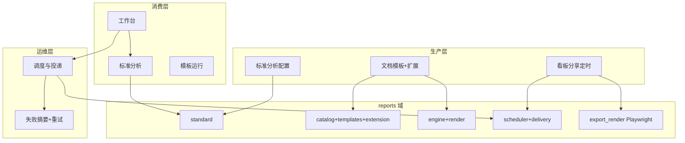

# 报表中心 ·  holistic audit（2026-08-20）

## 元信息

| 项 | 值 |
|----|-----|
| mode | audit |
| scope | 报表中心全模块：IA、三条产品线、RPT-001～007、对标 DataEase / 积木 |
| 日期 | 2026-08-20 |
| 证据袋 | `docs/services/reports.md` · `F08-RPT.md` · `2026-08-17-report-center-industry-audit.md` · `2026-08-12-reports-full-truth-audit.md` · `2026-08-19-standard-analysis-results-panel-audit.md` · live API probe · `fe/src/pages/admin/reports/*` |
| domain_strength | **strong** |
| PRD 锚 | RPT-001～007 |
| 前序 audit | [2026-08-17-report-center-industry-audit.md](./2026-08-17-report-center-industry-audit.md) |

---

## 1. JTBD 与最贵失败

| | |
|---|---|
| **JTBD** | 政企数据团队把「可重复看的决策视图」和「可定时投递的固定版式产物」交给业务方；业务方要能**看数、比上期、收报告**。 |
| **成功** | 30 秒内找到该看的分析；定时任务稳定、失败可追；快照≠投递概念不混。 |
| **最贵失败** | 用户以为「报表中心=积木式 Excel 设计器」，实际只有块编辑 + 标准分析，形成「半成品」印象；或调度/投递链 silently 失败。 |

**总体判定**：`DONE_WITH_CONCERNS` — **架构与 IA 已成型且领先社区版 DataEase 的部分能力**；与积木 JimuReport 对标时，**固定版式呈现层仍是最大短板**。

---

## 2. 架构 as-is

### 难回退选型

| ID | 选题 | 状态 | 证据 |
|----|------|------|------|
| S1 | 统一调度 FSM + 多 artifactKind | anchored | `scheduler/service.py` |
| S2 | RenderSpec 契约 | anchored | ADR-09 · `reports/contract.py` |
| S3 | 看板 Playwright PDF | anchored | `export_render.py` |
| S4 | 零第三方 BI 运行时（不嵌积木） | anchored | NFR-08 · project.mdc |
| S5 | Dataset 为标准分析主绑定 | mixed | `dataset_binding.py` + 物理表兼容 |
| S6 | 自研块模板而非 WYSIWYG 设计器 | anchored | `TemplateBlockEditor` · PRD companion |

---

## 3. 做得好的地方（相对业内）

| 维度 | 评价 | 证据 |
|------|------|------|
| **IA 分层** | 消费 / 生产 / 运维三层清晰；四侧栏子项 + 配置深链 | `nav-manifest.tsx` · industry audit E1–E4 |
| **标准分析** | 对象工作台 + 周期快照 + 本期 vs 上期 — **社区版 DataEase 无对等物** | RPT-002 · `StandardAnalysis*` |
| **看板定时 PDF** | 主路径在分享页 + 前置检查 — 贴近 DataEase X-Pack 定时报告 | `DashboardSchedulePanel` · G5 |
| **调度横切** | 模板 / 看板 / 标准分析共用 FSM、历史、重试、IM 按人投递 | RPT-005 · `schemas.py` 含 `standard` |
| **工程纪律** | RenderSpec、ACL、probe 预算、DB 持久化、大量 smoke/pytest | F08 验收 + `reports-full-truth` |
| **近期体验** | 标准分析 R1 信任包（人话轴/tooltip、capabilities 灰显、快照条） | `2026-08-19-standard-analysis-results-panel-audit` |

**live 探针（2026-08-20）**：`GET /schedules` 200（11 条）· `standard/packs` 200 · `templates` 200 — 较 08-12 truth audit 的 list 500 **已恢复**。

---

## 4. 需要大改进的地方（按优先级）

### P0 · 信任链 / 断链（必须先绿）

| ID | 缺口 | as-is | 建议 |
|----|------|-------|------|
| P0-1 | 标准分析 → 定时投递端到端 | schema/executor 已含 `standard`；需回归 live SMTP/IM + 配置页 CTA | 补一条 `standard_schedule_e2e` smoke；配置保存后「去创建投递」深链带 `packKey` |
| P0-2 | 调度列表/历史在生产环境的稳定性 | 本地 200；需 CI + 部署后探针 | 纳入 `make test` 门禁 + deploy-dev 走查项 |
| P0-3 | 模板扩展/模板页 smoke 漂移 | 08-12 报告 `report-templates.smoke` 部分失败 | 修 label/选择器漂移，禁止假绿 |

### P1 · 对标积木 / 政企验收（产品体感差距最大）

| ID | 缺口 | as-is | 建议 |
|----|------|-------|------|
| **P1-1** | **固定版式「设计器」体验** | 块列表 + SQL/JSON 预览；**非** Excel 套打、非所见即所得 | 分期：① 业务向字段绑定向导 ② 套打占位符预览 ③ 远期 WYSIWYG（或受控 HTML 模板） |
| **P1-2** | **交叉表 / 分组报表 / 打印排版** | RenderSpec 有 table/chart block；无交叉表、无分页打印模型 | 新 RPT 分片或 companion：交叉表 DSL + PDF 分页策略 |
| **P1-3** | **码值翻译（数据字典）** | META-003 维度字典已有 API；报表/标准分析展示层未统一 lookup | 渲染层 `valueMap`：绑定维度字典 → 表/图/导出一致翻译 |
| **P1-4** | **文档模板默认体验** | 前序 audit：空态/默认选中弱 | 首进引导 + 示例模板种子 + 运行 CTA |

### P2 · 架构债与规模化

| ID | 缺口 | as-is | 建议 |
|----|------|-------|------|
| P2-1 | 标准分析 M1 内存聚合 | `theme_aggregate` 出数后内存聚合；大数据会顶 cap | M2 库内 GROUP BY（蓝图 S4 open） |
| P2-2 | 快照保留策略 | 无 retention 清理 | 配置「保留 N 期」+ job |
| P2-3 | Dataset vs 物理表双叙事 | 兼容路径仍在 | UI 默认 Dataset + 物理表 deprecated 提示 |
| P2-4 | 目录「另存为/手工执行」 | PRD companion 未做 | 低优先级，与模板设计器同期 |

### P3 · 有意不做（避免走错路）

| 项 | 原因 |
|----|------|
| 嵌入积木 / AJ-Report 运行时 | 违反 NFR-08；仅作本地对标环境 |
| 单入口 Tab 吞掉四子项 | 行业蓝图已否决（S5 anchored） |
| 标准分析变第四套 Explore | 应保持「对象工作台」定位 |

---

## 5. 场景对照（政企 vs 积木 vs VitalSpan）

| 情境 | 积木 JimuReport | DataEase 社区 | VitalSpan as-is | 判定 |
|------|-----------------|---------------|-----------------|------|
| Excel 式报表设计 | 强 | 弱（仪表板为主） | 块编辑 + 扩展 | ⚠️ 弱于积木 |
| 定时邮件/IM 报告 | 有 | 社区弱 / X-Pack | 看板 PDF + 模板 + standard | ✅ 领先社区 DE |
| 对象周期对比 | 弱 | 弱 | 标准分析快照 compare | ✅ 差异化 |
| 交叉表/套打 | 强 | 中 | 未覆盖 | ❌ P1 |
| 数据字典展示 | 菜单化字典 | 数据集字段 | META 有、报表未接 | ⚠️ P1 |
| 运维统一失败面 | 中 | 中 | Hub + Schedules 重试 | ✅ |

---

## 6. 核心 F 健康度（≤5）

| ID | 业务 | 健康度 | 一句话 |
|----|------|--------|--------|
| F1 | 工作台导航 | **B+** | 卡片 + 失败摘要够用；收藏/最近可再强化 |
| F2 | 标准分析 | **B+** | 核心闭环强；图可读性、M2 聚合、投递 CTA 待补 |
| F3 | 文档模板 | **C** | 后端完整；**业务设计器体感**是对标积木最大 gap |
| F4 | 调度与投递 | **B** | FSM 完整；端到端投递与运维探针需常驻绿 |
| F5 | 看板定时 PDF | **A-** | 主路径清晰；依赖 Playwright/SMTP 前置检查 |

**附录（确认面不展开）**：批量导入 RPT-007 · 扩展配置 RPT-006 · 引擎导出 RPT-001

---

## 7. PRD 偏航建议（不自动改）

| 项 | 建议 |
|----|------|
| RPT-003 演化 | 明确「块模板 ≠ WYSIWYG」；交叉表/套打分期 |
| RPT-002 演化 | M2 聚合、快照 retention、维度字典 lookup |
| 新产品线叙事 | 对外：**分析看标准分析、固定版式看文档模板、定时收看板/调度** |

---

## 8. 建议落地顺序（3 个里程碑）

1. **M0（2～3 周）**：调度 list/standard 投递 e2e 绿 · smoke 修漂移 · 配置页投递深链  
2. **M1（1～2 月）**：报表展示层接 META 维度字典 · 模板向导/示例 · 导出翻译  
3. **M2（季度）**：交叉表 MVP · 打印分页 · 标准分析库内聚合  

---

## 9. 证据索引

| ID | 路径 |
|----|------|
| E1 | `docs/services/reports.md` |
| E2 | `docs/automate/prd/F08-RPT.md` |
| E3 | `fe/src/pages/admin/reports/ReportCenterPage.tsx` |
| E4 | `backend/app/reports/scheduler/schemas.py` |
| E5 | `docs/feature-truth/2026-08-12-reports-full-truth-audit.md` |
| E6 | live probe 2026-08-20 schedules 200 |

---

## 10. 总结一句话

**报表中心在「架构、IA、标准分析、看板定时」上已经是能打的自研底座；要对标积木 JimuReport 的政企报表体感，最大改进不在调度而在「固定版式呈现层」（设计器、交叉表、字典翻译、套打导出）—— 这与你们「零第三方 BI 运行时」战略一致，必须自研分期补，而不是嵌积木。**
