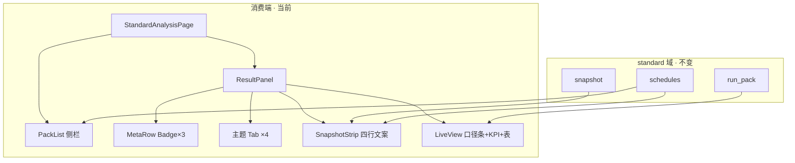
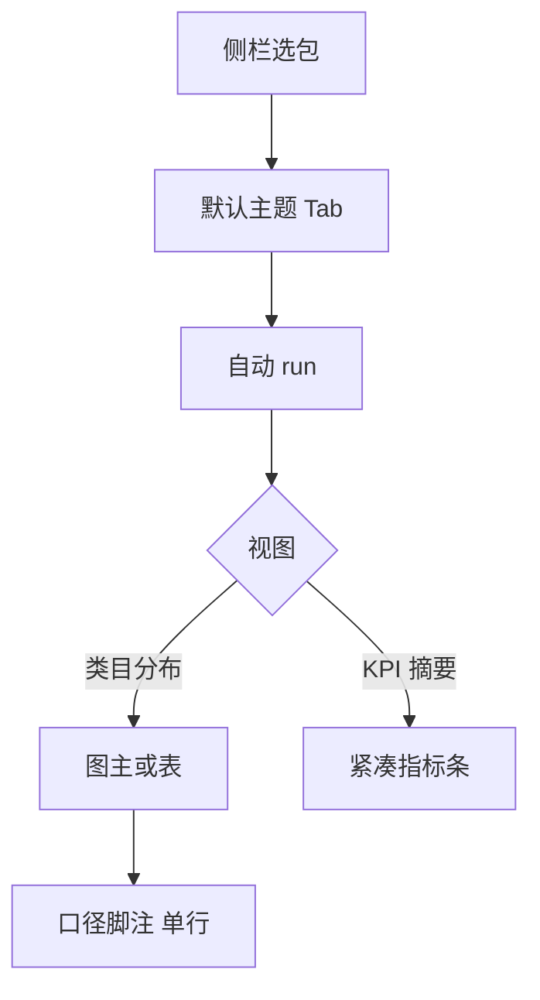
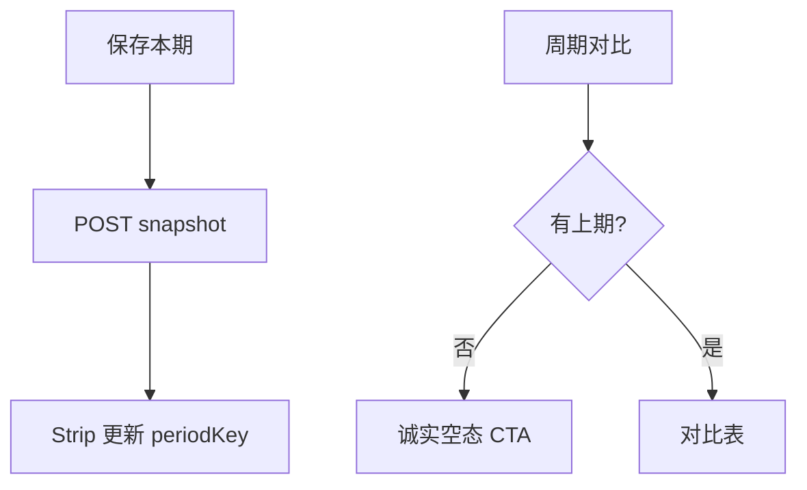

# 标准分析 Hub · 视觉与功能体验 audit

## 元信息

| 项 | 值 |
|----|-----|
| mode | audit |
| scope | `/admin/reports/standard/results` — 标准分析消费端（侧栏 + 结果区 + 可观测条 + 实时/对比） |
| 日期 | 2026-08-20 |
| 触发 | 用户截图反馈「非常难用」；lifecycle 主题 · 实时 · 包 sss1 |
| 证据袋 | 用户截图 · `StandardAnalysisPage.tsx` · `StandardAnalysisResultPanel.tsx` · `StandardAnalysisPackList.tsx` · `StandardAnalysisSnapshotStrip.tsx` · `StandardAnalysisLiveView.tsx` · `docs/ui/layout.md` · `F08-RPT.md` RPT-002 · 前序 `2026-08-19-standard-analysis-results-panel-audit.md` · `2026-08-20-report-center-holistic-audit.md` |
| domain_strength | strong |
| PRD 锚 | RPT-002 · M-RPT F-B（可观测条） |
| 假设状态 | **草稿待确认** |
| 关联 UI | `docs/ui/layout.md` §标准分析 · TailAdmin list-page-kit · hubFilterUi 分段控件 |

---

## 1. JTBD 与最贵失败

| | |
|---|---|
| **JTBD** | 业务/分析师打开标准分析，**先看到结论数字与分布**，需要时再查口径、快照、投递状态。 |
| **成功** | 3 秒内定位「当前主题 + 关键指标 + 主视图（图或表）」；运维信息可查但不挡读数。 |
| **最贵失败** | 首屏被 Badge/四行运维文案占满，表格挤在底部空白区 — 用户认为「功能堆叠、像后台配置页而非看数工作台」。 |

**as-is 判断（对照截图）**：能力链 **REAL**（run/翻译/快照/投递均已打通），但 **F-B 可观测条 + 侧栏摘要 + MetaRow 三重叠加**，造成 **信息架构退化** — 不是缺功能，是 **视觉层级与重复展示** 问题。

---

## 2. 架构关系图



### 2.1 难回退选型

| ID | 选题 | 状态 | 证据 | 阻塞优化 |
|----|------|------|------|----------|
| S1 | 对象工作台 = 侧栏选包 + 主区 Tab 主题 | anchored | `layout.md` · industry blueprint | 否；保留结构，减重复 |
| S2 | 可观测条（口径/快照/投递）须在消费端可见 | anchored | M-RPT F-B · `StandardAnalysisSnapshotStrip` | 否；改 **形态** 不改 **存在** |
| S3 | 图表走平台 ChartEngine，对比以表为主 | anchored | 08-18/19 audit | 否 |
| S4 | 侧栏 + 主区 xl 分栏 | anchored | `STANDARD_WORKBENCH_GRID_CLASS` | 否 |

---

## 3. 场景对照（截图 vs 业内）

| 场景 | 业内惯例（Superset/QuickBI/Tableau Pulse） | VitalSpan as-is（截图） | 偏离 |
|------|-------------------------------------------|-------------------------|------|
| 首屏读数 | 指标卡 + 主图/表占 **≥60% 视口** | KPI 卡 + 表在下方，上方 **~50% 为 meta** | **严重** |
| 包级配置摘要 | 侧栏一行状态或 hover | 侧栏 **5 Badge + 4 主题 chip** | 重复 |
| 主题切换 | 主区 Tab 或 Segmented | 侧栏 chip **+** 主区 Tab **双份** | 重复 |
| 口径/样本说明 | 图下小字或 tooltip | 口径条 + meta 脚注 + Strip「口径」行 **三处** | 重复 |
| 快照/投递运维 | 折叠「数据新鲜度」或状态点 | Strip **四段完整句子** + 侧栏「投递：未配置」 | 过载 |
| 保存快照 | 工具栏次要按钮 | Strip 右侧，与运维文案同一行 | 层级弱 |
| 生命周期 4 类 | 条形/饼图扫读更快 | 仅表 + 大 KPI 卡 | 可接受但非最优 |

---

## 3.1 术语表

| 术语 | 用户向含义 | 勿混淆 |
|------|------------|--------|
| 分析包 | 一个业务对象的看数范围 | 不是「主题」 |
| 主题 | 生命周期/区域/活跃/趋势 | 不是图表类型 |
| 实时 | 现查聚合 | 快照对比里的「本期」 |
| 可观测条 | 口径·快照·投递状态 | 不是错误日志 |
| 投递 | 定时邮件 PDF | 不是保存快照 |

---

## 4. 核心 F（≤5）与优化方向

### F1 · 选包并读实时结果（截图主路径）



| 优先级 | 缺口 | 建议（视觉+功能） |
|--------|------|-------------------|
| **P0** | 首屏 **7 层壳** 才到表格（MetaRow + Strip + metaNote + Summary） | **合并为 2 层**：① 工具栏（包名/主题/模式/刷新/快照）② 数据区（KPI+图/表+单行口径） |
| **P0** | 侧栏与主区 **重复** 快照/留存/投递/主题 | 侧栏只保留：**包名 + 健康点（绿/黄/灰）+ 投递一行**；主题 chip **删除** |
| **P1** | `StandardAnalysisMetaRow` 与侧栏 Badge 完全同义 | xl 分栏时 **隐藏 MetaRow**；窄屏保留 MetaRow、隐藏侧栏明细 |
| **P1** | lifecycle 4 行仍纯表 | 默认 **横向条形图**（可切表）；与 distribution 一致 |
| **P2** | Summary 卡片区过高 | 改为 **inline 统计**（一行三数：行数/合计/Top1） |

### F2 · 切换主题


| 优先级 | 缺口 | 建议 |
|--------|------|------|
| **P1** | 切换主题 Strip 重复展示包级「快照节奏/留存」 | Strip **按主题** 只显示：最近快照 + 本期口径；包级节奏 **进侧栏或折叠** |
| **P2** | 不可用主题仅 disabled | 保持；可加空态插图 |

### F3 · 保存快照 / 对比上期



| 优先级 | 缺口 | 建议 |
|--------|------|------|
| **P1** | 「保存本期快照」埋在 Strip 右侧 | 移到 **工具栏 actions**（与刷新并列）；Strip 只读 |
| **P1** | 对比模式仍显示完整 Strip 四行 | 对比模式 **精简为 2 项**：对比期定义 + 最近快照 |
| **P2** | 历史快照列表不可见 | R2 抽屉（前序 audit 已 open） |

### F4 · 投递配置（未配置）

| 优先级 | 缺口 | 建议 |
|--------|------|------|
| **P1** | 「投递：未配置」在侧栏 + Strip 各出现 | **仅侧栏** 显示；Strip 去掉投递行（或 admin 折叠区） |
| **P2** | 「去配置」链到 schedules | 保留；侧栏 Badge 点击直达 `standardScheduleHubPath` |

### F5 · 管理分析包（右上角）

| 优先级 | 缺口 | 建议 |
|--------|------|------|
| **P2** | 与看数混在同一视觉权重 | 保持 outline/secondary；数据区不出现「配置」长文案 |

---

## 5. 推荐 IA 重构（目标态 · 不改后端）

```mermaid
flowchart TB
  subgraph sidebar [侧栏 · 精简]
    N[包名]
    H[健康: 数据✓ 快照✓ 投递○]
  end

  subgraph toolbar [主区工具栏 · 单行]
    T[主题 Tabs]
    M[实时 | 对比]
    R[刷新]
    S[保存快照]
  end

  subgraph data [主区数据 · 占满剩余高度]
    K[inline KPI]
    V[Chart 或 Table]
    F[单行口径脚注]
  end

  subgraph ops [运维 · 默认折叠]
    O[快照节奏 / 留存 / 投递详情]
  end

  sidebar --> toolbar --> data
  toolbar --> ops
```

### 5.1 组件映射（FE 仅 · 预估）

| 现状组件 | 动作 |
|----------|------|
| `StandardAnalysisPackList` | 去掉主题 chip；Badge 收成 1 行状态；投递可点击 |
| `StandardAnalysisMetaRow` | xl 下隐藏；或合并进侧栏 expanded |
| `StandardAnalysisSnapshotStrip` | 改为 **CompactObservabilityBar**（3 格 icon+短标签）；包级字段默认折叠 |
| `StandardAnalysisResultPanel` | 工具栏合并快照按钮；减少 header padding |
| `StandardAnalysisLiveView` | KPI 改 inline；metaNote 与 Strip 口径 **二选一** |
| `standardAnalysisDataMeta.ts` | 保留；作为图下唯一口径来源 |

### 5.2 视觉规范（对齐 b-design-system）

- 工具栏：沿用 `ListPageToolbar` + `hubFilterUi` 分段壳（已有）
- 运维信息：`Collapsible` + `text-theme-xs`（TailAdmin 模式），**默认 collapsed**
- KPI：禁止 `grid-cols-4` 大卡占高；改用 `flex gap-6` 数字行
- 数据表：`ListPageTableFrame` 占 `flex-1 min-h-0`，保证 **表格区域 ≥50vh**

---

## 6. 智囊团摘要（缩席 · 基于证据袋）

| 席 | 投票 | 一句 |
|----|------|------|
| 产品 | 通过带保留 | 功能齐全但 **信息重复** 是「难用」主因；P0 做减法不改契约 |
| 规划 | 通过 | 建议 **1 个 FE 迭代包 UX-R2**（IA 合并），不新开后端 |
| 领域 | 通过 | 对象工作台应 **数优先、运维次之**；F-B 可观测条需 **降维展示** |
| 架构 | 通过 | S1–S4 不动；仅组件重组 + 条件渲染 |
| UI | 通过 | 遵守 `list-page-kit`；禁止再加 Badge 层 |
| 运维 | 关注 | 折叠区须保留投递/快照入口，不可删能力 |

**vetoes**：无  
**theater_ok**：缩席合成

---

## 7. 实施批次（建议）

| 批次 | 内容 | 验收 |
|------|------|------|
| **UX-R2a（P0）** | 侧栏精简；xl 隐藏 MetaRow；Strip→紧凑条；快照按钮进工具栏 | 首屏表格/图 **可见无需滚动**（1280×720）；smoke 更新 |
| **UX-R2b（P1）** | 口径/meta 去重；对比模式 Strip 精简；lifecycle 默认条形图 | vitest + 截图对比 |
| **UX-R2c（P2）** | 运维 Collapsible；侧栏投递深链；历史快照抽屉 | 接力 08-19 R2 |

**不改**：后端 API · run/compare 契约 · M-RPT 已交付测试。

---

## 8. PRD / 文档偏航（仅建议）

| 项 | 建议 |
|----|------|
| RPT-002 F-B | 验收改为「可观测信息 **可见且可折叠**」，而非「四行全文常驻」 |
| `layout.md` | 补一句：标准分析 Hub **数优先 IA** |
| 08-19 audit | R2 与本 audit 合并跟踪 |

---

## 9. 假设（须整包接受）

- **H1**：用户主路径为 **实时看数**（截图即为 live + lifecycle）。
- **H2**：分析包数量通常 **≤10**；侧栏精简不会损失寻址能力。
- **H3**：管理员仍需要看到投递/快照状态，但 **默认可折叠**。
- **H4**：不在此 audit 做 M2 库内聚合或新主题（S4 open 项独立立项）。

---

## 10. 对用户截图的直接解读

| 你看到的问题 | 根因（代码锚点） |
|--------------|------------------|
| 左侧卡片 Badge 太多 | `StandardAnalysisPackList` L95–127 |
| 标题下又是一排 Badge | `StandardAnalysisMetaRow` in `ResultPanel` L122–124 |
| 主题 Tab 与侧栏 chip 重复 | PackList theme chips + `TabsList` L134–154 |
| 四行灰色运维字占屏 | `StandardAnalysisSnapshotStrip` L56–85 |
| KPI 大卡 + 小表 + 大量空白 | `LiveSummaryStrip` grid + `DataTable` 未 flex-1 撑满 |
| 「保存本期快照」不显眼 | Strip 右侧 outline 与文案竞争 |

**一句话**：不是 SMTP/run 坏了，是 **M-RPT F-B 可观测条与侧栏摘要叠在同一视口**，需要 **做减法重组**，而不是再加功能。
