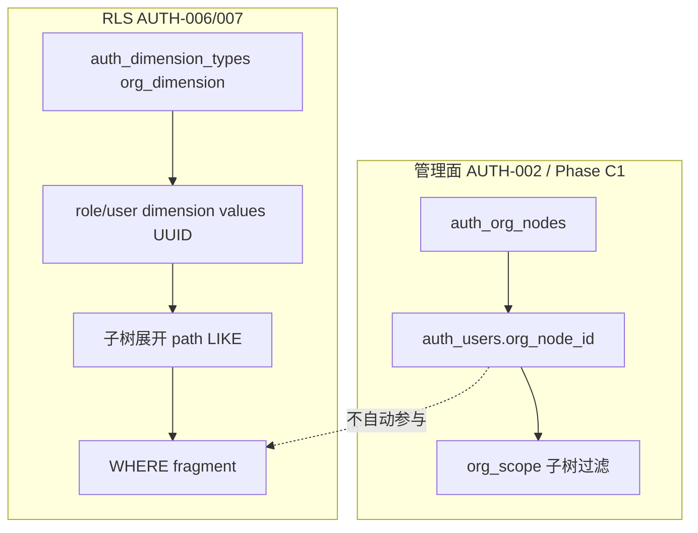

# 数据模型审计 · 平台元库（auth 深度）· 2026-08-31

## Model Card

| 项 | 值 |
|----|-----|
| **引擎/版本** | PostgreSQL（本地 `alembic current` → `PostgresqlImpl`）；兼容 SQLite/MySQL（迁移含方言分支） |
| **真源** | `backend/migrations/versions/`（head **0060**）+ ORM `backend/app/**/models.py`；**一致** |
| **文档真源漂移** | `docs/arch.md` 登记 head **0047**；`docs/data/README.md` frontmatter **0050**；与现网 **0060** 不一致（见 M-16） |
| **范围** | **整库表清单穷尽**（~85 张平台元表）+ **auth 表族 21 张深度八维**；非 auth 域仅浅扫硬门槛与跨域类型 |
| **量级** | M1 开发/演示规模；`auth_audit_events` 为**无界增长** append-only；其余 auth 表低基数 |
| **多租户/分片** | M1 **单租户**（`production.mdc` R25）；无 `tenant_id` 列——与当前 PRD 一致，非缺陷 |
| **扫描工具** | `rg-only` + `codegraph`（索引 2790 文件，**pending +1**，未 sync）；无 `ast-grep` |
| **规则来源（应然）** | `docs/automate/prd/F02-AUTH.md` · `docs/services/auth.md` · `docs/arch.md` §5/§6.3 |
| **代码入口（实然）** | `backend/app/auth/**` · `query/rls/guard.py` · 各域 `*_acl.py` |
| **已定取舍** | Phase C 双通路 ACL（角色 grant + 用户 add/deny）为**有意设计**；多态 `resource_type+resource_id` 为 ACL 常见取舍 |

---

## ADR 复核

| ADR / 目标态 | 模型角度 | 架构角度 | 前提是否已变 | 现网绕开证据 | verdict | 动作 |
|--------------|----------|----------|--------------|--------------|---------|------|
| `docs/arch.md` §6.3 M7 RBAC+RLS 链式图 | 未记载 Phase B/C 表与双 org 通路；非建模错误 | 缝未泄漏；执行链仍成立 | Phase C 已交付，文档未跟进 | 代码已写 `auth_user_*` / `auth_rls_column_bindings` / `org_scope` | **adr_outdated** | 更新 arch §6.3；补「管理 org vs RLS org」说明 |
| ADR-07 平台元库三引擎 | 迁移有 SQLite batch 分支 | 与实现一致 | — | — | **adr_sound** | — |
| ADR-11 前端 RBAC | 与 `auth_permissions` 目录一致 | — | — | — | **adr_sound** | — |

---

## 三方对账矩阵

| 规则 | 出处 | 库 | 代码 | 结论 | finding |
|------|------|----|------|------|---------|
| 用户名全局唯一 | AUTH-003 · `auth_users.username` UNIQUE | yes | yes（IntegrityError→409） | ok | — |
| 角色资源授权不可重复 | AUTH-004 · `uq_auth_resource_grants` | yes | yes | ok | — |
| 用户例外有效集 = 角色 ∪ add − deny | Phase C2 · `auth.md:90` | partial（effect CHECK） | yes `merge.py` | ok | — |
| 未授权资源不可见 | AUTH-004 | partial（无 resource FK） | yes ACL 链 | gap | M-2 |
| `resource_type` 限定枚举 | `resources/service.py:197` VALID_RESOURCE_TYPES | **no** CHECK | 读路径校验；**写路径 `create_grant` 未校验** | gap | M-4 |
| RLS 无绑定默认 `1=0` | AUTH-007 · `predicate.py` | no | yes | ok（预期代码兜底） | — |
| 列绑定 scope 至少一项 | Phase B · `column_bindings/service.py:25` | partial（NULL UNIQUE 漏洞） | bindings yes；**masks no** | gap | M-1 |
| 组织维度值须为有效 org 节点 | AUTH-006 · `validate_dimension_value` | **no** FK | yes 运行时查 | gap | M-12 |
| 用户组织归属 | AUTH-002 · `auth_users.org_node_id` FK | yes | yes | ok | — |
| **用户组织 ≠ RLS 组织可见性** | PRD 未显式声明等价 | — | `resolve_user_org_node_ids` **不读** `org_node_id` | drift | M-5 |
| 列脱敏策略枚举 | Phase C3 | yes CHECK | yes | ok | — |
| root 角色 `code=admin` | `ck_auth_roles_root_code` | yes | yes `bootstrap_root` | ok | — |

### 代码替库兜底清单

| 兜底位置 | 兜的是什么 | 绕过路径 | finding |
|----------|-----------|----------|---------|
| `masking/service.py:41` 无 scope 校验 | 列脱敏作用域 | API/脚本双 NULL 插入 | M-1 |
| `resources/service.py:62` 直写 `resource_type` | 资源类型值域 | 绕过 Pydantic 的内部调用 | M-4 |
| `rls/groups/service.py` `validate_dimension_value` | org_ref 维度值 | 运维 SQL、并发删组织 | M-12 |
| `roles/service.py` 过滤 `is_active` | 停用角色不可继承 | 直写库 `is_active=false` 仍有关联 | —（低风险） |

---

## 目标态 vs 现网（组织双轨 · 非 I 组未收口）

Phase C 角色/用户双通路为**产品目标态**，非迁移未收口。需文档化的是 **管理组织 vs RLS 组织** 分叉：

| 差异 | 类型 | 旧通路仍写入 | finding |
|------|------|-------------|---------|
| `org_node_id` 与 `org_dimension` 值独立维护 | 语义分叉（非重复表） | 两通路均活跃 | M-5 |

---

## 真实访问路径（D8 · 代码实证）

| 路径 | 出处 | 索引 | 覆盖 | 结论 |
|------|------|------|------|------|
| 用户→角色→权限码 | `permissions/service.py:43-60` | `auth_user_roles` PK(user,role) | 部分 | role 反查缺索引 M-17 |
| 角色→资源 grant | `resources/service.py:184-194` | `uq(role,type,id)` | yes | ok |
| 用户资源例外 merge | `user_overrides/merge.py:16-48` | `ix_auth_user_resource_grants_user` | yes | ok |
| 组织子树 `path LIKE` | `org_scope.py:36-40` | **无 path 索引** | no | M-7 |
| 审计分页多条件 | `audit/service.py:59-82` | created_at / actor / action | target_type 缺 | M-18 |
| 列脱敏查询 | `masking/service.py:31-38` | datasource/dataset ix | 双空时可能全表扫 | 待生产验证 |
| RLS 列绑定列表 | `column_bindings/service.py:34-63` | datasource/dataset ix | yes | ok |

---

## 八维评分

| 维 | 分 | 一句话依据 |
|----|---:|------------|
| D1 概念完整性与粒度 | 78 | auth 实体边界清晰；RLS/ACL 多通路为有意设计但增认知负担 |
| D2 键与身份 | 62 | 多态 `resource_id` 无 FK；可空 scope UNIQUE 削弱业务键 |
| D3 关系与基数 | 64 | 角色+用户双 ACL 合理；管理 org 与 RLS org **未收敛** |
| D4 时间与审计 | 71 | TZ 一致；审计列覆盖不均；`platform_im_connect_configs.updated_at` 失真 |
| D5 类型与精度 | 74 | 无浮点金额；`view_user_overrides.user_id` 与 `auth_users.id` 类型分裂 |
| D6 约束与完整性 | **38** | **硬门槛 #8**：PRD 关键约束靠代码；NULL-in-UNIQUE；无 resource/datasource FK |
| D7 演化与扩展性 | 70 | expand-only 链健康；seed import catalog；CHECK 扩展需迁移 |
| D8 访问路径与容量 | 66 | 审计无归档；org path 无索引；role_id 反查无索引 |
| **总分（加权）** | **64** | 命中硬门槛 #8 → 上限 69；**不可标「可上量」** |

**硬门槛命中**：**#8**（`resource_type`、列脱敏 scope、org 维度值）→ M-4、M-1、M-12

---

## 表清单（穷尽底表）

### Auth 表族（深度）

| 表 | 分类 | 结论 | finding |
|----|------|------|---------|
| auth_roles | 核心 | ok | — |
| auth_permissions | 字典 | ok | — |
| auth_role_permissions | 关联 | ok | — |
| auth_org_nodes | 核心 | findings | M-7 |
| auth_users | 核心 | findings | M-10, M-11 |
| auth_user_roles | 关联 | findings | M-17 |
| auth_resource_grants | 核心 | findings | M-2, M-4 |
| auth_dimension_types | 字典 | ok | — |
| auth_audit_events | 流水 | findings | M-6, M-18 |
| auth_dimension_groups | 核心 | ok | — |
| auth_dimension_group_values | 关联 | ok | — |
| auth_role_dimension_values | 关联 | ok | M-19（有意多通路） |
| auth_role_dimension_groups | 关联 | ok | M-19 |
| auth_dimension_type_refs | 字典 | ok | — |
| auth_user_resource_grants | 核心 | findings | M-2, M-4 |
| auth_user_dimension_overrides | 核心 | ok | — |
| auth_column_masks | 核心 | findings | M-1, M-3 |
| auth_rls_column_bindings | 核心 | findings | M-1, M-3 |
| user_im_bindings | 核心 | findings | M-14 |
| im_oauth_states | 流水 | findings | M-14 |
| platform_im_connect_configs | 配置 | findings | M-8 |

### 平台其他域（浅扫 · 硬门槛）

| 表 | 分类 | 结论 | 备注 |
|----|------|------|------|
| data_sources | 核心 | ok | 软删 `deleted_at`；与 grant 无 FK（见 M-2） |
| datasets | 核心 | ok | — |
| dashboards | 核心 | ok | — |
| chart_query_bindings | 核心 | ok | — |
| ingestion_sync_jobs / runs / etl_rules | 核心/流水 | ok | — |
| report_*（18 表） | 核心/流水 | ok | 未逐列审计 |
| gov_* / catalog_* | 字典/核心 | ok | — |
| metadata 域（entity/dimension/glossary/theme/physical） | 核心 | ok | — |
| viz_components / ai_viz_artifacts / viz_tile_services | 核心 | ok | — |
| view_role_defaults | 配置 | ok | — |
| view_user_overrides | 配置 | findings | M-13 |
| platform_delivery_configs | 配置 | ok | — |
| embed_tokens / integration_idempotency_records | 流水 | ok | — |
| query_config_records | 配置 | ok | — |

---

## Findings

### M-1 · P1 · D6 — 列脱敏 scope 可双空 + UNIQUE 对 NULL 无效

| 字段 | 内容 |
|------|------|
| evidence | `models.py:285-291`；`masking/service.py:41-61`（无 `_validate_scope`）；对比 `column_bindings/service.py:25-31` |
| source | code_cross |
| business_impact | 可插入多条 `(NULL,NULL,table,column)` 脱敏规则；查询合并结果不确定，列可能漏脱敏或策略冲突 |
| blast_radius | 3 个 py 文件 + `query/service.py` 消费 |
| min_cost | `create_mask` 复用 `_validate_scope`；存量 `SELECT` 清洗双 NULL 行 |
| long_term | `scope_kind` ENUM + `scope_id` NOT NULL 单通路；partial UNIQUE |
| recommend | **min_cost**（T1：加服务校验 + 清洗脚本） |
| recommend_why | 可靠性：立刻堵住写入；迁移风险：T1 可回滚；长期形状改动可排期 |
| confidence | high |
| migration_playbook | T1：无 DDL 或加 CHECK `datasource_id IS NOT NULL OR dataset_id IS NOT NULL`（需存量校验） |

### M-2 · P1 · D2/D3 — 多态资源授权无 FK，可产生孤儿 ACL

| 字段 | 内容 |
|------|------|
| evidence | `auth_resource_grants` / `auth_user_resource_grants` · `models.py:141-145,257-258` |
| source | code_cross |
| business_impact | 删除 datasource/dashboard/report 后 grant 残留；ACL 统计误导；极端情况下 ID 复用导致错授权 |
| blast_radius | ~17–20 py 引用 |
| min_cost | 各域删除钩子按 `(resource_type, resource_id)` 清理 grant |
| long_term | `auth_resource_registry` 或分资源类型子表 + FK CASCADE |
| recommend | **min_cost_then_long_term** |
| recommend_why | 安全面不能等；统一注册表需跨域 ADR |
| confidence | high |
| migration_playbook | T2 expand 注册表 + 回填；T3 switch 读路径（park 升人） |

### M-3 · P1 · D2/D6 — masks/bindings 的 `datasource_id` 无 FK

| 字段 | 内容 |
|------|------|
| evidence | `models.py:299,320`；迁移 0052/0053 无 FK |
| source | schema_only |
| business_impact | 数据源删除后 RLS/脱敏规则悬挂，谓词仍可能引用无效 scope |
| blast_radius | 3 py + query 链 |
| min_cost | 数据源删除时同步删 binding/mask 行 |
| long_term | FK `ON DELETE CASCADE` 至 `data_sources.id` |
| recommend | **min_cost** 与 M-2 删除钩子同批 |
| confidence | high |

### M-4 · P1 · D6/D7 — `resource_type` 写路径无校验、库无 CHECK（硬门槛 #8）

| 字段 | 内容 |
|------|------|
| evidence | `resources/service.py:62-66`；`0003` 列 `String(32)` 无 CHECK |
| source | code_cross |
| business_impact | 非法 `resource_type` 落库后读路径 422 或静默不可见，数据修复困难 |
| blast_radius | ~20 py |
| min_cost | `create_grant` 调 `_validate_resource_type`；migration 加 CHECK IN (...) |
| long_term | `auth_resource_types` 字典表 + FK |
| recommend | **min_cost** |
| confidence | high |
| migration_playbook | T1：存量 `SELECT DISTINCT resource_type` 校验后加 CHECK |

### M-5 · P1 · D3 — 用户 `org_node_id` 与 RLS `org_dimension` 双轨（语义分叉）

| 字段 | 内容 |
|------|------|
| evidence | `predicate.py` `resolve_user_org_node_ids`；`auth_users.org_node_id`；`org_scope.py` |
| source | doc_cross |
| business_impact | 运维以为「给用户设组织即收窄数据」；组织范围管理员与查询 RLS 行为不一致 |
| blast_radius | auth + query RLS 全链 |
| min_cost | 文档 + Admin UI 提示；集成测试矩阵 |
| long_term | 可选策略：无维度绑定时回退 `user.org_node_id`；或统一写入维度值 |
| recommend | **needs_product_decision**（规则是否应等价） |
| confidence | high |

### M-6 · P1 · D8 — `auth_audit_events` 无界增长无归档

| 字段 | 内容 |
|------|------|
| evidence | `0005` 建表；`audit/service.py` 仅 append/list；PRD AUTH-008 演化项未落地 |
| source | doc_cross |
| business_impact | 磁盘与查询延迟随时间线性恶化；合规保留期未定义 |
| blast_radius | 全 auth 写路径 |
| min_cost | 定时 job 按 `created_at` 删/迁 N 天前；runbook |
| long_term | 月分区或冷存表 + 保留期 ADR |
| recommend | **min_cost_then_long_term** |
| confidence | high |

### M-7 · P1 · D8 — `auth_org_nodes.path` 前缀查询无索引

| 字段 | 内容 |
|------|------|
| evidence | `org_scope.py:36-40` `path LIKE '{prefix}%'`；`0003` 无 path 索引 |
| source | code_cross |
| business_impact | 组织规模上百后，scoped admin 每次操作全表扫 org 节点 |
| blast_radius | `users/service.py` · `org_scope.py` |
| min_cost | `CREATE INDEX ix_auth_org_nodes_path ON auth_org_nodes(path)` |
| long_term | closure table 或 `path` 生成列 + 前缀索引 |
| recommend | **min_cost**（T1） |
| confidence | high |

### M-8 · P1 · D4 — `platform_im_connect_configs.updated_at` 更新不刷新

| 字段 | 内容 |
|------|------|
| evidence | `im_connect_model.py:53-57` 无 `onupdate`；`im_service.py` 改写不显式 touch |
| source | code_cross |
| business_impact | 运维无法凭时间戳判断 IM 凭证是否近期变更 |
| blast_radius | 2 py |
| min_cost | ORM 加 `onupdate=func.now()` 或 save 时显式 set |
| long_term | same（单点修复） |
| recommend | **min_cost** |
| confidence | high |

### M-9 · P2 · D7 — `permission_version`/`rls_version` 失效域过窄

| 字段 | 内容 |
|------|------|
| evidence | 仅 `replace_role_permissions` / `replace_role_dimension_*` bump；grant/override 不写 |
| source | code_cross |
| business_impact | 若 JWT 缓存挂 version，资源授权变更不触发失效 |
| min_cost | 文档明确 version 语义边界 |
| long_term | 用户级 `effective_acl_version` 或事件溯源 |
| recommend | **min_cost** |
| confidence | high |

### M-10 · P2 · D2 — `auth_users.email` 无唯一约束

| 字段 | 内容 |
|------|------|
| evidence | `models.py:96` |
| source | schema_only |
| business_impact | LDAP/OIDC 按 email 匹配时可能错绑 |
| min_cost | 应用层查重 |
| long_term | `UNIQUE WHERE email IS NOT NULL` |
| recommend | **long_term**（C5 落地前） |
| confidence | medium |

### M-11 · P2 · D6 — `is_active` + `username` UNIQUE 不可复用用户名

| 字段 | 内容 |
|------|------|
| evidence | `models.py:94,101-103` |
| source | schema_only |
| business_impact | 停用账号仍占用户名；若产品要「释放用户名」则不支持 |
| min_cost | 文档声明不可复用 |
| long_term | partial unique 或软删 + `username` 改名后缀 |
| recommend | **needs_product_decision** |
| confidence | medium |

### M-12 · P2 · D6 — 组织维度值 `String(256)` 无 FK

| 字段 | 内容 |
|------|------|
| evidence | `auth_role_dimension_values.value`；`validate_dimension_value` 运行时查 |
| source | code_cross |
| business_impact | 删组织节点后 RLS 值悬空，查询静默收窄或 `1=0` |
| min_cost | 删 org 时清理相关维度值 |
| long_term | org_ref 值 FK 或触发器 |
| recommend | **min_cost** |
| confidence | high |

### M-13 · P2 · D5 — `view_user_overrides.user_id` 为 String，非 `auth_users.id` UUID

| 字段 | 内容 |
|------|------|
| evidence | `views/models.py:32` vs `auth_users.id` Uuid |
| source | schema_only |
| business_impact | 无法 FK 联接；用户名变更后视图偏好孤儿；跨域 join 需隐式转换 |
| min_cost | 应用层保证存 username 与 UUID 一致 |
| long_term | 迁移改列类型 + FK |
| recommend | **long_term** 挂号 |
| confidence | high |

### M-14 · P2 · D5/D6 — IM 表 CHECK 与 ORM 漂移

| 字段 | 内容 |
|------|------|
| evidence | `0047` channel CHECK 未进 `im_models.py`；`source` 无 CHECK |
| source | doc_cross |
| business_impact | autogenerate 丢约束；非法 source 直写库 |
| min_cost | ORM 补 `CheckConstraint`；`source IN ('oauth','admin')` |
| long_term | same |
| recommend | **min_cost** |
| confidence | high |

### M-15 · P2 · D7 — 权限 seed 迁移 import 运行时 catalog

| 字段 | 内容 |
|------|------|
| evidence | `0025` · `0053` `from app.auth.permissions.catalog` |
| source | code_cross |
| business_impact | 同 revision 在不同代码版本 replay 结果不同 |
| min_cost | 文档约束「replay 须匹配 tag」 |
| long_term | 迁移内联快照；seed 与 DDL 分离 |
| recommend | **long_term** |
| confidence | high |

### M-16 · P2 · D7 — 文档 head 与 Alembic 真源漂移

| 字段 | 内容 |
|------|------|
| evidence | `docs/arch.md:256` head 0047；`docs/data/README.md:8` head 0050；`alembic current` 0060 |
| source | doc_cross |
| business_impact | 演化审计、新成员按错版本升级或漏迁移 |
| min_cost | 同步 `arch.md` + `docs/data/README.md` head |
| long_term | arch-inspect 门禁 |
| recommend | **min_cost**（文档 PR，非 DDL） |
| confidence | high |

### M-17 · P2 · D8 — `auth_user_roles(role_id)` 反查无索引

| 字段 | 内容 |
|------|------|
| evidence | `roles/service.py:131-133`；PK 前缀为 user_id |
| source | code_cross |
| min_cost | `CREATE INDEX ix_auth_user_roles_role_id` |
| long_term | same |
| recommend | **min_cost** |
| confidence | high |

### M-18 · P2 · D8 — 审计 `target_type` 过滤缺复合索引

| 字段 | 内容 |
|------|------|
| evidence | `audit/service.py:67-69` |
| source | code_cross |
| min_cost | `(target_type, created_at DESC)` 索引 |
| long_term | 与 M-6 分区同批 |
| recommend | **min_cost** |
| confidence | medium |

---

## 穷尽自检

- Auth 21 表：逐表勾选 ✓
- 平台其余 ~64 表：浅扫硬门槛（无浮点金额、有版本化 migrations）✓
- P0+P1 共 8 条（auth 域）；二次 sweep 合并子 agent 重复项后无新增 P0
- **盲区**：非 auth 域未做逐列 D4–D8；无生产行数量级；codegraph pending 未 sync

---

## coverage.blind_spots

| 盲区 | 原因 |
|------|------|
| reports/metadata/ingestion 等域逐列约束 | 本轮深度聚焦 auth；仅浅扫 |
| 三引擎 `EXPLAIN` 索引行为 | 未跑 |
| `ast-grep` 形状复核 | 工具未安装，H 组靠 rg+读文件 |
| 生产 `auth_audit_events` 行数 | 无 metrics |

---

## Top Recommendation

**优先做 M-1 + M-4 的 min_cost（T1）**：列脱敏补 scope 校验、资源 grant 写路径校验 + CHECK——二者均属硬门槛 #8，改动可回滚，能立刻降低权限脏数据风险。

---

## 修复选项（停等确认）

**已按选项 ② 落地（2026-08-31）** — 迁移 `0061` 已应用；详见 `auth/cleanup.py` · `0061_model_reviewer_auth_fixes.py` · `scripts/purge-auth-audit-events.py`。

未做（需产品裁定 / 长期项）：M-5 org 双轨、M-10 email 唯一、M-11 用户名复用、M-13 view_user_overrides 类型、M-15 seed 内联。

是否继续？请选：

1. **只做最小代价止痛项**（已完成大部分）
2. **按推荐执行**（**当前状态**）
3. **做长期最优形状**（资源注册表、scope 重构、org 双轨 ADR）
4. **只要报告不改库**
