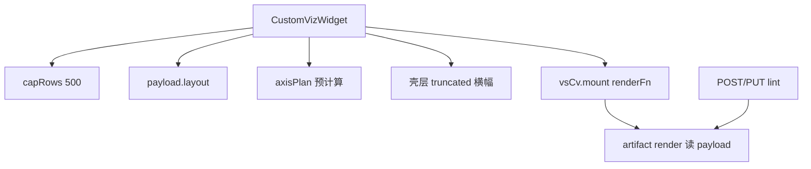
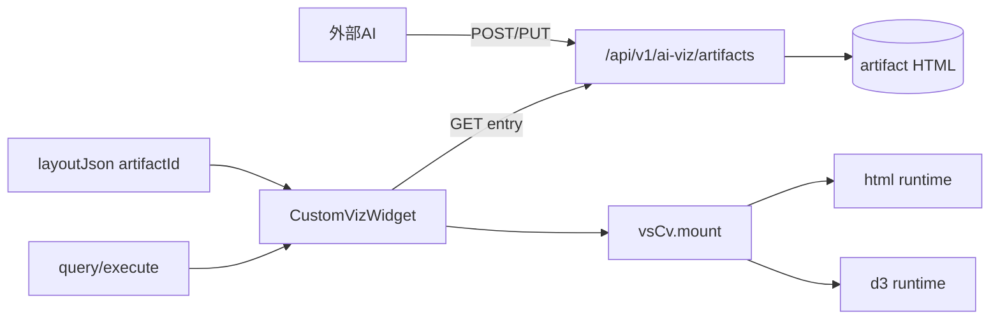

# customViz 平台底座 SLA 开工规格

> 蓝图：[`docs/material/blueprints/2026-08-19-customviz-platform-sla-blueprint.md`](../material/blueprints/2026-08-19-customviz-platform-sla-blueprint.md)（H1–H4、S1–S3 已确认）  
> PRD：F17-AIVIZ · **AIVIZ-017 已实现**  
> 特征真源：[`docs/feature-truth/2026-08-19-customviz-engine-separation-truth.md`](../feature-truth/2026-08-19-customviz-engine-separation-truth.md)

## 问题陈述

VitalSpan L3 customViz 已采用「唯一 Base + API 存库 + 异步加载 + PUT 更新」架构，但平台给 bundle 的**底座纪律**不完整：resize/抽稀/采样提示依赖 artifact 手写 `onLayout`/`onPayload`，老制品与 AI 交付物易踩坑（轴标签重叠、拖大组件图表不跟随、超 500 行无壳层提示）。这与用户预期「AI 做配置与视觉，底座默认保证 chart 级基础体验」不符。

**最贵失败**：用户认为产品缺陷，而非单个 AI 制品质量问题。

## 方案

维持 F17 架构边界（**不**走 `renderD3Chart`、**不**动态注册 chartType），在 **html / d3 双轨**下补齐平台 SLA：

| runtime | AI 自由度 | 平台约束 |
|---------|-----------|----------|
| **html** | DOM/CSS/SVG 视觉自由 | 配置严格：fieldSlots、styleSchema、Payload 状态机、安全红线、**必须 mount** |
| **d3** | 绘制逻辑可自写或调参考 API | **必须** mount + layout + axisPlan/helpers；参考 draw API **Phase 2 可选** |

**Phase 1（本规格主交付）**：`vsCv.mount` + payload `axisPlan` + 壳层 truncated 横幅 + customViz 查看数据 + 入库 lint + `PLATFORM-SLA` 规范分轨。

**Phase 2（范围外于 Phase 1 编码，规格预留）**：`vsCv.draw.*` 参考 API、HTML-RUNTIME 对称文档。

**Phase 3（范围外）**：`manifest.renderAs` chart 代理，需单独立项改 PRD。



## 用户故事

1. 作为**数据分析师**，我想把看板上的 customViz 组件拖大后图表随之铺满，以便大屏展示时不留空白。  
2. 作为**数据分析师**，我想在类目很多时轴标签仍可读，以便不被重叠文字误导。  
3. 作为**外部 AI 集成方**，我想只写 `vsCv.mount(render)` 而不手写 onLayout/onPayload，以便交付物稳定符合平台契约。  
4. 作为**数据分析师**，我想对 customViz 右键「查看数据」，以便与内置 chart 行为一致。  
5. 作为**平台管理员**，我想入库时拒绝明显不合规的 d3 制品（无 mount、裸 320 fallback），以便减少线上踩坑。

## 可观察验收

| # | 验收 | 失败路径 |
|---|------|----------|
| V1 | 官方 d3 示例：40+ 类目轴可读；拖大组件后 SVG/canvas 随 `layout` 铺满；**artifact 内无手写 onLayout** | 仍固定 320 或全量 tick → 失败 |
| V2 | 查询结果 >500 行：payload `truncated=true` 且 **CustomVizWidget 壳层**出现与内置 chart 同等语义提示（非 bundle 自写） | 仅 payload flag 无 UI → 失败 |
| V3 | `vsCv.mount(fn)`：payload 或 layout 变化时 Base **自动调用** `fn(getPayload())`；vitest 覆盖 mount 注册与触发 | 仍须 bundle 双监听 → 失败 |
| V4 | payload 含 `axisPlan.categoryTickIndices`（类目数超阈值时抽稀）；d3 官方示例消费该字段 | 无 axisPlan 或 bundle 忽略 → 失败 |
| V5 | customViz 右键菜单含「查看数据」，打开 `WidgetViewDataDialog` 展示 execute 结果 | 仅 chart 有入口 → 失败 |
| V6 | `POST/PUT /ai-viz/artifacts`：d3 runtime 源码无 `vsCv.mount` → **422** 人话错误码；html 禁 `id="root"`/`id="app"` 等既有规则保留 | 土制品仍可入库 → 失败 |
| V7 | `docs/api/vs-ai-spec/guides/PLATFORM-SLA.md` 写清 html/d3 强制 vs 可选；HANDOFF/PROTOCOL 交叉引用 | 规范仍写 bundle 全责 → 失败 |
| V8 | unbound/empty/error：mount 模式下 render 收到正确 `bindingStatus`；官方 html 样例展示引导态 | 静默空白 → 失败 |

## 实现决策

| # | 决策 | 依据 |
|---|------|------|
| D1 | **S1**：新增 `vsCv.mount(renderFn)`，由 Base 在 payload/layout 变化时统一调度；保留 `onPayload`/`onLayout` 兼容但官方示例/ lint 以 mount 为准 | 蓝图 S1 已确认 |
| D2 | **S2 anchored**：customViz **不**调用 `renderD3Chart`；标准柱/线走 L1/L2 | F17 Out |
| D3 | **S3**：html=配置严格 + mount；d3=mount + helpers + axisPlan 必须 | 用户定调 |
| D4 | `axisPlan` 结构：`{ categoryTickIndices?: number[]; categoryCount?: number }`，由 Base 据 `layout.width` + 行数计算 | 扩展 `customVizLayoutHelpers.ts` |
| D5 | truncated 横幅 UI 放在 `CustomVizWidget` 壳层（对标 `D3CanvasView` 语义），不要求 bundle 绘制 | 壳层 SLA |
| D6 | 查看数据：扩展 `WidgetContextMenu` 条件为 `chart \|\| customViz`（有 execute 配置时） | parity |
| D7 | 入库 lint 静态扫描 entry HTML：`runtime=d3` 须含 `vsCv.mount`；warn 级可二期升 error | `validate_bundle_files` |
| D8 | 老 artifact：不自动迁移；PUT 升级 + lint 仅对新提交生效 | H2 |
| D9 | rowCap 保持 500（与 `ADVANCED_CHART_ROW_CAP` 一致） | 已有 AIVIZ-016 |
| D10 | **S4 Phase 2**：`vsCv.draw.cartesianBars` 等为可选加速器，本 Phase 不实现 | 降 scope |

## 测试决策 / seam

| 层 | 测什么 | 不测什么 |
|----|--------|----------|
| `customVizRuntime.ts` | mount 注册、payload/layout 变化触发 render、卸载清理 | d3 具体 SVG 像素 |
| `customVizPayload.ts` | axisPlan 字段构建、truncated 组合 | 后端 SQL |
| `CustomVizWidget.tsx` | truncated 横幅渲染 smoke | 全 E2E 浏览器 |
| `backend/app/ai_viz/models.py` | lint 规则：无 mount、禁 id | manifest 全字段 fuzz |
| 官方示例 bundle | patch 脚本后 entry 含 mount + axisPlan 消费 | 第三方 AI 随机制品 |

现有测试基线：`customVizHost.test.ts`、`customVizLayoutHelpers.test.ts`、`customVizPayload.test.ts` 须扩展。

## 范围外

- iframe 沙箱、在线地图、ECharts/AntV（F17/GEO Out）
- `manifest.renderAs` 走内置 chart 引擎（Phase 3）
- customViz 右键快捷样式（toggleLegend 等）与 chart 完全对齐
- 导出/放大 parity
- `vsCv.draw.*` 参考 API（Phase 2）
- 修改 F17 PRD 正文（除非点名 create-evolution-prd）；本规格仅建议 AIVIZ-017 条目

## 补充说明

### 架构图（to-be）



### L1/L2 决策树（写入 RENDERERS.md）

- 标准柱/线/表/地图 → **chartConfig（L1/L2）**
- KPI/滚动/纯 DOM → **html customViz + mount**
- 比例尺/坐标轴/SVG 数据图 → **d3 customViz + mount + axisPlan**

### 代码锚点（Phase 1）

| 任务 | 文件 |
|------|------|
| mount API | [`fe/src/components/dashboard/custom-viz/customVizRuntime.ts`](../fe/src/components/dashboard/custom-viz/customVizRuntime.ts) |
| axisPlan | [`fe/src/components/dashboard/custom-viz/customVizPayload.ts`](../fe/src/components/dashboard/custom-viz/customVizPayload.ts) · [`customVizLayoutHelpers.ts`](../fe/src/components/dashboard/custom-viz/customVizLayoutHelpers.ts) |
| 壳层 + inject | [`fe/src/components/dashboard/CustomVizWidget.tsx`](../fe/src/components/dashboard/CustomVizWidget.tsx) |
| 查看数据 | [`fe/src/components/dashboard/WidgetContextMenu.tsx`](../fe/src/components/dashboard/WidgetContextMenu.tsx) |
| 入库 lint | [`backend/app/ai_viz/models.py`](../backend/app/ai_viz/models.py) |
| 规范 | [`docs/api/vs-ai-spec/guides/PLATFORM-SLA.md`](../api/vs-ai-spec/guides/PLATFORM-SLA.md)（新建） |
| 示例 | [`docs/api/vs-ai-spec/examples/`](../api/vs-ai-spec/examples/) · [`scripts/patch-custom-viz-example-bundles.mjs`](../scripts/patch-custom-viz-example-bundles.mjs) |

### Payload v1 扩展（规格冻结）

```typescript
type CustomVizAxisPlan = {
  categoryCount?: number;
  categoryTickIndices?: number[];
};

type CustomVizRuntimePayload = {
  // ...existing...
  axisPlan?: CustomVizAxisPlan;
};
```

### vsCv.mount 契约（规格冻结）

```typescript
// 追加到 VsCvApi
mount: (renderFn: (payload: CustomVizRuntimePayload) => void) => () => void;
```

- Base 在首次 mount 与每次 payload/layout 更新后调用 `renderFn(getPayload())`。
- 返回 disposer；重复 mount 替换上一 renderFn。
- bundle 内 **禁止** 裸 `clientWidth || 320` 作为唯一尺寸来源（lint warn）。

### 偏航表摘要

| PRD | 现状 | 建议 |
|-----|------|------|
| AIVIZ-016 | onLayout/helpers 半步 | 升维为 AIVIZ-017 mount+壳层+lint |
| PROTOCOL | bundle 责任为主 | 增 PLATFORM-SLA 分轨 |
| HANDOFF | 未写 layout/mount | 同步双轨表 |

### 交接

- **go-fast Phase 1**：按上表代码锚点顺序实现；第一刀 `vsCv.mount`。
- **可选**：`create-evolution-prd` 补 AIVIZ-017。
- **不测**：product-reviewer 八维（实现后可选接力）。
