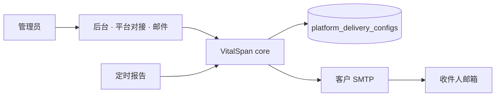

# 开工规格 · 平台对接 · 邮件 SMTP

> **状态（2026-08-13）**：已实现（邮件通道）。IM 仍见 [im-app-config-self-bind.md](./im-app-config-self-bind.md) 延期。

## 问题陈述

管理员要把定时报告发到同事邮箱，却必须 SSH 改服务器 `RPT_SMTP_*`。客户部署后往往用企业邮箱或专用发信账号，与开发者本机 QQ 授权码无关。最贵失败：界面显示能发、实际 SMTP 未配或配错；清空配置后环境变量仍偷偷发信；授权码明文进仓库或 API 回显。

## 方案

在后台 **系统管理 → 平台对接 → 邮件** 保存 SMTP（密码 SM4 加密入库，探测通过才算已配置）。定时投递与 `delivery-health` **只读**该配置；从未在管理面保存过才允许 `RPT_SMTP_*` 环境变量回落（开发/MailHog）。**保存或清空后以库为准**；管理员清空后，即使 env 仍有旧值也不得发信。



与 IM 规格差异：**无**用户 OAuth 绑定；收件人仍读用户资料 `email` 或定时里直接填邮箱。

## 用户故事

1. 作为管理员，我想在后台填写 SMTP 主机、端口、发件人与授权码并保存，以便部署后不用改服务器环境变量。
2. 作为管理员，我想保存前/后看到探测是否通过，以及配置来源是「库内」还是「环境变量回落」，以便知道现在能不能发信。
3. 作为调度人，我想定时预检指向「请管理员配置平台对接」，而不是 `.env` 路径，以便人话可执行。
4. 作为运维，我想清空邮件通道后 env 不能再发信，以便关停行为可解释。
5. 作为安全审计，我想 save/clear 有记录且 API 不回明文密码，以便合规。

## 可观察验收

1. 当管理员保存邮件 SMTP 且探测（连接 + 可选 login）成功，则 `GET /api/v1/platform/delivery/email` 显示 `configured: true`、`source: db`；`delivery-health` 邮件项为 reachable。
2. 当从未保存、仅 env 有 `RPT_SMTP_*`，则 `source: env`，行为与现网一致（开发/MailHog 不破）。
3. 当管理员清空邮件配置后，即使 env 仍有 `RPT_SMTP_*`，则 `configured: false`，调度执行失败「邮件应用未配置」，**不得**用 env 发信。
4. 当无 `system:platform_connect.manage` 的账号 PUT/DELETE，则 403；审计可查 `platform_connect.email.save` / `clear`（无明文 Secret）。
5. 当保存后探测失败（超时、认证失败），则不得标 `configured: true`，人话说明原因。
6. 定时创建/执行仍强制 `deliveryChannels: ["email"]`（与 email-only 交付一致）。

## 实现决策

### 难回退选型

| ID | 决策 | 说明 |
|----|------|------|
| E1 | 凭证库内 SM4 为 SoR；清空忽略 env | 对齐 IM 规格 S1 |
| E2 | 配置归 **core/platform_config**；reports 只读 resolve | 禁止报表域存 Secret |
| E3 | 探测 = 与发信相同 `_connect_smtp`（587 STARTTLS / 465 SSL） | 复用 `delivery_adapter` |
| E4 | 权限 `system:platform_connect.manage` | IM 恢复时同权限按 channel 审计 |
| E5 | UI `/admin/system/platform-connect`（首版仅邮件 Tab） | IM 延期后加企微/钉钉/飞书 Tab |

### 数据模型（草案）

表 `platform_delivery_configs`：

| 列 | 说明 |
|----|------|
| `channel` | PK，`email` |
| `host` | SMTP 主机 |
| `port` | 端口 |
| `from_addr` | 发件人 |
| `username` | 登录名（可空） |
| `password_encrypted` | SM4，via `encrypt_credential` |
| `updated_at` / `updated_by` | 审计 |

### API（草案）

| 方法 | 路径 | 说明 |
|------|------|------|
| GET | `/api/v1/platform/delivery/email` | 配置摘要：`configured`、`source`、`host`、`port`、`from`、`hasPassword`；无明文 |
| PUT | `/api/v1/platform/delivery/email` | 保存 + 探测；body 含 password（仅写入） |
| POST | `/api/v1/platform/delivery/email/probe` | 可选：不落库仅探测 |
| DELETE | `/api/v1/platform/delivery/email` | 清空；之后忽略 env |

登记：`docs/api/README.md`。

### 解析顺序

```
resolve_email_delivery_settings(session):
  if row exists and not cleared → DB（解密 password）
  elif never_saved and env RPT_SMTP_HOST+FROM → env 回落
  else → unconfigured
```

`delivery_adapter.probe_smtp_health` / `_send_smtp` 改为接受 `ResolvedSmtpSettings`，不再直接 `get_settings()` 读密码。

### 页面

- 路径：`/admin/system/platform-connect`（侧栏「平台对接」）
- 表单：主机、端口、发件人、用户名、密码（placeholder「留空则不修改」）、保存、清空、探测状态
- 系统管理首页向导增加可选步骤：「配置邮件发信」
- 定时预检 `SchedulePrecheckPanel` fixHint → 链到该页，不再主推 `.env`

### 部署与环境变量

| 场景 | 做法 |
|------|------|
| 开发者本机 | 可继续 MailHog + env，或管理面保存一次 |
| 客户生产 | **管理员在后台配客户企业邮箱**；运维仅保留 `CREDENTIAL_SM4_KEY` 等根密钥在 env |
| 你的个人 QQ | **仅本机联调**；不得作为客户生产默认 |

`RPT_SMTP_*` 保留在 `Settings` 作 bootstrap/回落，**不删**；`docs/arch.md` ADR-19 实现后回写「SMTP SoR 可 DB」。

## 测试决策

- 单测：save/clear/403、清空后 env 回落被忽略、探测失败不标 configured
- 集成：fake SMTP 边界；禁止 mock 标 delivered
- 可参考：`tests/test_im_person_delivery.py` 风格；新增 `tests/test_platform_email_config.py`

## 范围外

- 多发件人路由、邮件模板编辑器
- POP3/IMAP 收信
- 用个人 QQ 写死在代码或默认种子

## 与延期 IM 规格的关系

- 共用页面壳 `/admin/system/platform-connect`、权限 `system:platform_connect.manage`、core store 按 `channel` 扩展
- IM 恢复实现时加 channel，不重复造 SMTP 轮子
- [im-app-config-self-bind.md](./im-app-config-self-bind.md) 仍延期；本规格**不阻塞** email-only 定时 UI

## 文档同步（实现时）

| 变更 | 文档 |
|------|------|
| 新 API | `docs/api/README.md` |
| core 边界 | `docs/services/core.md` |
| ADR | `docs/arch.md` § ADR-19 |
| 验收 | `docs/automate/prd/F08-RPT.md` RPT-005 |
