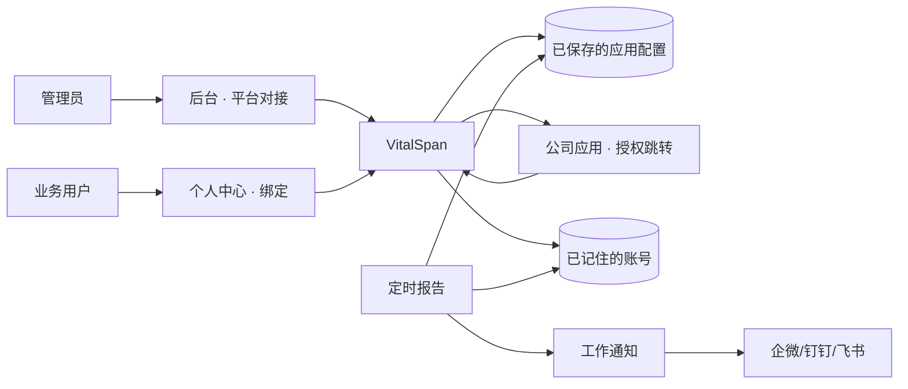

# 开工规格 · IM 后台配置 + 自助绑定

> **状态（2026-09-01）**：邮件 + 飞书按人投递与自助绑定已实现。**钉钉按群发**（平台对接粘贴自定义机器人 webhook，`deliveryMode=group_webhook`，无需个人绑定）。**企业微信已下线**。契约见 [docs/integrations/im-platform-connect.md](../integrations/im-platform-connect.md)。  
> **邮件 SMTP**：不得长期依赖 `.env`；见 [email-smtp-platform-config.md](./email-smtp-platform-config.md)（与本文共用「平台对接」页与 `system:platform_connect.manage`）。

## 问题陈述

管理员要把定时报告发到同事的企微/钉钉/飞书，却必须改服务器环境变量，同事还要手抄对方账号。抄错号或应用未真正连通时，界面仍可能像能发。最贵失败：显示已绑定但账号错误、未配置却能点绑定、没发出去却当成功（含发到群里假装成功）。

## 方案

在后台「平台对接」保存公司应用（加密入库，探测通过才算已配置）。业务用户在个人中心点绑定，跳到公司应用授权后自动记住账号。定时仍走工作通知；没绑定或应用已清空则失败点名，不回落群。登录继续用 VitalSpan JWT，不用 IM 登录本系统。

浏览器授权与探测契约见 [docs/integrations/im-platform-connect.md](../integrations/im-platform-connect.md)（选定自研 httpx 调官方 REST）。无厂商凭据前不得宣称已对接。

## 用户故事

1. 作为管理员，我想在后台填应用凭证和回调域名并保存，以便不用改服务器环境变量就能让同事去绑定。
2. 作为管理员，我想看到探测是否通过以及凭证来自库内还是环境变量回落，以便知道现在能不能发信。
3. 作为业务用户，我想在个人中心绑定企业微信/钉钉/飞书，以便定时报告发到我自己的号，而不用把 userid 交给管理员抄。
4. 作为业务用户，我想看到已绑定的脱敏账号并能解绑，以便确认绑的是自己、并能撤销。
5. 作为调度人，我想勾选通道后只发给已绑定且应用已配置的人，以便失败时执行记录说清是谁没绑或应用没配。
6. 作为运维，我想清空通道后环境变量不能再把信发出去，以便关掉应用后行为可解释。

## 可观察验收

真实依赖：厂商开放平台。禁止 mock 标已配置或已送达。三通道完成定义相同；**无该通道凭据真打不得勾选该通道已完成**。钉钉 `asyncsend_v2` 任务受理 **不得** 标已送达/已读。

1. 在后台平台对接，当管理员保存某通道凭证且该通道探测（gettoken / tenant_access_token）成功，则该通道显示已配置，个人中心对应绑定可点（真应用）。
2. 当某通道未配置或探测失败，则不得标已配置，个人中心该通道绑定不可点，并说明请管理员先做平台对接。
3. 当已登录用户完成该通道浏览器授权回调，则资料显示已绑定且有脱敏账号，绑定表有记录。
4. 当调度勾选该通道发给该用户，执行记录为已送达 **当且仅当** 厂商发信回执成功（企微无全员 invaliduser；钉钉不得把任务受理当已送达）。入队、mock、群 webhook 均不得当成功。
5. 当收件人未绑定该通道，则该通道失败并点名，不出现群 webhook 成功。
6. 当管理员清空某通道后执行调度，即使用户已绑定且环境变量仍有旧值，则失败「应用未配置」；个人中心仍显示已绑定，并可见「通道暂不可投递」。
7. 当无 `system:im_connect.manage` 的账号保存对接，则 403；审计可查 save/clear（无明文 Secret）。
8. 当探测/发信超时、非 0 码或 429 经有限退避仍失败，则该通道失败人话，不得返回成功。
9. 当用户解绑某通道，则该通道回到未绑定，定时不再发往旧账号。

## 实现决策

### 难回退选型

| ID | 决策 | 状态 |
|----|------|------|
| S1 | 凭证库内 SM4 为 SoR；清空忽略 env | 蓝图已确认 |
| S2 | 浏览器授权绑定，不替代 JWT 登录 | 蓝图已确认 |
| S3 | 自研 httpx 调官方 REST，不引入三家 SDK | researched：`docs/integrations/im-platform-connect.md` |

ADR-19 扩写为需求，**未**改 `docs/arch.md`（待点名回写）。

- 凭证 SoR：管理面 DB + SM4（ADR-06）。从未保存才允许 env 回落；保存或清空后以库为准，清空=禁用且**忽略 env**。
- 配置属 **core 运行时配置端口**；绑定与授权回调属 **auth outbound**；发信属 **reports** 只读配置 + 现有工作通知。禁止报表域存 Secret，禁止前端直连开放平台。
- 出站：继续 **httpx** 调官方 HTTPS（简报方案 A），超时 8s。不引入三家官方 SDK。
- 探测 = 与发信相同的 gettoken/tenant_access_token；字段非空不得标已配置。
- 浏览器绑定（非客户端内免登）：
  - 企微：[Web 登录 CorpApp](https://developer.work.weixin.qq.com/document/path/98174) → `auth/getuserinfo` → UserId
  - 钉钉：`login.dingtalk.com/oauth2/auth` → 用户信息 userid
  - 飞书：`accounts.feishu.cn` 授权 → user_info 的 **user_id**（与发信 `receive_id_type=user_id` 对齐）
- 回调：`state` 绑定当前 VitalSpan 用户防 CSRF；授权码一次性，不作发信令牌。
- 已绑定 ≠ 可投递：应用清空后资料仍显示已绑定，但提示通道暂不可投递。
- 管理员手改他人账号须显示来源，禁止静默覆盖；权限仍 `system:user.manage`。
- 写平台对接：`system:im_connect.manage`，禁止挂到 `system:user.manage`。
- 企微发信：errcode=0 仍检查 `invaliduser`；全员无效按失败。钉钉 asyncsend 成功=任务受理，验收口径与简报一致，不得写成已读。
- 页面：`/admin/system` 向导加步骤；新页 `/admin/system/im-connect`（form-composition）；`/admin/account/profile` 三态绑定；定时预检沿用现弹窗。壳层引用 `docs/ui/layout.md`。
- 开工前凭据：B 级。无 `WECOM_*` / `DINGTALK_*` / `FEISHU_*` 时实现可合入，但不得把探测/绑定验收标已完成。
- 确认后建议扩 ADR-19（凭证 SoR + 授权绑定）；本规格不直接改 arch/PRD。

## 测试决策

- 只测外部行为：保存/清空/探测结果、绑定回调写入、解绑、调度失败点名、403、审计无明文。
- **seam**：厂商 HTTP 在适配器边界 fake（超时、非 0 码、invaliduser、81013）；禁止用 fake 标产品「已送达」。授权回调测 code→userid 映射与冲突/过期。
- 不测：httpx 内部、SM4 算法、厂商页面 DOM。
- 真打：`contracts/im-platform-connect.smoke.py` 打 gettoken；有凭据才作为集成门。
- 可参考：`tests/test_im_person_delivery.py`（未绑不回落群）；须新增探测与绑定失败语义用例（简报 §5.1 现为未落）。

## 范围外

- 用企微/钉钉/飞书扫码登录 VitalSpan（替代 JWT）
- 通讯录同步、按邮箱自动匹配
- IM 内嵌 PDF（文字 + 下载链接；邮件继续带附件）→ **2026-09-03 起飞书按人投递支持 PDF/Excel 文件消息；邮件仍走 SMTP 附件**
- 群机器人当按人投递
- 多企业应用路由
- 把 stub/mock 当生产完成定义

## 补充说明

- 蓝图（已确认）：[docs/material/blueprints/2026-08-13-im-app-config-self-bind.md](../material/blueprints/2026-08-13-im-app-config-self-bind.md)
- 证据袋：`docs/material/blueprints/2026-08-13-im-app-config-self-bind-evidence.md`
- 集成简报：`docs/integrations/im-platform-connect.md`（可行性 B，凭据 need）
- 偏航：RPT-005 仍写管理员填号；确认后点名再改 PRD/auth.md/ADR-19
- 核心流程 F1–F3 图见蓝图 §4；本规格不重复贴三张以免漂移，以实现决策与验收为准

### F1 探测失败出口（摘要）

保存 → 探测失败 → 不得标已配置 → 绑定不可点。

### F2 绑定失败出口（摘要）

未配置 / code 无效 / 账号冲突 → 人话失败可重试，不写绑定表。
