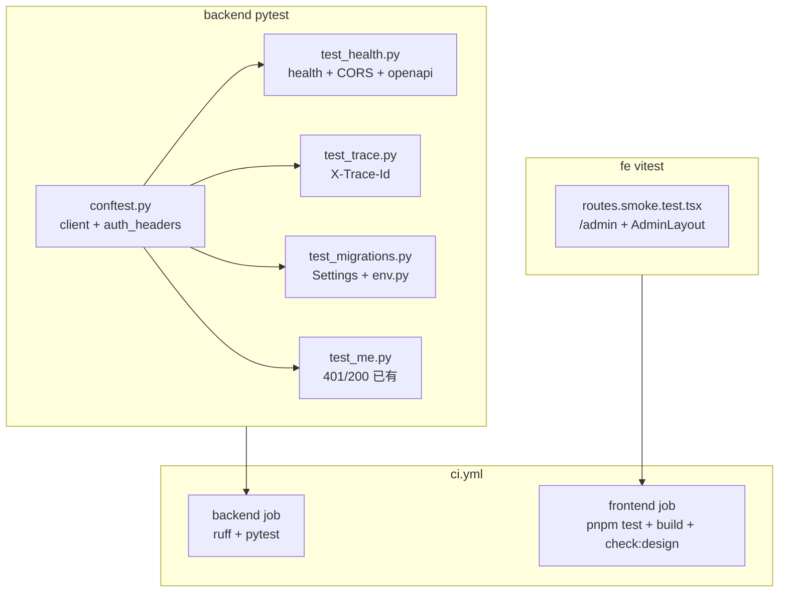

# M1 BOOT 测试覆盖补强设计 — BOOT-005 / BOOT-004 / BOOT-002 / BOOT-001 / BOOT-006

```yaml
date: 2026-07-03
milestone: M1
round_target: docs/superpowers/evolution/2026-07-03-round-target.md
base_branch: dev-auto
prd_ids: [BOOT-005, BOOT-004, BOOT-002, BOOT-001, BOOT-006]
ui_design_skill: .agents/skills/b-design-system-tailadmin-radix/SKILL.md
status: design
```

## 1. 批量主题与子项映射

| # | 子项 | PRD ID | 执行顺序 | 主攻薄弱维 | 用户感知 |
|---|------|--------|:--------:|------------|----------|
| 1 | Settings 与 Alembic 配置测试 | BOOT-005 | 1 | 测试覆盖 8% | CI 在合并前暴露元库连接串与 Settings 链错配 |
| 2 | TraceId 中间件测试 | BOOT-004 | 2 | 测试覆盖 12% | 健康检查 trace 可追踪性有自动化回归 |
| 3 | 前端壳层最小 smoke | BOOT-002 | 3 | 测试覆盖 22%；加权 64.8 | CI 除 build/check:design 外，路由与 AdminLayout 挂载有回归 |
| 4 | 健康检查与 CORS 预检测试 | BOOT-001 | 4 | 测试覆盖 32% | 前后端联调 CORS 与健康检查在 CI 可重复验证 |
| 5 | conftest 加固与 CI 整合 | BOOT-006 | 5 | 测试覆盖 42%；可靠性 | PR 合并前 backend + frontend 测试门禁更完整 |

**依赖链**：子项 1–4 各自独立新增/扩展测试文件；子项 5 收尾整合（`conftest` fixture 供 2/4 复用；CI 拾取 1–4 全部用例）。

**上轮已交付（本轮不重复）**：BOOT-003 `tests/test_me.py`（3 pytest 绿）；M1 plan §勾选清单 6/6；PR #6 文档回写。

## 2. 现状与约束

| 项 | 现状 |
|----|------|
| `tests/conftest.py` | 已有 `client` fixture；预设 `DATABASE_URL`/`SECRET_KEY`/`CREDENTIAL_FERNET_KEY`；无 `auth_headers` |
| `tests/test_health.py` | 仅 `GET /health` → 200 + body |
| `tests/test_me.py` | 401/200 smoke（BOOT-003，本轮不修改行为） |
| `backend/app/core/` | `Settings`、`TraceIdMiddleware`、`JsonFormatter` 已实现；`X-Trace-Id` 响应头已透出 |
| `backend/migrations/env.py` | 模块级 `get_settings()` + `config.set_main_option("sqlalchemy.url", settings.database_url)` |
| `fe/` | 已有壳层与 `check:design`；**无** vitest 与测试脚本 |
| `.github/workflows/ci.yml` | backend：`ruff` + `pytest`；frontend：`build` + `check:design`；**无**前端测试步骤 |
| P5 评分 | BOOT-001~006 加权 64.8–78.6，主薄弱维均为测试覆盖 |

**范围框定模块**（3）：`tests/`、`backend/app/core/`（只读参照，**不修改生产代码**）、`fe/`（BOOT-002 最小 smoke）。

**真理源优先级**：`round-target` > `plan.md` §M1 > `prd/F01-BOOT.md` > `backend-fastapi.mdc` / `fe-ui.mdc`。

## 3. 范围框定文件清单（≤20）

| 路径 | 子项 | 动作 |
|------|:----:|------|
| `tests/test_migrations.py` | 1 | 新建：Settings `database_url` + env.py URL 绑定 |
| `tests/test_trace.py` | 2 | 新建：TraceId 响应头与透传 |
| `tests/test_health.py` | 4 | 扩展：CORS 预检 + OpenAPI 公开路径 |
| `tests/conftest.py` | 5 | 扩展：`auth_headers` fixture；`get_settings.cache_clear` 辅助（如需） |
| `fe/package.json` | 3,5 | 修改：增 vitest 依赖与 `test`/`test:smoke` script |
| `fe/vite.config.ts` | 3 | 修改：vitest `test` 块（`environment: jsdom`） |
| `fe/src/routes.smoke.test.tsx` | 3 | 新建：`AppRoutes` + `/admin` smoke render |
| `.github/workflows/ci.yml` | 5 | 修改：frontend job 增 `pnpm test`（或 `test:smoke`） |

**只读参照（不修改）**：

| 路径 | 用途 |
|------|------|
| `backend/app/core/config.py` | Settings 字段与 `cors_origins` 断言来源 |
| `backend/app/core/middleware.py` | TraceId 生成/透传逻辑 |
| `backend/app/core/logging.py` | `traceId` JSON 字段名 |
| `backend/migrations/env.py` | URL 绑定断言目标 |
| `backend/app/main.py` | CORS 与公开路径注册 |
| `fe/src/routes.tsx` | 路由结构断言 |
| `fe/src/layouts/AdminLayout.tsx` | smoke render 挂载目标 |

**文件计数**：新建 3 + 修改 5 = **8 文件**（≤20）。

## 4. 非目标（明确不做）

- 修改 `backend/app/core/*`、`backend/migrations/env.py` 生产逻辑（本轮仅增测试）
- CI 内启动 docker postgres 或执行 `alembic upgrade`
- Playwright / E2E / 视觉回归截图自动化
- TanStack Query、`@/lib/api.ts`、业务 API 客户端
- M1B（DATA-*）、META-001、DESIGN-001、CONN-021
- `plan.md` §文档回写 4 行勾选（留 P5/plan-fix）
- `docs/automate/goal.md` 修订
- BOOT-003 行为变更（`test_me.py` 保持绿即可；可选改用 `auth_headers` fixture）

## 5. PRD 8 维薄弱项对齐

| PRD ID | 薄弱维（选题时） | 本轮设计对策 |
|--------|------------------|--------------|
| BOOT-005 | 测试覆盖 **8%** | `test_migrations.py` 覆盖 Settings 链与 env.py URL 绑定；不依赖真实 DB |
| BOOT-004 | 测试覆盖 **12%** | `test_trace.py` 断言 `X-Trace-Id` 生成与透传；可选 `caplog` 断言 JSON `traceId` |
| BOOT-002 | 测试覆盖 **22%**；加权 **64.8** | vitest smoke：`/admin` 路由 + `AdminLayout` 渲染；CI 拾取 |
| BOOT-001 | 测试覆盖 **32%** | 扩展 `test_health.py`：CORS 预检 + `/openapi.json` 200 |
| BOOT-006 | 测试覆盖 **42%**；可靠性 68% | `conftest` 共享 fixture；CI 双 job 执行全部新增用例 |

**P5 重评预期**：五项测试覆盖维由 8–42% 向 ≥40% 靠拢；加权总分向 90 迈进（具体分值由 P5 评分器计算，设计不预设数值）。

## 6. 方案比选（摘要）

### 6.1 BOOT-005：Alembic 配置测试

| 方案 | 说明 | 结论 |
|------|------|------|
| A 单元测试：`get_settings()` + monkeypatch 后 `importlib.reload(migrations.env)` 断言 `set_main_option` | 无 docker；覆盖 URL 绑定链 | **采用** |
| B CI job 启动 postgres 执行 `alembic upgrade` | 与 plan §BOOT-006「不启动 docker postgres」冲突 | 否决 |
| C 仅断言 `env.py` 源码含 `get_settings` 字符串 | 过弱，无法捕获运行时错配 | 否决 |

### 6.2 BOOT-004：TraceId 断言策略

| 方案 | 说明 | 结论 |
|------|------|------|
| A 响应头 `X-Trace-Id` 生成 + 透传已有头 | 直接、稳定、与中间件契约一致 | **采用（主）** |
| B `caplog` 捕获 JSON 日志含 `traceId` | 补充覆盖 logging 格式化 | **采用（辅，1 用例）** |
| C 解析 stdout 全量日志流 | 脆弱、与 pytest caplog 重复 | 否决 |

### 6.3 BOOT-002：前端 smoke

| 方案 | 说明 | 结论 |
|------|------|------|
| A vitest + jsdom + `@testing-library/react` smoke render `AppRoutes` at `/admin` | 验证路由挂载与壳层 DOM；与 plan「vitest 或脚本级」一致 | **采用** |
| B 纯脚本解析 `routes.tsx` AST 查 `/admin` 字符串 | 不验证 render；易漏运行时错误 | 否决 |
| C Playwright 浏览器 E2E | 超范围、CI 成本高 | 否决 |

### 6.4 BOOT-001：CORS 测试

| 方案 | 说明 | 结论 |
|------|------|------|
| A `OPTIONS /health` + `Origin` 头断言 `Access-Control-Allow-Origin` | 对齐 `Settings.cors_origins` 默认 `http://localhost:5173` | **采用** |
| B 仅测 `GET` 响应 CORS 头 | 不覆盖预检场景 | 否决（可作补充） |

## 7. 子项详细设计

### 7.1 BOOT-005 — `tests/test_migrations.py`

**目标**：在无 postgres 条件下验证 Settings → Alembic URL 绑定链。

**用例清单**：

| 用例 ID | 描述 | 断言 |
|---------|------|------|
| `T-MIG-01` | Settings 从环境变量加载 `database_url` | `get_settings().database_url == os.environ["DATABASE_URL"]`（与 `conftest` 预设一致） |
| `T-MIG-02` | `migrations/env.py` 将 `settings.database_url` 写入 alembic config | monkeypatch `get_settings` 返回已知 URL；mock `alembic.context.config`；`importlib.reload(migrations.env)` 后断言 `set_main_option("sqlalchemy.url", <known>)` 被调用 |

**实现要点**：

- 每个修改 `DATABASE_URL` 的用例前后调用 `get_settings.cache_clear()`
- `T-MIG-02` 须 mock `alembic.context` 的 `config` 对象（`Config` 实例或 `MagicMock`），避免触发真实 migration 执行
- **不** import 并执行 `run_migrations_online/offline`
- **不** 在 CI 增加 `alembic upgrade`

**验收标准（可测试）**：

- [ ] `cd backend && pytest tests/test_migrations.py -v` 全绿
- [ ] 用例不依赖网络或 docker

### 7.2 BOOT-004 — `tests/test_trace.py`

**目标**：验证 `TraceIdMiddleware` 契约。

**用例清单**：

| 用例 ID | 描述 | 断言 |
|---------|------|------|
| `T-TRC-01` | `GET /health` 响应含 `X-Trace-Id` | `response.headers["X-Trace-Id"]` 非空；格式为 32 位 hex（`uuid4().hex`） |
| `T-TRC-02` | 透传已有 `X-Trace-Id` 请求头 | 请求头 `X-Trace-Id: abc123` → 响应头同为 `abc123` |
| `T-TRC-03` | 日志 JSON 含 `traceId`（可选辅用例） | `caplog` at INFO on `vitalspan.http`；`GET /health` 后日志 record 格式化为含 `"traceId"` 的 JSON |

**实现要点**：

- 复用 `conftest.client` fixture
- `T-TRC-03` 若 caplog 与 middleware 日志时序不稳定，可仅保留 `T-TRC-01/02`（两项已满足 round-target 验收）

**验收标准（可测试）**：

- [ ] `cd backend && pytest tests/test_trace.py -v` 全绿
- [ ] `T-TRC-01` + `T-TRC-02` 必须通过

### 7.3 BOOT-002 — 前端 vitest smoke

**目标**：最小自动化验证 `/admin` 路由与 `AdminLayout` 可挂载。

**新增依赖**（`fe/package.json` devDependencies）：

- `vitest`
- `@testing-library/react`
- `@testing-library/jest-dom`
- `jsdom`

**脚本**：

```json
"test": "vitest run",
"test:smoke": "vitest run src/routes.smoke.test.tsx"
```

**`fe/vite.config.ts` 增补**：

```ts
/// <reference types="vitest/config" />
export default defineConfig({
  // ...existing...
  test: {
    environment: "jsdom",
    setupFiles: [], // 可选：vitest.setup.ts 引入 @testing-library/jest-dom
    include: ["src/**/*.test.{ts,tsx}"],
  },
});
```

**`fe/src/routes.smoke.test.tsx` 用例**：

| 用例 ID | 描述 | 断言 |
|---------|------|------|
| `T-FE-01` | `/admin` 路由渲染 AdminLayout | `MemoryRouter initialEntries={["/admin"]}` + `render(<AppRoutes />)`；`screen.getByText("VitalSpan")` 存在 |
| `T-FE-02` | 根路径重定向至 `/admin`（可选） | `initialEntries={["/"]}` 后仍可见壳层标识 |

**实现要点**：

- 从 `routes.tsx` import `AppRoutes`（非 `App.tsx`），减少 Provider 包裹
- `AdminLayout` 依赖 `ThemeProvider`/`SidebarProvider` 已在组件内封装，测试无需额外 mock
- **不**新增或修改 UI 组件；**不**改动 `AdminLayout` 视觉
- `pnpm build` + `pnpm run check:design` 必须仍通过

**验收标准（可测试）**：

- [ ] `cd fe && pnpm test` 全绿
- [ ] `cd fe && pnpm build && pnpm run check:design` 全绿
- [ ] CI frontend job 执行测试步骤

### 7.4 BOOT-001 — 扩展 `tests/test_health.py`

**目标**：补齐 CORS 预检与 OpenAPI 公开路径覆盖。

**用例清单**（保留现有 `test_health_returns_ok`）：

| 用例 ID | 描述 | 断言 |
|---------|------|------|
| `T-HLT-01` | `GET /health` → 200（已有） | 保持 |
| `T-HLT-02` | `OPTIONS /health` CORS 预检 | `Origin: http://localhost:5173`（默认 `cors_origins`）+ `Access-Control-Request-Method: GET` → 响应含 `access-control-allow-origin: http://localhost:5173` |
| `T-HLT-03` | `GET /openapi.json` 公开可访问 | status 200；body 含 `"openapi"` 键 |
| `T-HLT-04` | `GET /docs` 公开可访问（二选一或兼有） | status 200 |

**实现要点**：

- 默认 `Settings.cors_origins_raw` 为 `http://localhost:5173`，与 `conftest` 环境一致，无需额外 monkeypatch
- 预检用例使用 `client.options(...)`

**验收标准（可测试）**：

- [ ] `cd backend && pytest tests/test_health.py -v` 全绿（含旧 + 新用例）

### 7.5 BOOT-006 — conftest 与 CI 整合

**`tests/conftest.py` 扩展**：

```python
@pytest.fixture
def auth_headers() -> dict[str, str]:
    return {"Authorization": "Bearer dev"}
```

- 可选：在 `test_me.py` 中将 inline headers 改为 `auth_headers` fixture（行为不变，DRY）
- 保持 `client` fixture 不变；所有测试继续通过 `TestClient(app)`

**`.github/workflows/ci.yml` 变更**：

| Job | 新增/修改步骤 |
|-----|---------------|
| backend | 保持 `ruff` + `pytest`（自动拾取 `test_migrations`/`test_trace`/扩展 `test_health`） |
| frontend | 在 `check:design` 之后（或之前）增：`pnpm test` |

**本地等价命令**（与 CI 一致）：

```bash
cd backend && ruff check . && pytest -v
cd fe && pnpm install --frozen-lockfile && pnpm test && pnpm build && pnpm run check:design
```

**验收标准（可测试）**：

- [ ] `cd backend && ruff check . && pytest -v` 全绿（全部 tests，含 `test_me.py`）
- [ ] `cd fe && pnpm test && pnpm build && pnpm run check:design` 全绿
- [ ] `.github/workflows/ci.yml` backend + frontend job 与本地等价

## 8. 测试架构示意



## 9. UI 设计交付（BOOT-002 测试触及 fe/）

> 本轮**不修改** UI 组件或页面视觉；仅增 vitest smoke。以下描述现有壳层契约，供测试断言选取稳定 DOM 锚点。

### 9.1 ui_design_skill

`.agents/skills/b-design-system-tailadmin-radix/SKILL.md`（已读取）

### 9.2 页面信息架构

| 路由 | 层级 | 主内容区 | 测试锚点 |
|------|------|----------|----------|
| `/` | 重定向 → `/admin` | — | 重定向后壳层可见 |
| `/admin` | AdminLayout 嵌套 index | `max-w-(--breakpoint-2xl)`，`p-4 md:p-6` | 侧栏 logo 文案「VitalSpan」 |
| `*` | 重定向 → `/admin` | — | 不单独测 |

**状态覆盖（测试范围）**：仅验证默认加载态壳层挂载；不测 empty/error/权限（M1 静态壳层无 API）。

### 9.3 视觉层级

- 主操作：无业务主操作（M1 占位）
- 壳层：侧栏 290px/90px（`AppSidebar`）+ 顶栏 sticky（`AppHeader`）+ 内容区 `Outlet`
- smoke 断言选用 logo 文本「VitalSpan」，避免依赖 Tailwind 计算宽度

### 9.4 组件映射

| 区域 | 复用组件 | 本轮动作 |
|------|----------|----------|
| 路由 | `fe/src/routes.tsx` → `AppRoutes` | 测试 import，不修改 |
| 壳层 | `fe/src/layouts/AdminLayout.tsx` | smoke render，不修改 |
| 侧栏/顶栏 | `components/layout/*` | 间接挂载，不修改 |
| UI 基元 | `components/ui/button` 等 | 不触及 |

**禁止**：为测试便利在页面内新增 data-testid 以外的视觉变更；禁止局部重画按钮/表格。

### 9.5 Token 与密度

- 沿用 `fe/src/index.css` 语义 Token；`check:design` 继续拦截硬编码 hex
- 测试不断言具体色值，仅断言文本与结构存在

### 9.6 响应式与可访问性

- `AdminLayout` 已实现 `xl:ml-[290px]` / mobile sidebar；smoke 在 jsdom 默认视口运行，不覆盖响应式截图
- 后续 P4 人工 QA：desktop + mobile 截图检查对齐与留白（本轮不自动化）

### 9.7 视觉 QA 清单（P4 执行，设计预留）

| 检查项 | desktop | mobile |
|--------|:-------:|:------:|
| `/admin` 侧栏 + 顶栏对齐 | ✓ | ✓ |
| logo 与「管理员」文案无溢出 | ✓ | ✓ |
| 暗色切换按钮可点击 | ✓ | ✓ |
| 内容区留白与 `max-w-(--breakpoint-2xl)` | ✓ | ✓ |

## 10. 风险与缓解

| 风险 | 缓解 |
|------|------|
| `migrations/env.py` 模块级副作用导致 reload 失败 | mock `alembic.context` 完整；隔离 `T-MIG-02` 到独立用例 |
| vitest 与 vite 6 配置冲突 | 使用 `vitest/config` 类型引用；`environment: jsdom` |
| CORS 预检头大小写 | 使用 `response.headers.get("access-control-allow-origin")` 大小写不敏感访问 |
| `get_settings` LRU 缓存污染用例 | 每用例 `get_settings.cache_clear()` |
| 新增 fe 依赖导致 lockfile 漂移 | 同 PR 更新 `fe/pnpm-lock.yaml` |

## 11. 文档同步评估（P3 实施后）

| 变更 | 是否同步 | 说明 |
|------|:--------:|------|
| 仅增测试与 CI 步骤 | 通常否 | 行为不变；`prd-sync.mdc` 纯测试豁免 |
| `prd/F01-BOOT.md` 演化建议 | 可选 | P5 重评后由 scorer 更新 8 维；P3 可不改 PRD |
| `docs/services/core.md` | 否 | 域边界未变 |

## 12. 完成自检（P1）

- [x] 覆盖 round-target 全部 5 子项（BOOT-005/004/002/001/006）
- [x] 未超出范围框定（8 文件；不修改 core 生产代码）
- [x] 无 TBD/TODO 占位
- [x] 触及 fe/：已读 UI skill；含完整「UI 设计交付」节
- [x] 禁止写生产代码（本文档仅设计）
