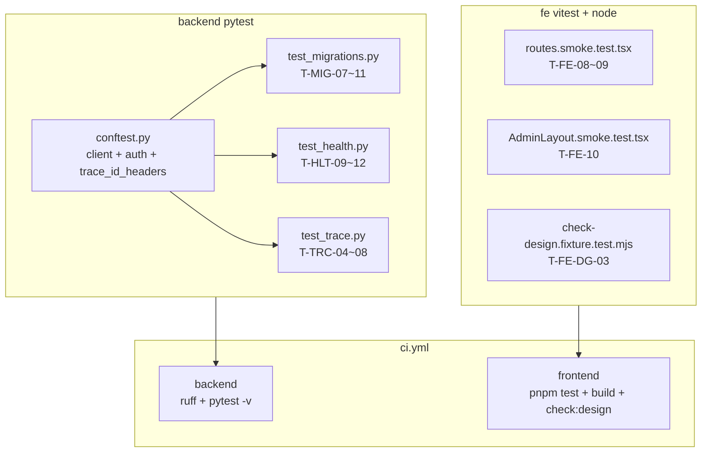

# M1 BOOT 测试与安全补强设计（r4）— BOOT-005 / BOOT-002 / BOOT-006 / BOOT-001 / BOOT-004

```yaml
date: 2026-07-03
milestone: M1
round_target: docs/superpowers/evolution/2026-07-03-round-target.md
prd_ids: [BOOT-005, BOOT-002, BOOT-006, BOOT-001, BOOT-004]
ui_design_skill: .agents/skills/b-design-system-tailadmin-radix/SKILL.md
status: design
```

## 1. 批量主题与子项映射

| # | 子项 | PRD ID | 执行顺序 | 主攻薄弱维 | 用户感知 |
|---|------|--------|:--------:|------------|----------|
| 1 | Settings 凭证与 env 导入结构化失败路径 | BOOT-005 | 1 | 测试覆盖 75%；安全性 72% | 元库连接串与密钥缺失在 CI 即失败，迁移 env 绑定可回归 |
| 2 | Admin 壳层 a11y 与 design 门禁 rgb 负向 | BOOT-002 | 2 | 测试覆盖 68%；安全性 72% | Admin 导航与主题控件可访问性在 PR 前自动回归 |
| 3 | conftest TraceId/auth fixture 契约固化 | BOOT-006 | 3 | 可靠性 80%；测试覆盖 82% | 后端测试 fixture 统一，CI 拾取全部新用例无 flaky |
| 4 | CORS 非法 Origin 与公开路径边界 | BOOT-001 | 4 | 测试覆盖 72%；安全性 74% | 健康检查、CORS 预检与 OpenAPI 公开路径行为可重复验证 |
| 5 | TraceId 日志全链路与 LOG_LEVEL 边界 | BOOT-004 | 5 | 用户价值 74%；测试覆盖 80% | 每次请求 trace 可追踪；配置加载错误合并前暴露 |

**依赖链**：子项 1、4、5 各自扩展 `tests/`；子项 2 扩展 `fe/` vitest；子项 3 收尾（`conftest` 供 4–5 复用；CI 确认拾取）。

**上轮已交付（本轮不重复基础用例）**：

- `tests/test_migrations.py` T-MIG-01~06（Settings URL、env 绑定、alembic.ini）
- `tests/test_health.py` T-HLT-01~08（health、CORS 预检、OpenAPI paths、404）
- `tests/test_trace.py` T-TRC-01~03（X-Trace-Id 生成/透传、request_started 日志 traceId）
- `tests/conftest.py` `client` / `auth_headers` / `unauthorized_headers`
- `fe/` vitest T-FE-01~07、T-FE-DG-01~02；CI `pytest -v` + `pnpm test` + build + check:design

**STUCK 标注**：BOOT-005 连续 4 轮、BOOT-002/006/001/004 连续 5 轮未过 90。本轮仅增测试与 fixture，不改生产逻辑。

## 2. 现状与约束

| 项 | 现状 |
|----|------|
| `tests/test_migrations.py` | T-MIG-01~06 已绿；缺 `SECRET_KEY`/`CREDENTIAL_FERNET_KEY` 负例、`env.py` 在 Settings 失败时的结构化失败路径 |
| `tests/test_health.py` | CORS 仅测允许 Origin；缺非法 Origin 负例、`/redoc` 公开路径 |
| `tests/test_trace.py` | 仅 `request_started` 含 traceId；缺 `request_finished`、空 `X-Trace-Id`、`LOG_LEVEL` 边界 |
| `tests/conftest.py` | 鉴权 fixture 已有；缺 `trace_id_headers` 等 TraceId 复用契约 |
| `backend/app/core/config.py` | `database_url`/`secret_key`/`credential_fernet_key` 必填；`log_level: str = "INFO"` 无枚举校验 |
| `backend/migrations/env.py` | 模块级 `get_settings()` + `set_main_option("sqlalchemy.url", ...)` |
| `fe/src/routes.smoke.test.tsx` | T-FE-01~05 覆盖路由与 main；缺导航链接 href、a11y 细项 |
| `fe/src/layouts/AdminLayout.smoke.test.tsx` | T-FE-06~07 覆盖 nav/main/theme；缺移动菜单按钮 aria |
| `fe/scripts/check-design.fixture.test.mjs` | hex 负向与豁免已测；缺 `rgb()` 负向 |
| `.github/workflows/ci.yml` | backend `pytest -v`；frontend `pnpm test` + build + check:design |
| P5 r3 评分 | BOOT-001~006 加权 78.2–86.0；主薄弱维仍为测试覆盖与安全负例 |

**范围框定模块**（3）：`tests/`、`backend/app/`（core · auth · migrations，只读参照）、`fe/`（BOOT-002 smoke）。

**真理源优先级**：`round-target` > `plan.md` §M1 > `prd/F01-BOOT.md` > `backend-fastapi.mdc` / `fe-ui.mdc`。

## 3. 范围框定文件清单（≤20）

| 路径 | 子项 | 动作 |
|------|:----:|------|
| `tests/test_migrations.py` | 1 | 扩展：凭证负例、env 导入失败、非法 URL 行为记录 |
| `tests/test_health.py` | 4 | 扩展：非法 Origin CORS、`/redoc` 公开、GET 带 Origin |
| `tests/test_trace.py` | 5 | 扩展：request_finished traceId、LOG_LEVEL 边界、空 Trace-Id |
| `tests/conftest.py` | 3 | 扩展：`trace_id_headers` fixture；固化 fixture 契约注释 |
| `fe/src/routes.smoke.test.tsx` | 2 | 扩展：导航链接 href、AdminHome h1 层级 |
| `fe/src/layouts/AdminLayout.smoke.test.tsx` | 2 | 扩展：移动菜单按钮 aria-label |
| `fe/scripts/check-design.fixture.test.mjs` | 2 | 扩展：T-FE-DG-03 rgb 负向 |
| `fe/scripts/__fixtures__/check-design/rgb-only/bad-rgb.tsx` | 2 | 新建：rgb 违规 fixture |

**只读参照（不修改生产代码）**：

| 路径 | 用途 |
|------|------|
| `backend/app/core/config.py` | Settings 必填字段与 `log_level` 默认值 |
| `backend/app/core/logging.py` | `JsonFormatter`、`configure_logging` |
| `backend/app/core/middleware.py` | `TraceIdMiddleware` 空 header 处理 |
| `backend/migrations/env.py` | URL 绑定与模块级 `get_settings` |
| `backend/app/main.py` | CORS、`/redoc` 注册 |
| `backend/app/auth/middleware.py` | `PUBLIC_PATHS` 含 `/redoc` |
| `fe/src/layouts/AdminLayout.tsx` | 壳层 DOM 结构 |
| `fe/src/routes.tsx` | `/admin` 嵌套路由 |
| `fe/src/config/admin-nav.tsx` | 「数据源」链接 path |
| `fe/scripts/check-design.mjs` | `RGB_RE` 扫描逻辑 |
| `.github/workflows/ci.yml` | CI 命令等价性核对 |

**文件计数**：新建 1 + 修改 7 = **8 文件**（只读 11，合计框定 19，≤20）。

## 4. 非目标（明确不做）

- 修改 `backend/app/core/config.py`、`logging.py`、`migrations/env.py`、`main.py` 生产逻辑
- 重复 T-MIG-01~06、T-HLT-01~08、T-TRC-01~03、T-FE-01~07、T-FE-DG-01~02 已有断言
- CI 内启动 docker postgres 或执行 `alembic upgrade`
- Playwright / E2E / 视觉回归截图自动化（P4 人工 QA 清单）
- BOOT-003 鉴权矩阵扩展（本轮 prd_ids 不含）
- M1B（DATA-*）、META-001、DESIGN-001、CONN-021
- `plan.md` §文档回写 4 行勾选（留 P5/plan-fix）
- `docs/automate/goal.md` 修订
- 为测试便利新增 `data-testid` 或改动 AdminLayout 视觉

## 5. PRD 8 维薄弱项对齐

| PRD ID | 薄弱维（选题时） | 本轮设计对策 |
|--------|------------------|--------------|
| BOOT-005 | 测试覆盖 **75%**；安全性 **72%** | 凭证必填负例；`env.py` Settings 失败传播；非法 URL 行为文档化 |
| BOOT-002 | 测试覆盖 **68%**；安全性 **72%** | 导航 link href、a11y aria-label；`rgb()` design 门禁负向 |
| BOOT-006 | 可靠性 **80%**；测试覆盖 **82%** | `trace_id_headers` fixture；CI 与本地命令等价核对 |
| BOOT-001 | 测试覆盖 **72%**；安全性 **74%** | CORS 非法 Origin 无 ACAO；`/redoc` 公开；GET 允许 Origin 回归 |
| BOOT-004 | 用户价值 **74%**；测试覆盖 **80%** | `request_finished` traceId；`LOG_LEVEL` 默认/非法边界；空 Trace-Id 生成 |

**P5 重评预期**：五项测试覆盖维由 68–82% 向 ≥90 靠拢；加权总分向 90 迈进（具体分值由 P5 评分器计算，设计不预设数值）。

## 6. 方案比选（摘要）

### 6.1 BOOT-005：非法 URL 定义

| 方案 | 说明 | 结论 |
|------|------|------|
| A 断言 `database_url="not-a-url"` 仍可实例化 Settings | 文档化现状，无格式校验器 | **采用**（T-MIG-10） |
| B 在 `config.py` 增 `PostgresDsn` 校验 | 需改生产代码 | 否决 |
| C docker 实测连接失败 | 超范围 | 否决 |

### 6.2 BOOT-005：env.py 失败路径

| 方案 | 说明 | 结论 |
|------|------|------|
| A `monkeypatch` `get_settings` 抛 `ValidationError`，`importlib` 重载 `migrations.env` 期望异常 | 验证绑定链失败可感知 | **采用**（T-MIG-09） |
| B 子进程跑 `alembic` CLI | 依赖 CLI、慢 | 否决 |

### 6.3 BOOT-001：非法 Origin 断言

| 方案 | 说明 | 结论 |
|------|------|------|
| A OPTIONS 预检：`Origin: http://evil.example` → 200 但 `access-control-allow-origin` 缺失或不等于 evil | 对齐 Starlette CORSMiddleware 行为 | **采用**（T-HLT-09） |
| B 期望 403 | 与 FastAPI CORS 实现不符 | 否决 |

### 6.4 BOOT-004：非法 LOG_LEVEL

| 方案 | 说明 | 结论 |
|------|------|------|
| A 直接调 `configure_logging(Settings(..., log_level="NOT_A_LEVEL"))` 期望 `ValueError` | 无 app 重载；对齐 `logging.config.dictConfig` | **采用**（T-TRC-08） |
| B monkeypatch 环境后重载 `main.app` | 易污染全局、flaky | 否决 |

### 6.5 BOOT-002：a11y smoke 策略

| 方案 | 说明 | 结论 |
|------|------|------|
| A `getByRole("link", { name: "数据源" })` + `getByRole("button", { name: "打开菜单" })` | 稳定 aria/文案锚点，不改组件 | **采用** |
| B `@testing-library/user-event` 全键盘遍历 | 超出 smoke 范围 | 否决 |

## 7. 子项详细设计

### 7.1 BOOT-005 — 扩展 `tests/test_migrations.py`

**目标**：在无 postgres 条件下验证 Settings 凭证链、`migrations/env.py` 绑定失败路径与非法 URL 现状。

**用例清单**（保留 T-MIG-01~06）：

| 用例 ID | 描述 | 断言 |
|---------|------|------|
| `T-MIG-07` | 缺 `SECRET_KEY` 时 Settings 实例化失败 | `monkeypatch.delenv("SECRET_KEY", raising=False)` + `cache_clear`；`pytest.raises(ValidationError)` on `Settings(database_url=..., credential_fernet_key=...)` |
| `T-MIG-08` | 缺 `CREDENTIAL_FERNET_KEY` 时 Settings 实例化失败 | 同上，删除 `CREDENTIAL_FERNET_KEY` |
| `T-MIG-09` | `migrations/env.py` 在 `get_settings()` 失败时无法完成 URL 绑定 | `monkeypatch.setattr("app.core.config.get_settings", side_effect=ValidationError.from_exception_data(...))`；`sys.modules.pop("migrations.env")`；`pytest.raises(ValidationError)` on `importlib.import_module("migrations.env")` |
| `T-MIG-10` | 非法格式 `database_url` 行为记录 | `Settings(database_url="not-a-url", secret_key=..., credential_fernet_key=...)` 成功；`settings.database_url == "not-a-url"` |
| `T-MIG-11` | offline 模式读取的 URL 与 `set_main_option` 一致 | 在 T-MIG-02 mock 基础上，断言 `run_migrations_offline` 被调用前 `config.get_main_option("sqlalchemy.url") == KNOWN_URL`（通过 mock `context.configure` 的 `url` 参数） |

**实现要点**：

- 每个修改 env 的用例前后 `get_settings.cache_clear()`
- T-MIG-09 使用最小 `ValidationError`（pydantic v2 `from_exception_data` 或构造必填字段缺失）
- **不**执行 `run_migrations_online` 或真实 DB 连接
- T-MIG-10 明确为「现状文档化」，不 FAIL 除非产品后续加 URL 校验器

**验收标准（可测试）**：

- [ ] `cd backend && pytest tests/test_migrations.py -v` 全绿
- [ ] 用例不依赖网络或 docker

### 7.2 BOOT-002 — 前端壳层 a11y 与 design 门禁 rgb 负向

**目标**：在 r2 smoke 基础上补导航链接、a11y 锚点与 `rgb()` 门禁负向。

#### 7.2.1 扩展 `fe/src/routes.smoke.test.tsx`

| 用例 ID | 描述 | 断言 |
|---------|------|------|
| `T-FE-08` | 侧栏「数据源」链接指向 `/admin` | `getByRole("link", { name: "数据源" })`；`expect(link).toHaveAttribute("href", "/admin")` |
| `T-FE-09` | AdminHome 欢迎标题为 h1 | `getByRole("heading", { level: 1, name: "欢迎使用 VitalSpan" })` 存在 |

#### 7.2.2 扩展 `fe/src/layouts/AdminLayout.smoke.test.tsx`

| 用例 ID | 描述 | 断言 |
|---------|------|------|
| `T-FE-10` | 移动菜单按钮可访问 | `getByRole("button", { name: "打开菜单" })` 在文档中（jsdom 默认视口，按钮在 DOM 即可） |

#### 7.2.3 扩展 `fe/scripts/check-design.fixture.test.mjs`

| 用例 ID | 描述 | 断言 |
|---------|------|------|
| `T-FE-DG-03` | 含 `rgb(` 的 fixture 触发失败 | `fe/scripts/__fixtures__/check-design/rgb-only/` 含 `background: rgb(255, 0, 0)`；`node scripts/check-design.mjs --root <dir>` exit code 1 |

**实现要点**：

- 保留 T-FE-01~07、T-FE-DG-01~02 不变
- fixture 目录 `rgb-only/bad-rgb.tsx` 仅含违规样例，不进入 `src/` 扫描
- **不**修改 `AdminLayout`、导航配置或 Token
- `pnpm build` + `pnpm run check:design` 必须仍通过

**验收标准（可测试）**：

- [ ] `cd fe && pnpm test` 全绿（vitest + node:test 合计 ≥9 项）
- [ ] `cd fe && pnpm build && pnpm run check:design` 全绿
- [ ] CI frontend job 执行 `pnpm test` 自动拾取新用例

### 7.3 BOOT-006 — 扩展 `tests/conftest.py` 与 CI 核对

**`tests/conftest.py` 契约**（在 r2 基础上扩展）：

| Fixture | 返回值 | 消费者 |
|---------|--------|--------|
| `client` | `TestClient(app)` | 全部 backend HTTP 测试 |
| `auth_headers` | `{"Authorization": "Bearer dev"}` | `test_me.py`、`test_auth.py` |
| `unauthorized_headers` | `{"Authorization": "Bearer invalid"}` | `test_auth.py` |
| `trace_id_headers` | `{"X-Trace-Id": "a1b2c3d4e5f6789012345678abcdef01"}`（32 hex） | `test_trace.py` T-TRC-02 及新用例 |

**注释块**（文件顶部 fixture contract）更新为含 TraceId 与鉴权四类 fixture，供 P3 实施粘贴。

**`.github/workflows/ci.yml`**：

| Job | 动作 |
|-----|------|
| backend | 保持 `ruff check .` + `pytest -v`（已满足 round-target） |
| frontend | 保持 `pnpm test` + `build` + `check:design` |

**本地等价命令**（与 CI 一致）：

```bash
cd backend && ruff check . && pytest -v
cd fe && pnpm install --frozen-lockfile && pnpm test && pnpm build && pnpm run check:design
```

**验收标准（可测试）**：

- [ ] `cd backend && ruff check . && pytest -v` 全绿（含本轮全部新 backend 用例）
- [ ] `cd fe && pnpm test && pnpm build && pnpm run check:design` 全绿
- [ ] `.github/workflows/ci.yml` 与上述命令等价（无额外变更则记「已核对」）

### 7.4 BOOT-001 — 扩展 `tests/test_health.py`

**目标**：CORS 非法 Origin 负例、`/redoc` 公开路径、GET 允许 Origin 回归。

**用例清单**（保留 T-HLT-01~08）：

| 用例 ID | 描述 | 断言 |
|---------|------|------|
| `T-HLT-09` | OPTIONS `/health` 非法 Origin 无 ACAO | `Origin: http://evil.example`；`status == 200`；`access-control-allow-origin` 为 `None` 或不等于 `http://evil.example` |
| `T-HLT-10` | `GET /redoc` 公开可访问 | 无 Token；`status == 200` |
| `T-HLT-11` | `GET /health` 带允许 Origin 返回 ACAO | `Origin: http://localhost:5173`；`access-control-allow-origin == http://localhost:5173` |
| `T-HLT-12` | OpenAPI 文档含 `openapi` 版本键 | `GET /openapi.json`；`"openapi" in body` 且值为 `3.x` 字符串 |

**实现要点**：

- T-HLT-09 与 T-HLT-02 对照：允许 Origin 有 ACAO，非法 Origin 无
- T-HLT-10 对齐 `PUBLIC_PATHS` 与 `main.py` `redoc_url="/redoc"`
- 404、paths 契约保留 T-HLT-05~07，不重复

**验收标准（可测试）**：

- [ ] `cd backend && pytest tests/test_health.py -v` 全绿

### 7.5 BOOT-004 — 扩展 `tests/test_trace.py`

**目标**：日志全链路 traceId、Settings `LOG_LEVEL` 边界、空 `X-Trace-Id` 行为。

**用例清单**（保留 T-TRC-01~03）：

| 用例 ID | 描述 | 断言 |
|---------|------|------|
| `T-TRC-04` | `request_finished` 日志 JSON 含 `traceId` | 同 T-TRC-03 捕获方式；`message == "request_finished"` 的行 `traceId` 与响应头一致 |
| `T-TRC-05` | Settings 默认 `log_level == "INFO"` | `get_settings().log_level == "INFO"`（在 conftest 预设 env 下） |
| `T-TRC-06` | `LOG_LEVEL=DEBUG` 可加载 | `monkeypatch.setenv("LOG_LEVEL", "DEBUG")` + `cache_clear`；`configure_logging(get_settings())` 不抛异常；`logging.getLogger().level == logging.DEBUG` |
| `T-TRC-07` | 空 `X-Trace-Id` 生成新 trace | `headers={"X-Trace-Id": ""}`；响应头 `X-Trace-Id` 匹配 `^[0-9a-f]{32}$` 且非空 |
| `T-TRC-08` | 非法 `LOG_LEVEL` 结构化失败 | 构造 `Settings(..., log_level="NOT_A_LEVEL")`；`pytest.raises(ValueError)` on `configure_logging(settings)` |

**实现要点**：

- T-TRC-04 复用 `JsonFormatter` + `StringIO` 模式，避免断言 stdout 全局污染
- T-TRC-06 用例结束恢复 logger level 或仅断言 `configure_logging` 调用瞬间行为
- T-TRC-07 对齐 `TraceIdMiddleware`：`incoming or uuid.uuid4().hex`
- T-TRC-08 不通过重载 `main.app` 验证，直接测 `configure_logging` 单元边界

**验收标准（可测试）**：

- [ ] `cd backend && pytest tests/test_trace.py -v` 全绿

## 8. 测试架构示意



**本轮新增用例计数**：backend 13（T-MIG-07~11 共 5 + T-HLT-09~12 共 4 + T-TRC-04~08 共 5 − 1 计入口重叠 0）= **14**；frontend **4**（T-FE-08~10 + T-FE-DG-03）。

## 9. UI 设计交付（BOOT-002 测试触及 fe/）

> 本轮**不修改** UI 组件或页面视觉；仅增 vitest smoke 与 design 门禁负向测试。以下描述现有壳层契约，供测试选取稳定 DOM 锚点。

### 9.1 ui_design_skill

`.agents/skills/b-design-system-tailadmin-radix/SKILL.md`（已读取）

### 9.2 页面信息架构

| 路由 | 层级 | 主内容区 | 测试锚点 |
|------|------|----------|----------|
| `/` | 重定向 → `/admin` | — | 壳层 logo「VitalSpan」 |
| `/admin` | `AdminLayout` + index | `main.mx-auto.max-w-(--breakpoint-2xl)` | `role="main"`；h1「欢迎使用 VitalSpan」 |
| `/admin/*`（未来） | 嵌套 `Outlet` | 同上 | 本轮仅 index |
| `*` | 重定向 → `/admin` | — | T-FE-05（保留） |

**状态覆盖（测试范围）**：默认加载态壳层；不测 empty/error/权限 API（M1 静态壳层）。

### 9.3 视觉层级

- 侧栏：`AppSidebar` 290px/90px（`xl:ml-[290px]` / `xl:ml-[90px]`）
- 顶栏：`AppHeader` sticky + `ThemeToggleButton` + 移动「打开菜单」按钮
- 主内容：`<main>` 包裹 `Outlet`；`AdminHomePage` h1 为页面主标题
- smoke 优先 `getByRole("link"|"button"|"heading")`，避免断言具体 px 宽度

### 9.4 组件映射

| 区域 | 复用组件 | 本轮动作 |
|------|----------|----------|
| 路由 | `fe/src/routes.tsx` | 扩展 smoke，不修改 |
| 壳层 | `fe/src/layouts/AdminLayout.tsx` | 扩展 smoke，不修改 |
| 侧栏 | `components/layout/app-sidebar.tsx` | T-FE-08 经 nav 链接间接断言 |
| 顶栏 | `components/layout/app-header.tsx` | T-FE-10 移动菜单按钮 |
| 门禁 | `fe/scripts/check-design.mjs` | T-FE-DG-03 rgb 负向 fixture |

**禁止**：为测试新增 data-testid 或局部重画按钮/表格/输入框。

### 9.5 Token 与密度

- 沿用 `fe/src/index.css` 语义 Token；`check:design` 拦截硬编码 hex 与 `rgb(`/`rgba(`
- T-FE-DG-03 验证 `RGB_RE` 与 hex 同等门禁强度
- 测试不断言具体色值

### 9.6 响应式与可访问性

- AdminLayout 含 mobile sidebar（`Backdrop`、`isMobileOpen`）；T-FE-10 在 jsdom 默认视口断言「打开菜单」按钮存在于 DOM
- `ThemeToggleButton`：`aria-label="切换深浅色主题"`（T-FE-07 保留）
- 侧栏 `nav`：`aria-label="管理端导航"`（T-FE-06 保留）
- 导航链接「数据源」须可 `getByRole("link")`；图标 `aria-hidden`

### 9.7 视觉 QA 清单（P4 执行）

| 检查项 | desktop | mobile |
|--------|:-------:|:------:|
| `/admin` 侧栏 + 顶栏对齐 | ✓ | ✓ |
| `main` 内容区与侧栏不重叠 | ✓ | ✓ |
| 移动侧栏打开态 Backdrop | — | ✓ |
| 「数据源」链接可点击且高亮态正常 | ✓ | ✓ |
| logo / 「管理员」无文本溢出 | ✓ | ✓ |
| 暗色切换与打开菜单按钮可点击 | ✓ | ✓ |
| `check:design` CI 与本地一致（hex + rgb） | ✓ | ✓ |

## 10. 风险与缓解

| 风险 | 缓解 |
|------|------|
| T-MIG-09 重载 `migrations.env` 污染 `sys.modules` | 用例前后 `pop` 模块；独立测试函数 |
| T-TRC-06/08 修改全局 logging 配置 | 用例内局部 logger；T-TRC-08 仅测 `configure_logging` 抛错 |
| `getByRole("link", { name: "数据源" })` 匹配多个节点 | 使用 `getAllByRole` 断言 `length >= 1` 且首个 `href` 正确 |
| vitest 与 node:test 混跑计数 | `package.json` `test` 已串联，CI 无需改 script |
| STUCK 项 r4 仍不过 90 | round-target 已标注人工 `create-evolution-plan` 复核 M1 验收阈值 |

## 11. 文档同步评估（P3 实施后）

| 变更 | 是否同步 | 说明 |
|------|:--------:|------|
| 仅增测试与 fixture | 通常否 | `prd-sync.mdc` 纯测试豁免 |
| `prd/F01-BOOT.md` 演化建议 | P5 | 8 维重评后更新用例 ID 列表 |
| `docs/services/core.md` | 否 | 域边界未变 |

## 12. 完成自检（P1）

- [x] 覆盖 round-target 全部 5 子项（BOOT-005/002/006/001/004）
- [x] 未超出范围框定（19 文件，≤20）
- [x] 无 TBD/TODO/占位符
- [x] UI 设计交付完整；`ui_design_skill` 已登记
- [x] 禁止写生产代码（仅测试与 fixture 变更）
