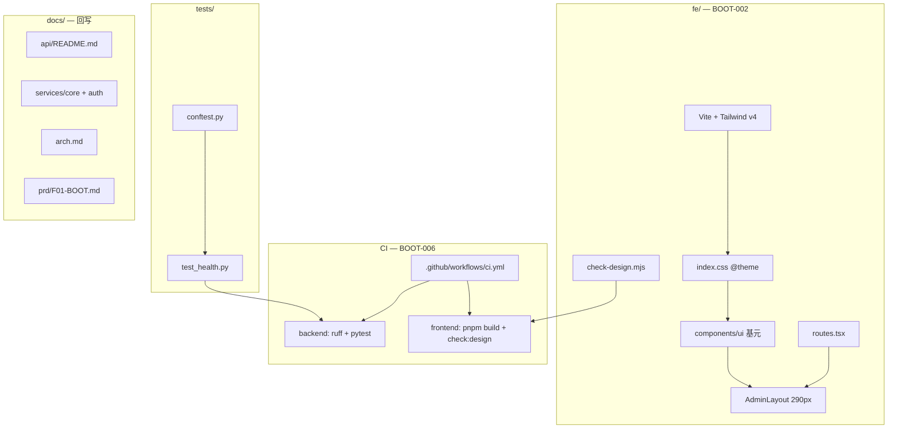

# M1 前端壳层 + CI 收尾设计 — BOOT-002 / BOOT-006

```yaml
date: 2026-07-03
milestone: M1
round_target: docs/superpowers/evolution/2026-07-03-round-target-m1-fe-ci.md
base_branch: dev-auto
prd_ids: [BOOT-002, BOOT-006]
ui_design_skill: .agents/skills/b-design-system-tailadmin-radix/SKILL.md
status: design
```

## 1. 批量主题与子项映射

| # | 子项 | PRD ID | 执行顺序 | 用户感知 |
|---|------|--------|:--------:|----------|
| 1 | FE 工程脚手架与 Design Token | BOOT-002 | 1 | `pnpm dev` 可启动；Tailwind v4 + Token 加载；shadcn 基元可复用 |
| 2 | Admin 壳层与路由 | BOOT-002 | 2 | 浏览器 `:5173/admin` 可见 290px 侧栏 + 内容区 |
| 3 | 设计合规门禁 `check:design` | BOOT-002 | 3 | 本地/CI 拦截硬编码色，退出码 0 |
| 4 | CI 流水线与后端 smoke 测试 | BOOT-006 | 4 | PR 触发 Actions；ruff + pytest + fe build + check:design 全绿 |
| 5 | M1 文档回写与联调验收锚点 | BOOT-006 | 5 | 文档与实现一致；arch §9 联调步骤可复现 |

**依赖链**：子项 1 → 2 → 3（`check:design` 依赖 `fe/src` 存在）→ 4（CI frontend job 依赖 1–3）→ 5（P3 实现完成后、P5 勾选 plan）。

**上轮已交付（本轮不重复实施）**：BOOT-004/001/005/003 后端启动链（PR #2 已合并）。

## 2. 现状与约束

| 项 | 现状 |
|----|------|
| `fe/` | 仅存在 `fe/.env.example`（`VITE_API_BASE_URL`）；无 `package.json`、无源码 |
| `tests/` | 不存在 |
| `.github/workflows/` | 不存在 |
| `.gitignore` | 仅 `__pycache__/`、`.env`、`backend/.env`、`*.pyc`；缺 Node/Python 产物 |
| `backend/` | BOOT-001~005/003 已落地；`GET /health` 返回 `{"status":"ok"}` |
| `docs/services/core.md`、`auth.md` | 状态仍为「未实现」，与代码漂移 |
| `docs/api/README.md` | `/health` 仍为「规划」；无 M1 `GET /api/v1/me` 登记行 |

**范围框定模块**（≤3）：`fe/`、`tests/` + `.github/workflows/`、`docs/`（M1 收尾回写）。

**不含（非目标）**：

- TanStack Query、`@/lib/queryKeys`、`mapApiError`、业务 API 客户端（二期联调）
- Portal/Embed 完整壳层与业务页
- M1B（DATA-*）、Dataset、连接器、E2E 测试
- CI 内启动 docker postgres / 集成测试库
- 修改 `docs/automate/goal.md`；P5 前改 `plan.md` 结构（仅勾选 BOOT-002/006 行）
- META/DESIGN/CONN 远期薄弱项

**真理源优先级**：`round-target` > `plan.md` §M1 > `layout.md` / `fe-ui.mdc` > b-design-system skill > `prd/F01-BOOT.md`。

## 3. 范围框定文件清单（≤20）

| 路径 | 子项 | 动作 |
|------|:----:|------|
| `fe/package.json` | 1,3 | 新建：依赖、scripts（`dev`/`build`/`check:design`） |
| `fe/pnpm-lock.yaml` | 1 | 新建：`pnpm install` 产出，纳入版本控制 |
| `fe/vite.config.ts` | 1 | 新建：React 插件、`@` 别名、dev proxy、`@tailwindcss/vite` |
| `fe/tsconfig.json` | 1 | 新建：引用 app/node 配置 |
| `fe/tsconfig.app.json` | 1 | 新建：`paths: { "@/*": ["./src/*"] }` |
| `fe/tsconfig.node.json` | 1 | 新建：Vite 配置 TS 支持 |
| `fe/index.html` | 2 | 新建：挂载 `#root` |
| `fe/components.json` | 1 | 新建：复制 skill `templates/components.json` |
| `fe/src/index.css` | 1 | 新建：`@import "tailwindcss"` + `@theme` Token + `dark` variant |
| `fe/src/lib/utils.ts` | 1 | 新建：`cn()` = clsx + tailwind-merge |
| `fe/src/components/ui/button.tsx` | 1 | 新建：skill 模板覆盖 |
| `fe/src/components/ui/input.tsx` | 1 | 新建：skill 模板覆盖 |
| `fe/src/components/ui/label.tsx` | 1 | 新建：shadcn 基元 |
| `fe/src/components/ui/skeleton.tsx` | 1 | 新建：加载态占位 |
| `fe/src/components/README.md` | 1 | 新建：`ui/` 基元索引 |
| `fe/.env.example` | 1 | 已有，校验字段完整 |
| `fe/src/main.tsx` | 2 | 新建：`createRoot` + `RouterProvider` |
| `fe/src/routes.tsx` | 2 | 新建：react-router v7 嵌套路由 |
| `fe/src/layouts/AdminLayout.tsx` | 2 | 新建：290px Admin 壳层 |
| `fe/scripts/check-design.mjs` | 3 | 新建：硬编码色扫描 |
| `.github/workflows/ci.yml` | 4 | 新建：backend + frontend jobs |
| `.gitignore` | 4 | 增补忽略规则 |
| `tests/conftest.py` | 4 | 新建：`TestClient` fixture |
| `tests/test_health.py` | 4 | 新建：`GET /health` smoke |
| `docs/api/README.md` | 5 | 回写状态与 `/me` 行 |
| `docs/services/core.md` | 5 | 回写状态与锚点 |
| `docs/services/auth.md` | 5 | 回写状态与锚点 |
| `docs/arch.md` | 5 | §4.2/§4.3/§10 段落 |
| `prd/F01-BOOT.md` | 5 | BOOT-001~006 状态与验收勾选 |

> **文件预算说明**：`fe/` 脚手架必需 TS 配置共 6 个；`ui/` 最小集 4 个基元。`AdminLayout.tsx` 采用**单文件内联侧栏/顶栏**（不另建 `components/layout/*`），以满足 round-target ≤20 文件上限。若实现阶段单文件逼近 300 行上限，优先拆 `useAdminSidebar` hook 至 `fe/src/hooks/`，不新增页面业务组件。

## 4. PRD 8 维薄弱项对齐

| PRD ID | 薄弱维（≤40%） | 本轮设计对策 |
|--------|----------------|--------------|
| BOOT-002 | 完整度 5%、可靠性 0%、测试 0%、性能 0% | 交付可构建 `fe/` + 可访问 `/admin`；`check:design` 静态门禁弥补无 E2E；`pnpm build` 作为体积/构建冒烟 |
| BOOT-002 | 交互体验 N/A → 壳层后可在 P5 重评 | UI 设计交付节规定壳层 IA、状态、响应式；P4 截图 QA |
| BOOT-006 | 完整度 5%、可靠性 0%、测试 0% | `test_health.py` + CI 双 job；`.gitignore` 防泄漏 |
| BOOT-006 | 架构 13%、安全 13% | CI 不启 postgres；ruff 门禁；文档回写 CORS/Auth 锚点 |

## 5. 方案比选（摘要）

### 5.1 前端脚手架初始化

| 方案 | 说明 | 结论 |
|------|------|------|
| A `pnpm create vite` + skill 模板拷贝 + shadcn init | 与 `fe-ui.mdc`、skill `from-zero.md` 一致；可控体量 | **采用** |
| B 整包复制 `examples/b-design-system-tailadmin-radix` | 超范围、引入 demo 路由与第三方图表 | 否决 |
| C npm/yarn 替代 pnpm | 违反项目约定 | 否决 |

### 5.2 Admin 壳层实现

| 方案 | 说明 | 结论 |
|------|------|------|
| A 单文件 `AdminLayout.tsx` 内联侧栏/顶栏，比例对齐 skill | 满足文件预算；M1 静态占位导航 | **采用** |
| B 完整拷贝 `templates/layout/*` + `context/*` | 文件数超预算；M1 无 Portal 切换需求 | 否决 |
| C 页面内自定义 flex 布局、不用 Token | 设计漂移、`check:design` 难维护 | 否决 |

### 5.3 API 联调（dev）

| 方案 | 说明 | 结论 |
|------|------|------|
| A Vite `server.proxy` 将 `/api` → `VITE_API_BASE_URL` + `.env` 显式基址 | M1 无 API 客户端亦可预备；与 arch §9 一致 | **采用** |
| B 仅 CORS 直连、无 proxy | 可行但 M1 后续联调易遇跨域配置分散 | 备选 |

### 5.4 `check:design` 扫描范围

| 方案 | 说明 | 结论 |
|------|------|------|
| A 仅扫描 `fe/src/**/*.{tsx,ts}`；`index.css` 整文件豁免（Token 定义含 hex） | 与 plan 意图一致；避免误报 | **采用** |
| B 扫描含 `index.css` + `@design-token-ok` 文件头豁免 | 可行但 Token 块大，维护成本高 | 备选 |
| C stylelint 插件 | 新依赖、M1 超范围 | 否决 |

### 5.5 CI 拓扑

| 方案 | 说明 | 结论 |
|------|------|------|
| A 并行 `backend` + `frontend` jobs；backend `pip install -e ".[dev]"` 后 ruff/pytest | 与 plan §BOOT-006 一致 | **采用** |
| B 单 job 顺序执行 | 慢、失败定位差 | 否决 |
| C 增加 postgres service | plan 明确不含 | 否决 |

## 6. 总体架构



**路由结构（M1）**：

```text
/                    → Navigate to /admin
/admin               → AdminLayout
  ├─ index           → AdminHomePlaceholder（壳层欢迎页，无业务 API）
  └─ *               → 404 ContentState（壳层内，非裸路由）
```

react-router v7 使用 `createBrowserRouter` + `RouterProvider`（`main.tsx` 挂载）。

## 7. 分项设计

### 7.1 子项 1 — FE 工程脚手架与 Design Token

#### 7.1.1 `fe/package.json` 依赖（最小集）

| 类型 | 包 | 用途 |
|------|-----|------|
| runtime | `react`, `react-dom`, `react-router` (^7) | 壳层与路由 |
| runtime | `clsx`, `tailwind-merge`, `class-variance-authority` | `cn()` / `cva` |
| runtime | `@radix-ui/react-slot`, `@radix-ui/react-label` | Button/Label 基座 |
| dev | `vite`, `@vitejs/plugin-react`, `typescript` | 构建 |
| dev | `tailwindcss`, `@tailwindcss/vite`, `@tailwindcss/forms` | Tailwind v4 |
| dev | `@types/react`, `@types/react-dom` | TS |

**scripts**：

```json
{
  "dev": "vite",
  "build": "tsc -b && vite build",
  "preview": "vite preview",
  "check:design": "node scripts/check-design.mjs"
}
```

**engines**：`"node": ">=20"`；包管理器字段 `"packageManager": "pnpm@9.x"`（与 CI `pnpm/action-setup` 对齐）。

#### 7.1.2 `fe/vite.config.ts`

- `resolve.alias`: `@` → `path.resolve(__dirname, "src")`
- `plugins`: `react()`, `tailwindcss()`（`@tailwindcss/vite`）
- `server.port`: `5173`
- `server.proxy`（M1 预备联调）：

```ts
proxy: {
  "/api": {
    target: process.env.VITE_API_BASE_URL ?? "http://localhost:8000",
    changeOrigin: true,
  },
}
```

- `build.outDir`: `dist`

#### 7.1.3 `fe/src/index.css`

按 skill `references/token-index.md` + `templates/globals.css`（或等效 `@theme` 块）写入：

- `@import "tailwindcss";`
- `@custom-variant dark (&:is(.dark *));`
- `@theme { ... }`：brand/gray/semantic 色板、字体 `font-outfit`、`shadow-theme-*`、`--breakpoint-2xl`
- `body` 默认：`@apply font-outfit bg-gray-50 text-gray-700 antialiased dark:bg-gray-900 dark:text-gray-300`

**禁止**在 `tsx` 中重复定义色值；Token 源仅在此文件。

#### 7.1.4 `fe/src/components/ui/*` 最小集

| 组件 | 来源 | M1 用途 |
|------|------|---------|
| `button.tsx` | skill `templates/ui/button.tsx` | 壳层操作、侧栏折叠触发 |
| `input.tsx` | skill `templates/ui/input.tsx` | 顶栏搜索占位（disabled/只读） |
| `label.tsx` | shadcn add + Radix Label | 表单预备 |
| `skeleton.tsx` | shadcn add | 内容区 loading 占位演示 |

`fe/src/components/README.md` 表格列：组件名、路径、variants、何时使用。

#### 7.1.5 `fe/.env.example`

保持单行 `VITE_API_BASE_URL=http://localhost:8000`（已存在，实现阶段校验无遗漏）。

#### 7.1.6 验收标准（可测试）

| # | 标准 | 验证命令/方式 |
|---|------|----------------|
| 1 | `package.json` 含 react、react-router v7、tailwind v4、Radix 最小集 | 文件审查 |
| 2 | `dev` 支持 proxy 或 `VITE_API_BASE_URL` | `pnpm dev` 启动；`vite.config.ts` 含 proxy |
| 3 | `vite.config.ts` 可构建 | `cd fe && pnpm build` exit 0 |
| 4 | `index.css` 含 Tailwind v4 + 设计 Token | 文件含 `@theme` 与 `brand-500` |
| 5 | `ui/` 最小集存在 | 目录列出 ≥4 基元 |
| 6 | `components/README.md` 索引 `ui/` | 文件审查 |
| 7 | `.env.example` 含 `VITE_API_BASE_URL` | 文件审查 |

---

### 7.2 子项 2 — Admin 壳层与路由

#### 7.2.1 `fe/src/layouts/AdminLayout.tsx` 结构

对齐 `layout.md` §2 与 skill 壳层比例：

| 区域 | 规格 | 实现要点 |
|------|------|----------|
| 侧栏 | 固定 **290px**（`xl` 断点）；M1 **不实现** 90px 折叠（二期补 `SidebarContext`） | `bg-white dark:bg-gray-900 border-r border-gray-200`；`localStorage` key 预留注释 `sidebar:admin` |
| 顶栏 | sticky `top-0 z-50`；高度 ~64px | Logo 文案「VitalSpan」；右侧用户区占位（Avatar 圆形 + 「管理员」） |
| 内容区 | `max-w-(--breakpoint-2xl) mx-auto p-4 md:p-6` | `<Outlet />` 渲染子路由 |
| 导航 | M1 **静态占位** 2 组（见下） | 不用业务 API；`NavLink` + `brand-50`/`brand-500` 选中态 |

**M1 侧栏占位 IA**（`layout.md` §3 子集，无 dead link）：

| 分组 | 项 | 路由 | M1 行为 |
|------|-----|------|---------|
| 平台 | 运营总览 | `/admin` | 默认 landing |
| 数据 | 数据源 | `#` | `aria-disabled` + tooltip「二期开放」 |

#### 7.2.2 `fe/src/routes.tsx`

```tsx
// 结构示意（非生产代码）
const router = createBrowserRouter([
  { path: "/", element: <Navigate to="/admin" replace /> },
  {
    path: "/admin",
    element: <AdminLayout />,
    children: [
      { index: true, element: <AdminHomePlaceholder /> },
      { path: "*", element: <AdminNotFound /> },
    ],
  },
]);
```

`AdminHomePlaceholder`：单文件内联于 `routes.tsx` 或同目录 `pages/admin/AdminHomePage.tsx`（**仅当**不突破文件预算时放后者；默认内联于 `routes.tsx` 底部 private 组件）。

占位内容：`text-title-sm` 标题「运营总览」+ `text-theme-sm text-gray-500` 说明「M1 壳层已就绪」+ `Skeleton` 演示卡片 2 列 grid。

#### 7.2.3 `fe/src/main.tsx`

- `import "./index.css"`
- `createRoot(document.getElementById("root")!).render(<RouterProvider router={router} />)`

#### 7.2.4 验收标准（可测试）

| # | 标准 | 验证命令/方式 |
|---|------|----------------|
| 1 | `AdminLayout.tsx` 290px 侧栏 | 浏览器 DevTools 量宽；desktop 截图 |
| 2 | `routes.tsx` 嵌套 `/admin/*` | 路由配置审查 |
| 3 | `pnpm build` 成功 | `cd fe && pnpm build` exit 0 |
| 4 | 浏览器 `/admin` 可渲染 | P4：`pnpm dev` + 访问 `:5173/admin` 截图 |

---

### 7.3 子项 3 — `check:design` 门禁

#### 7.3.1 `fe/scripts/check-design.mjs` 行为

1. **递归**读取 `fe/src/**/*.{tsx,ts}`（不扫描 `.css`）
2. 逐行检测：
   - 正则 `#[0-9a-fA-F]{3,8}\b`
   - 正则 `rgb\s*\(`
3. **豁免**：同行含 `// @design-token-ok` 或 `/* @design-token-ok */`
4. 命中 → `console.error` 打印 `file:line:col`；**退出码 1**
5. 无命中 → 打印 `check:design passed (N files)`；**退出码 0**

#### 7.3.2 验收标准（可测试）

| # | 标准 | 验证 |
|---|------|------|
| 1 | 脚本存在且扫描 `fe/src` ts/tsx | 文件审查 |
| 2 | `package.json` 含 `check:design` script | 文件审查 |
| 3 | 当前代码库扫描通过 | `cd fe && pnpm run check:design` exit 0 |
| 4 | 故意在 tsx 写 `#fff` 应失败 | P4 负例单测或手工验证后回滚 |

---

### 7.4 子项 4 — CI 流水线与后端 smoke

#### 7.4.1 `.github/workflows/ci.yml`

**触发**：`pull_request`（全分支）；可选 `push` to `dev-auto`（与仓库惯例一致时启用，默认仅 `pull_request`）。

**Job `backend`**：

| Step | 命令 |
|------|------|
| checkout | `actions/checkout@v4` |
| Python 3.11 | `actions/setup-python@v5` |
| 安装 | `working-directory: backend` → `pip install -e ".[dev]"` |
| Lint | `ruff check .` |
| Test | `pytest`（`testpaths = ["../tests"]` 已配置于 `pyproject.toml`） |

**Job `frontend`**：

| Step | 命令 |
|------|------|
| checkout | `actions/checkout@v4` |
| pnpm | `pnpm/action-setup@v4`，version 9 |
| Node 22 | `actions/setup-node@v4`，`cache: pnpm`，`cache-dependency-path: fe/pnpm-lock.yaml` |
| 安装 | `working-directory: fe` → `pnpm install --frozen-lockfile` |
| 构建 | `pnpm build` |
| 设计门禁 | `pnpm run check:design` |

**明确不做**：`services: postgres`、docker compose、alembic migrate。

#### 7.4.2 `.gitignore` 增补

```
.env
backend/.env
fe/.env
__pycache__/
*.pyc
.venv/
.pytest_cache/
*.egg-info/
node_modules/
fe/dist/
.DS_Store
```

#### 7.4.3 `tests/conftest.py`

```python
import pytest
from fastapi.testclient import TestClient
from app.main import app

@pytest.fixture
def client() -> TestClient:
    return TestClient(app)
```

前置条件：自 `backend/` 执行 pytest 且 `pip install -e ".[dev]"` 已安装 `app` 包。

#### 7.4.4 `tests/test_health.py`

```python
def test_health_returns_ok(client):
    response = client.get("/health")
    assert response.status_code == 200
    assert response.json() == {"status": "ok"}
```

不 mock `Settings`；不依赖数据库连接（`/health` 不触库）。

#### 7.4.5 验收标准（可测试）

| # | 标准 | 验证 |
|---|------|------|
| 1 | `ci.yml` PR 触发；backend ruff + pytest | 工作流文件审查；P4 本地 `cd backend && ruff check . && pytest` |
| 2 | frontend pnpm install + build + check:design | P4 本地等效命令 |
| 3 | CI 不启 docker postgres | 工作流无 `services:` |
| 4 | `.gitignore` 覆盖 `.env`、`node_modules/`、`fe/dist/` 等 | 文件审查 |
| 5 | `conftest.py` 提供 `TestClient` fixture | pytest 收集通过 |
| 6 | `test_health.py` GET /health → 200 | `pytest tests/test_health.py -v` |

---

### 7.5 子项 5 — M1 文档回写

#### 7.5.1 `docs/api/README.md`

| 变更 | 内容 |
|------|------|
| §0 `/health` | 状态 `规划` → `已实现` |
| 新增行 | `GET /api/v1/me` · M1 占位验收 · 状态 `已实现` · 锚点 `backend/app/api/v1/me.py` |
| §1 `/api/v1/auth/me` | 保持 `规划`；注记「二期正式路径；M1 占位见 `/api/v1/me`」 |

#### 7.5.2 `docs/services/core.md`

- 状态 → **已实现**
- 锚点：`Settings`、`TraceIdMiddleware`、`CORSMiddleware`、`GET /health`
- `main.py` 中间件注册顺序说明（引用 backend-fastapi.mdc）

#### 7.5.3 `docs/services/auth.md`

- 状态 → **骨架已实现**（M1 占位，非完整 M7）
- 锚点：`auth/middleware.py` `AuthMiddleware`、`auth/deps.py` `get_current_user`、`PUBLIC_PATHS`、`Bearer dev` 开发占位

#### 7.5.4 `docs/arch.md`

| 段落 | 变更 |
|------|------|
| §4.1 | `fe/` 改为「React 双端前端（M1 Admin 壳层）」；`tests/` 改为「单元 / smoke」 |
| §4.2 | `core/` 描述中鉴权改为「委托 `auth/`；**`AuthMiddleware` 由 `main.py` 注册**」 |
| §4.3 | 增 **M1 过渡布局** 注记：`routes.tsx` + `layouts/AdminLayout.tsx`；目标态 `src/app/` 二期统一 |
| §10 | PRD hub 计数 `118 项` → `124 项` |

#### 7.5.5 `prd/F01-BOOT.md`

- BOOT-001~006 状态 → `已实现`
- 各项验收标准 `[ ]` → `[x]`（与 plan 验证步骤一致）
- BOOT-003 代码锚点：`auth/middleware.py` + `main.py` 注册

#### 7.5.6 `docs/automate/plan.md`

- **P3 不修改**；**P5** 勾选 `- [ ] BOOT-002`、`- [ ] BOOT-006` 行（不改结构）

#### 7.5.7 联调验收（P4 手工证据）

```bash
docker compose up -d
cd backend && cp .env.example .env && uvicorn app.main:app --reload --port 8000
cd fe && cp .env.example .env && pnpm dev
# 浏览器 http://localhost:5173/admin — 壳层可见
# 可选：curl -H "Origin: http://localhost:5173" http://localhost:8000/health — 无 CORS 错误
```

#### 7.5.8 验收标准（可测试）

| # | 标准 | 验证 |
|---|------|------|
| 1 | api README `/health` 已实现 + `/me` 登记 | 文档审查 |
| 2 | services core/auth 状态与锚点更新 | 文档审查 |
| 3 | arch §4.2/§4.3/§10 更新 | 文档审查 |
| 4 | F01-BOOT BOOT-001~006 已实现且勾选 | 文档审查 |
| 5 | 联调步骤可执行 | P4 截图/日志证据 |

---

## 8. UI 设计交付

`ui_design_skill`: `.agents/skills/b-design-system-tailadmin-radix/SKILL.md`（已读取；子引用 `output-modes/from-zero.md`、`references/token-index.md`、`references/layout-patterns/dual-portal-shell.md`）

### 8.1 页面信息架构

| 层级 | M1 内容 |
|------|---------|
| L0 根 | `/` 重定向至 `/admin` |
| L1 配置台壳层 | `AdminLayout`：侧栏 + 顶栏 + 主内容 `Outlet` |
| L2 默认页 | `/admin` → 运营总览占位（KPI 骨架 + 说明文案） |
| L3 业务模块 | **不实现**（数据源等显示 disabled 占位） |

**主内容区**：`max-w-(--breakpoint-2xl)` 居中；桌面左右留白对称；禁止全宽空白容器堆叠。

**状态覆盖（M1 最小）**：

| 状态 | 处理 |
|------|------|
| 加载 | 内容区 `Skeleton` 卡片 2 列 |
| 空 | 占位页文案说明 M1 壳层就绪 |
| 错误 | 子路由 `*` → 壳层内 404 文案 +「返回运营总览」`Button` link |
| 权限 | M1 不鉴权前端；403 态二期 |

### 8.2 视觉层级

| 层级 | 元素 | Token/组件 |
|------|------|------------|
| 主操作 | 「返回运营总览」 | `Button` variant `primary` |
| 次操作 | 侧栏折叠（若实现）/ 主题切换占位 | `Button` variant `outline` |
| 结构 | 侧栏、顶栏、内容卡片 | `bg-white`/`bg-gray-50` 分层；`border-gray-200` |
| 强调 | 当前 NavLink | `bg-brand-50 text-brand-500 dark:bg-brand-500/10` |

禁止：页面内原生 `<button>`；大面积无内容 `div` 撑满视口。

### 8.3 组件映射

| 用途 | 复用 | 新封装 |
|------|------|--------|
| 按钮 | `@/components/ui/button` | 无 |
| 输入 | `@/components/ui/input` | 无 |
| 标签 | `@/components/ui/label` | 无 |
| 加载 | `@/components/ui/skeleton` | 无 |
| 壳层 | — | `AdminLayout.tsx`（组合 ui 基元，不复制 skill 全量 layout 包） |
| 导航项 | — | `AdminLayout` 内 private `SidebarNavItem`（不上浮到 `components/`） |

### 8.4 Token 与密度

- **语义色**：`brand-*` 主色、`gray-*` 背景与边框、`error-*` 仅用于 404 提示图标
- **背景层**：页面 `bg-gray-50`；侧栏/顶栏 `bg-white dark:bg-gray-900`
- **边框**：`border-gray-200 dark:border-gray-800`
- **阴影**：顶栏 `shadow-theme-sm`；卡片 `shadow-theme-xs`
- **间距**：壳层 `p-4 md:p-6`；导航项 `py-2 px-3 gap-3`
- **圆角**：按钮/输入 `rounded-lg`；用户头像 `rounded-full`
- **字号**：标题 `text-title-sm`；正文 `text-theme-sm`；辅助 `text-theme-xs text-gray-500`
- **图标**：lucide-react `size-5`（侧栏导航）；禁止 emoji 作图标

### 8.5 响应式与可访问性

| 视口 | 行为 |
|------|------|
| Desktop ≥1280px | 290px 侧栏常驻；内容区最大宽度受限 |
| Tablet 768–1279px | 侧栏 overlay + 汉堡按钮打开（`Sheet` 二期；M1 可简化为侧栏堆叠顶部全宽） |
| Mobile <768px | 侧栏默认隐藏；顶栏汉堡切换侧栏 `translate` 滑入；主内容 `p-4` |

**a11y**：

- 汉堡按钮 `aria-label="打开导航菜单"`
- 当前路由 `NavLink` `aria-current="page"`
- disabled 占位链 `aria-disabled="true"`
- 焦点环：`focus-visible:ring-3 focus-visible:ring-brand-500/20`

**文本**：长组织名 `truncate`；说明文案可换行 `break-words`。

### 8.6 视觉 QA 清单（P3/P4 执行）

| # | 检查项 | Desktop | Mobile |
|---|--------|:-------:|:------:|
| 1 | `/admin` 首屏无大面积无意义空白 | ☐ | ☐ |
| 2 | 侧栏 290px（desktop）与内容区 framing 对齐 | ☐ | N/A |
| 3 | 顶栏与侧栏 border/shadow 层级正确 | ☐ | ☐ |
| 4 | NavLink 选中态 brand 色一致 | ☐ | ☐ |
| 5 | `Skeleton` 无文本裁切/重叠 | ☐ | ☐ |
| 6 | light 主题对比度可读 | ☐ | ☐ |
| 7 | 窄屏无控件重叠、汉堡可开侧栏 | N/A | ☐ |
| 8 | `check:design` + `pnpm build` 通过 | ☐ | ☐ |

失败任一项 → P4 `fail` 或 `pass-with-concerns`；不得仅凭「能编译」判通过。

---

## 9. 风险与缓解

| 风险 | 缓解 |
|------|------|
| `AdminLayout` 单文件过大 | 超 200 行拆 `useAdminNav` hook；仍不增 `components/layout` 目录 |
| `check:design` 误扫 `index.css` | 仅扫描 ts/tsx |
| CI 无 lockfile 导致依赖漂移 | 提交 `pnpm-lock.yaml`；`--frozen-lockfile` |
| pytest 找不到 `app` | CI 强制 `pip install -e ".[dev]"` from `backend/` |
| 文档与 M1 `/me` 路径双轨 | api README 明确 M1 占位 vs 二期 `auth/me` |

## 10. 非目标（重申）

- 不实现 TanStack Query、登录页、真实用户菜单 API
- 不实现 Portal/Embed 路由与 `PortalLayout`
- 不在 CI 跑 docker postgres、alembic、前端 E2E
- 不修改 `goal.md`；不在 P3 改 `plan.md` 结构
- 不新增 PRD 功能 ID 或 SRS 需求

## 11. Self-review 记录

| 检查项 | 结果 |
|--------|------|
| 覆盖 round-target 5 子项 | 通过 |
| 未超出范围框定模块 | 通过（文件清单 ≤20 fe 相关 + 文档/ci/tests） |
| 无 TBD/TODO 占位 | 通过 |
| UI 设计交付完整 | 通过 |
| 未包含生产代码 | 通过 |
