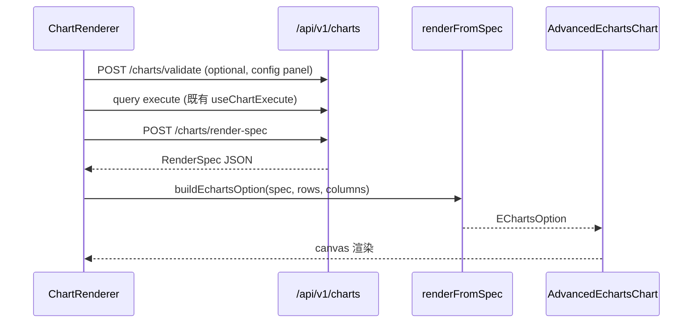

# M9 可视化高级图表类型 companion 质量推分 r43 设计 — VIZ-003/004/005/006/008

```yaml
date: 2026-07-04
milestone: M9 (F06-VIZ 横切)
round_target: docs/superpowers/evolution/2026-07-04-round-target-r43.md
prd_ids: [VIZ-005, VIZ-006, VIZ-004, VIZ-008, VIZ-003]
ui_design_skill: .agents/skills/b-design-system-tailadmin-radix/SKILL.md
status: design
base_branch: dev-auto
```

## 1. 批量主题与子项映射

本轮为 **r42 L1 kickoff 的 companion 质量推分**（闭合前端渲染、配置 UI、iframe 嵌入页、Tailwind/ECharts 主题与性能 smoke 薄弱维，目标五 ID 加权总分 **≥90**）。核心洞察：**后端 `render-spec` 契约已就绪（r42）**；本轮在前端建立 **render-spec 消费适配层 + 五高级类型渲染骨架 + 字段/样式配置 UI + Embed 表面**，镜像 r36→r37、r40→r41、r42→r43 companion 节奏。

| # | 子项 | PRD ID | 前端交付切面 | 执行顺序 | 主攻薄弱维 | 用户感知 |
|---|------|--------|--------------|:--------:|------------|----------|
| 1 | 漏斗图 | VIZ-005 | `funnel` ECharts 渲染 + 阶段/度量字段绑定 + style_variant | 3 | 完整度 **55%→≥88%**；性能 **50%→≥70%** | 漏斗图预览分层转化，配置面板可调阶段字段与样式 |
| 2 | 仪表盘/iframe 嵌入 | VIZ-006 | `/embed/*` 页面 + origin 白名单配置 UI + 非法 origin 错误态 | 5 | 完整度 **55%→≥88%**；安全性 **55%→≥70%** | 图表可 iframe 安全嵌入；非法 origin 被拦截并提示 |
| 3 | 桑基图 | VIZ-004 | `sankey` 渲染 + FieldRule 驱动字段校验 UI + `CHART_INVALID_STYLE_VARIANT` 展示 | 2 | 完整度 **58%→≥88%**；性能 **50%→≥70%** | 桑基图预览流量关系；源/目标/权重字段可绑 |
| 4 | 关系图 | VIZ-008 | `graph` 渲染 + render-spec 适配层 + 节点/边字段绑定 + 大数据边界态 | 4 | 完整度 **58%→≥88%**；性能 **50%→≥70%** | 关系/网络图预览实体关联；空数据/超大数据有明确态 |
| 5 | 地图可视化 | VIZ-003 | `map` 渲染骨架（mock GeoJSON，无外部瓦片 CDN）+ 地理维度 UI + ECharts 主题 Token | 1（registry 镜像先行，支撑配置 UI） | 完整度 **62%→≥88%**；测试覆盖 **65%→≥80%** | 地图按地理维度可视化；region/lat-lng 字段可绑 |

**依赖链**：`chartRegistry.ts`（GET `/charts/types` 镜像）+ `chartViewConfig.ts` 扩展 → `echarts-theme.ts`（Tailwind Token 对齐）→ `renderFromSpec.ts`（VIZ-008 适配层）→ 四高级渲染器（map/sankey/funnel/graph；gauge 作为 registry 可见类型保留 L1 最小仪表渲染，非本轮五 ID 主攻但可在 `AdvancedEchartsChart` 内一并落地以闭合 catalog）→ `ChartConfigPanel.tsx`（VIZ-004/005 字段+样式 UI）→ `embed/` 表面（VIZ-006）→ `ChartRenderer.tsx` 分发改造 → vitest smoke + `test_viz_advanced_l1_r43.py` + r42 35 测回归 → P5 目标各 ID **≥90**（STUCK 清零）。

**上轮已交付（本轮不重复）**：r42 后端 `app/viz/`（registry 9 类型、FieldRule、style_variants、`build_render_spec`、`validate_chart_embed_config`）+ `charts.py` 三路由 + `test_viz_advanced_l1_r42.py` 35 用例；r28/r29 表格/折线/柱 Apex 渲染 + `ChartPanel` 状态壳。

**STUCK 说明**：五 ID 各连续 1 轮（57.1–61.1）；本轮 companion 质量推分主攻，未达 ≥3 轮硬阻塞阈值。

**plan.md 状态**：M1+M1B 全 `[x]`；立项来源 `plan.archive.md` M9；**禁止**修改 `goal.md` / `plan.md` 结构。

## 2. PRD 分片锚点与 round-target 对齐

| 项 | round-target | F06-VIZ.md / r42 | 本轮处理 |
|----|--------------|------------------|----------|
| VIZ-003 | 地图渲染 + 地理维度 UI | 「图表类型插件注册」+ registry | **地图渲染 + `fe` registry 镜像** 闭合 VIZ-003 完整度；registry 插件性已由 r42 后端满足 |
| VIZ-004 | 桑基 + FieldRule UI + style 错误展示 | 「图表样式子类型」 | 桑基作为 style/field 校验 UI 载体；`bar`/`line`/`pie` style 变体在 `ChartConfigPanel` Select 中可选（非法值展示后端错误码） |
| VIZ-005 | 漏斗渲染 + 配置 UI | 「维度指标筛选配置 UI」 | 漏斗字段绑定 UI + 时间范围**不纳入**（round-target 非目标） |
| VIZ-006 | iframe 嵌入页 + origin UI | 「iframe 嵌入门户」 | 前端 Embed 表面 + 分享配置 UI；CSP/X-Frame-Options 响应头**不纳入**（留后续） |
| VIZ-008 | 关系图 + render-spec | 「ECharts/AntV 渲染适配层」 | `renderFromSpec` + ECharts option 构造；AntV **不纳入** |

**round-target 每轮必答**：用户感知见 §1；补缺型（闭合 r42 前端缺口）；不做代价（高级图表面向用户不可见）；同域批处理 5 项；共 5 项、3 模块、≤18 文件（§2.4）。

## 2.4 范围框定

**范围框定模块**（3）：

1. `fe/src/components/charts/` + `fe/src/lib/` — 高级渲染、配置 UI、主题、registry 镜像
2. `fe/src/embed/` + `fe/src/layouts/` + `fe/src/routes.tsx` — iframe 嵌入表面
3. `backend/app/viz/` + `backend/app/api/v1/charts.py`（companion 边界）+ `tests/`

**范围框定文件列表**（18 ≤ 20）：

| 文件 | 子项 | 变更类型 |
|------|------|----------|
| `fe/package.json` | VIZ-008 | 修改：新增 `echarts`、`echarts-for-react` 依赖 |
| `fe/src/lib/chartViewConfig.ts` | 全部 | 修改：扩展 9 类型 + styleVariant；`isChartViewConfig` 改 registry 驱动 |
| `fe/src/lib/chartRegistry.ts` | VIZ-003 | 新建：`fetchChartTypeCatalog()` 镜像 GET `/charts/types` |
| `fe/src/lib/echarts-theme.ts` | VIZ-003/008 | 新建：ECharts 主题（对齐 `chart-theme.ts` Token / `brand-500` 等） |
| `fe/src/assets/geo/regions-simplified.json` | VIZ-003 | 新建：精简 GeoJSON（省级 mock，无 CDN） |
| `fe/src/components/charts/adapters/renderFromSpec.ts` | VIZ-008 | 新建：`RenderSpec` 类型 + `buildEchartsOption(renderSpec, rows, columns)` |
| `fe/src/components/charts/adapters/AdvancedEchartsChart.tsx` | VIZ-003/004/005/008 | 新建：map/sankey/funnel/graph/gauge 统一 ECharts 挂载 + 性能 cap |
| `fe/src/components/charts/ChartConfigPanel.tsx` | VIZ-004/005 | 新建：维度/指标字段 Select + styleVariant Select + 校验错误展示 |
| `fe/src/components/charts/ChartRenderer.tsx` | 全部 | 修改：高级类型分发；集成 `ChartConfigPanel`（edit 模式 prop）；调用 `POST /charts/render-spec` |
| `fe/src/embed/EmbedChartPage.tsx` | VIZ-006 | 新建：chromeless 图表嵌入预览 |
| `fe/src/embed/EmbedSharePanel.tsx` | VIZ-006 | 新建：origin 白名单配置 + `POST /charts/embed/validate` |
| `fe/src/layouts/EmbedLayout.tsx` | VIZ-006 | 新建：最小 chrome（`layout.md` §4） |
| `fe/src/routes.tsx` | VIZ-006 | 修改：`/embed/chart/:chartId`、`/embed/share` 路由 |
| `fe/src/components/charts/charts.smoke.test.tsx` | 回归 | 修改：r28/r29 用例保持绿 |
| `fe/src/components/charts/charts.advanced.smoke.test.tsx` | 全部 | 新建：五类型 + 配置 UI + 性能 cap vitest |
| `backend/app/viz/embed.py` | VIZ-006 | 修改：导出 `is_origin_allowed()` 供前端/测试复用（regex 与 `_ORIGIN_RE` 一致） |
| `tests/test_viz_advanced_l1_r43.py` | 全部 | 新建（≥28 条断言） |
| `fe/src/components/README.md` | 全部 | 修改：登记新公共组件 |

> `docs/ui/layout.md`（Embed 路由）、`docs/api/README.md`（无新路由）、`docs/automate/prd/F06-VIZ.md`（P5 状态/锚点）为 P3/P5 文档同步项，不计入 P3 代码框定文件数。

**本轮性质**：M9 **companion 质量推分**（前端为主 + 后端 embed 边界闭合 + pytest/vitest）；`ui_design_skill` 已加载；不含 VIZ-007 SDK、生产地图瓦片 CDN、完整桑基布局算法优化、Dashboard 全量联调、时间范围选择器。

## 3. 架构设计

### 3.1 目标增量结构

```
fe/src/
├── lib/
│   ├── chartViewConfig.ts          # 扩展 ChartType + styleVariant
│   ├── chartRegistry.ts            # GET /charts/types 缓存镜像
│   └── echarts-theme.ts            # ECharts 语义色 / 暗色
├── assets/geo/regions-simplified.json
├── components/charts/
│   ├── ChartRenderer.tsx           # 分发：table/line/bar → Apex；advanced → ECharts
│   ├── ChartConfigPanel.tsx        # 字段 + styleVariant 配置
│   ├── ChartPanel.tsx              # 复用（不改行为）
│   └── adapters/
│       ├── renderFromSpec.ts       # render-spec → ECharts option
│       └── AdvancedEchartsChart.tsx
├── embed/
│   ├── EmbedChartPage.tsx          # /embed/chart/:chartId
│   └── EmbedSharePanel.tsx         # origin 白名单 UI
└── layouts/EmbedLayout.tsx

backend/app/viz/embed.py            # +is_origin_allowed()
tests/test_viz_advanced_l1_r43.py
```

**数据流**：



**分层遵从**（common.mdc + fe-ui.mdc）：`adapters/` 为 domain 渲染逻辑；`ChartRenderer` 为编排；`embed/` 为 entry 页面；HTTP 仅经 `@/lib/api.ts`。

### 3.2 方案比选（渲染引擎）

| 方案 | 描述 | 结论 |
|------|------|------|
| **A** 高级类型用 ECharts，table/line/bar 保留 Apex | 对齐 r42 `renderer: echarts`；最小 diff | **采用** |
| B 全量迁移 ECharts | 改动 r28/r29 已验收 Apex 路径 | 否决 — 超范围、回归风险 |
| C 全 SVG 自绘 | 无第三方 | 否决 — 不满足 VIZ-008「ECharts 适配层」 |

### 3.3 VIZ-008 — render-spec 适配层

**文件**：`renderFromSpec.ts`、`AdvancedEchartsChart.tsx`

**RenderSpec 类型**（与 r42 `build_render_spec` 输出对齐）：

```ts
type RenderSpec = {
  engine: "echarts" | "table";
  chartType: string;
  styleVariant: string;
  encoding: { dimensions: ChartFieldRef[]; metrics: ChartFieldRef[] };
  source: Record<string, unknown>;
};
```

**`buildEchartsOption` 契约**：

| chartType | 输入列映射 | option 要点 |
|-----------|-----------|-------------|
| `funnel` | dim[0]=阶段, metric[0]=值 | `series.type=funnel`，`sort=descending`；styleVariant 暂仅 `default` |
| `sankey` | dim[0]=source, dim[1]=target, metric[0]=value | `series.type=sankey`；节点/边从行聚合 |
| `graph` | dim[0]=source, dim[1]=target, metric[0]=可选权重 | `series.type=graph`，`layout=force`；超 cap 显示警告条 |
| `map` | dim[0]=region 名 或 metric 为值 | `registerMap('vs-regions', geoJson)` + `series.type=map`；无匹配 region 落 scatter 提示 |
| `gauge` | metric[0]=值 | `series.type=gauge`（bonus，闭合 catalog 可见性） |

**性能 cap**（主攻性能维 50%→≥70%）：

| 常量 | 值 | 行为 |
|------|:--:|------|
| `ADVANCED_CHART_ROW_CAP` | 500 | 超出：`ChartPanel` 内 `role=status` 警告「数据量较大，已采样显示前 500 条」 |
| `GRAPH_NODE_CAP` | 200 | 关系图节点超限：force 布局 + 采样 |
| `SANKEY_LINK_CAP` | 300 | 桑基边超限：按权重 Top-N |

**验收（可测试）**：

| ID | 断言 |
|----|------|
| T-VIZ-R43-008-01 | `buildEchartsOption` 对 funnel 合法 spec+rows 返回 `series[0].type===funnel` |
| T-VIZ-R43-008-02 | graph 201 节点输入 → option 节点数 ≤200 且 UI 警告文案存在 |
| T-VIZ-R43-008-03 | vitest：`ChartRenderer` funnel mock render-spec → `data-testid=echarts-chart` |
| T-VIZ-R43-008-04 | `POST /charts/render-spec` 合法 sankey → 200 + `engine=echarts`（r43 pytest 链） |

### 3.4 VIZ-005 — 漏斗图

**文件**：`AdvancedEchartsChart.tsx`、`ChartConfigPanel.tsx`、`ChartRenderer.tsx`

- 配置 UI：`dimensions[0]` 阶段字段 Select（来自 query columns）、`metrics[0]` 度量 Select、`styleVariant` Select（catalog 驱动，漏斗仅 `default`）
- 预览：`ChartRenderer` 在 `chartType=funnel` 时走 ECharts 路径
- 非法字段：调用 `POST /charts/validate`，展示 `CHART_FIELD_REQUIREMENT` 中文映射（页面 `mapChartConfigError`）

**验收**：

| ID | 断言 |
|----|------|
| T-VIZ-R43-005-01 | vitest：funnel 3 阶段 mock 数据 → 漏斗 series 可见 |
| T-VIZ-R43-005-02 | vitest：缺 metric → 配置面板展示字段错误文案 |
| T-VIZ-R43-005-03 | vitest：501 行 → 警告 + 渲染不抛错 |
| T-VIZ-R43-005-04 | pytest：funnel validate + render-spec 链 200（r42 回归 + r43 增量） |

### 3.5 VIZ-004 — 桑基图 + 样式子类型 UI

**文件**：`ChartConfigPanel.tsx`、`AdvancedEchartsChart.tsx`

- 字段 UI：2×维度（源/目标）+ 1×度量；FieldRule `note` 作 `FormDescription` 辅助文案
- styleVariant：`Select` 选项来自 `chartRegistry` 的 `styleVariants`；提交非法值 → Alert 展示 `CHART_INVALID_STYLE_VARIANT`（含后端 message）
- 桑基仅 `default` variant，但 **bar** 的 `stacked/grouped/horizontal` 须在面板可选（闭合 VIZ-004 style 生效项中对基础类型的覆盖）

**验收**：

| ID | 断言 |
|----|------|
| T-VIZ-R43-004-01 | vitest：sankey 2 维+1 度量 → echarts 容器 |
| T-VIZ-R43-004-02 | vitest：`styleVariant=invalid` → alert 含「样式」或错误码 |
| T-VIZ-R43-004-03 | vitest：bar `stacked` mock → Apex plotOptions stacked 生效（mock apex options 断言） |
| T-VIZ-R43-004-04 | pytest：sankey 缺维 → 422 `CHART_FIELD_REQUIREMENT`（r42 回归） |

### 3.6 VIZ-003 — 地图可视化

**文件**：`regions-simplified.json`、`echarts-theme.ts`、`AdvancedEchartsChart.tsx`、`chartRegistry.ts`

- **无外部瓦片 CDN**：内置精简 GeoJSON（≥10 省级 polygon）；`dim[0]` 为 region 名称字段
- 主题：`echarts-theme.ts` 使用 `chartPalette` / CSS 变量语义色；`dark:` 下 grid/label 对比度与 `chart-theme.ts` 一致
- 未匹配 region：地图区展示「部分区域无地理匹配」+ 表格 fallback 前 10 行（`ChartPanel` empty 子态）

**验收**：

| ID | 断言 |
|----|------|
| T-VIZ-R43-003-01 | vitest：map + 3 省 mock → echarts 容器 |
| T-VIZ-R43-003-02 | vitest：`fetchChartTypeCatalog` mock 9 类型含 map |
| T-VIZ-R43-003-03 | vitest：echarts-theme 暗色 label 色非空 |
| T-VIZ-R43-003-04 | pytest：GET `/charts/types` 含 map + fieldRule（r42 回归） |

### 3.7 VIZ-006 — iframe 嵌入

**文件**：`EmbedLayout.tsx`、`EmbedChartPage.tsx`、`EmbedSharePanel.tsx`、`routes.tsx`、`embed.py`

**路由**（对齐 `layout.md` §4，本轮最小闭环）：

| 路由 | 用途 |
|------|------|
| `/embed/chart/:chartId` | chromeless 单图表预览（query: `theme=light\|dark`） |
| `/embed/share` | 嵌入配置：chartId + allowedOrigins 列表 + 预览 iframe |

**origin 守卫链**：

1. `EmbedSharePanel`：Origin 输入（`Input` + 添加 `Badge` 列表）；前端预检 `is_origin_allowed` 同款 regex
2. 提交 `POST /charts/embed/validate`；非法 → `role=alert` 展示 `EMBED_INVALID_ORIGIN` / `detail.fields`
3. 合法 → 生成 embed URL 文案 + `<iframe src=...>` 预览（sandbox=`allow-scripts` 最小集）
4. 模拟非法 parent origin：vitest mock `window.location.origin` 不在白名单 → 全屏错误态「当前来源未授权嵌入」

**后端 companion**：`embed.py` 导出 `is_origin_allowed(origin: str, allowed: list[str]) -> bool`（空列表=不限制，与 r42 语义一致并在 r43 pytest 断言）。

**验收**：

| ID | 断言 |
|----|------|
| T-VIZ-R43-006-01 | vitest：`EmbedSharePanel` 非法 origin `not-a-url` → 字段错误 |
| T-VIZ-R43-006-02 | vitest：合法配置 → iframe `title` 可访问 |
| T-VIZ-R43-006-03 | vitest：未授权 origin → 错误态文案 |
| T-VIZ-R43-006-04 | pytest：`is_origin_allowed` 单元 + `POST /charts/embed/validate` r42 7 用例回归 |

### 3.8 ChartRenderer 集成改造

**文件**：`ChartRenderer.tsx`

- 新增可选 prop `mode?: "preview" | "config"`；`config` 时右侧/下方渲染 `ChartConfigPanel`
- 高级类型流程：`useChartExecute` 取数 → `apiFetch POST /charts/render-spec` → `AdvancedEchartsChart`
- 保持 table/line/bar 既有 Apex 路径不变（r28/r29 回归）
- `DashboardWidget` 默认 `preview`；后续 `/admin/charts/explore` 可用 `config`（本轮不建页，仅在 `ChartRenderer` 预留 prop）

## 4. UI 设计交付

```yaml
ui_design_skill: .agents/skills/b-design-system-tailadmin-radix/SKILL.md
```

### 4.1 页面信息架构

| 表面 | 导航层级 | 主内容区 | 空/加载/错误/权限态 |
|------|----------|----------|---------------------|
| **Embed 图表** `/embed/chart/:id` | 无壳层（EmbedLayout） | 100% 宽高；`ChartPanel` 占满 | 加载：`Skeleton min-h-[240px]`；空：「暂无数据」；错误：`role=alert` + 重试；未授权 origin：全屏错误卡片 |
| **Embed 分享配置** `/embed/share` | 无壳层；单列表单 | `max-w-2xl` 居中（编辑密度） | 校验错误：字段下 `FormMessage`；API 错误：`Alert variant=destructive` |
| **Dashboard 内图表**（既有） | Admin 壳层 → 看板 edit/view | 栅格卡片内 `ChartPanel` | 复用 r29 态；新增配置面板折叠区 |

### 4.2 视觉层级

- **主操作**：Embed 分享页「校验并生成嵌入链接」→ `Button variant=default`
- **次操作**：origin 添加/删除 → `Button variant=outline` / `IconButton`
- **承载关系**：`ChartPanel`（卡片壳）→ 图表画布 / 配置 `ChartConfigPanel`（`rounded-xl border` 与 Dashboard 卡片一致）→ 字段 `Select`+`Label` 纵向表单
- **禁止**：整页空白 div 堆叠；图表区高度 `<180px`（与 `chart-theme.md` 一致，Embed 可用 `min-h-[240px]`）

### 4.3 组件映射

| 需求 | 复用 | 新建/扩展 |
|------|------|-----------|
| 图表壳 loading/empty/error | `ChartPanel` | — |
| 字段选择 | `Select`、`Label` | `ChartConfigPanel` |
| 样式变体 | `Select` | 选项来自 `chartRegistry` |
| 错误展示 | `Alert` | `mapChartConfigError`（`fe/src/lib/chartErrors.ts`，≤40 行） |
| 嵌入预览 iframe | — | `EmbedChartPage` 内原生 `iframe` + `rounded-lg border` |
| 主/次按钮 | `Button` | — |
| 高级图表 | — | `AdvancedEchartsChart`（禁止页面内重画图表容器样式） |

### 4.4 Token 与密度

- 语义色：`brand-500`、`gray-200/800` 边框、`error-500` 错误壳 — 与 `ChartPanel` / `fe-ui.mdc` 一致
- ECharts：`echarts-theme.ts` 映射 `chartPalette` hex（`@design-token-ok` 注释）；暗色 `html.dark` 下 axisLabel/tooltip 对比度 ≥4.5:1
- 表单控件：`h-11`、`rounded-lg`、`text-theme-sm`
- 图表容器：`min-h-[180px]`（Dashboard）/ `min-h-[240px]`（Embed）；`overflow-x-auto` 宽图

### 4.5 响应式与可访问性

- **桌面**：配置面板与图表上下堆叠（`<lg`）或左右分栏（`lg:grid lg:grid-cols-2`）
- **窄屏**：Embed 100% 宽；表格 fallback 横向滚动
- **键盘**：`Select`/`Button` 可 Tab；`focus-visible:ring-3`
- **aria**：图表区 `aria-label="{displayName}图表"`；iframe `title="嵌入图表预览"`；错误 `role=alert`
- **长文本**：origin URL `truncate` + `title` tooltip；字段名超长 `max-w-full truncate`

### 4.6 视觉 QA 清单

实施完成后须截图或浏览器检查（`references/ui-drift-review-checklist.md` + `bi-chart-interaction-review-checklist.md` 抽检）：

- [ ] Desktop light：`/embed/share` 表单对齐、无大面积空白
- [ ] Desktop dark：ECharts 轴标签可读
- [ ] Mobile（375px）：Embed 图表无横向溢出遮挡
- [ ] 漏斗/桑基/关系/地图：有数据态层级清晰
- [ ] 空数据、501 行采样、非法 origin、非法 styleVariant 四态截图
- [ ] 无控件重叠、文字裁切、`check:design` 通过

## 5. 测试策略

### 5.1 前端 vitest（`charts.advanced.smoke.test.tsx`）

- Mock `@/lib/api`、`echarts-for-react`（与现有 Apex mock 对称）
- 覆盖五类型渲染容器、配置面板错误、性能警告、Embed origin 守卫
- 保持 `charts.smoke.test.tsx` 7 用例全绿

### 5.2 后端 pytest（`test_viz_advanced_l1_r43.py`）

| 类别 | 数量 | 说明 |
|------|:----:|------|
| `is_origin_allowed` 单元 | ≥4 | 空列表、匹配、端口、非法 |
| render-spec 链 | ≥6 | funnel/sankey/graph/map 各 1 + 非法 type |
| embed HTTP 回归 | ≥7 | 复用 r42 断言 ID |
| field/style 回归 | ≥8 | r42 `CHART_FIELD_REQUIREMENT` / `CHART_INVALID_STYLE_VARIANT` |
| catalog | ≥3 | 9 类型 + advanced 子集 |

**回归门控**：`test_viz_advanced_l1_r42.py` 35/35 + `test_viz_dash_l1_r28` + `charts.smoke.test.tsx` 全绿。

### 5.3 验证命令（P4 引用）

```bash
cd backend && python3 -m pytest tests/test_viz_advanced_l1_r43.py tests/test_viz_advanced_l1_r42.py -q
cd fe && pnpm exec vitest run src/components/charts/
cd fe && pnpm run check:design
```

## 6. 非目标（明确不做）

- VIZ-007 JS SDK 初始化/销毁
- 生产级地图瓦片 CDN、完整桑基布局优化、AntV 引擎
- Dashboard 编排全量联调、`/admin/charts/explore` 独立路由页
- 时间范围选择器、filters[] SQL 注入防护
- HTTP 响应头 CSP / `X-Frame-Options` 生产配置
- 修改 `goal.md` / `plan.md` 结构
- API-003、NFR-006/007、CONN-016~020、QUERY-009 等远期项

## 7. PRD 8 维薄弱项对齐

| PRD ID | 选题时薄弱维 | 本轮闭合手段 | 目标 |
|--------|-------------|-------------|:----:|
| VIZ-005 | 性能 50%、完整度 55% | 漏斗 ECharts + 配置 UI + 500 行 cap smoke | ≥90 |
| VIZ-006 | 完整度 55%、安全性 55% | Embed 页 + origin UI + `is_origin_allowed` 双端守卫 | ≥90 |
| VIZ-004 | 性能 50%、完整度 58% | 桑基渲染 + styleVariant Select + 非法样式错误展示 | ≥90 |
| VIZ-008 | 性能 50%、完整度 58% | render-spec 适配层 + graph 渲染 + 节点 cap | ≥90 |
| VIZ-003 | 性能 50%、完整度 62%、测试 65% | map mock GeoJSON + registry 镜像 + vitest/pytest 增量 | ≥90 |

## 8. P5 文档同步清单（非 P3 代码）

| 变更 | 文档 |
|------|------|
| Embed 路由落地 | `docs/ui/layout.md` §4 状态注记 |
| 前端锚点 | `docs/automate/prd/F06-VIZ.md` VIZ-003~008 状态/锚点/验收勾选 |
| 无新 HTTP 路由 | `docs/api/README.md` 仅锚点补充（若需） |
| 公共组件 | `fe/src/components/README.md`（已入框定） |

## 9. 风险与缓解

| 风险 | 缓解 |
|------|------|
| ECharts 包体积 | 仅 import 所需 chart type（tree-shake）；dynamic import `AdvancedEchartsChart` |
| GeoJSON 匹配率低 | 未匹配 region 表格 fallback + 中文提示 |
| `chartViewConfig` 类型扩展破坏 Dashboard 存盘 | `isChartViewConfig` 放宽为 registry 校验；旧 widget 仅 table/line/bar 不受影响 |
| 性能 smoke 不稳定 | 不断言绝对毫秒；断言 cap 后节点/行数 + 警告 DOM 存在 |

---

**Self-review**：已覆盖 round-target 五子项；文件列表 18 ≤ 20；无 TBD/TODO；UI 设计交付 §4 完整；未写生产代码。
