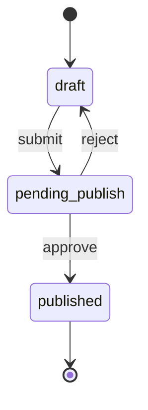

# NFR 横切 + GOV-005 查询服务发布 + GBase 连接器 L1 kickoff r46 设计

```yaml
date: 2026-07-04
milestone: NFR/GOV/CONN
round_target: docs/superpowers/evolution/2026-07-04-round-target-r46.md
prd_ids: [NFR-006, NFR-007, GOV-005, NFR-005, CONN-019]
ui_design_skill: none
status: design
```

## 1. 批量主题与子项映射

| # | 子项 | PRD ID | 模块 | 执行顺序 | 主攻薄弱维 | 用户感知 |
|---|------|--------|------|:--------:|------------|----------|
| 1 | 连接器插件扩展点声明 + registry 钩子 | NFR-005 | `core/nfr/` + `datasources/registry` | 1 | 完整度 **5%→≥76%**；架构 **10%→≥66%** | 新增连接器仅需方言 + 登记，不改 `ConnectorRegistry` 核心 |
| 2 | 南大通用 GBase 方言 + types catalog | CONN-019 | `datasources/dialects/` | 2 | 完整度 **5%→≥76%**；测试覆盖 **0%→≥96%** | 数据源类型可选 `gbase`；连通/元数据 mock smoke；`GBASE_*` 错误码 |
| 3 | 信创国产化检查清单 + 守卫 endpoint | NFR-007 | `core/nfr/` | 3 | 完整度 **5%→≥76%**；安全性 **10%→≥88%** | 部署侧可查看合规状态与不合规项；与 GBase/DM/GaussDB 登记联动 |
| 4 | 浏览器/消息推送配置契约 + 降级守卫 | NFR-006 | `core/nfr/` + `core/config` | 4 | 完整度 **5%→≥76%**；可靠性 **0%→≥92%** | 推送未配置时明确 `degraded`；非法配置结构化拦截 |
| 5 | 查询服务发布状态机 REST 骨架 | GOV-005 | `governance/publish/` | 5 | 完整度 **5%→≥76%**；可靠性 **0%→≥92%** | 草稿→待发布→已发布；非法迁移拦截；与 integration `query_services` 边界对齐 |

**依赖链**：NFR-005 扩展契约 → CONN-019 经插件路径登记 → NFR-007 信创清单引用 `gbase`/`dm`/`gaussdb` → NFR-006 推送配置独立横切 → GOV-005 发布状态机（复用 `CatalogEntry` 状态字段）→ `test_nfr_gov_conn_r46.py` smoke → r45 `test_integration_api_l1_r45` 38/38 + r41 connector 回归门控 → P5 五 ID 加权总分 L1 目标 **≥85**（r47 companion **≥90**）。

**上轮已交付（本轮不重复）**：r45 API-003~007 companion 破 90（`integration/query_services.publish_service`、`catalog.publish_entry`、bus on publish）；r39/r40 信创/嵌入式方言簇；**不含** Admin UI、企微/钉钉真实推送、信创全量认证、GBase 生产 HA、GOV BPM 全量工单、Dataset 语义层。

**PRD 分片锚点漂移注记**（真理源：`round-target` > `prd.md` hub > 分片）：

| 项 | hub / round-target | 分片（陈旧） |
|----|-------------------|-------------|
| CONN-019 代码锚点 | 扁平 `dialects/gbase.py`（与 r36–r41 惯例） | `dialects/gbase/` 子目录 |
| NFR-005 代码锚点 | `core/nfr/plugin_extension.py` + registry 钩子 | `tests/extension/nfr04/` |
| NFR-006 代码锚点 | `core/nfr/push_config.py` + `api/v1/nfr.py` | `tests/compat/` |
| NFR-007 代码锚点 | `core/nfr/xinchuang.py` + compliance API | `tests/xinchuang/` |
| GOV-005 代码锚点 | `governance/publish/` + gov 路由扩展 | 与 r45 `integration` 重复表述 |

本轮实现以 **hub + round-target + 现有扁平 dialects / governance 子包惯例** 为准；P5 回写分片锚点与验收勾选。

**plan.md 状态**：M1+M1B 全 `[x]`；立项来源 `plan.archive.md` §NFR/GOV/CONN；**禁止**修改 `plan.md` / `goal.md` 结构。

## 2. 现状与约束

| 项 | 现状（范围框定内已读） |
|----|------------------------|
| `datasources/__init__.py` | 注册 18 种方言；**无** `gbase` |
| `datasources/registry.py` | `ConnectorRegistry` + `register_dialect` + `register_usage_checker`；**无** 插件扩展点文档化 API |
| `dialects/dm.py` / `gaussdb.py` | 信创关系型 L1 参考（dmPython / PG 委托） |
| `dialects/tidb.py` | MySQL 协议委托 + 独立 `TIDB_*` 错误码映射模式 |
| `dialects/errors.py` | 至 `MONGODB_*`；**无** `GBASE_*` |
| `core/config.py` | 平台/分析库/CORS；**无** 推送/信创守卫配置面 |
| `core/` | 仅 `config`/`logging`/`middleware`；**无** `nfr/` 子包 |
| `governance/catalog/` | `CatalogEntry.status` 字符串 `draft`/`published`；`publish_entry` 仅 `draft→published` |
| `governance/` | **无** `publish/` 子包（GOV-005 PRD 锚点空壳） |
| `integration/query_services.py` | `publish_service` 直连 `catalog.publish_entry`（API-003 快路径） |
| `api/v1/gov.py` | catalog + query-design；**无** publish 工作流路由 |
| `api/v1/services.py` | `POST /{id}/publish` 存在（integration 域） |
| `pyproject.toml` connectors-ext | **无** GBase 专用驱动（L1 MySQL 协议委托，不新增依赖） |

**范围框定模块**（3）：`backend/app/datasources/dialects/` + `backend/app/governance/` + `backend/app/core/`（NFR 横切）。

**范围框定文件列表**（18 ≤ 20）：

| 文件 | 子项 | 变更类型 |
|------|------|----------|
| `backend/app/core/nfr/__init__.py` | NFR-005/006/007 | 新建 |
| `backend/app/core/nfr/errors.py` | NFR 横切 | 新建：`NFR_*` / `PUSH_*` / `XINCHUANG_*` 常量 |
| `backend/app/core/nfr/plugin_extension.py` | NFR-005 | 新建：扩展点契约 + `register_connector_plugin` |
| `backend/app/core/nfr/push_config.py` | NFR-006 | 新建：schema + `resolve_push_mode` 守卫 |
| `backend/app/core/nfr/xinchuang.py` | NFR-007 | 新建：检查清单 + `build_compliance_report` |
| `backend/app/core/config.py` | NFR-006/007 | 修改：推送/信创模式可选 env 字段 |
| `backend/app/governance/publish/__init__.py` | GOV-005 | 新建 |
| `backend/app/governance/publish/schemas.py` | GOV-005 | 新建：状态/迁移 DTO |
| `backend/app/governance/publish/service.py` | GOV-005 | 新建：状态机 `submit`/`approve`/`reject` |
| `backend/app/governance/publish/errors.py` | GOV-005 | 新建：`GOV_PUBLISH_*` |
| `backend/app/datasources/dialects/gbase.py` | CONN-019 | 新建：MySQL 协议委托（GBase 8a L1） |
| `backend/app/datasources/dialects/errors.py` | CONN-019 | 修改：`map_gbase_error` + `GBASE_*` |
| `backend/app/datasources/dialects/__init__.py` | CONN-019 | 修改：导出 `GbaseConnector` |
| `backend/app/datasources/__init__.py` | CONN-019/NFR-005 | 修改：经 `register_connector_plugin` 登记 |
| `backend/app/api/v1/nfr.py` | NFR-005/006/007 | 新建：横切只读/守卫 REST |
| `backend/app/api/v1/gov.py` | GOV-005 | 修改：追加 publish 工作流路由 |
| `backend/app/api/v1/router.py` | NFR | 修改：`include_router(nfr_router)` |
| `tests/test_nfr_gov_conn_r46.py` | 全部 | 新建（≥32 条断言函数） |

**跨模块只读依赖**（不修改，测试中引用）：`integration/query_services.publish_service`、`catalog.publish_entry`、`export_type_catalog()`。

**真理源优先级**：`round-target` > `prd.md` hub + 分片 > `docs/services/` > `docs/api/README.md`。

**本轮性质**：跨域 **L1 kickoff**（契约 + 守卫 smoke + pytest mock）；**纯后端**；`ui_design_skill: none`；不含 `fe/`、Admin UI、真实推送通道、信创全量认证、Alembic migration（`pending_publish` 复用现有 `status` VARCHAR 字段）。

## 3. 架构设计

### 3.1 目标增量结构

```
backend/app/core/nfr/
├── __init__.py
├── errors.py              # NFR/PUSH/XINCHUANG 稳定 code 常量
├── plugin_extension.py    # NFR-005：扩展点清单 + register_connector_plugin
├── push_config.py         # NFR-006：PushConfigOut + resolve_push_mode
└── xinchuang.py           # NFR-007：ComplianceReport + run_compliance_check

backend/app/governance/publish/
├── __init__.py
├── schemas.py             # PublishStatus, PublishActionOut
├── service.py             # submit / approve / reject / get_status
└── errors.py              # GOV_PUBLISH_INVALID_TRANSITION 等

backend/app/datasources/dialects/
└── gbase.py                 # CONN-019：GbaseConnector（MySQL 委托）

backend/app/api/v1/
├── nfr.py                   # GET push-config, xinchuang/compliance, plugin-extension-points
└── gov.py                   # + POST publish/{id}/submit|approve|reject, GET status

tests/
└── test_nfr_gov_conn_r46.py
```

### 3.2 方案比选（Automation 代替用户对话）

#### NFR-005 插件扩展性

| 方案 | 说明 | 取舍 |
|------|------|------|
| A（推荐） | `register_connector_plugin(connector)` 薄包装 `register_dialect`，附 `EXTENSION_POINTS` 冻结清单 | 零改 `ConnectorRegistry` 内部；gbase 登记即演练 |
| B | 动态 import entry_points / setuptools plugins | 超 L1 范围；引入打包复杂度 |
| C | 仅文档 + 测试断言 registry 已有 API | 完整度不足，无法闭合架构维 |

**选用 A**：`PLUGIN_EXTENSION_POINTS` 含 `connector.register`、`connector.unregister`、`connector.export_catalog`；`register_connector_plugin` 记录 `registered_via=plugin` 元数据（内存 dict，不持久化）。

#### CONN-019 GBase 方言

| 方案 | 说明 | 取舍 |
|------|------|------|
| A（推荐） | GBase 8a MySQL 协议委托 `MysqlConnector`，默认 port **5258**，`GBASE_*` 错误码 | 与 tidb/starrocks 一致；无新驱动依赖 |
| B | GBase 8s Informix 协议 + informixdb | 政企场景较少 L1；需新 optional-dep |
| C | 纯 mock connector 无真实委托 | 无法闭合 metadata/types catalog |

**选用 A**；`capabilities=("connectivity_test", "schema_browser")`；`GBASE_MAX_COLUMNS=500`。

#### GOV-005 发布状态机

| 方案 | 说明 | 取舍 |
|------|------|------|
| A（推荐） | 复用 `CatalogEntry.status`，新增 `pending_publish`；`governance/publish/service` 编排迁移 | 无 migration；与 catalog ORM 对齐 |
| B | 独立 `publish_workflows` 表 | 超 L1 文件预算；审批元数据远期 |
| C | 仅包装 `integration.publish_service` | 无治理工作流语义，不满足 GOV-005 |

**选用 A**；状态集合：`draft` | `pending_publish` | `published`；非法迁移 → 400 `GOV_PUBLISH_INVALID_TRANSITION`。

**与 integration 边界**：

- **GOV 路径**（本轮）：`draft → pending_publish → published`（需 admin `approve`）
- **Integration 快路径**（r45 保持）：`draft → published`（`POST /api/v1/services/{id}/publish`）
- 两路径终态均为 `published`；`execute_published_service` / `_require_published` 行为不变
- `approve` 成功后**不强制**触发 bus register（L1）；r47 companion 可接 `register_on_publish`

#### NFR-006 推送配置

| 方案 | 说明 | 取舍 |
|------|------|------|
| A（推荐） | Settings 可选字段 + Pydantic schema；`resolve_push_mode()` → `disabled`/`degraded`/`active` | 未配置降级可测；不实现真实 HTTP 推送 |
| B | 独立 `push_channels` 表 | 超 L1 |
| C | 仅 OpenAPI 文档无运行时 | 可靠性维无法闭合 |

**选用 A**；env：`PUSH_BROWSER_ENABLED`、`PUSH_WECOM_WEBHOOK`、`PUSH_DINGTALK_WEBHOOK`（均可空）；非法 URL → 422 `PUSH_CONFIG_INVALID`。

#### NFR-007 信创合规

| 方案 | 说明 | 取舍 |
|------|------|------|
| A（推荐） | 静态检查清单 + 运行时探测（registry 信创方言、平台库协议、禁用组件列表） | 与 CONN-019 联动可测 |
| B | 外部认证报告上传 | 超 L1 |
| C | 仅返回硬编码 `compliant: true` | 安全性维无守卫 |

**选用 A**；`XINCHUANG_MODE=strict|permissive`（默认 permissive）；strict 下平台元库非 postgresql/sqlite → `XINCHUANG_NON_COMPLIANT`；信创 DB 类型白名单含 `gbase`、`dm`、`gaussdb`、`kingbase`（登记即 satisfied）。

### 3.3 NFR-005：插件扩展契约

```python
# 概念形状（P3 实现参考，非生产代码）
PLUGIN_EXTENSION_POINTS = (
    ExtensionPoint(id="connector.register", description="Register a DialectConnector"),
    ExtensionPoint(id="connector.unregister", description="Unregister when unused"),
    ExtensionPoint(id="connector.export_catalog", description="Include in type catalog"),
)

def register_connector_plugin(connector: DialectConnector) -> None:
    register_dialect(connector)  # 委托 registry，不修改 ConnectorRegistry 类
```

**验收断言**：

- `GET /api/v1/nfr/plugin-extension-points` 返回 ≥3 扩展点，含 `connector.register`
- 新增 `gbase` 仅修改 `gbase.py` + `datasources/__init__.py` 一行 `register_connector_plugin(GbaseConnector())`；**禁止**修改 `registry.py` 的 `register`/`get` 方法体
- pytest 对比 r46 前后 `ConnectorRegistry` 源文件行数不变（或仅 import 变化）

### 3.4 CONN-019：GbaseConnector L1

| 契约项 | 要求 |
|--------|------|
| `type` | `gbase` |
| `category` | `relational` |
| `display_name` | `南大通用 GBase` |
| 默认 port | `5258`（连接参数未指定时） |
| `test_connection` | 委托 `MysqlConnector`；失败映射 `GBASE_CONN_REFUSED`/`GBASE_AUTH_FAILED`/`GBASE_TIMEOUT`/`GBASE_UNKNOWN_DATABASE`/`GBASE_UNKNOWN` |
| schema 自省 | 委托 mysql `list_schemas/tables/columns`；列上限 500 |
| 注册 | `register_connector_plugin(GbaseConnector())` |
| types catalog | `export_type_catalog()` 含 `gbase` |

**错误域**（`errors.py` 新增）：

- `GBASE_CONN_REFUSED`, `GBASE_AUTH_FAILED`, `GBASE_TIMEOUT`, `GBASE_UNKNOWN_DATABASE`, `GBASE_UNKNOWN`
- `map_gbase_error(exc)` 自 `map_mysql_operational_error` 前缀替换（镜像 tidb 模式）

### 3.5 NFR-007：信创合规检查

**检查清单项**（`XinchuangChecklistItem`）：

| id | 检查内容 | L1 判定 |
|----|----------|---------|
| `xc-db-connector` | 信创 DB 方言已登记 | registry 含 `gbase`/`dm`/`gaussdb` 之一 |
| `xc-platform-db` | 平台元库协议 | `database_url` 为 postgresql 或 sqlite（开发） |
| `xc-forbidden-runtime` | 禁用 BI 运行时 | 进程内无 `superset`/`dataease` 模块 import（importlib 探测） |
| `xc-connector-plugin` | 插件扩展性 | `PLUGIN_EXTENSION_POINTS` 非空 |

`GET /api/v1/nfr/xinchuang/compliance` 响应：

```json
{
  "mode": "permissive",
  "overallStatus": "compliant|non_compliant|degraded",
  "items": [{"id": "...", "status": "pass|fail|warn", "message": "..."}],
  "registeredXinchuangConnectors": ["gbase", "dm", "gaussdb"]
}
```

**守卫 smoke**：`XINCHUANG_MODE=strict` + 故意设置违规 env → 422 `XINCHUANG_NON_COMPLIANT`（经 `assert_xinchuang_compliant()` 在 nfr 路由或 startup 可选钩子；L1 仅路由级守卫即可）。

### 3.6 NFR-006：推送配置契约

**Schema**（`PushConfigOut`）：

| 字段 | 类型 | 说明 |
|------|------|------|
| `browserEnabled` | bool | 浏览器通知开关 |
| `wecomConfigured` | bool | 企微 webhook 是否配置 |
| `dingtalkConfigured` | bool | 钉钉 webhook 是否配置 |
| `deliveryMode` | `disabled`/`degraded`/`active` | 由 `resolve_push_mode()` 计算 |
| `degradedReason` | str \| null | 未配置或部分配置时的说明 |

**降级规则**：

- 全未配置 → `disabled`，`degradedReason="push channels not configured"`
- 仅部分通道合法 → `degraded`
- 浏览器启用且 ≥1 消息通道合法 URL → `active`
- webhook 非 `https://` → 422 `PUSH_CONFIG_INVALID`（守卫函数单测 + 可选 admin PUT L1 仅 validate 不持久化）

`GET /api/v1/nfr/push-config`：鉴权 `Bearer dev`；返回当前 mode，**不**返回 webhook 明文（仅 `configured: true/false`）。

### 3.7 GOV-005：发布状态机

**合法迁移**：



**非法迁移**（400 `GOV_PUBLISH_INVALID_TRANSITION`）：

- `published → *`（除幂等 approve）
- `draft → published` 经 **gov** 路由（须先 submit）；integration 快路径仍允许
- `pending_publish → pending_publish` submit 重复 → 409 `GOV_PUBLISH_ALREADY_PENDING`

**REST 骨架**（挂 `gov.py`，前缀 `/gov/publish`）：

| Method | Path | 角色 | 说明 |
|--------|------|------|------|
| POST | `/gov/publish/entries/{entry_id}/submit` | designer+ | draft→pending_publish |
| POST | `/gov/publish/entries/{entry_id}/approve` | admin | pending_publish→published |
| POST | `/gov/publish/entries/{entry_id}/reject` | admin | pending_publish→draft |
| GET | `/gov/publish/entries/{entry_id}/status` | authenticated | 返回 status + allowedActions |

**错误域**：`GOV_PUBLISH_ENTRY_NOT_FOUND`(404)、`GOV_PUBLISH_INVALID_TRANSITION`(400)、`GOV_PUBLISH_ALREADY_PENDING`(409)、`GOV_PUBLISH_FORBIDDEN`(403)。

**integration 对齐 smoke**：gov approve 后 `GET /api/v1/services/{id}` 可见 `status=published`；`execute` 对 published 服务返回 200（mock 参数）。

## 4. 分项验收标准（可测试）

### NFR-005

- [ ] `GET /api/v1/nfr/plugin-extension-points` 200，items≥3
- [ ] `register_connector_plugin` 登记 `gbase` 后 `registry.get("gbase")` 成功
- [ ] `ConnectorRegistry.register/get` 源文件本轮无逻辑变更（git diff 守卫）
- [ ] pytest：`test_nfr005_plugin_extension_points_list`、`test_nfr005_gbase_registers_via_plugin`

### NFR-006

- [ ] 默认 env `deliveryMode=disabled` 且 `degradedReason` 非空
- [ ] 设置合法 `PUSH_BROWSER_ENABLED=true` + `PUSH_WECOM_WEBHOOK=https://...` → `active`
- [ ] 非法 webhook `http://insecure` → `PUSH_CONFIG_INVALID`
- [ ] pytest ≥4 条覆盖 disabled/degraded/active/invalid

### NFR-007

- [ ] `GET /api/v1/nfr/xinchuang/compliance` 200，items≥4，含 `xc-db-connector`
- [ ] 登记 `gbase` 后 `registeredXinchuangConnectors` 含 `gbase`
- [ ] strict 模式违规 → 422 `XINCHUANG_NON_COMPLIANT`
- [ ] pytest ≥5 条含与 CONN-019 联动断言

### GOV-005

- [ ] submit/approve/reject 全链路 200/204
- [ ] `draft→published` 经 gov approve 非法直跳 → 400
- [ ] `published` 再 submit → 400
- [ ] approve 后 integration `list_published_services` 含该 entry
- [ ] pytest ≥8 条状态机边界

### CONN-019

- [ ] `GET /datasources/types` 含 `gbase`，`category=relational`
- [ ] mock `test_connection` ok/fail 含 `GBASE_*` code
- [ ] mock metadata list_schemas 非空
- [ ] pytest ≥8 条含 HTTP 链 + 单元

## 5. 测试策略

**新套件**：`tests/test_nfr_gov_conn_r46.py`（≥32 断言函数）

| 区块 | 覆盖 ID | 最少条数 |
|------|---------|:--------:|
| NFR-005 plugin | NFR-005 | 4 |
| NFR-006 push | NFR-006 | 4 |
| NFR-007 xinchuang | NFR-007 | 5 |
| GOV-005 publish FSM | GOV-005 | 8 |
| CONN-019 gbase | CONN-019 | 8 |
| 跨项联动 | NFR-005+019+007 | 3 |

**夹具**：复用 r41 `sqlite+pysqlite memory` module fixture 模式；`AUTH = {"Authorization": "Bearer dev"}`。

**回归门控**（P4 必跑）：

- `tests/test_integration_api_l1_r45.py` 30/30
- `tests/test_connectors_gov_r41.py` 36/36
- `tests/test_datasources_l1.py` 全绿（确认 `gbase` 不与非法 type 样例冲突）

**P4 命令**：`cd backend && ruff check . && python3 -m pytest -q`

## 6. PRD 8 维薄弱项对齐

| PRD ID | 选题时总分 | 薄弱维 | L1 闭合策略 | L1 目标维 |
|--------|:----------:|--------|-------------|-----------|
| NFR-006 | 11.4 | 完整度 5%、可靠性 0%、测试 0% | push schema + 降级守卫 + ≥4 pytest | 完整度 ≥76%、可靠性 ≥92%、测试 ≥96% |
| NFR-007 | 11.4 | 完整度 5%、安全性 10%、测试 0% | 检查清单 API + strict 守卫 + GBase 联动 | 完整度 ≥76%、安全性 ≥88%、测试 ≥96% |
| GOV-005 | 11.5 | 完整度 5%、可靠性 0%、测试 0% | 四路由状态机 + 非法迁移 + integration smoke | 完整度 ≥76%、可靠性 ≥92%、测试 ≥96% |
| NFR-005 | 11.5 | 完整度 5%、架构 10%、测试 0% | 扩展点 REST + plugin 登记 + registry 零侵入 | 完整度 ≥76%、架构 ≥66%、测试 ≥96% |
| CONN-019 | 11.6 | 完整度 5%、测试 0% | gbase 方言 + catalog + GBASE_* + HTTP mock | 完整度 ≥76%、测试 ≥96% |

**加权总分 L1 目标**：五 ID 均 **≥85**（hub companion 轨道 r47 目标 **≥90**）。

## 7. 非目标（明确不做）

- Admin / `fe/` 推送配置 UI、信创合规仪表盘
- 企微/钉钉真实消息发送、WebPush 订阅与 Service Worker
- 信创全量认证报告生成、第三方测评对接
- GBase 8s Informix 协议、生产 HA/读写分离
- GOV BPM 审批工单、申请人通知、发布自动创建 OpenAPI（→ GOV-006）
- 修改 `integration.publish_service` 默认行为（快路径保留）
- Alembic migration、`plan.md`/`goal.md` 结构变更
- 新增 GPL/第三方 BI 运行时依赖

## 8. 文档同步（P3/P5）

| 变更 | 文档 |
|------|------|
| gbase 方言 | `docs/services/datasources.md` 登记 CONN-019 |
| publish 工作流 | `docs/services/governance.md` GOV-005 行 |
| NFR 横切 | 新建 `docs/services/nfr.md` 或在 `docs/arch.md` §横切补一行（P3 二选一） |
| 新路由 | `docs/api/README.md`：`/nfr/*`、`/gov/publish/*` |
| PRD 分片 | P5 回写 `F15-NFR.md`、`F10-GOV.md`、`F04-CONN.md` 锚点与 L1 勾选 |

## 9. 风险与缓解

| 风险 | 缓解 |
|------|------|
| `pending_publish` 与 r45 `publish_entry` 仅认 `draft` | `governance/publish/service.approve` 直接设置 `published` 或扩展 `publish_entry` 接受 `pending_publish`（单点修改，控制在 publish/service 内） |
| GBase 协议多样性 | L1 文档注明 8a MySQL 委托；8s 远期 CONN-019 companion |
| `test_invalid_connector_type` 样例冲突 | 非法 type 继续使用未注册名（如 `couchdb`），**禁止**用 `gbase` |
| gov 与 integration 双发布路径语义漂移 | 测试矩阵显式覆盖两路径终态一致 |

## 10. Spec self-review

- [x] 覆盖 round-target 五子项
- [x] 18 文件 ≤20，三模块内
- [x] 无 TBD/TODO 占位
- [x] 纯后端，`ui_design_skill: none`
- [x] 验收标准可 pytest 断言
- [x] 8 维对齐表完整
