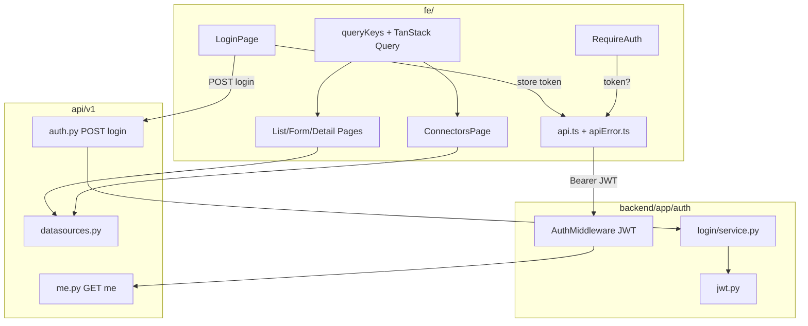

# M-FE-1 认证与数据源 FE companion 设计 — BOOT-003 / BOOT-002 / DS-002 / DS-003 / DS-007

```yaml
date: 2026-07-06
milestone: M-FE-1
round_target: docs/superpowers/evolution/2026-07-06-round-target.md
base_branch: dev-auto
prd_ids: [BOOT-003, BOOT-002, DS-002, DS-003, DS-007]
ui_design_skill: .agents/skills/b-design-system-tailadmin-radix/SKILL.md
status: design
```

## 1. 批量主题与子项映射

| # | 子项 | PRD ID | 执行顺序 | 主攻薄弱维 | 用户感知 |
|---|------|--------|:--------:|------------|----------|
| 1 | 正式 JWT 登录与会话 | BOOT-003 | 1 | 用户价值 **84%**；交互 N/A→实评 | `/login` 输入凭证；`api.ts` 携带 JWT；未登录 `/admin/*`→`/login`；`GET /api/v1/me` 200 |
| 2 | API 客户端与 TanStack Query | BOOT-002 | 2 | 用户价值 **84%**；安全性 **88%** | 列表/表单 loading·成功·失败即时反馈；401 自动跳转登录 |
| 3 | 数据源管理页 CRUD | DS-002 | 3 | 交互 N/A→实评；用户价值 **84%** | 侧栏「数据源」可点；列表/新建/编辑 MySQL 或 PG 源 |
| 4 | 连通性测试 UI | DS-003 | 4 | 交互 N/A；完整度 **94%** | 详情页「测试连接」；结构化错误非笼统文案 |
| 5 | 连接器类型只读页 | DS-007 | 5 | 交互 N/A；用户价值 **84%** | `/admin/connectors` 展示已注册类型清单 |

**依赖链**：BOOT-003（后端 login + FE token/守卫）→ BOOT-002（Query 层供 DS 页消费）→ DS-007 types API（表单 type 下拉）→ DS-002 CRUD 页 → DS-003 详情页 test。

**上轮已交付（本轮不重复）**：M3 后端 `datasources` CRUD/test/types API；M1 Admin 壳层；M2 `auth_users`/`auth_roles` 表与 RBAC API；`SyncJobsPage` 等 ingestion 页（本轮仅复用其表格/错误 Banner 模式，不重构为 Query）。

## 2. 现状与约束

| 项 | 现状（范围框定内已读） |
|----|------------------------|
| `fe/src/lib/api.ts` | 硬编码 `Authorization: Bearer dev`；401 抛中文 Error，无跳转 |
| `fe/src/lib/session.ts` | 静态 `M1_SESSION` 占位；`AdminLayout`/`UserDropdown` 直读 |
| `fe/src/routes.tsx` | 无 `/login`、无 datasources/connectors 路由；无路由守卫 |
| `fe/src/config/admin-nav.tsx` | 「数据源」指向 `/admin`（死链）；无「连接器」项 |
| `fe/package.json` | 无 `@tanstack/react-query` |
| `backend/app/auth/middleware.py` | 仅 `Bearer dev`（development）；无 JWT 校验 |
| `backend/app/auth/models.py` | `auth_users` 无 `password_hash` 字段 |
| `backend/app/api/v1/` | 无 `auth.py`；`router.py` 未挂载 login |
| `docs/api/README.md` | `POST /api/v1/auth/login` 状态「规划」 |
| `layout.md` §3 | `/admin/datasources*`、`/admin/connectors` IA 已定义 |

**范围框定模块**（3）：`fe/`（login、api 客户端、datasources/connectors 页）+ `backend/app/auth/`（JWT/login）+ `backend/app/api/v1/`（auth 薄 entry）。

**真理源优先级**：`round-target` > `plan.md` §M-FE-1 > `layout.md` / `fe-ui.mdc` > b-design-system skill > `prd/F01-BOOT.md` · `prd/F03-DS.md`。

**非目标（明确不做）**：

- DS-004 Schema 浏览器（M-FE-2）
- Dashboard 出数、图表联调（M-FE-2）
- 系统用户/角色 Admin UI（M-FE-3）
- MySQL/PG 连接器方言实现（CONN-001/002，后端已部分存在）
- M13 冻结项；OAuth/SSO；刷新 token 轮换；`POST /api/v1/auth/logout` 服务端黑名单（本轮 FE 清 localStorage 即可）
- 将 `SyncJobsPage` 等既有页全面迁移 TanStack Query（仅新页 + `api.ts` 基座）
- 修改 `docs/automate/goal.md`；P5 前改 `plan.md` 结构

## 3. 范围框定文件清单（≤20 主文件）

| 路径 | 子项 | 动作 |
|------|:----:|------|
| `backend/app/auth/jwt.py` | 003 | 新建：签发/校验 JWT（PyJWT + `Settings.secret_key`） |
| `backend/app/auth/login/service.py` | 003 | 新建：用户名密码校验、角色解析 |
| `backend/app/auth/middleware.py` | 003 | 修改：JWT 校验；移除 `Bearer dev`；`PUBLIC_PATHS` 增 login |
| `backend/app/auth/models.py` | 003 | 修改：`AuthUser.password_hash` |
| `backend/migrations/versions/0011_auth_user_password.py` | 003 | 新建：列 + dev seed `admin` 用户 |
| `backend/app/api/v1/auth.py` | 003 | 新建：`POST /auth/login` |
| `backend/app/api/v1/router.py` | 003 | 修改：挂载 auth router |
| `backend/pyproject.toml` | 003 | 修改：增 `PyJWT`、`bcrypt` |
| `tests/test_auth_login.py` | 003 | 新建：login/me/JWT 矩阵 |
| `fe/src/pages/login/LoginPage.tsx` | 003 | 新建：登录表单页 |
| `fe/src/components/auth/require-auth.tsx` | 003 | 新建：路由守卫 |
| `fe/src/lib/auth-token.ts` | 003 | 新建：localStorage 读写/清除 |
| `fe/src/lib/session.ts` | 003 | 修改：废弃静态用户；导出类型与权限 helper |
| `fe/src/context/auth-context.tsx` | 003 | 新建：`/me` 会话 Provider |
| `fe/src/lib/api.ts` | 002,003 | 修改：读 token、envelope、401 处理 |
| `fe/src/lib/apiError.ts` | 002 | 新建：`mapApiError` |
| `fe/src/lib/queryKeys.ts` | 002 | 新建：Query key 注册表 |
| `fe/src/App.tsx` | 002 | 修改：`QueryClientProvider` + `AuthProvider` |
| `fe/src/pages/admin/datasources/DatasourceListPage.tsx` | 002,003 | 新建：列表 |
| `fe/src/pages/admin/datasources/DatasourceFormPage.tsx` | 002,003 | 新建：新建/编辑（`mode` prop 或 `:id/edit`） |
| `fe/src/pages/admin/datasources/DatasourceDetailPage.tsx` | 003 | 新建：详情 + 测试连接 |
| `fe/src/pages/admin/connectors/ConnectorsPage.tsx` | 007 | 新建：只读类型表 |
| `fe/src/routes.tsx` | 003,002,007 | 修改：login、守卫、datasources、connectors |
| `fe/src/config/admin-nav.tsx` | 002,007 | 修改：「数据」分组路径 |
| `fe/package.json` | 002 | 修改：增 `@tanstack/react-query` |
| `fe/src/components/layout/user-dropdown.tsx` | 003 | 修改：读 auth 上下文；退出清 token |
| `fe/src/layouts/AdminLayout.tsx` | 003 | 修改：用 `useAuth` 替代 `getSessionUser` |
| `fe/src/routes.smoke.test.tsx` | 全项 | 修改：补 login/守卫 smoke |
| `docs/api/README.md` | 003 | P3 同步：login 状态→已实现 |

> **文件预算说明**：上表 28 行含测试与文档；实现阶段将 `DatasourceFormPage` 合并 new/edit 单文件、`jwt.py` 与 `login/service.py` 保持拆分（各 <60 行）。若超预算，优先砍 `tests/test_auth_login.py` 用例合并入 `tests/test_me.py`，不砍业务页。

## 4. PRD 8 维薄弱项对齐

| PRD ID | 薄弱维 | 本轮设计对策 |
|--------|--------|--------------|
| BOOT-003 | 用户价值 84%；交互 N/A | 可感知 `/login` + 守卫 + 顶栏真实用户；P4 desktop/mobile 登录截图 |
| BOOT-002 | 用户价值 84%；安全性 88% | `mapApiError` 脱敏；401 统一清 token；Query 缓存失效策略 |
| DS-002 | 交互 N/A；用户价值 84% | `crud-flow` 列表/表单三态；侧栏可导航 |
| DS-003 | 交互 N/A；完整度 94% | test 结果 Alert 展示 `code`/`message`/`latencyMs`/`traceId`（trace 仅折叠区） |
| DS-007 | 交互 N/A；用户价值 84% | 只读 table-list；capabilities Badge |

## 5. 方案比选（摘要）

### 5.1 鉴权令牌

| 方案 | 说明 | 结论 |
|------|------|------|
| A PyJWT + `auth_users.password_hash`（bcrypt）+ middleware 校验 | 与 `docs/api/README.md` Bearer 契约一致；`secret_key` 已存在 | **采用** |
| B 保留 `Bearer dev` 与 JWT 双轨 | 违反 round-target「移除硬编码」 | 否决 |
| C HttpOnly Cookie Session | 与现有 API 文档、FE `apiFetch` Bearer 头不一致 | 否决 |

### 5.2 FE token 存储

| 方案 | 说明 | 结论 |
|------|------|------|
| A `localStorage` key `vitalspan:access_token` | M-FE-1 单页应用最简单；与 Vite 静态部署兼容 | **采用** |
| B sessionStorage | 关标签即失效，联调体验差 | 否决 |
| C 内存 only | 刷新丢登录，不符合管理端预期 | 否决 |

### 5.3 路由守卫

| 方案 | 说明 | 结论 |
|------|------|------|
| A `RequireAuth` 包裹 `/admin` 父路由；`/login` 在壳层外 | 对齐 `layout.md` §3 | **采用** |
| B 每页内 `useEffect` 检查 | 重复、易漏 | 否决 |

### 5.4 数据源表单

| 方案 | 说明 | 结论 |
|------|------|------|
| A 单 `DatasourceFormPage` 处理 `/new` 与 `/:id/edit` | 字段与 `DataSourceCreate`/`DataSourceUpdate` 重叠高 | **采用** |
| B 独立 Create/Edit 两文件 | 超文件预算、重复校验 | 否决 |

## 6. 总体架构



**路由结构（M-FE-1 增量）**：

```text
/login                          → LoginPage（无 AdminLayout）
/admin                          → RequireAuth → AdminLayout
  ├─ datasources                → DatasourceListPage
  ├─ datasources/new            → DatasourceFormPage (create)
  ├─ datasources/:id            → DatasourceDetailPage
  ├─ datasources/:id/edit       → DatasourceFormPage (edit)
  └─ connectors                 → ConnectorsPage
```

## 7. 分项设计与验收标准

### 7.1 BOOT-003 — 正式登录与会话

#### 7.1.1 后端

**迁移 `0011_auth_user_password.py`**：

- `auth_users` 增 `password_hash VARCHAR(255) NOT NULL`（新环境）
- 数据迁移：若存在 username=`admin` 则更新 hash；否则插入 `admin` 用户并绑定 `admin` 角色（复用 `auth_roles.code='admin'` 若存在）
- 默认密码：环境变量 `VITALSPAN_DEV_ADMIN_PASSWORD`（`.env.example` 登记默认值 `changeme`）；**仅** `vitalspan_env=development` 迁移脚本写入该默认

**`auth/jwt.py`**：

- `create_access_token(user_id: str, username: str, *, expires_minutes: int = 480) -> str`
- `decode_access_token(token: str) -> dict`；过期/签名失败抛 `JwtError`

**`auth/login/service.py`**：

- `authenticate(session, username, password) -> AuthUser`；失败抛 `LoginError(AUTH_INVALID_CREDENTIALS, 401)`
- 成功后 `resolve_role_codes_for_user` 供 middleware 注入

**`api/v1/auth.py`**：

```text
POST /api/v1/auth/login
Body: { "username": string, "password": string }
200: { "accessToken": string, "tokenType": "bearer", "expiresIn": number }
401: { "code": "AUTH_INVALID_CREDENTIALS", "message": "用户名或密码错误", "detail": null }
```

**`middleware.py` 变更**：

- `PUBLIC_PATHS` 增加 `/api/v1/auth/login`（精确匹配）
- 移除 `token == "dev"` 分支
- JWT 分支：decode → `user_id` → DB 查用户与角色 → `request.state.user = UserContext(...)`
- 无效 token → 401 与现有一致

**可测试验收**：

- [ ] `POST /api/v1/auth/login` 正确凭证返回非空 `accessToken`
- [ ] 错误凭证 401 + `AUTH_INVALID_CREDENTIALS`
- [ ] `Authorization: Bearer <jwt>` 访问 `GET /api/v1/me` 返回 DB 用户 id/username/roles
- [ ] 无 Authorization 访问 `/api/v1/datasources` → 401
- [ ] `Bearer dev` 在生产环境（`vitalspan_env=production`）→ 401
- [ ] `/health` 仍无需认证

#### 7.1.2 前端

**`LoginPage.tsx`**（pattern: `form-composition` 单栏居中）：

- 字段：用户名、密码（`RequiredLabel` + `Input` `type=password`）
- 提交：`POST /api/v1/auth/login` → 存 token → `navigate(from || '/admin')`
- 错误：字段下或表单顶 `Alert` variant error；`mapApiError` 转中文
- 已登录访问 `/login` → 重定向 `/admin`

**`RequireAuth`**：

- 无 token → `<Navigate to="/login" replace state={{ from: location.pathname }} />`
- 有 token 但 `/me` 失败（401）→ 清 token → `/login`

**`session.ts` 迁移**：

- 删除 `M1_SESSION` 常量
- 保留 `SessionRole`、`canManagePlatform`、`canEditDashboards`；参数改为 `AuthUser`（来自 context）
- `UserDropdown`/`AdminLayout` 改读 `useAuth()`

**`user-dropdown` 退出**：

- `onClick`：`clearAuthToken()` + `queryClient.clear()` + `navigate('/login')`

**可测试验收**：

- [ ] 未登录访问 `/admin/datasources` → 浏览器地址 `/login`
- [ ] 登录成功 → `/admin` 且顶栏显示 `/me` 返回用户名
- [ ] `fe/src/lib/api.ts` 不再含字面量 `Bearer dev`
- [ ] vitest smoke：login 路由渲染、守卫重定向

### 7.2 BOOT-002 — API 客户端与 TanStack Query

#### 7.2.1 `api.ts`

- `getAuthHeaders()`：有 token 则 `Authorization: Bearer ${token}`，否则省略
- 响应解析：HTTP 2xx 后若 body 含 `code` 且 `code !== 0`（数字）且非数据源直出模型，抛 `ApiRequestError`
- `401`：调用 `onUnauthorized` 回调（由 `AuthProvider` 注册：清 token + 跳转 login）
- 保留 `ApiRequestError` 与 `fields` 支持

#### 7.2.2 `apiError.ts`

- `mapApiError(err: unknown): string` — 映射已知 `code`（`AUTH_INVALID_CREDENTIALS`、`DATASOURCE_*`、`MYSQL_*`、`UNAUTHORIZED` 等）为中文可行动文案
- 剥离 `traceId`/HTTP 码/英文堆栈；兜底「操作失败，请稍后重试」

#### 7.2.3 `queryKeys.ts`

```ts
export const queryKeys = {
  me: ['me'] as const,
  datasources: {
    all: ['datasources'] as const,
    list: (params?: { q?: string; type?: string }) => ['datasources', 'list', params] as const,
    detail: (id: string) => ['datasources', 'detail', id] as const,
  },
  connectorTypes: ['connectorTypes'] as const,
};
```

#### 7.2.4 Provider

- `App.tsx`：`QueryClient` defaultOptions `{ queries: { retry: 1, staleTime: 30_000 } }`
- `AuthProvider` 内 `useQuery(queryKeys.me, fetchMe)` 供壳层消费

**可测试验收**：

- [ ] `pnpm build` 通过（含新依赖）
- [ ] datasources 列表页使用 `useQuery`/`useMutation`（非裸 `useEffect` 拉列表）
- [ ] 模拟 401 触发跳转 login（单测或 smoke mock）
- [ ] 创建数据源成功后 `invalidateQueries(queryKeys.datasources.all)`

### 7.3 DS-002 — 数据源管理页

#### 7.3.1 列表 `DatasourceListPage`

- 布局：`AdminPageShell` + `crud-flow`/`table-list`
- 工具栏：搜索 `Input`（debounce 300ms → `?q=`）、主按钮「新建数据源」→ `/admin/datasources/new`
- 表格列：名称、编码、类型（Badge）、主机、端口、数据库、操作（编辑/删除）
- 状态：loading `Skeleton` 行；empty「暂无数据源」+ 新建 CTA；error `ErrorBanner`+重试
- 删除：`AlertDialog` 确认 → `DELETE /api/v1/datasources/{id}`；409 展示 `mapApiError`

#### 7.3.2 表单 `DatasourceFormPage`

- 字段（对齐 `DataSourceCreate`）：name、code（create 可编辑/edit 只读）、type（`Select` 来自 `connectorTypes`）、host、port、database、username、password、description（可选）
- connectionOptions 高级区（折叠 `Collapsible`）：sslMode、connectTimeoutSec — M-FE-1 最小集，默认折叠
- create：`POST /api/v1/datasources`；edit：`GET` 预填 + `PATCH /api/v1/datasources/{id}`（password 空表示不改）
- 校验：code 正则前端拦截；port 1–65535；必填中文提示

#### 7.3.3 路由与导航

- `routes.tsx` 注册四条 datasources 路由
- `admin-nav.tsx`：「数据源」`path: '/admin/datasources'`

**可测试验收**：

- [ ] `GET/POST/PATCH /api/v1/datasources` 经浏览器可走通
- [ ] 侧栏「数据源」高亮且跳转列表
- [ ] 列表至少展示 1 条记录（集成环境）

### 7.4 DS-003 — 连通性测试 UI

**`DatasourceDetailPage`**（`/:id`）：

- 头部：名称 + 次操作「编辑」+ 主操作「测试连接」
- 描述列表 Card：类型、主机、端口、数据库、用户名、编码
- 测试：`useMutation` → `POST /api/v1/datasources/{id}/test`
- 结果区（`Alert`）：
  - 成功：`variant` success 风格边框 —「连接成功」+ `latencyMs` ms
  - 失败：error 风格 — `mapApiError` 处理 `message`；若存在 `code` 显示为「错误码：xxx」（非英文裸码）
  - `traceId` 放 `<details>` 折叠「技术支持信息」
- 测试中：按钮 `disabled` + loading 文案「测试中…」
- 429 inflight：map 为「已有测试进行中，请稍候」

**可测试验收**：

- [ ] 详情页点击测试，成功展示 latency
- [ ] 故意错误密码源测试失败，页面展示可定位中文错误（非仅「操作失败」）
- [ ] 浏览器完成 MySQL **或** PG 新建 + 测试成功（M-FE-1 验收信号）

### 7.5 DS-007 — 连接器类型只读页

**`ConnectorsPage`**：

- `useQuery(queryKeys.connectorTypes)` → `GET /api/v1/datasources/types`
- 表格：显示名称（`displayName`）、类型标识（`type`）、分类（`category`）、能力（`capabilities` → 多个 `Badge` light）
- 只读：无新建/编辑/删除
- empty：「暂无已注册连接器类型」

**导航**：

- `admin-nav.tsx`「数据」分组增「连接器」`path: '/admin/connectors'`，图标 `Plug` 或 `Cable`（lucide `size-6`）

**可测试验收**：

- [ ] `/admin/connectors` 展示 ≥1 类型（如 `mysql`、`postgresql`）
- [ ] 路由与侧栏可导航

## 8. UI 设计交付

### 8.1 ui_design_skill

`.agents/skills/b-design-system-tailadmin-radix/SKILL.md`（已读取）；布局模式：`references/layout-patterns/crud-flow.md`、`form-composition.md`、`app-shell.md`。

### 8.2 页面信息架构

| 页面 | 导航层级 | 主内容区 | 空/加载/错误/权限 |
|------|----------|----------|-------------------|
| `/login` | 壳层外；无侧栏 | 居中 `max-w-md` 单卡 | loading：按钮 loading；error：Alert；无权限 N/A |
| `/admin/datasources` | 数据 > 数据源 | `AdminPageShell` + 全宽表格 Card | skeleton 行 / empty+CTA / ErrorBanner / 未登录→login |
| `/admin/datasources/new` | 数据 > 数据源 > 新建 | 单列表单 Card `max-w-2xl` | 提交中 disabled |
| `/admin/datasources/:id` | 数据 > 数据源 > 详情 | 描述列表 + 测试 Alert | 404→「数据源不存在」ContentState |
| `/admin/connectors` | 数据 > 连接器 | 只读表格 | empty 文案 |

主内容区宽度：列表/表格页 `max-w-(--breakpoint-2xl)`（继承 `AdminLayout`）；登录页视口垂直水平居中，背景 `bg-gray-50 dark:bg-gray-950`。

### 8.3 视觉层级

| 页面 | 主操作 | 次操作 | 承载 |
|------|--------|--------|------|
| Login | 「登录」`Button variant=primary` | — | `Card` 包裹表单 |
| 列表 | 「新建数据源」primary 右上 | 行内编辑 outline / 删除 destructive icon | `rounded-xl border` 表格容器 |
| 表单 | 「保存」primary 底栏 | 「取消」outline → 返回列表 | 分组 `Card` |
| 详情 | 「测试连接」primary | 「编辑」outline | 信息 `Card` + 结果 `Alert` |
| 连接器 | — | — | 只读 `Table` |

禁止整页仅空白 `div`；每页至少有 Card/表格/表单实体容器。

### 8.4 组件映射

| 需求 | 复用 | 新建/扩展 |
|------|------|-----------|
| 页面壳 | `AdminPageShell` | — |
| 按钮/输入 | `Button`、`Input`、`Label`、`Select` | — |
| 表格 | 沿用 `SyncJobsPage` 表格语义类名 | 可选抽 `DatasourceTable` 若 DS-002 单文件超限 |
| 错误条 | `SyncJobsPage` `ErrorBanner` 模式 | 上浮 `components/admin/error-banner.tsx` 若第二处复用 |
| 确认删除 | `AlertDialog` | — |
| 状态标签 | `Badge` | type/category/capability |
| 加载 | `Skeleton` | — |
| 登录表单 | — | `LoginPage` 内联（不新建 design-system 外组件） |

禁止页面内自定义 primary 按钮色或手写 modal。

### 8.5 Token 与密度

- 语义色：`brand-500` 主色、`gray-*` 背景层级、`error-*`/`success-*` 测试反馈
- 表单控件：`h-11`、`rounded-lg`；卡片 `rounded-xl shadow-theme-sm`
- 间距：页面 `gap-6`（`AdminPageShell`）；表单项 `gap-4`
- 字号：标题 `text-title-sm`；正文 `text-theme-sm`；辅助 `text-gray-500`
- 图标：`lucide-react` `size-4`（行内）/ `size-6`（侧栏）

### 8.6 响应式与可访问性

- Desktop（≥1280）：侧栏 290px，表格 `min-w-[720px]` 横向滚动
- Mobile（<1280）：侧栏抽屉；登录表单 `p-4` 全宽；工具栏纵向堆叠
- 焦点：`focus-visible:ring-3` 于按钮/输入；登录首字段 `autoFocus`
- `aria-label`：图标按钮（删除、测试）；密码框 `autoComplete=current-password`
- 长文本：名称列 `truncate max-w-[200px]` + `title` tooltip

### 8.7 视觉 QA 清单（P3/P4 执行）

- [ ] Desktop 截图：`/login`、`/admin/datasources` 列表、新建表单、详情测试成功/失败、`/admin/connectors`
- [ ] Mobile 375px 截图：`/login`、列表、侧栏打开态
- [ ] 检查：无大面积无意义空白；主列不过窄；文字无裁切重叠；侧栏/顶栏 framing 正确
- [ ] Light + dark 各 1 张登录页与列表页
- [ ] `pnpm run check:design` exit 0

## 9. 测试策略（P3/P4 指针）

| 层 | 范围 |
|----|------|
| Backend pytest | `test_auth_login.py`：login 成功/失败、JWT me、public path、dev token 移除 |
| FE vitest | `routes.smoke.test.tsx`：login 渲染、未认证重定向、datasources 路由挂载 |
| 集成 | docker compose + 浏览器：admin 登录 → 新建 PG/MySQL 源 → 测试连接成功 |
| 门禁 | `ruff`、`pytest`、`pnpm test`、`pnpm build`、`check:design` |

## 10. 文档同步（P3/P5 评估）

| 变更 | 文档 |
|------|------|
| `POST /auth/login` 实现 | `docs/api/README.md` login 状态 |
| JWT 鉴权行为 | `docs/services/auth.md` In/Out 边界 |
| 新 FE 路由 | `docs/ui/layout.md` 若 IA 偏差（本轮应对齐，预计无需改） |
| M-FE-1 完成 | `plan.md` 勾选 5 行；`prd/F01-BOOT.md`、`prd/F03-DS.md` 浏览器验收勾 |

## 11. Spec self-review

- [x] 覆盖 round-target 全部 5 子项
- [x] 未超出范围框定（无 Schema 浏览器/Dashboard/角色 Admin）
- [x] 无 TBD/TODO 占位
- [x] UI 设计交付完整；`ui_design_skill` 已声明
- [x] 验收标准可测试
- [x] 内部一致：JWT 方案与移除 `Bearer dev` 不矛盾；路由与 `layout.md` 一致
