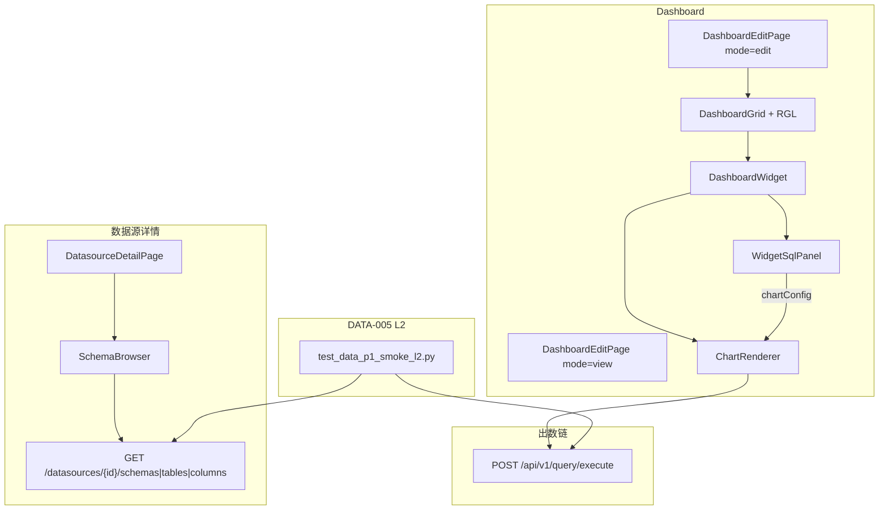

# M-FE-2 P1 最小出数闭环设计 — DS-004 / VIZ-002 / DASH-002 / DATA-005

```yaml
date: 2026-07-06
milestone: M-FE-2
round_target: docs/superpowers/evolution/2026-07-06-round-target-m-fe-2.md
base_branch: dev-auto
prd_ids: [DS-004, VIZ-002, DASH-002, DATA-005]
ui_design_skill: .agents/skills/b-design-system-tailadmin-radix/SKILL.md
status: design
```

## 1. 批量主题与子项映射

| # | 子项 | PRD ID | 执行顺序 | 主攻薄弱维 | 用户感知 |
|---|------|--------|:--------:|------------|----------|
| 1 | Schema 元数据浏览 FE | DS-004 | 1 | 交互 N/A→实评；用户价值 **82%** | 数据源详情页展开 schema→表→列；可复制/引用表名到 SQL |
| 2 | 最小图表集 Dashboard 出数 | VIZ-002 | 2 | 交互 N/A→loading/空/错态实评；用户价值 **84%** | view 模式 widget 展示表格/折线/柱真实数据 |
| 3 | Dashboard 网格拖拽布局 | DASH-002 | 3 | 交互 N/A→拖拽与模式切换；完整度 **92%** | edit 模式拖拽调整网格；保存后 view 布局持久 |
| 4 | DATA-SMOKE L2 验收与文档 | DATA-005 | 4 | 用户价值 **82%**；完整度 **98%** | 托管库登记 dataSourceId→SQL 出数可判定；PRD L2 可勾选 |

**依赖链**：DS-004（选表辅助 SQL）→ VIZ-002（widget 绑定 dataSourceId+SQL 出数）→ DASH-002（布局承载 VIZ 组件）→ DATA-005（全链路 pytest + vitest + PRD 回写）。

**上轮已交付（本轮不重复）**：M3 后端 metadata API（`GET .../schemas|tables|columns`）；`ChartRenderer`/`ChartPanel`/`useChartExecute` 三态；`DashboardEditPage` 与 order/colSpan 编排；M-FE-1 登录与数据源 CRUD。

## 2. 现状与约束

| 项 | 现状（范围框定内已读） |
|----|------------------------|
| `DatasourceDetailPage.tsx` | 连接信息 + 测试连接；**无** schema 浏览 |
| `fe/src/lib/queryKeys.ts` | 无 metadata query key |
| `ChartRenderer.tsx` | table/line/bar 已实现；对接 `/api/v1/query/execute` |
| `DashboardWidget.tsx` | edit 仅标题/SQL 摘要；**无** dataSource/SQL 配置面板；view 直接渲染 ChartRenderer |
| `layoutUtils.defaultChartConfig` | 硬编码占位 `dataSourceId` `...0099` |
| `DashboardGrid.tsx` | CSS 12 列 + order 排序；**无**鼠标拖拽 |
| `DashboardEditPage.tsx` | `/edit` 与 `/:id` view 分路由；无顶栏 edit↔view 快捷切换 |
| `fe/package.json` | 无 `react-grid-layout` |
| `backend/dashboard/schemas.py` | `LayoutWidget` 仅 `colSpan`/`rowSpan`/`order`；`layout_json` 校验不允许多余字段 |
| `prd/F07-DASH.md` DASH-002 | 「网格布局可拖拽」仍为 `[ ]` |
| `prd/F16-DATA.md` DATA-005 | L2 dataSourceId+SQL 仍为「待 M3/M4」 |
| `tests/` | 无 `test_*_p1_smoke*`；L1 仅有 `test_ingestion_l1_smoke.py` |

**范围框定模块**（3）：`fe/`（schema 浏览器、chart widget 配置、dashboard 网格拖拽）+ `tests/`（P1-SMOKE / DATA-SMOKE L2）+ `docs/`（`prd/F16-DATA.md` L2、`prd/F07-DASH.md` DASH-002 勾选项）。

**真理源优先级**：`round-target` > `plan.md` §M-FE-2 > `layout.md` §3 / `bi-dashboard-builder.md` > b-design-system skill > `prd/F03-DS.md` · `F06-VIZ.md` · `F07-DASH.md` · `F16-DATA.md`。

**非目标（明确不做）**：

- 角色/用户 Admin UI（AUTH-001/003 · M-FE-3）
- 全局筛选器 FE（DASH-004 · M-FE-3）
- MySQL/PG 连接器新实现（CONN-001/002 · M3）
- 地图/热力/KPI 扩展图表（DASH-003）
- M13 冻结项；Dataset 语义层
- 修改 `layout_json` 后端 schema（不增 `gridX`/`gridY` 字段）
- `/dashboards/:id/preview` 独立路由（本轮用 edit/view 双路由 + 顶栏互链即可）
- Playwright 真浏览器 E2E（本轮以 pytest API 链 + vitest 组件 smoke 收口；Playwright 留 M6）
- 将 ingestion 页全面迁移 metadata 能力

## 3. 范围框定文件清单（≤20 主文件）

| 路径 | 子项 | 动作 |
|------|:----:|------|
| `fe/src/components/datasources/SchemaBrowser.tsx` | DS-004 | 新建：三级懒加载树 + 复制/引用 |
| `fe/src/components/datasources/schemaBrowserUtils.ts` | DS-004 | 新建：`mapMetadataError`、qualified 表名 |
| `fe/src/lib/queryKeys.ts` | DS-004 | 修改：增 `datasources.schemas/tables/columns` |
| `fe/src/pages/admin/datasources/DatasourceDetailPage.tsx` | DS-004 | 修改：集成 SchemaBrowser Card |
| `fe/src/components/dashboard/WidgetSqlPanel.tsx` | VIZ-002 | 新建：dataSource 选择 + SQL 编辑 + 预览执行 |
| `fe/src/components/dashboard/DashboardWidget.tsx` | VIZ-002,DASH-002 | 修改：edit 展开 SqlPanel；view 纯 ChartRenderer |
| `fe/src/components/dashboard/layoutUtils.ts` | VIZ-002 | 修改：移除占位 dataSourceId；新建 widget 须选源 |
| `fe/src/components/dashboard/DashboardGrid.tsx` | DASH-002 | 修改：edit 模式接入 react-grid-layout |
| `fe/src/components/dashboard/gridLayoutAdapter.ts` | DASH-002 | 新建：RGL layout ↔ colSpan/rowSpan/order 互转 |
| `fe/src/pages/admin/dashboard/DashboardEditPage.tsx` | DASH-002,VIZ-002 | 修改：顶栏 edit/view 互链；onLayoutChange 保存 |
| `fe/package.json` | DASH-002 | 修改：增 `react-grid-layout` + `@types/react-grid-layout` |
| `fe/src/components/README.md` | 全 FE | 修改：登记 SchemaBrowser、WidgetSqlPanel |
| `fe/src/pages/admin/datasources/datasource-detail.smoke.test.tsx` | DS-004 | 新建：schema 树三级展开 smoke |
| `fe/src/pages/admin/dashboard/dashboard.smoke.test.tsx` | DASH-002,VIZ-002 | 修改：拖拽改 order、SQL 配置保存 payload |
| `tests/test_data_p1_smoke_l2.py` | DATA-005 | 新建：DATA-SMOKE L2 API 编排 |
| `docs/automate/prd/F16-DATA.md` | DATA-005 | 修改：L2 验收 `[x]` + 代码锚点 |
| `docs/automate/prd/F07-DASH.md` | DATA-005,DASH-002 | 修改：拖拽项 `[x]` + 锚点 |
| `docs/automate/prd/F03-DS.md` | DS-004 | 修改：Admin UI schema 浏览器验收 `[x]` |

> **文件预算**：上表 18 行。若超预算，合并 `schemaBrowserUtils.ts` 入 `SchemaBrowser.tsx`（单文件 <200 行），不砍 L2 pytest。

## 4. PRD 8 维薄弱项对齐

| PRD ID | 薄弱维 | 本轮设计对策 |
|--------|--------|--------------|
| DS-004 | 交互 N/A；用户价值 82% | 三级 Collapsible 树 + 懒加载；复制/引用操作；metadata 错误中文映射 |
| VIZ-002 | 交互 N/A；用户价值 84% | WidgetSqlPanel 绑定真实 dataSourceId；ChartRenderer 三态在 dashboard view 可见 |
| DASH-002 | 交互 N/A；完整度 92% | react-grid-layout 拖拽+resize；colSpan 吸附 4/6/8/12；edit/view 顶栏切换 |
| DATA-005 | 用户价值 82%；完整度 98% | `test_data_p1_smoke_l2.py` 可重复判定 L2；PRD L2 与 plan §M-FE-2 同步勾选 |

## 5. 方案比选（摘要）

### 5.1 Schema 浏览 UI 形态

| 方案 | 说明 | 结论 |
|------|------|------|
| A 侧栏 Collapsible 三级懒加载树（Radix Collapsible） | 对齐 `detail-page` + 现有 Card；按需请求 tables/columns | **采用** |
| B 单页三列 Master-Detail | 宽屏好但窄屏差；超布局预算 | 否决 |
| C 弹窗 Command 搜索 | 缺逐级浏览验收；二期增强 | 否决 |

### 5.2 Dashboard 拖拽引擎

| 方案 | 说明 | 结论 |
|------|------|------|
| A `react-grid-layout` 12 列 + adapter 写回 order/colSpan/rowSpan | 满足 PRD「react-grid-layout 拖拽」；**不改**后端 schema | **采用** |
| B 仅 `@dnd-kit/sortable` 改 order | 不满足 PRD 演化备注；无 resize 手柄 | 否决 |
| C 后端增 gridX/gridY | 超出 round-target 模块范围 | 否决 |

### 5.3 Widget SQL 配置入口

| 方案 | 说明 | 结论 |
|------|------|------|
| A edit 模式 widget 内 `WidgetSqlPanel`（折叠区：选源 + Textarea SQL + 试运行） | 与 schema「引用到 SQL」闭环；不污染 view 模式 | **采用** |
| B 跳转独立 `/charts/:id/config` 页 | 打断 builder 流；超路由预算 | 否决 |
| C 仅 ChartConfigPanel 维度指标 | 缺 SQL/dataSource 编辑；无法完成 P1-SMOKE | 否决 |

### 5.4 DATA-SMOKE L2 验证层

| 方案 | 说明 | 结论 |
|------|------|------|
| A pytest API 链（建源→dashboard layout→query execute 断言行） | CI 稳定、无浏览器依赖；对齐 M1B L1 模式 | **采用** |
| B Playwright 全浏览器 | 超出本轮文件预算；M6 集成验收 | 否决 |
| C 仅手工 checklist | 不可审计、不满足 evolution P4 | 否决 |

## 6. 总体架构



**数据流（P1-SMOKE）**：

1. 管理员在 `/admin/datasources/:id` 浏览 schema，复制 `schema.table`。
2. `/admin/dashboards/:id/edit` 添加 widget → `WidgetSqlPanel` 选择 dataSourceId、粘贴 SQL → 保存 layout。
3. `/admin/dashboards/:id` view 模式 `ChartRenderer` 执行查询展示表格/折线/柱。
4. `test_data_p1_smoke_l2.py` 用 TestClient 复现 1–3 的 API 等价路径并断言 `rows` 非空。

## 7. 分项设计与验收标准

### 7.1 DS-004 — Schema 元数据浏览

#### 7.1.1 `SchemaBrowser.tsx`

**布局**：`DatasourceDetailPage` 主内容区第二块 `Card`（`max-w-3xl` 与连接信息同宽），标题「元数据浏览」。

**交互**：

- 顶层：schema 列表（`GET /api/v1/datasources/{id}/schemas`），每行 `Collapsible` trigger 显示 schema 名 + `ChevronRight` 旋转。
- 展开 schema：懒加载 `GET .../tables?schema={name}`；表行可再展开加载 `GET .../columns?schema=&table=`。
- 列展示：`name` · `dataType` · 可空 Badge（`nullable`）。
- 表行操作（`DropdownMenu`）：
  - **复制表名**：`schema.table` 写入剪贴板；`sonner` toast「已复制」。
  - **生成 SELECT**：`SELECT * FROM schema.table LIMIT 100` 复制（供粘贴到 Widget SQL）。

**状态**：

| 态 | UI |
|----|-----|
| loading | 行内 `Skeleton` height 32px |
| empty | `暂无 schema` / `该 schema 下暂无表` |
| error | `Alert` variant error + 重试；`mapMetadataError` 映射 `METADATA_CONNECTION_FAILED`→「无法连接数据源，请检查连通性」、`METADATA_TIMEOUT`→「元数据查询超时」、`METADATA_NOT_SUPPORTED`→「该连接器不支持元数据浏览」 |
| 403 | 「无权访问该数据源」 |

**Query keys**（`queryKeys.ts`）：

```ts
datasources: {
  schemas: (id: string) => ["datasources", id, "schemas"] as const,
  tables: (id: string, schema: string) => ["datasources", id, "tables", schema] as const,
  columns: (id: string, schema: string, table: string) =>
    ["datasources", id, "columns", schema, table] as const,
}
```

`enabled` 仅在被展开父节点时为 true（tables/columns）。

**可测试验收**：

- [ ] 详情页渲染「元数据浏览」Card
- [ ] mock schemas API 后展开 schema 触发 tables 请求（query 参数 `schema` 正确）
- [ ] 展开 table 触发 columns 请求（`schema`+`table` 正确）
- [ ] `METADATA_CONNECTION_FAILED` 展示中文错误 + 重试按钮
- [ ] 点击「复制表名」调用 `navigator.clipboard.writeText`（vitest mock）
- [ ] `fe/src/components/README.md` 登记 `SchemaBrowser`

### 7.2 VIZ-002 — 最小图表集 Dashboard 出数

#### 7.2.1 `WidgetSqlPanel.tsx`

**字段**（edit 模式 widget 卡片体上方，默认展开）：

| 字段 | 组件 | 说明 |
|------|------|------|
| 数据源 | `Select` | `GET /api/v1/datasources` 列表（TanStack Query `queryKeys.datasources.list()`）；选项显示 `name (code)` |
| SQL | `textarea` 或 shadcn `Textarea` | `mode: sql`；monospace `text-theme-sm` |
| 图表类型 | 只读 Badge | 来自 widget.chartConfig.chartType |
| 试运行 | `Button` variant outline | 临时更新 chartConfig 触发 ChartRenderer 预览（edit 内嵌 `ChartRenderer mode="config"` 可选） |

**chartConfig 更新**：`onChange(partial)` 写回 `widget.chartConfig`：`dataSourceId`、`sql`；保存 layout 时一并 PUT。

**移除占位**：`defaultChartConfig` 不再含固定 `dataSourceId`；新建 widget 时 `dataSourceId: ""`，`WidgetSqlPanel` 显示校验「请选择数据源」；保存前若空则 inline 错误（不禁 toast）。

**view 模式**：`DashboardWidget` 不渲染 `WidgetSqlPanel`；仅 `ChartRenderer config={widget.chartConfig}`。

**维度/指标**（折线/柱）：首次 execute 返回 columns 后，edit 模式展示精简 `ChartConfigPanel`（仅 dimensions[0] + metrics[]）；table 类型隐藏维度指标区。

**可测试验收**：

- [ ] view 模式 widget 渲染真实 `ChartRenderer`（非 mock）且调用 `/api/v1/query/execute`
- [ ] execute 返回 columns/rows 后表格显示表头与单元格（复用 `charts.smoke.test.tsx` 模式）
- [ ] `QUERY_SYNTAX_ERROR` / `QUERY_TABLE_NOT_FOUND` 显示 `mapChartQueryError` 中文 + 重试
- [ ] 保存 layout payload 含用户编辑的 `dataSourceId` 与 `sql`
- [ ] 折线/柱图在 view 模式渲染 Apex chart（mock apex 在 unit test）

### 7.3 DASH-002 — Dashboard 网格拖拽布局

#### 7.3.1 `gridLayoutAdapter.ts`

**映射规则**（12 列基准，`rowHeight=80`）：

- **读出**（FE state → RGL）：按 `order` 排序；用 packing 算法计算每 widget 的 `{i, x, y, w, h}`：`w = colSpan`，`h = rowSpan`（最小 2 以容纳 chart）。
- **写入**（RGL onLayoutChange → FE state）：`w` 吸附最近合法 `colSpan ∈ {4,6,8,12}`；`h` 钳制 `1..8` 为 `rowSpan`；按 `(y, x)` 排序生成新 `order`。
- **id**：RGL `i` = widget `id` 字符串。

#### 7.3.2 `DashboardGrid.tsx` 变更

- `mode === "view"`：保持现有 CSS grid（无拖拽手柄，性能更好）。
- `mode === "edit"`：外层 `ResponsiveGridLayout`（`cols={{ xl: 12, lg: 12, md: 12, sm: 6, xs: 4 }}`，`isDraggable`/`isResizable` true）；卡片 `dragHandleClassName="dashboard-drag-handle"` 置于 widget 标题栏左侧 `GripVertical` 图标。
- RGL 样式：引入 `react-grid-layout/css/styles.css`；覆盖 handle 颜色为 `gray-400`，与 TailAdmin token 一致（禁止 hex 硬编码，用 `@design-token-ok` 若需覆盖第三方 CSS）。

#### 7.3.3 模式切换

`DashboardEditPage` 顶栏 actions 增：

- edit 页：`Button asChild` → `/admin/dashboards/:id`「预览」
- view 页：`Button asChild` → `/admin/dashboards/:id/edit`「编辑布局」

对齐 `layout.md` §3 edit/view 双路由；不新增 `/preview`。

**可测试验收**：

- [ ] edit 模式 grid 容器含 `react-grid-layout` 且 `isDraggable=true`（data 属性或 class 检测）
- [ ] 模拟 `onLayoutChange` 后 widgets `order` 与 `colSpan` 更新符合 adapter 单测
- [ ] 拖拽后「保存布局」PUT body 中 widgets 顺序反映新 order
- [ ] view 模式无 drag handle；布局与保存后 edit 加载一致
- [ ] `prd/F07-DASH.md` DASH-002「网格布局可拖拽」可勾选

### 7.4 DATA-005 — DATA-SMOKE L2 验收与文档回写

#### 7.4.1 `tests/test_data_p1_smoke_l2.py`

**场景**（API 级，sqlite 元库 + mock 或 seed 分析源）：

| 步骤 | 动作 | 断言 |
|------|------|------|
| T-L2-01 | `POST /api/v1/datasources` 登记托管库连接（或复用 fixture DS） | 201 + `id` |
| T-L2-02 | `POST /api/v1/query/execute` `{ dataSourceId, mode:"sql", sql:"SELECT …" }` | `columns` 非空；`rows` 长度 ≥1 |
| T-L2-03 | `POST /api/v1/dashboards` 创建空 dashboard | 201 |
| T-L2-04 | `PUT /api/v1/dashboards/{id}/layout` 含 table widget + 上一步 chartConfig | 200 |
| T-L2-05 | `GET /api/v1/dashboards/{id}` | `layoutJson.widgets[0].chartConfig.dataSourceId` 匹配 |
| T-L2-06 | 编排 `test_p1_smoke_orchestrator` 串联 01–05；耗时 <5s | exit 0 |

**夹具策略**：优先复用 `tests/test_viz_dash_l1_r28.py` 的 sqlite env + uuid fixture；查询执行 mock 外部库或使用 `tests/conftest.py` 已有 `smoke_client` 若可用。

**文档回写**（P3 同 PR）：

- `prd/F16-DATA.md` DATA-005：增 L2 行 `[x] DATA-SMOKE L2：dataSourceId + SQL 出数`；锚点加 `tests/test_data_p1_smoke_l2.py`
- `prd/F03-DS.md` DS-004：增 `[x] Admin UI schema 三级浏览`；锚点 `SchemaBrowser.tsx`
- `plan.md` §M-FE-2 四项 `[x]`（P5 勾选，P3 可预勾若实现完成）

**可测试验收**：

- [ ] `pytest tests/test_data_p1_smoke_l2.py -q` exit 0
- [ ] `cd fe && pnpm test` 通过（含新增 smoke）
- [ ] PRD L2 与 DASH-002 拖拽项文档与实现一致

## 8. UI 设计交付

### 8.1 元信息

- **ui_design_skill**: `.agents/skills/b-design-system-tailadmin-radix/SKILL.md`
- **layout 参考**: `references/layout-patterns/bi-dashboard-builder.md`、`detail-page`（schema Card）
- **chart 参考**: `references/component-styles/chart-theme.md`

### 8.2 页面信息架构

| 路由 | 导航层级 | 主内容区 | 密度 |
|------|----------|----------|------|
| `/admin/datasources/:id` | 数据 → 数据源 → 详情 | `AdminPageShell` + 连接 Card + 元数据 Card；`max-w-3xl` 纵向堆叠 | 中等；树逐级展开 |
| `/admin/dashboards/:id/edit` | 分析 → Dashboard → 编辑 | 左 `WidgetPalette` 256px + 右 RGL 网格；`gap-6` | 偏高；builder 模式 |
| `/admin/dashboards/:id` | 分析 → Dashboard → 查看 | 全宽网格，无 palette | 消费态；图表为主 |

**空/加载/错误/权限**：

- Schema：见 §7.1.1 状态表
- Dashboard grid 空：保留现有虚线框 +「添加组件」
- Widget 无 dataSource：inline「请选择数据源」
- Chart：复用 `ChartPanel` loading skeleton / error alert / empty 文案
- 401/403：沿用 `RequireAuth` 与 API `mapApiError`

### 8.3 视觉层级

| 区域 | 主操作 | 次操作 | 承载 |
|------|--------|--------|------|
| 数据源详情 | 测试连接 | 编辑、复制表名 | `Card` + `Collapsible` 树 |
| Dashboard edit | 保存布局、添加组件 | 预览、拖拽 handle | `WidgetPalette` + RGL 卡片 |
| Widget edit | 保存（页面级） | 删除、resize、SQL 试运行 | `Card` 边框 + 标题栏工具组 |
| Dashboard view | — | 编辑布局（顶栏） | 图表 `ChartPanel` 占主体 |

禁止整页单一 `div` 空白；空 dashboard 必须有 CTA（已满足）。

### 8.4 组件映射

| 需求 | 复用 | 新建/扩展 |
|------|------|-----------|
| 树形浏览 | `Collapsible`、`Button`、`Badge`、`Skeleton` | `SchemaBrowser` |
| SQL 配置 | `Select`、`Input`/`Textarea`、`Label` | `WidgetSqlPanel` |
| 图表 | `ChartRenderer`、`ChartPanel`、`ChartConfigPanel` | — |
| 拖拽网格 | — | `DashboardGrid` + `react-grid-layout` |
| 删除确认 | `AlertDialog` | 已有 |
| 图标 | `lucide-react` `ChevronRight`、`GripVertical`、`Copy` | size-4 |

禁止页面内重写 Button/Table/Input 基元。

### 8.5 Token 与密度

- 边框：`border-gray-200 dark:border-gray-800`
- 卡片：`rounded-xl bg-white dark:bg-white/[0.03]`
- 树行高：`py-2`；字号 `text-theme-sm` / 辅助 `text-theme-xs text-gray-500`
- 图表高度：min `180px`（`chart-theme.md`）
- 间距：区块 `gap-6`（`AdminPageShell`）；网格 `gap-4`
- 语义色：error/success 用 `error-*` / `success-*` token

### 8.6 响应式与可访问性

| 场景 | 策略 |
|------|------|
| Desktop ≥1280px | Palette 左侧固定；RGL 12 列 |
| Tablet | Palette 上方全宽；网格 6 列 |
| Mobile | 单列；拖拽仍可用但 palette 折叠为 `DropdownMenu`「添加组件」 |
| 键盘 | Collapsible trigger 可 focus；RGL 提供基本键盘拖拽（库默认） |
| aria | 复制按钮 `aria-label="复制表名"`；drag handle `aria-label="拖拽组件"` |
| 长文本 | schema/table 名 `truncate` + `title` tooltip |

### 8.7 视觉 QA 清单（P3/P4 执行）

- [ ] Desktop light：数据源详情 schema 树展开截图
- [ ] Desktop light：Dashboard edit 拖拽手柄可见、双 widget 并排
- [ ] Desktop light：Dashboard view 表格有数据行
- [ ] Mobile：详情页元数据 Card 不横向溢出
- [ ] Mobile：Dashboard view 图表不重叠
- [ ] Dark：上述三页无背景/边框漂移
- [ ] 错误态：断开元数据 API 时错误 Banner 样式正确
- [ ] `cd fe && pnpm run check:design` 通过

## 9. 错误码映射补充

**`mapMetadataError`**（`schemaBrowserUtils.ts`）：

| code | 中文 |
|------|------|
| `METADATA_CONNECTION_FAILED` | 无法连接数据源，请先在上方测试连通性 |
| `METADATA_TIMEOUT` | 元数据查询超时，请稍后重试 |
| `METADATA_NOT_SUPPORTED` | 该连接器不支持元数据浏览 |
| `METADATA_INVALID_REQUEST` | 请求参数无效 |
| default | `mapApiError` 兜底 |

## 10. Spec self-review

| 检查项 | 结果 |
|--------|------|
| 覆盖 round-target 4 子项 | 通过 |
| 未超出范围框定（无后端 schema 变更、无 M-FE-3） | 通过 |
| 无 TBD/TODO 占位 | 通过 |
| UI 设计交付完整 | 通过 |
| 验收标准可测试 | 通过 |
| 与现有 `LayoutWidget` 契约兼容 | 通过（adapter 仅写 order/colSpan/rowSpan） |
