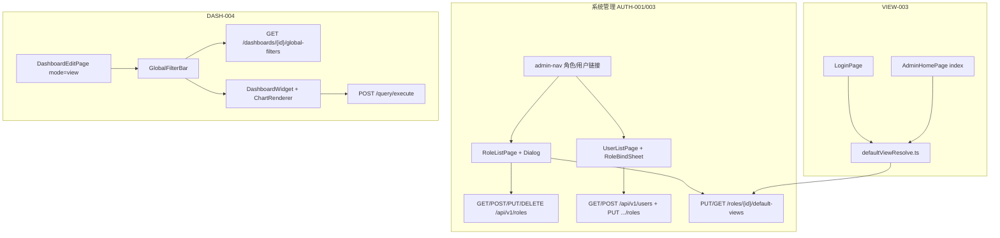

# M-FE-3 系统管理与消费态设计 — AUTH-001 / AUTH-003 / VIEW-003 / DASH-004

```yaml
date: 2026-07-06
milestone: M-FE-3
round_target: docs/superpowers/evolution/2026-07-06-round-target-m-fe-3.md
base_branch: dev-auto
prd_ids: [AUTH-001, AUTH-003, VIEW-003, DASH-004]
ui_design_skill: .agents/skills/b-design-system-tailadmin-radix/SKILL.md
status: design
```

## 1. 批量主题与子项映射

| # | 子项 | PRD ID | 执行顺序 | 主攻薄弱维 | 用户感知 |
|---|------|--------|:--------:|------------|----------|
| 1 | 角色管理 Admin UI | AUTH-001 | 1 | 交互 N/A→实评；用户价值 **82%** | 侧栏进入角色管理；CRUD 角色；可配置角色默认 Dashboard |
| 2 | 用户角色绑定 Admin UI | AUTH-003 | 2 | 交互 N/A→表单校验/反馈；用户价值 **84%** | 用户列表；为用户分配/变更角色；与角色数据联动 |
| 3 | 登录默认视图重定向 | VIEW-003 | 3 | 交互 N/A→登录后路由流畅；完整度 **90%** | 消费账号登录后进入角色默认 Dashboard；无默认时合理降级 |
| 4 | 全局筛选器 FE 联动 | DASH-004 | 4 | 交互 N/A→筛选即时刷新；用户价值 **84%** | view 模式变更筛选器后关联 widget 自动重新查询 |

**依赖链**：AUTH-001（角色 Registry + 默认视图配置）→ AUTH-003（用户绑定依赖角色列表）→ VIEW-003（重定向读角色 default-views）→ DASH-004（Dashboard view 消费链，依赖 M-FE-2 widget 出数）。

**上轮已交付（本轮不重复）**：M2 AUTH 后端 CRUD/绑定 API；VIEW-002 角色 default-views API；DASH-004 BE L1 global-filters API；M-FE-2 Dashboard edit/view + ChartRenderer 出数。

## 2. 现状与约束

| 项 | 现状（范围框定内已读） |
|----|------------------------|
| `fe/src/config/admin-nav.tsx` | 「用户管理」`path: "#"`；**无**「角色管理」入口 |
| `fe/src/routes.tsx` | **无** `/admin/system/*` 路由 |
| `fe/src/pages/admin/system/` | **不存在** |
| `GET /api/v1/roles` | 已实现（分页 `limit`/`offset`/`code_prefix`） |
| `GET /api/v1/users` | **未实现**（`docs/api/README.md` 登记为已实现，与 `users.py` 漂移） |
| `GET /api/v1/me` | 返回 `id`/`username`/`roles[]`（角色 code 字符串） |
| `GET /api/v1/roles/{id}/default-views` | 已实现；`role_id` 可为 UUID 或 **role code** |
| `GET/PUT /api/v1/dashboards/{id}/global-filters` | 已实现；linkage 含 `filters` + `linkageRules` + `refreshMode` |
| `POST /api/v1/query/execute` | **无** `parameters` 字段；筛选参数须 FE 侧 SQL 占位符替换 |
| `DashboardEditPage.tsx` | view/edit 双模式；`globalFilters: []` 硬编码；**无**筛选器 UI |
| `useChartExecute.ts` | 仅 `config` 依赖触发查询；**无**外部 filter 参数注入 |
| `LoginPage.tsx` | 登录成功 `navigate(from)` 默认 `/admin`；**无**默认 Dashboard 解析 |
| `AdminHomePage.tsx` | 静态 M1 占位；快捷入口「用户与角色」disabled |

**范围框定模块**（3）：`fe/`（system 管理页、登录重定向、dashboard 全局筛选器）+ `tests/`（vitest smoke）+ 薄 `docs/`（prd/plan 验收勾选）。

**真理源优先级**：`round-target` > `plan.md` §M-FE-3 > `layout.md` §3 > b-design-system skill > `prd/F02-AUTH.md` · `F09-VIEW.md` · `F07-DASH.md`。

**实现依赖例外（1 项，超出纯 FE 框定）**：

| 依赖 | 原因 | P3 最小补齐 |
|------|------|-------------|
| `GET /api/v1/users` 列表 | AUTH-003 验收要求「用户列表」；契约已登记但路由缺失 | `users.py` 增 `list_users` + `UserListResponse`（对齐 roles 分页）；`user_service.list_users`；**不**改 round-target 模块计数（记为 blocker 消解任务） |

**非目标（明确不做）**：

- 组织树 UI（AUTH-002）
- RLS 谓词/维度分组 Admin UI（AUTH-005~007）
- 审计日志页（AUTH-008）
- 用户个人视图覆盖 UI（PRD VIEW-003 全文 FR-VIEW-4 能力；本轮仅 plan 定义的**默认视图重定向**）
- 全局筛选器 linkage **编辑**配置 UI（edit 模式；本轮仅 view 消费 + 读已有 BE 配置）
- 地图/热力/KPI 扩展（DASH-003）
- MySQL/PG 连接器（CONN-001/002）
- M13 冻结项；Dataset 语义层
- Playwright E2E（vitest smoke + P4 截图 QA 收口）

## 3. 范围框定文件清单（≤20 主文件）

| 路径 | 子项 | 动作 |
|------|:----:|------|
| `fe/src/pages/admin/system/roles/RoleListPage.tsx` | AUTH-001 | 新建：列表 + Dialog 新建/编辑 |
| `fe/src/pages/admin/system/roles/roleFormSchema.ts` | AUTH-001 | 新建：zod 校验（code 正则对齐后端） |
| `fe/src/pages/admin/system/roles/roles.smoke.test.tsx` | AUTH-001 | 新建：列表/表单 mock API smoke |
| `fe/src/pages/admin/system/users/UserListPage.tsx` | AUTH-003 | 新建：用户列表 + 角色绑定 Sheet |
| `fe/src/pages/admin/system/users/users.smoke.test.tsx` | AUTH-003 | 新建：列表/绑定 mock smoke |
| `fe/src/routes.tsx` | AUTH-001,003 | 修改：注册 system 路由 |
| `fe/src/config/admin-nav.tsx` | AUTH-001,003 | 修改：角色/用户链接（非 `#`） |
| `fe/src/lib/queryKeys.ts` | 全项 | 修改：增 `roles`/`users`/`dashboards`/`globalFilters` keys |
| `fe/src/lib/defaultViewResolve.ts` | VIEW-003 | 新建：按 `me.roles` 解析默认 Dashboard 路径 |
| `fe/src/pages/login/LoginPage.tsx` | VIEW-003 | 修改：登录后调用 resolve 再 navigate |
| `fe/src/pages/admin/AdminHomePage.tsx` | VIEW-003 | 修改：index 消费账号重定向；管理员保留总览 |
| `fe/src/components/dashboard/GlobalFilterBar.tsx` | DASH-004 | 新建：view 顶栏筛选控件条 |
| `fe/src/components/dashboard/dashboardFilterUtils.ts` | DASH-004 | 新建：linkage 解析、SQL `{{key}}` 注入 |
| `fe/src/components/charts/useChartExecute.ts` | DASH-004 | 修改：可选 `filterParameters` + `executeKey` |
| `fe/src/components/dashboard/DashboardWidget.tsx` | DASH-004 | 修改：view 模式透传 filter 参数 |
| `fe/src/pages/admin/dashboard/DashboardEditPage.tsx` | DASH-004,VIEW-003 | 修改：集成 GlobalFilterBar；view 全宽 |
| `fe/src/components/README.md` | 全 FE | 修改：登记 GlobalFilterBar |
| `backend/app/api/v1/users.py` | AUTH-003 | **依赖例外**：增 GET 列表 |
| `backend/app/auth/users/service.py` | AUTH-003 | **依赖例外**：`list_users` |
| `docs/automate/plan.md` | 文档 | 修改：M-FE-3 四 ID 勾选 |

> **文件预算**：上表 20 行（含 2 行后端依赖例外）。若超预算，合并 `roleFormSchema.ts` 入 `RoleListPage.tsx`（单文件 <300 行）。

## 4. PRD 8 维薄弱项对齐

| PRD ID | 薄弱维 | 本轮设计对策 |
|--------|--------|--------------|
| AUTH-001 | 交互 N/A；用户价值 82% | `crud-flow` 列表 + Dialog 表单；默认 Dashboard `Select`；删除 `AlertDialog` |
| AUTH-003 | 交互 N/A；用户价值 84% | 用户表 + `Sheet` 多选角色；`PUT .../roles` 全量替换；`sonner` 成功反馈 |
| VIEW-003 | 交互 N/A；完整度 90% | `defaultViewResolve` 镜像 `resolve_defaults_for_roles`；登录与 `/admin` index 双入口 |
| DASH-004 | 交互 N/A；用户价值 84% | `GlobalFilterBar` + linkage 驱动 `useChartExecute` 重跑；widget loading/错误三态 |

## 5. 方案比选（摘要）

### 5.1 角色 CRUD 交互形态

| 方案 | 说明 | 结论 |
|------|------|------|
| A 列表页 + Dialog 新建/编辑（对齐 DatasourceList 删除 Dialog 模式） | 单路由 `crud-flow`；默认 Dashboard 同 Dialog 第二区块 | **采用** |
| B 独立 `/new` `/edit` 子路由 | 文件数 +2；与角色字段少不匹配 | 否决 |
| C 内联表格编辑 | 违反 form-composition；校验难 | 否决 |

### 5.2 用户角色绑定

| 方案 | 说明 | 结论 |
|------|------|------|
| A 列表行「管理角色」→ `Sheet` + `Checkbox` 组 + `PUT` 全量替换 | 对齐 API `UserRolesReplace`；反馈清晰 | **采用** |
| B 逐条 POST/DELETE bind | 多次请求；审计噪音 | 否决 |
| C 无列表仅创建用户 | 不满足验收「用户列表」 | 否决 |

### 5.3 登录后默认视图

| 方案 | 说明 | 结论 |
|------|------|------|
| A FE 按 `me.roles` 顺序 `GET /roles/{code}/default-views` 解析 | 无新 BE；镜像 `resolve_defaults_for_roles` | **采用** |
| B 新增 `GET /me/default-views` | 超出 FE 范围且非必要 | 否决 |
| C 固定跳转 `/admin/dashboards` | 不满足 VIEW-003 | 否决 |

### 5.4 筛选器驱动 widget 刷新

| 方案 | 说明 | 结论 |
|------|------|------|
| A view 顶栏 `GlobalFilterBar` + `{{parameterKey}}` SQL 占位符客户端替换 + `executeKey` 重查 | BE execute 无 parameters；与 linkage `parameterKey` 对齐 | **采用** |
| B 扩展 ExecuteRequest.parameters | 后端变更超 round-target | 否决 |
| C 仅 UI 不变更数据 | 不满足 DASH-004 未勾项 | 否决 |

## 6. 总体架构



## 7. 分项设计与验收标准

### 7.1 AUTH-001 — 角色管理 Admin UI

#### 7.1.1 `RoleListPage.tsx`

**路由**：`/admin/system/roles`（`layout.md` §3 `crud-flow`）。

**布局**：`AdminPageShell`；面包屑「系统 > 角色管理」；主操作「新建角色」打开 Dialog。

**表格列**：编码（`code` monospace）、显示名、描述（`truncate` max-w-xs）、状态（`Badge` active/inactive）、操作（编辑 / 删除）。

**数据**：`useQuery(queryKeys.roles.list(params))` → `GET /api/v1/roles?limit=50&offset=0`（可选 `code_prefix` 搜索 debounce 300ms）。

**新建/编辑 Dialog**（`Dialog` + `form`）：

| 字段 | 组件 | 校验 |
|------|------|------|
| code | `Input` | 创建必填；`^[a-z][a-z0-9_]{1,63}$`；编辑只读 |
| name | `Input` | 必填 1–128 |
| description | `Textarea` | 可选 |
| is_active | `Switch` | 仅编辑 |
| 默认 Dashboard | `Select` | 可选；选项来自 `GET /api/v1/dashboards`；空=清除默认 |

**提交**：

- 创建：`POST /api/v1/roles` → 若选了默认 Dashboard：`PUT /api/v1/roles/{id}/default-views` `{ dashboardId }`
- 编辑：`PUT /api/v1/roles/{id}` + 条件 `PUT default-views`
- 成功：`invalidateQueries(roles)` + `sonner`「已保存」+ 关 Dialog

**删除**：`AlertDialog` → `DELETE /api/v1/roles/{id}`；409/422 用 `mapRoleError` 中文展示。

**状态**：

| 态 | UI |
|----|-----|
| loading | 表格 `Skeleton` 5 行 |
| empty | 「暂无角色」+ 新建 CTA |
| error | `ErrorBanner` + 重试 |
| 403 | `ContentState`「无权访问系统管理」 |

**可测试验收**：

- [ ] `/admin/system/roles` 渲染表格与新建按钮
- [ ] mock `POST /roles` 后列表 refetch 含新角色
- [ ] 侧栏「角色管理」`path` 非 `#` 且 `NavLink` 高亮
- [ ] 编辑保存 `PUT` payload 含 `name`/`description`
- [ ] 选择默认 Dashboard 后 `PUT default-views` 被调用
- [ ] 删除确认 Dialog 触发 `DELETE`

### 7.2 AUTH-003 — 用户角色绑定 Admin UI

#### 7.2.1 `UserListPage.tsx`

**路由**：`/admin/system/users`。

**布局**：`AdminPageShell`；面包屑「系统 > 用户管理」；次操作「创建用户」打开 Dialog（仅 `username` 字段 → `POST /api/v1/users`）。

**表格列**：用户名、已绑定角色（`Badge` 列表，来自行内 `GET /users/{id}/roles` 或列表响应嵌套）、操作「管理角色」。

**角色绑定 `Sheet`**（右侧 `Sheet` + `ScrollArea`）：

- 打开时 `GET /api/v1/users/{id}/roles` + `GET /api/v1/roles` 全量
- `Checkbox` 列表展示所有角色；已选 = 当前绑定
- 保存：`PUT /api/v1/users/{id}/roles` `{ roleIds: [...] }`
- 提交中 footer 按钮 disabled；成功 `sonner`「角色已更新」+ 关 Sheet + invalidate

**与 AUTH-001 联动**：角色选项与角色列表同源 `queryKeys.roles.list`；绑定后 Badge 显示 `name`（非裸 code）。

**可测试验收**：

- [ ] `/admin/system/users` 渲染用户表（mock `GET /users`）
- [ ] 打开 Sheet mock `GET .../roles` 显示 Checkbox
- [ ] 保存触发 `PUT .../roles` 且 `roleIds` 数组正确
- [ ] 侧栏「用户管理」可点击跳转
- [ ] 创建用户 Dialog `POST` 成功后列表含新用户

### 7.3 VIEW-003 — 登录默认视图 FE

#### 7.3.1 `defaultViewResolve.ts`

```typescript
// 行为契约（实现时 TypeScript）
export async function resolveDefaultDashboardPath(
  roleCodes: string[],
): Promise<string | null>
```

**算法**（对齐 `resolve_defaults_for_roles`）：

1. 按 `roleCodes` 数组顺序遍历 code
2. `GET /api/v1/roles/{code}/default-views`
3. 若 `dashboardId` 非空 → 返回 `/admin/dashboards/{dashboardId}`
4. 若 `inheritFromRoleId` 非空 → 递归解析继承角色（最大深度 8，防环）
5. 全部未命中 → 返回 `null`

**错误处理**：单角色 403/404 跳过继续下一角色；网络错误记录 console，不阻断登录。

#### 7.3.2 集成点

| 入口 | 行为 |
|------|------|
| `LoginPage` | `refresh()` 后 `const path = await resolve...`；`navigate(path ?? from)` |
| `AdminHomePage` | `useEffect`：非 `canManagePlatform` 用户且 resolve 有路径 → `<Navigate replace>` |
| 降级 | resolve `null` + 消费用户 → `/admin/dashboards`；管理员 → 保留运营总览 |

**无默认视图空态**（`/admin/dashboards` 列表空）：`ContentState`「暂无可用 Dashboard，请联系管理员配置」+ 链到文档说明（非技术栈）。

**可测试验收**：

- [ ] mock `me.roles=['viewer']` + default-views 返回 id → Login navigate 到 `/admin/dashboards/{id}`
- [ ] mock 无 default → navigate `/admin` 或 `/admin/dashboards`（按角色）
- [ ] `defaultViewResolve` 单测：多角色顺序取首个有值
- [ ] inheritFromRoleId 链解析单测

### 7.4 DASH-004 — 全局筛选器 FE 联动

#### 7.4.1 `GlobalFilterBar.tsx`

**位置**：`DashboardEditPage` `mode==="view"` 时，标题行下方全宽工具条（`layout.md` §2 view 顶栏可强化筛选器）。

**数据**：`useQuery(queryKeys.dashboards.globalFilters(id))` → `GET /api/v1/dashboards/{id}/global-filters`；404 → 不渲染 Bar（无配置）。

**控件**：每个 `FilterBinding` 一行 `Label` + `Select`（枚举暂用 `defaultValue` + 手动输入 `Input` 组合；dimensionRef 作 Label 文案）；初始值 = `defaultValue`。

**状态提升**：`DashboardEditPage` 持有 `filterValues: Record<filterId, string>`；Bar `onChange` 更新。

#### 7.4.2 `dashboardFilterUtils.ts`

- `buildWidgetFilterParams(widgetId, linkage, filterValues)` → `Record<parameterKey, string>`（仅含该 widget 的 linkage rules）
- `injectSqlParameters(sql, params)` → 将 `{{paramKey}}` 替换为转义后的值（拒绝含 `;` `--` `/*` 的值；失败抛用户可见错误）

**Widget SQL 约定**：配置 linkage 的 widget，其 SQL 应含 `{{region}}` 等占位符（与 `parameterKey` 一致）；文档注释写入 `WidgetSqlPanel` 帮助文案（本轮 1 行 hint）。

#### 7.4.3 刷新链

- `DashboardWidget` view 模式：计算 `filterParams` + `executeKey`（`JSON.stringify(filterValues)`）
- `useChartExecute(config, { filterParameters, executeKey })`：`executeKey` 变化触发 `run()`；body 发送前对 `sql` 做 inject
- `refreshMode === 'eager'`（默认）：每次 filter change 立即重查；widget 区 `ChartPanel` loading
- 错误：保留 `mapChartQueryError` + 重试

**edit 模式**：不展示 GlobalFilterBar；保存 layout 时继续 `globalFilters: []`（linkage 由独立 API 管理，本轮不建编辑 UI）。

**可测试验收**：

- [ ] view 模式 mock global-filters GET 渲染筛选控件
- [ ] 变更筛选值后 `useChartExecute` 第二次调用且 SQL 含替换值
- [ ] linkage 未覆盖的 widget 不受 filter 影响
- [ ] GET global-filters 404 时不渲染 Bar
- [ ] 筛选变更时 widget 显示 loading 再展示新数据（mock 延迟）

## 8. UI 设计交付

### 8.1 ui_design_skill

`.agents/skills/b-design-system-tailadmin-radix/SKILL.md`（已读取）；布局模式：`references/layout-patterns/crud-flow.md`、`form-composition.md`、`app-shell.md`、`bi-dashboard-builder`（view 筛选条）。

### 8.2 页面信息架构

| 页面 | 导航层级 | 主内容区 | 空/加载/错误/权限 |
|------|----------|----------|-------------------|
| `/admin/system/roles` | 系统 > 角色管理 | `AdminPageShell` + 表格 Card 全宽 | skeleton / empty+CTA / ErrorBanner / 非 admin ContentState 403 |
| `/admin/system/users` | 系统 > 用户管理 | 同上 + RoleBind `Sheet` | 同上 |
| `/admin` index | — | 管理员：运营总览；消费者：重定向 | resolve loading：`Skeleton` 居中 |
| `/admin/dashboards/:id` view | 分析 > Dashboard | 顶栏 GlobalFilterBar + 全宽 grid `max-w-none` | 筛选 loading；widget ChartPanel 三态；GF 404 隐藏 Bar |

### 8.3 视觉层级

- **主操作**：「新建角色」「保存角色」「保存角色绑定」→ `Button variant="primary"`
- **次操作**：「管理角色」→ `Button variant="outline"`；删除 → `AlertDialog` destructive
- **承载**：列表 `Card elevation={1}`；表单/绑定 `Dialog`/`Sheet`（Radix）；Dashboard 筛选条 `border-b` 浅灰条 `bg-gray-50 dark:bg-white/[0.03]`，与 widget 卡片区分

### 8.4 组件映射

| 场景 | 复用 | 新建 |
|------|------|------|
| 页壳 | `AdminPageShell` | — |
| 表格 | 沿用 DatasourceList 表格 markup 模式 | — |
| 表单 | `Input`/`Label`/`Textarea`/`Select`/`Switch` | `roleFormSchema` zod |
| 浮层 | `Dialog`、`Sheet`、`AlertDialog` | `UserRoleBindSheet`（页面内组件可上浮） |
| 筛选 | `Select`/`Input` | `GlobalFilterBar` |
| 图表 | `ChartPanel`、`ChartRenderer` | `dashboardFilterUtils` |

**禁止**：页面内自定义表格/按钮样式；手写 Modal；硬编码 hex。

### 8.5 Token 与密度

- 语义色：`brand-*` 主操作、`error-*` 错误 Banner、`gray-*` 边框
- 间距：shell `gap-6`；表格 cell `px-4 py-3`；筛选条 `gap-4 p-4`
- 圆角：Card `rounded-2xl`；输入 `rounded-xl`
- 图标：lucide `size-4`（行内）/ `size-6`（侧栏）

### 8.6 响应式与可访问性

- 表格 `overflow-x-auto`；窄屏 Dialog 全宽 `max-w-[calc(100%-2rem)]`
- Sheet 移动端全宽
- 筛选条 `flex-wrap`；控件 `min-w-[140px]`
- Checkbox 组 `aria-label="选择角色"`
- 筛选 `Label` 关联 `htmlFor`；focus-visible 环保留

### 8.7 视觉 QA 清单（P3/P4）

- [ ] desktop：roles 列表、users+Sheet 打开、dashboard view+筛选条
- [ ] mobile：侧栏导航 system 分组、Sheet 全屏、筛选条折行无重叠
- [ ] 检查：对齐、留白、主/次操作层级、loading/empty/error、文本无裁切、light/dark 边框可读

## 9. 导航变更（`admin-nav.tsx`）

```typescript
// 系统分组替换为：
{
  title: "系统",
  items: [
    { name: "角色管理", icon: <Shield />, path: "/admin/system/roles" },
    { name: "用户管理", icon: <Users />, path: "/admin/system/users" },
  ],
}
```

`routes.tsx` 增：

- `system/roles` → `RoleListPage`
- `system/users` → `UserListPage`

## 10. Query Keys 扩展

```typescript
roles: {
  all: ["roles"] as const,
  list: (params?: { codePrefix?: string; limit?: number; offset?: number }) =>
    ["roles", "list", params] as const,
},
users: {
  all: ["users"] as const,
  list: (params?: { q?: string }) => ["users", "list", params] as const,
  roles: (userId: string) => ["users", userId, "roles"] as const,
},
dashboards: {
  // 若已有则扩展
  globalFilters: (id: string) => ["dashboards", id, "globalFilters"] as const,
},
```

## 11. 文档回写（P5）

| 文档 | 变更 |
|------|------|
| `docs/automate/plan.md` | M-FE-3 四 ID `[x]` |
| `docs/automate/prd/F02-AUTH.md` | 增 FE 验收锚点（Admin UI 浏览器可验收） |
| `docs/automate/prd/F07-DASH.md` | DASH-004「筛选器驱动组件刷新」`[x]` |
| `docs/ui/layout.md` | 系统侧栏链接状态（若仍写占位则更新） |
| `docs/api/README.md` | 确认 `GET /users` 与实现对齐 |

## 12. Spec Self-Review

- [x] 覆盖 round-target 四项
- [x] 范围框定内；唯一例外已文档化（GET users）
- [x] 无 TBD/TODO 占位
- [x] UI 设计交付完整
- [x] VIEW-003 按 plan 定义为默认视图重定向（非 FR-VIEW-4 全量）
- [x] 方案与现有 M-FE-1/2 模式一致
