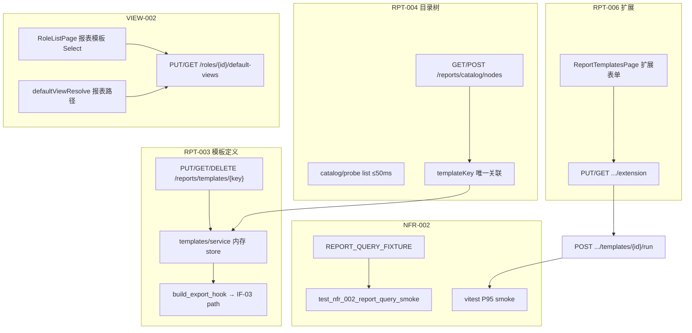

# M10 报表模板与角色默认视图设计 — RPT-003 / RPT-004 / RPT-006 / VIEW-002 / NFR-002

```yaml
date: 2026-07-06
milestone: M10
round_target: docs/superpowers/evolution/2026-07-06-round-target-m10-report-templates.md
base_branch: dev-auto
prd_ids: [RPT-003, RPT-004, RPT-006, VIEW-002, NFR-002]
ui_design_skill: .agents/skills/b-design-system-tailadmin-radix/SKILL.md
status: design
```

## 1. 批量主题与子项映射

| # | 子项 | PRD ID | 执行顺序 | 主攻薄弱维 | 用户感知 |
|---|------|--------|:--------:|------------|----------|
| 1 | Word/Excel/PDF 模板定义 + 导出 hook | RPT-003 | 1 | 用户价值 **84%**；完整度 **90%** | Admin 可创建/编辑/删除模板元数据与块定义；运行时可占位渲染并挂接导出 |
| 2 | 模板树形目录 FE + catalog 关联 | RPT-004 | 2 | 性能 **88%**；完整度 **90%** | 树形浏览文件夹/模板；新建/移动；与模板定义一一关联 |
| 3 | 报表扩展配置 Admin UI | RPT-006 | 3 | 架构健康 **88%**；用户价值 **86%** | 选中模板节点可配置指标/筛选器；只读预览 render-spec |
| 4 | 角色默认报表模板 + 登录落地 | VIEW-002 | 4 | 用户价值 **84%**；完整度 **90%** | 角色可绑默认报表模板；登录后无 Dashboard 默认时进入报表模板 |
| 5 | 报表查询性能 fixture + P95 回归 | NFR-002 | 5 | 性能 **88%**；用户价值 **84%** | 报表列表/运行响应可探测；CI 可断言 P95 与 budget 不回归 |

**依赖链**：RPT-003 模板实体（`templateKey` + `storageRef` + export hook）→ RPT-004 catalog `templateKey` 唯一关联 → RPT-006 扩展配置 UI 挂载模板节点 → VIEW-002 角色 `reportTemplateNodeId` FE 绑定与 `defaultViewResolve` 落地 → NFR-002 以 engine run + mock probe 双轨验收。

**上轮已交付（本轮不重复 L1/companion 骨架）**：

| PRD | 已有 | 本轮不重复 |
|-----|------|-----------|
| RPT-003 | `PUT/GET/POST validate` + blocks + ACL/probe（r62/r67） | 不重写内存 store 校验核心；不实现真实 PDF/Word 排版引擎 |
| RPT-004 | catalog CRUD/move + 深度/环检测 + ACL（r53/r57/r58） | 不重写 FSM；不实现「另存为/手工执行」远期项 |
| RPT-006 | extension CRUD + revision + render-spec API（r54/r55/r58） | 不重写 compare/batch 联动；不建 DB 持久化 |
| VIEW-002 | `PUT/GET default-views` + cycle/scope/probe（r60/r63/r68） | 不重写 store 结构；不实现新用户 onboarding 全链 |
| NFR-002 | mock probe validate + ACL（r61/r67） | 不重写 `elapsedMs=120` mock 语义 |

**真理源优先级**：`round-target` > `plan.md` §M10 > `layout.md` §3 > b-design-system skill > `prd/F08-RPT` · `F09-VIEW` · `F15-NFR` > `docs/services/reports.md` · `views.md`。

## 2. 现状与约束

| 项 | 现状（范围框定内已读） |
|----|------------------------|
| `reports/templates/` | 内存 store；`format` word/excel/pdf + blocks；**无** `storageRef`、**无** DELETE、**无** list、**无** export hook |
| `reports/catalog/` | folder/template 节点；`templateKind`；**无** `templateKey` 与 RPT-003 关联；**无** list perf probe |
| `reports/engine/service.py` | `web/html` 真实执行；`pdf` → 422；word/excel 未入枚举；**无** exportHook |
| `reports/extension/` | 完整 CRUD + render-spec；**无** FE 配置 UI |
| `views/role_template.py` | 支持 `reportTemplateNodeId`；BE 校验 catalog template 节点 |
| `fe/.../RoleListPage.tsx` | 仅 `defaultDashboardId` Select；**未**写 `reportTemplateNodeId` |
| `fe/lib/defaultViewResolve.ts` | 用户覆盖 > 角色 Dashboard；**忽略** `reportTemplateNodeId` |
| `fe/config/admin-nav.tsx` | 分析组仅有「预制报表」；**无**「报表模板」导航 |
| `fe/routes.tsx` | `/admin/reports` → PrefabReportsPage；**无** `/admin/reports/templates` |
| `core/nfr/report_perf.py` | mock probe；**无** `REPORT_QUERY_FIXTURE`；**无** `test_nfr_002_*` |
| `fe/components/` | **无** TreeTable；`SchemaBrowser` 有 Collapsible 树模式可参照 |
| IF-03 `reports/export` | mock 导出已登记；本轮仅作 export hook 目标路径引用 |

**范围框定模块**（3）：`backend/app/reports/` + `backend/app/views/`（只读消费 default-views，不改 store）+ `backend/app/core/nfr/report_perf.py` + `fe/` 模板/角色页 + `tests/` + 薄 `docs/`。

## 3. 范围框定文件清单（≤18 主文件）

| 路径 | 子项 | 动作 |
|------|:----:|------|
| `backend/app/reports/templates/schemas.py` | RPT-003 | 修改：`storageRef`；`exportHook` 只读出参类型 |
| `backend/app/reports/templates/service.py` | RPT-003 | 修改：delete、list_keys、`build_export_hook` |
| `backend/app/reports/templates/probe.py` | RPT-003 | 修改：`probe_list_templates_budget_ms` |
| `backend/app/api/v1/reports/templates.py` | RPT-003 | 修改：`DELETE` + `GET` list（query 可选） |
| `backend/app/reports/catalog/schemas.py` | RPT-004 | 修改：`templateKey` 可选字段 |
| `backend/app/reports/catalog/service.py` | RPT-004 | 修改：template 节点 `templateKey` 唯一性 + 存在性校验 |
| `backend/app/reports/catalog/probe.py` | RPT-004 | 新建：`probe_list_catalog_budget_ms` ≤50ms |
| `backend/app/reports/engine/schemas.py` | RPT-003 | 修改：`RenderRunOut.exportHook` 可选 |
| `backend/app/reports/engine/service.py` | RPT-003 | 修改：word/excel/pdf 占位 render + exportHook |
| `backend/app/core/nfr/report_perf.py` | NFR-002 | 修改：`REPORT_QUERY_FIXTURE` + fixtureProfile 出参 |
| `fe/src/pages/admin/reports/ReportTemplatesPage.tsx` | RPT-003/004/006 | 新建：master-detail 树 + 模板/扩展配置 |
| `fe/src/pages/admin/reports/useReportTemplates.ts` | RPT-003/004/006 | 新建：catalog/template/extension mutations |
| `fe/src/pages/admin/reports/report-templates.smoke.test.tsx` | 全 FE | 新建：树加载/空态/扩展保存 mock smoke |
| `fe/src/pages/admin/system/roles/RoleListPage.tsx` | VIEW-002 | 修改：默认报表模板 Select |
| `fe/src/lib/defaultViewResolve.ts` | VIEW-002 | 修改：Dashboard 优先后 fallback 报表模板路径 |
| `fe/src/lib/defaultViewResolve.test.ts` | VIEW-002 | 修改：报表默认 + 优先级用例 |
| `tests/test_m10_report_templates_r234.py` | 全项 | 新建：≥18 条后端集成（CRUD/关联/越权/边界） |
| `tests/test_nfr_002_report_query_smoke.py` | NFR-002 | 新建：fixture + simulate_slow breach（镜像 NFR-001） |

**薄修改（不计入 18 行主清单）**：`fe/src/routes.tsx`、`fe/src/config/admin-nav.tsx`、`fe/src/lib/queryKeys.ts`、`docs/api/README.md`、`docs/services/reports.md`、`docs/services/views.md`、`docs/ui/layout.md`。

**文件预算**：上表 18 行。`report-query.perf.smoke.test.tsx` 并入 `report-templates.smoke.test.tsx` 第二节（同文件第二 `describe`，避免超预算）。

## 4. 非目标（明确不做）

- M11 `CONN-009+` 三期连接器、M12 `RPT-005` 调度、M13 Dataset/设计器
- 真实 PDF/Word/Excel 排版引擎与对象存储上传
- WYSIWYG 模板设计器（首包仅元数据 + blocks 表单）
- 模板文件二进制上传（`storageRef` 为 mock URI 契约）
- catalog「另存为/手工执行」、batch 管理员 UI、调度 FE
- DB/Alembic 持久化（延续内存 store + 文档注明）
- 新用户 onboarding 自动继承全链（PRD 远期项）
- Playwright E2E（vitest smoke + P4 截图 QA）
- `tests/perf/nfr01_report/` 全量并发压测报告（本轮 fixture + P95 smoke 即可勾选 plan）

## 5. PRD 8 维薄弱项对齐

| PRD ID | 薄弱维 | 本轮设计对策 |
|--------|--------|--------------|
| RPT-003 | 用户价值 84%；完整度 90% | Admin 模板 CRUD/删除 + 三格式元数据；engine 占位渲染 + IF-03 export hook 指针 |
| RPT-004 | 性能 88%；完整度 90% | catalog list probe ≤50ms；FE 树懒加载子节点；`templateKey` 唯一关联闭合 |
| RPT-006 | 架构健康 88%；用户价值 86% | 扩展配置 UI 只调既有 extension API；render-spec 只读预览与域服务解耦 |
| VIEW-002 | 用户价值 84%；完整度 90% | 角色 Dialog 双默认（Dashboard + 报表模板）；`defaultViewResolve` 报表 fallback |
| NFR-002 | 性能 88%；用户价值 84% | `REPORT_QUERY_FIXTURE` + pytest smoke + vitest P95 ≤3000ms（API budget 10000ms） |

## 6. 方案比选（摘要）

### 6.1 模板树 FE 形态

| 方案 | 说明 | 结论 |
|------|------|------|
| A master-detail：`Collapsible` 树（参照 `SchemaBrowser`）+ 右侧详情/扩展 Sheet | 不引入 TreeTable 新组件；≤300 行/页 | **采用** |
| B 引入 skill `TreeTable` 全量 vendoring | 文件 +2、check:design 风险 | 否决（M10 companion 范围） |
| C 扁平静态表 | 不满足树形目录验收 | 否决 |

### 6.2 catalog ↔ template 关联

| 方案 | 说明 | 结论 |
|------|------|------|
| A catalog template 节点可选 `templateKey` 外键式引用 RPT-003 store | 唯一性在 catalog 层守卫；engine 仍按 nodeId 运行 | **采用** |
| B 合并 store（取消独立 templates 模块） | 破坏 r62/r67 锚点与 API 契约 | 否决 |
| C 仅名称约定无校验 | 不满足「关联唯一性」验收 | 否决 |

### 6.3 角色默认落地优先级

| 方案 | 说明 | 结论 |
|------|------|------|
| A 用户覆盖 Dashboard > 角色 Dashboard（inherit）> 角色报表模板（inherit）> null | 与 VIEW-003 一致；Dashboard 优先于报表模板 | **采用** |
| B 报表模板优先于 Dashboard | 与现有 Dashboard 消费路径冲突 | 否决 |
| C 新增 `GET /me/default-landing` | 超 round-target FE+BE 薄改原则 | 否决 |

### 6.4 NFR-002 测量

| 方案 | 说明 | 结论 |
|------|------|------|
| A 镜像 NFR-001：`REPORT_QUERY_FIXTURE` + pytest smoke + vitest P95 | 已有 `test_nfr_001_first_screen_smoke.py` 先例 | **采用** |
| B 新建 `tests/perf/nfr01_report/` 压测目录 | 超 ≤18 文件预算；PRD 标 companion | 否决 |

## 7. 总体架构



## 8. 分项设计与验收标准

### 8.1 RPT-003 — Word/Excel/PDF 模板定义

#### 8.1.1 数据模型增量

`TemplateDefinitionIn/Out` 增：

| 字段 | 类型 | 规则 |
|------|------|------|
| `storageRef` | `string \| null` | 可选；pattern `^mock://templates/[a-z0-9_-]+\\.(word|excel|pdf)$`；缺省按 `mock://templates/{templateKey}.{format}` 合成 |
| `exportHook` | 只读出参 | `{ integrationPath, format, placeholder: true }` |

`DELETE /api/v1/reports/templates/{templateKey}`：

- admin/editor 可删；viewer → `RPT_TEMPLATE_FORBIDDEN` 403
- 若 catalog 仍有节点引用该 `templateKey` → `RPT_TEMPLATE_IN_USE` 409
- 成功 204

`GET /api/v1/reports/templates?prefix=`（可选）：返回 `{ items: TemplateDefinitionOut[] }`；enterprise scope 过滤。

#### 8.1.2 引擎 export hook

`engine/service.run_template` 当 `node.template_kind ∈ {word, excel, pdf}` 且请求 `format` 匹配 kind：

- 返回 `renderSpec.sections=[{ kind:"table", placeholder:true }]`
- `exportHook={ integrationPath:"/api/v1/reports/export?templateId={nodeId}&format={kind}", placeholder:true }`
- **不**调用真实 query（与无 extension 占位一致）；有 extension + dataSourceId 时仍走 M3-LITE 真实 sections，并附带 exportHook

#### 8.1.3 验收标准（可测试）

- [ ] PUT/GET/DELETE 模板三格式 CRUD；非法 format/block → 422
- [ ] `storageRef` 校验与默认合成
- [ ] catalog 引用时 DELETE → 409 `RPT_TEMPLATE_IN_USE`
- [ ] `POST .../templates/{nodeId}/run` word/excel/pdf 返回 exportHook
- [ ] pytest：越权、duplicate block、delete-in-use、export hook（≥6 新用例计入 r234 文件）
- [ ] `docs/api/README.md` 登记 DELETE + list

### 8.2 RPT-004 — 模板树形目录管理

#### 8.2.1 catalog `templateKey`

`CatalogNodeCreate/Out` 增 `templateKey: string | null`：

- `nodeType=folder` 时必须为 null
- `nodeType=template` 时可选；若提供须存在于 templates store
- 全局唯一：第二节点相同 key → `RPT_CATALOG_DUPLICATE_TEMPLATE_KEY` 422
- `templateKind` 与关联模板 `format` 不一致 → `RPT_CATALOG_TEMPLATE_KIND_MISMATCH` 422

`catalog/probe.py`：`probe_list_catalog_budget_ms` 对空树 + 50 节点 fixture 列表 ≤50ms。

#### 8.2.2 FE 树浏览（与 RPT-003 同页）

见 §10 UI 设计交付。

#### 8.2.3 验收标准

- [ ] 创建/移动/删除节点；环/深度/子节点守卫回归
- [ ] `templateKey` 唯一性与存在性
- [ ] list catalog probe ≤50ms
- [ ] FE：树展开、新建文件夹、新建模板节点、移动（Dropdown「移动到…」选父节点）
- [ ] pytest：空树/深层(8)/循环/templateKey 冲突（≥4 新用例）

### 8.3 RPT-006 — 报表扩展配置 FR-6.3

#### 8.3.1 FE 扩展配置区

选中 `nodeType=template` 节点时，右侧详情 Tabs：

| Tab | 内容 |
|-----|------|
| 基本信息 | 名称、templateKind、templateKey 链接、运行按钮 |
| 扩展配置 | metrics/filters 动态列表（key/label/expression/operator/compareMode） |
| 预览 | 只读 JSON `GET .../extension/render-spec` + 「同比预览」按钮调 compare-preview |

保存：`PUT .../extension` + `changeNote` 必填（审计）；校验错误字段级展示。

#### 8.3.2 验收标准

- [ ] PUT extension 非法 operator/compareMode → 422 字段映射中文
- [ ] render-spec 可见指标与 revision 列表只读展示
- [ ] FE smoke：保存 metrics + 预览 render-spec mock
- [ ] pytest：extension 与 catalog 非 template 节点 → 422（回归 2 条）

### 8.4 VIEW-002 — 角色默认模板 FR-VIEW-3

#### 8.4.1 解析优先级（文档化差异）

消费路径解析顺序（与 VIEW-003 对齐并扩展）：

1. `GET /users/me/views` 用户覆盖 Dashboard（**VIEW-003 已有**）
2. 按 `me.roles` 顺序：`default-views.dashboardId`（含 `inheritFromRoleId` 链，深度 ≤8）
3. 同角色链上 `reportTemplateNodeId`（含 inherit 链上继承的报表默认）
4. `null` → 保持 `/admin` 或 Dashboard 列表降级

**差异说明**：同一角色同时配置 Dashboard 与报表模板时，**Dashboard 优先**；仅当 Dashboard 为空时落报表模板 `/admin/reports/templates/{nodeId}?panel=run`。

#### 8.4.2 RoleListPage 增量

Dialog 增第二 `Select`「默认报表模板」：

- 选项来自 `GET /reports/catalog/nodes` 扁平过滤 `nodeType=template`
- 保存 `PUT default-views` body 同时含 `dashboardId` + `reportTemplateNodeId`（允许其一为空，不可双空——沿用 BE `VIEW_DEFAULT_EMPTY`）

#### 8.4.3 defaultViewResolve

重命名导出为 `resolveDefaultLandingPath`（保留 `resolveDefaultDashboardPath` 别名 re-export 防破坏）：

- 报表路径：`/admin/reports/templates/{reportTemplateNodeId}?panel=run`
- inherit 链上若仅有 `reportTemplateNodeId` 亦生效

#### 8.4.4 验收标准

- [ ] PUT/GET 绑定/解绑 `reportTemplateNodeId`；非 template 节点 → 404
- [ ] viewer PUT → 403；inherit cycle 回归
- [ ] vitest：Dashboard 优先、仅报表默认、inherit 报表、用户覆盖仍优先
- [ ] FE：角色 Dialog 可选报表模板并保存成功 toast

### 8.5 NFR-002 — NFR-01 报表查询性能

#### 8.5.1 REPORT_QUERY_FIXTURE

`report_perf.py` 增常量：

```python
REPORT_QUERY_FIXTURE = {
    "id": "rpt-m10-query-smoke",
    "templateKey": "sales_summary",
    "budgetMs": 10000,
    "mockElapsedMs": 120,
}
```

`ReportPerfProbeOut` 增可选 `fixtureProfile`（与 NFR-001 `fixtureProfile` 对称）；`reportId` 等于 fixture id 时附带。

#### 8.5.2 测试与阈值

| 层 | 阈值 | 文件 |
|----|------|------|
| API mock probe | `budgetMs` 默认 10000；`elapsedMs=120` → withinBudget | 既有 r61/r67 回归 |
| pytest smoke | fixture within_budget；`simulateFailure` → samplePassed false | `tests/test_nfr_002_report_query_smoke.py` |
| vitest P95 | 模板页 mock run 5 样本 P95 ≤ **3000ms**（CI 稳定门槛；SRS 10000ms 为 API 合同） | `report-templates.smoke.test.tsx` 第二节 |

`docs/services/core.md` 注明测量方法：进程内 mock + vitest headless P95；全量压测留 `tests/perf/nfr01_report/` companion。

#### 8.5.3 验收标准

- [ ] `REPORT_QUERY_FIXTURE` probe/validate 通过
- [ ] simulate_slow breach 用例
- [ ] vitest P95 断言纳入 CI
- [ ] M10 pytest 套件含性能退化用例 ≥2

## 9. 后端错误码增量

| 码 | HTTP | 场景 |
|----|------|------|
| `RPT_TEMPLATE_IN_USE` | 409 | DELETE 时 catalog 仍引用 templateKey |
| `RPT_CATALOG_DUPLICATE_TEMPLATE_KEY` | 422 | 重复 templateKey |
| `RPT_CATALOG_TEMPLATE_KIND_MISMATCH` | 422 | templateKind 与模板 format 不一致 |

## 10. UI 设计交付

`ui_design_skill`: `.agents/skills/b-design-system-tailadmin-radix/SKILL.md`

### 10.1 页面信息架构

| 路由 | 导航 | 布局 |
|------|------|------|
| `/admin/reports/templates` | 新增侧栏分组 **报表** → 「报表模板」 | `AdminPageShell` + 左右 master-detail（`lg:grid-cols-[280px_1fr]`） |
| `/admin/reports/templates/:nodeId` | 同上（可选深链） | 同页选中节点高亮 |
| `/admin/system/roles` | 已有系统分组 | Dialog 内双 Select 区块 |

主内容区：`max-w-(--breakpoint-2xl)` 内全宽；树栏固定 280px，右侧 `gap-6` 堆叠 Card。

**状态**：

| 态 | 树栏 | 详情区 |
|----|------|--------|
| loading | `Skeleton` 6 行 | — |
| empty | 「暂无模板目录」+ 主按钮「新建文件夹」 | — |
| error | `ErrorBanner` + 重试 | — |
| 权限 | viewer：树只读，隐藏新建/移动/扩展保存 | 「无权编辑报表模板」 |
| 未选中 | 树正常 | 空态插画 +「请选择左侧模板或文件夹」 |

### 10.2 视觉层级

- **主操作**：「新建模板」「新建文件夹」→ `Button` default，树栏顶工具行
- **次操作**：运行、预览、移动到 → `outline` / `DropdownMenu`
- **承载**：树用 `Card` + `ScrollArea`；详情用 `Card` + `Tabs`；扩展指标行用紧凑 `border` 列表而非大留白
- **删除**：模板/节点 → `AlertDialog`

### 10.3 组件映射

| 用途 | 组件 | 来源 |
|------|------|------|
| 页壳 | `AdminPageShell` | 已有 |
| 树节点 | `Collapsible` + `Button` ghost | 参照 `SchemaBrowser` |
| 表单 | `Input`/`Select`/`Textarea`/`Label` | `components/ui` |
| 扩展动态列表 | 行内 `Input` + 删除 `Button` icon | 页内私有；≥2 处再上浮 |
| 预览 | `ScrollArea` + `pre` monospace | 页内 |
| 反馈 | `sonner` toast；字段错误 inline | skill 规范 |
| 角色默认 | `Select` ×2（Dashboard / 报表模板） | `RoleListPage` 已有模式 |

**禁止**：页面内自定义按钮/表格样式；手写 Modal；硬编码 hex。

### 10.4 Token 与密度

- 语义色：`brand-*` 主操作、`gray-*` 边框、`error-*` 错误横幅（对齐 `PrefabReportsPage` / `RoleListPage`）
- 间距：壳层 `gap-6`；表单项 `gap-4`；树行 `py-2 px-3`
- 圆角：`rounded-xl` Card；`rounded-lg` 输入
- 字号：`text-theme-sm` 表体；`text-title-sm` 区块标题
- 图标：`lucide-react` `Folder`/`FileSpreadsheet`/`FileText`/`File` size-5

### 10.5 响应式与可访问性

- **桌面**：左右分栏；树 `ScrollArea` max-h `[calc(100vh-12rem)]`
- **窄屏 `<lg`**：树折叠为顶部 `Select`「当前节点」+ 详情全宽
- 树节点 `aria-expanded`；操作 `aria-label`「移动到…」「删除模板」
- 长模板名 `truncate` + `title` tooltip；扩展 key `font-mono text-xs`

### 10.6 视觉 QA 清单（P3/P4）

- [ ] desktop light/dark：树 + 详情 + 扩展 Tab 对齐截图
- [ ] mobile：窄屏 Select 切换节点无重叠
- [ ] 状态：empty / error / viewer 只读 / 保存成功 toast
- [ ] 角色 Dialog：双 Select 对齐、无文本溢出
- [ ] `pnpm run check:design` PASS

## 11. 验证计划（P4 预览）

| 命令 | 期望 |
|------|------|
| `cd backend && ruff check . && pytest tests/test_m10_report_templates_r234.py tests/test_nfr_002_report_query_smoke.py -q` | exit 0 |
| `cd fe && pnpm run check:design && pnpm vitest run src/pages/admin/reports/report-templates.smoke.test.tsx src/lib/defaultViewResolve.test.ts` | exit 0 |
| 全量回归 | r67/r68/r233 相关用例无破坏 |

## 12. 文档同步（P3 同 PR）

| 变更 | 文档 |
|------|------|
| 新路由 DELETE/list、catalog templateKey | `docs/api/README.md` |
| 模板域 FE、export hook、probe | `docs/services/reports.md` |
| 角色报表默认、落地优先级 | `docs/services/views.md` |
| 报表分组导航、模板路由 | `docs/ui/layout.md` |
| M10 五项勾选 | `docs/automate/plan.md`（P5） |
