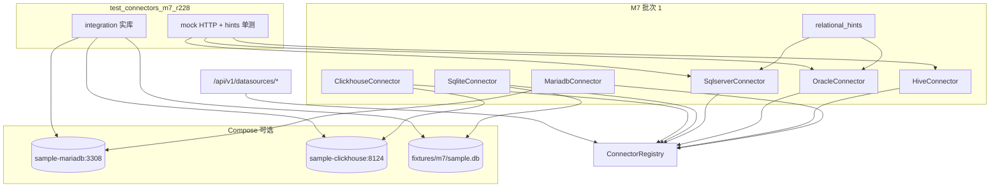

# M7 二期数据源类型扩展批次 1 设计 — CONN-003~007

```yaml
date: 2026-07-06
milestone: M7
round_target: docs/superpowers/evolution/2026-07-06-round-target-m7-conn-ext.md
base_branch: dev-auto
prd_ids: [CONN-003, CONN-004, CONN-005, CONN-006, CONN-007]
ui_design_skill: none
status: design
```

## 1. 批量主题与子项映射

| # | 子项 | PRD ID | `type` | category | 执行顺序 | 主攻薄弱维 | 用户感知 |
|---|------|--------|--------|----------|:--------:|------------|----------|
| 1 | MariaDB + Hive M7 集成验收 | CONN-003 | `mariadb`, `hive` | `relational`, `lake` | 1 | 用户价值 **84%**；完整度 **90%** | 可建 MariaDB/Hive 源；连通性 + schema 浏览与 MySQL/PG 同等路径 |
| 2 | Oracle 连接器 M7 集成验收 | CONN-004 | `oracle` | `relational` | 2 | 完整度 **88%**；用户价值 **84%** | 政企 Oracle 可接入；凭证加密与 RLS 链路与既有 DS 一致；响应无密码泄露 |
| 3 | SQL Server 方言差异 + M7 集成 | CONN-005 | `sqlserver` | `relational` | 3 | 用户价值 **84%**；性能 **88%** | 标识符引用、分页语义、类型映射行为正确；连接池可复用 |
| 4 | SQLite 文件源 M7 集成验收 | CONN-006 | `sqlite` | `embedded` | 4 | 用户价值 **84%**；性能 **88%** | 指定 SQLite 文件路径建源；只读约束；非法路径拦截 |
| 5 | ClickHouse OLAP M7 集成验收 | CONN-007 | `clickhouse` | `olap` | 5 | 用户价值 **84%**；安全性 **88%** | `SHOW TABLES`/列元数据浏览；M3-LITE 只读 SQL 可执行（clickhouse 查询方言已存在） |

**依赖链**：`mariadb.py` 注册 → `relational_hints.py` 纯函数 + oracle/sqlserver 消费 → compose 夹具 `m7_compose_env` → `test_connectors_m7_r228.py` 集成/mock 分层 → r207 + r36/r37/r40/r41 回归 → P5 勾 plan §M7 前五项 + PRD 对账。

**上轮已交付（本轮不重复 L1/companion 骨架）**：

| 域 | 已有能力 | 本轮不重复 |
|----|----------|-----------|
| CONN-003 Hive | `hive.py` + `HIVE_*` 错误域 + r36/r37 mock（≥14 条） | 不重写 pyhive 连接与 `information_schema` 过滤核心 |
| CONN-004 Oracle | `oracle.py` + `ORACLE_*` + owner/table 层级 + r37 mock | 不重写 oracledb thin 连接与 `ALL_TAB_COLUMNS` 查询 |
| CONN-005 SQL Server | `sqlserver.py` + `SQLSERVER_*` + TLS `encrypt` + r37 mock | 不重写 pymssql 连接与 `INFORMATION_SCHEMA` 自省 |
| CONN-006 SQLite | `sqlite.py` + 路径穿越/只读守卫 + r40/r41 mock | 不重写 `mode=ro` URI 与 `PRAGMA table_info` |
| CONN-007 ClickHouse | `clickhouse.py` + HTTP client + r36/r37 mock；QUERY-004 `get_sql_dialect(clickhouse)` | 不重写 `system.*` 元数据查询与宽表 limit |
| 注册 | 五 type 已在 `register_builtin_dialects()`；`connectors-ext` optional 组已声明驱动 | 不新增 registry API |
| M3 范式 | `test_connectors_compose_r207.py` + `connector_compose_env`（3307/5433） | 不改动 MySQL/PG 集成测语义 |

**PRD / plan 命名漂移注记**（真理源：`round-target` > `prd/F04-CONN.md` > `plan.md` 行文案）：

| PRD ID | plan.md 行文案 | F04-CONN / 本轮 canonical |
|--------|---------------|---------------------------|
| CONN-003 | MariaDB / Hive | **`mariadb`（本轮新增）+ `hive`（已有）** |
| CONN-004 | SQL Server / Oracle | **`oracle`** |
| CONN-005 | Oracle / SQL Server | **`sqlserver` + `relational_hints` 方言差异** |

plan 行将两关系型库并列描述；实现按 PRD 一 ID 一方言主 type，CONN-005 专项闭合 Oracle/SQL Server **差异点**（标识符、分页、类型映射），与 CONN-004 共享 registry、无重复注册。

## 2. 现状与约束（范围框定内已读）

| 项 | 现状 |
|----|------|
| `dialects/hive.py` 等五方言 | L1 已实现；真实驱动 lazy import；mock 单测已绿 |
| `dialects/mariadb.py` | **不存在**；SRS §3.6 枚举含 `mariadb`；sample-mysql 为 MySQL 8 非 MariaDB |
| `query/dialects/` | 仅 `mysql`/`postgresql`/`clickhouse`；**无** sqlserver/oracle 查询方言（本轮不扩 query 模块） |
| `docker-compose.yml` | 仅 postgres / analytics-postgres / sample-mysql；**无** mariadb、clickhouse、sqlserver、oracle、hive |
| `tests/conftest.py` | `connector_compose_env` 仅 mysql+pg 端口检测 |
| `pool.py` | 已按 `connector.open_connection(**kwargs)` 泛型池化；sqlserver/oracle 可直接复用 |
| PRD `F04-CONN` CONN-003~007 | L1 `[x]`；「UI 可选」「只读查询集成」仍 `[ ]`；**本轮不含 FE** |
| `plan.md` §M7 | CONN-003~007 五行 `[ ]` |

**范围框定模块**（≤3）：`backend/app/datasources/` + `tests/` + `docker/`（compose 种子，计入文件预算）。

**真理源优先级**：`round-target` > `plan.md` §M7 > `prd/F04-CONN.md` > `docs/services/datasources.md` > `docs/srs/`（MariaDB 枚举）> `docs/api/README.md`（本轮无新 HTTP 路由）。

## 3. 非目标（明确不做）

- CONN-008 Doris（留 M7 批次 2）；M11 三期连接器 CONN-009~016；M13 信创 CONN-017~022
- FE 数据源管理 UI 变更（M-FE-1 已交付 types catalog 消费；「UI 可选」PRD 子项非本轮）
- `query/dialects` 新增 sqlserver/oracle（QUERY 只读执行链 companion，非 round-target）
- Dataset 路径（QUERY-009）；M1B ingestion 写入 SQLite
- Spark/Presto、RAC/AlwaysOn 高可用专项；Hive 真实 compose 重型栈（integration 可 skip）
- 修改 `goal.md`；创建/改结构 `plan.md`（P5 仅勾选已有 `- [ ] <prd ID>:` 行）
- 新增 Alembic migration（类型由 registry 发现，非 DB 枚举表）

## 4. 范围框定文件清单（18）

| 路径 | 子项 | 动作 |
|------|:----:|------|
| `backend/app/datasources/dialects/mariadb.py` | CONN-003 | 新建：`MariadbConnector`，MySQL 协议委托 |
| `backend/app/datasources/dialects/relational_hints.py` | CONN-005 | 新建：标识符/分页/类型映射纯函数 |
| `backend/app/datasources/dialects/oracle.py` | CONN-004,005 | 修改：列类型经 `normalize_oracle_type` |
| `backend/app/datasources/dialects/sqlserver.py` | CONN-005 | 修改：列类型经 `normalize_sqlserver_type` |
| `backend/app/datasources/dialects/__init__.py` | CONN-003 | 修改：导出 `MariadbConnector` |
| `backend/app/datasources/__init__.py` | CONN-003 | 修改：`register_dialect(MariadbConnector())` |
| `docker-compose.yml` | CONN-003,007 | 修改：`sample-mariadb`（3308）、`sample-clickhouse`（8124） |
| `docker/sample-mariadb/init.sql` | CONN-003 | 新建：与 sample-mysql 对称种子表 |
| `docker/sample-clickhouse/init.sql` | CONN-007 | 新建：`dirty_orders` 宽表种子 |
| `tests/fixtures/m7/sample.db` | CONN-006 | 新建：预置 sqlite 文件（git 跟踪，<50KB） |
| `tests/conftest.py` | 全部 | 修改：`m7_compose_env` 夹具 + 端口检测 |
| `tests/test_connectors_m7_r228.py` | 全部 | 新建：M7 集成 + 方言差异 mock 测 |
| `docs/services/datasources.md` | 全部 | 修改：mariadb 登记 + M7 compose 锚点 |
| `docs/automate/prd/F04-CONN.md` | 全部 | **P5**：勾选 M7 集成验收项 |
| `docs/automate/plan.md` | 全部 | **P5**：§M7 CONN-003~007 勾选 |
| `backend/pyproject.toml` | CONN-004 | 修改：pytest marker 注释扩 M7 compose 端口说明 |
| `backend/app/datasources/dialects/hive.py` | CONN-003 | 修改（仅当集成测暴露缺陷；预期零改动） |
| `backend/app/datasources/dialects/clickhouse.py` | CONN-007 | 修改（仅当集成测暴露缺陷；预期零改动） |

> **文件预算**：16 行确定 + 2 行「预期零改动」缓冲。`sqlite.py` 逻辑不变，仅通过 fixture 文件做集成测。

## 5. PRD 8 维薄弱项对齐

| PRD ID | 薄弱维 | 本轮设计对策 |
|--------|--------|--------------|
| CONN-003 | 用户价值 84%；完整度 90% | 新增 `mariadb` type；compose `sample-mariadb:3308` 端到端 test_connection + metadata；Hive 保持 mock 绿 + types catalog 回归 |
| CONN-004 | 完整度 88%；用户价值 84% | Oracle HTTP CRUD→test→schemas 链 mock 集成测；断言 test/metadata 响应体无 `password`/`secret` 子串；驱动依赖已在 `connectors-ext` |
| CONN-005 | 用户价值 84%；性能 88% | `relational_hints` 单测覆盖 `quote_*`/`build_limit_clause`/`normalize_*`；sqlserver TLS 与 pool 复用 r37 回归；与 oracle 无 registry 冲突 |
| CONN-006 | 用户价值 84%；性能 88% | 临时文件 + `tests/fixtures/m7/sample.db` 只读链；`..` 路径穿越 400/422；`open_connection` 只读 URI 对称 |
| CONN-007 | 用户价值 84%；安全性 88% | compose ClickHouse 8124 集成；`get_sql_dialect(clickhouse)` 不回归；只读账号参数 `readonly=1` 文档化（connection_options 占位，不强制 TLS 实现） |

## 6. 方案比选（摘要）

### 6.1 MariaDB vs 复用 `mysql` type

| 方案 | 说明 | 结论 |
|------|------|------|
| A 独立 `type=mariadb`，`MariadbConnector` 委托 `MysqlConnector._build_connect_kwargs` | 对齐 SRS §3.6；types catalog 显式选项；与 TiDB/OceanBase 委托模式一致 | **采用** |
| B 文档声明 MariaDB 使用 `mysql` type | 不满足 round-target「MariaDB 或 Hive 类型」 | 否决 |
| C 独立 pymysql 复制 mysql.py | 重复维护 | 否决 |

### 6.2 M7 集成测运行模式

| 方案 | 说明 | 结论 |
|------|------|------|
| A 新文件 `test_connectors_m7_r228.py` + `@pytest.mark.integration` + 分层 skip | MariaDB/ClickHouse 有 compose 则跑实库；Oracle/SQL Server/Hive 以 mock HTTP 链 + 方言单测闭合；SQLite 用 fixture 文件无需 compose | **采用** |
| B 强制 CI 启全套 sqlserver/oracle/hive compose | 镜像重、超 round-target「可 skip」 | 否决 |
| C 仅复跑 r36/r37 mock | 不闭合 plan §M7「FR-2.0-EXT」集成验收 | 否决 |

### 6.3 CONN-005 方言差异落点

| 方案 | 说明 | 结论 |
|------|------|------|
| A `datasources/dialects/relational_hints.py` 纯函数 + connector `list_columns` 消费 | 落在范围框定 datasources 模块；可被未来 query 方言 import | **采用** |
| B 直接扩 `query/dialects/sqlserver.py` | 超出 round-target 模块框定 | 否决 |
| C 仅文档描述差异 | 不可测试；不满足验收 | 否决 |

## 7. 总体架构



## 8. 分项设计与验收标准

### 8.1 CONN-003 — MariaDB + Hive

#### 8.1.1 MariadbConnector

**文件**：`backend/app/datasources/dialects/mariadb.py`

| 属性 | 值 |
|------|-----|
| `type` | `mariadb` |
| `category` | `relational` |
| `capabilities` | `("connectivity_test", "schema_browser")` |
| `display_name` | `MariaDB` |
| 默认 port | 3306（compose 映射 3308） |
| 实现 | 组合/委托 `MysqlConnector`：`open_connection`/`test_connection`/`list_*` 转发；`type`/`display_name`/`category` 覆盖 |

**注册**：`register_builtin_dialects()` 在 `HiveConnector` 邻位注册；`export_type_catalog()` 同时含 `mariadb` 与 `hive`。

#### 8.1.2 Hive

保持现有 `hive.py`；本轮仅补 types catalog + mock 回归断言（r36/r37 不删）。

#### 8.1.3 验收标准（可测试）

| ID | 断言 |
|----|------|
| T-CONN-R228-003-01 | `MariadbConnector().type == "mariadb"`；catalog 含 `mariadb` + `hive` |
| T-CONN-R228-003-02 | compose 运行时：`test_connection` 对 `sample-mariadb` `ok=true` |
| T-CONN-R228-003-03 | compose：`list_schemas` 含 `sample_db`；`list_tables` 含 `dirty_orders` |
| T-CONN-R228-003-04 | HTTP：POST mariadb 源 → test → GET schemas 全 200 |
| T-CONN-R228-003-05 | Hive mock：`test_connection` 失败返回 `HIVE_*` code（r37 回归 ≥1 条） |
| T-CONN-R228-003-06 | 无 compose mariadb 端口时 integration 用例 `pytest.skip` |

### 8.2 CONN-004 — Oracle

#### 8.2.1 实现要点

- 不新增方言文件；本轮闭合 **HTTP 集成链 + 凭证脱敏**。
- `@patch("oracledb.connect")` 驱动 mock 下：CRUD → test → schemas → tables → columns。
- 断言：`json.dumps(response)` 不含 payload 密码；502 消息不含 `password=`。

#### 8.2.2 验收标准

| ID | 断言 |
|----|------|
| T-CONN-R228-004-01 | mock 成功：`OracleConnector.test_connection` `ok=true` |
| T-CONN-R228-004-02 | mock 失败：`ORACLE_AUTH_FAILED` 等 code 稳定（r37 回归） |
| T-CONN-R228-004-03 | HTTP test_connection 失败链 200 + `ok=false` + `code`（非 500） |
| T-CONN-R228-004-04 | HTTP 响应体无明文 `sample_secret` 密码字段 |
| T-CONN-R228-004-05 | `pyproject.toml` `connectors-ext` 含 `oracledb>=2.5.0`（声明回归，无重复添加） |

### 8.3 CONN-005 — SQL Server 方言差异

#### 8.3.1 relational_hints API

**文件**：`backend/app/datasources/dialects/relational_hints.py`

| 函数 | Oracle 语义 | SQL Server 语义 |
|------|-------------|-----------------|
| `quote_identifier(dialect, name)` | `"NAME"` 大写保留 | `[name]` bracket |
| `build_limit_clause(dialect, limit, offset)` | `OFFSET n ROWS FETCH NEXT m ROWS ONLY`（offset=0 时仍合法） | 同左（SQL:2008+） |
| `normalize_column_type(dialect, raw)` | `NUMBER`→`decimal`；`VARCHAR2`→`string`；`DATE`→`datetime` | `nvarchar`→`string`；`datetime2`→`datetime`；`bit`→`boolean` |

`oracle.py` / `sqlserver.py` 的 `list_columns` 对 `data_type` 调用 `normalize_column_type`。

#### 8.3.2 验收标准

| ID | 断言 |
|----|------|
| T-CONN-R228-005-01 | `quote_identifier("oracle", "My Table")` → `"MY TABLE"` |
| T-CONN-R228-005-02 | `quote_identifier("sqlserver", "My Table")` → `[My Table]` |
| T-CONN-R228-005-03 | `build_limit_clause("sqlserver", 10, 20)` 含 `OFFSET 20` 与 `FETCH NEXT 10` |
| T-CONN-R228-005-04 | `normalize_column_type("oracle", "NUMBER")` → `decimal` |
| T-CONN-R228-005-05 | `registry.get("oracle")` 与 `registry.get("sqlserver")` 均成功；无 `ConnectorAlreadyRegisteredError` |
| T-CONN-R228-005-06 | mock：`SqlserverConnector.list_columns` 返回归一化 `data_type` |
| T-CONN-R228-005-07 | `pooled_connection` 对同一 `data_source_id` 二次 acquire 复用连接（connect_count 不重复暴涨） |

### 8.4 CONN-006 — SQLite

#### 8.4.1 实现要点

- `host` = 绝对路径至 `tests/fixtures/m7/sample.db`（含 `dirty_orders` 表）。
- 集成测验证：`test_connection` ok；`list_tables` 含表名；`host` 含 `..` → `SQLITE_PATH_TRAVERSAL`。
- 不写权限；不扩 M1B 同步。

#### 8.4.2 验收标准

| ID | 断言 |
|----|------|
| T-CONN-R228-006-01 | fixture 路径 `test_connection` `ok=true` |
| T-CONN-R228-006-02 | `list_columns` 返回列名与类型 |
| T-CONN-R228-006-03 | `host="../../../etc/passwd"` → `code=SQLITE_PATH_TRAVERSAL` |
| T-CONN-R228-006-04 | HTTP：sqlite 源 metadata tables 200 |
| T-CONN-R228-006-05 | 不存在路径 → `SQLITE_FILE_NOT_FOUND`（r40 回归） |

### 8.5 CONN-007 — ClickHouse

#### 8.5.1 Compose

```yaml
sample-clickhouse:
  image: clickhouse/clickhouse-server:24-alpine
  ports:
    - "8124:8123"
  volumes:
    - ./docker/sample-clickhouse/init.sql:/docker-entrypoint-initdb.d/init.sql:ro
```

默认用户 `default`/空密码；database `sample_db`。

#### 8.5.2 验收标准

| ID | 断言 |
|----|------|
| T-CONN-R228-007-01 | compose 运行时：`ClickhouseConnector.test_connection` `ok=true` |
| T-CONN-R228-007-02 | `list_tables(sample_db)` 含 `dirty_orders` |
| T-CONN-R228-007-03 | `list_columns` ≤500；宽表不超时（r37 perf 回归） |
| T-CONN-R228-007-04 | HTTP metadata 链 200 |
| T-CONN-R228-007-05 | `get_sql_dialect("clickhouse")` 不抛 `UnsupportedDialectError` |
| T-CONN-R228-007-06 | 无 8124 端口时 integration `pytest.skip` |

## 9. Compose 与夹具规格

### 9.1 `m7_compose_env`（`tests/conftest.py`）

```python
# 伪代码 — P3 实现
{
  "mariadb": {"host": "127.0.0.1", "port": 3308, "database": "sample_db", ...},
  "clickhouse": {"host": "127.0.0.1", "port": 8124, "database": "sample_db", ...},
  "sqlite": {"host": str(FIXTURES / "m7" / "sample.db"), "port": 1, ...},
}
```

端口检测：`_port_open("127.0.0.1", 3308)` / `8124`；未就绪则 skip 并提示 `docker compose up -d sample-mariadb sample-clickhouse`。

### 9.2 pytest marker

扩 `pyproject.toml`：

```toml
"integration: requires docker compose services (see test module docstring)",
```

`test_connectors_m7_r228.py` 模块 docstring 列出可选服务。

## 10. 错误处理与安全

| 场景 | 行为 |
|------|------|
| 未知 type 创建 | 422（既有） |
| 驱动缺失（非 mock） | `ok=false` + `{PREFIX}_DRIVER_MISSING` 或 ImportError 映射 |
| 连通失败 | HTTP 200 + `ok=false` + `code` + `traceId` |
| 元数据失败 | 502/504；message 不含 password |
| SQLite 路径 | 穿越拦截；只读 URI |
| SQL Server TLS | `ssl_mode=required` → `encrypt=True`（r37 已有） |

## 11. 测试策略

| 层 | 文件 | 数量目标 |
|----|------|----------|
| M7 新建 | `test_connectors_m7_r228.py` | ≥28 断言函数（五 ID 合计） |
| 回归 | r207, r36, r37, r40, r41 全量 | 0 失败 |
| CI 默认 | mock + sqlite fixture | 无 compose 仍绿 |
| 本地集成 | `docker compose up -d sample-mariadb sample-clickhouse` | 闭合 T-CONN-R228-* integration |

## 12. P5 文档对账（非 P3）

| 文档 | 动作 |
|------|------|
| `docs/automate/prd/F04-CONN.md` | CONN-003 增 mariadb 验收；003~007 勾 M7 集成项；更新代码锚点 `test_connectors_m7_r228.py` |
| `docs/automate/plan.md` | §M7 CONN-003~007 勾选 |
| `docs/services/datasources.md` | `mariadb` 行 + M7 compose 说明 |
| `docs/api/README.md` | 无新路由；若 types catalog 行为变化则补注 |

## 13. 风险与缓解

| 风险 | 缓解 |
|------|------|
| MariaDB/MySQL 协议细微差异 | L1 委托 mysql；集成测暴露再最小补丁 |
| ClickHouse compose 启动慢 | healthcheck + integration skip |
| Oracle/SQL Server 无 compose | mock HTTP 链闭合 plan 验收；实库留人工 optional |
| 文件预算超限 | hive/clickhouse 预期零改动；hints 单文件 |

## 14. Self-review 清单

- [x] 覆盖 round-target 五子项 CONN-003~007
- [x] 文件清单 ≤18；模块 ≤3
- [x] 无 TBD/TODO 占位
- [x] PRD 8 维薄弱项逐 ID 对策
- [x] `ui_design_skill: none`（纯后端）
- [x] 非目标与 plan/PRD 漂移显式注记
- [x] 每项验收标准可测试（含 skip 条件）
