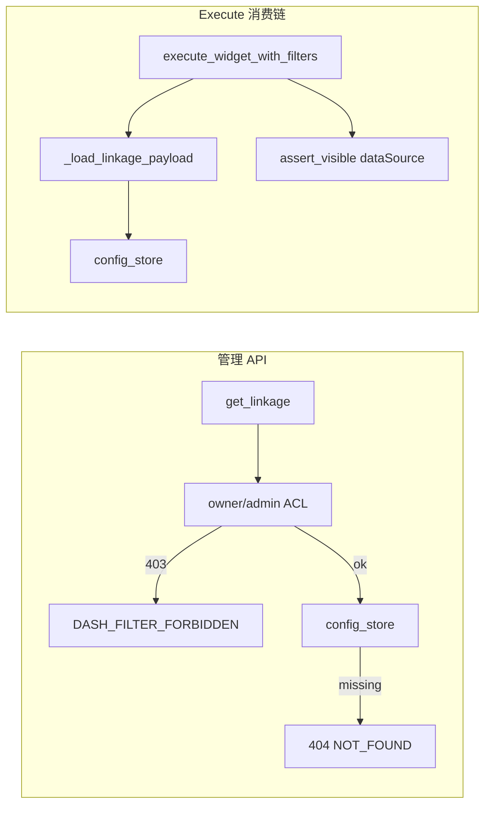
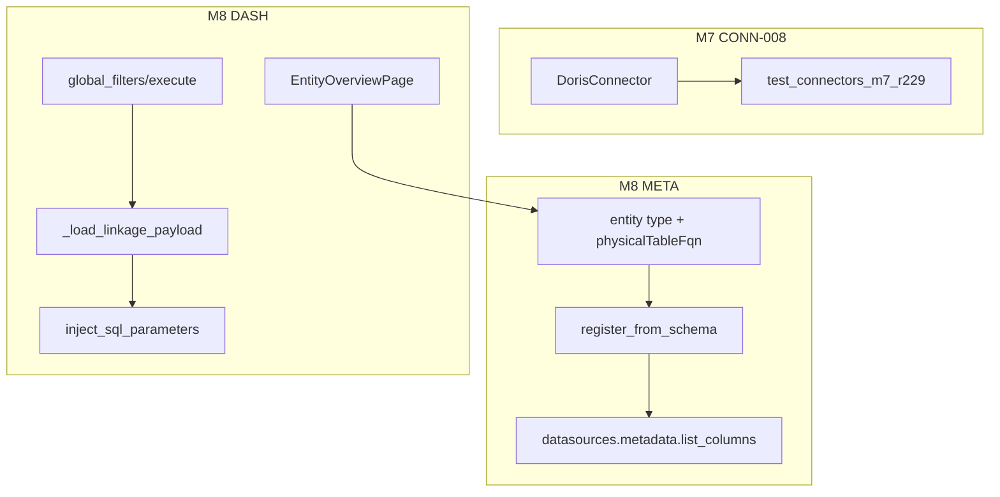

# M7 Doris 收官 + M8 实体元数据 kickoff 设计 — CONN-008 / META-005~006 / DASH-004 BE / DASH-005 FE

```yaml
date: 2026-07-06
milestone: M7 + M8
round_target: docs/superpowers/evolution/2026-07-06-round-target-m7-conn008-m8-kickoff.md
base_branch: dev-auto
continuation_branch: feat/m7-conn008-m8-entity-kickoff-r231
prd_ids: [CONN-008, META-005, META-006, DASH-004, DASH-005]
ui_design_skill: .agents/skills/b-design-system-tailadmin-radix/SKILL.md
status: design
```

## 1. 批量主题与子项映射

| # | 子项 | PRD ID | 模块 | 执行顺序 | 主攻薄弱维 | 用户感知 |
|---|------|--------|------|:--------:|------------|----------|
| 1 | Apache Doris M7 集成验收 | CONN-008 | `datasources/` | 1 | 用户价值 **84%**；完整度 **90%** | 可选 Doris 类型建源；连通性 + schema 浏览与 ClickHouse 同等路径 |
| 2 | 物理表登记 + schema 导入链 | META-005 | `metadata/physical/` | 2 | 架构健康 **88%**；用户价值 **84%** | Admin 从已登记数据源 schema 浏览一键登记物理表，含 dataSourceId 与列元数据 |
| 3 | 实体类型 schema + 物理表映射 | META-006 | `metadata/entity/` | 3 | 用户价值 **84%**；完整度 **90%** | 实体类型可配置属性 schema，并绑定物理表 FQN 供总览页消费 |
| 4 | 全局筛选器 BE widget execute 链 | DASH-004 | `dashboard/global_filters/` + `query/` | 4 | 交互体验 **86%**；安全性 **88%** | Dashboard view 变更筛选后，BE 合并参数执行 widget 查询；越权数据源 403 |
| 5 | 实体总览页 FR-6.2 Admin FE | DASH-005 | `fe/pages/admin/entities/` | 5 | 用户价值 **84%**；完整度 **90%** | 侧栏进入实体总览；按类型浏览登记实体、筛选与下钻至 Dashboard |

**依赖链**：CONN-008（独立）→ META-005 `register-from-schema` → META-006 `physicalTableFqn` 映射 → DASH-005 读 physical + entity-types + entity-overview config → DASH-004 BE execute 与 DASH-005 下钻 query 共用参数合并。

**续作策略**：优先 rebase `origin/feat/m7-conn008-m8-entity-kickoff-r231` 至 `dev-auto`；**禁止**从零重复已交付方言/页面骨架。孤儿分支 P3 已完成 CONN-008/META/DASH/FE 主体实现；P4 阻塞于 ACL 回归（见 §7.4.1），本轮 P3 首要修复项。

**上轮已交付（本轮不重复 L1/companion 骨架）**：

| 域 | 已有能力 | 本轮不重复 |
|----|----------|-----------|
| CONN-008 | `doris.py` 委托 MySQL + `DORIS_*` 错误域；r36 types catalog + r37 mock | 不重写 connector 核心与 registry 注册 |
| META-005 | `physical/service` 内存 CRUD + r62 L1 + r65 ACL/probe | 不重写 validate/register 基础校验链 |
| META-006 | `entity/service` CRUD + validate/query-bindings + r54/r55 companion | 不重写 lifecycle/attribute 校验核心 |
| DASH-004 | `global_filters/` validate/save/get + r61 L1 + r67 ACL/probe；M-FE-3 FE `GlobalFilterBar` | 不重写 linkage 配置 API 与 GlobalFilterBar |
| DASH-005 | `entity_overview/` validate/save/get + r59 L1 + r66 companion | 不重写 config_store 契约与 probe |

## 2. 现状与约束（范围框定内已读）

| 项 | 现状 |
|----|------|
| `dialects/doris.py` | L1 已实现；`register_builtin_dialects()` 已含 `DorisConnector` |
| `tests/test_connectors_gov_r36/r37.py` | Doris mock 单测已绿；孤儿分支含 `test_connectors_m7_r229.py` |
| `docker-compose.yml` | 无 `sample-doris`；Doris MySQL 协议可 mock 或 optional compose |
| `metadata/physical/service.py` | 手工 `columns[]` 登记；孤儿分支已增 `register_from_schema` |
| `metadata/entity/schemas.py` | 孤儿分支已增 `physicalTableFqn` |
| `dashboard/global_filters/` | 配置 CRUD 完整；孤儿分支已增 `execute.py` + widget execute 路由 |
| `fe/src/config/admin-nav.tsx` | dev-auto 无实体总览；孤儿分支已增「主题与实体」分组与页面 |
| `layout.md` §3 | 登记 `/entities/overview`（二期实体总览） |
| `plan.md` §M7/M8 | CONN-008 + META-005/006 + DASH-004/005 五行 `[ ]` |

**范围框定模块**（≤3）：`backend/app/datasources/` + `backend/app/metadata/` + `backend/app/dashboard/` + `fe/src/pages/`（DASH-005 companion）。

**真理源优先级**：`round-target` > `plan.md` §M7/M8 > `prd/F04-CONN.md` · `F11-META.md` · `F07-DASH.md` > `docs/services/*` > `layout.md` > b-design-system skill。

## 3. 非目标（明确不做）

- M11 CONN-009 StarRocks；M13 信创库 CONN-017~022；M13 冻结 META-001~004 Dataset/术语树
- M9 DASH-006 主题分析；预制报表 RPT-*
- Doris 真实 compose 全量 E2E（无 compose 时 integration skip，与 M7 r228 策略一致）
- FE `GlobalFilterBar` 重写或 linkage **编辑** UI（M-FE-3 已交付）
- GOV catalog 引用释放与 lineage 全链路（META-005 PRD 远期子项）
- Dataset 语义层；query 只读 execute 以外新模式
- Alembic migration（physical/entity 仍为内存 store L1）
- 修改 `goal.md`；创建/改结构 `plan.md`（P5 仅勾选已有 `- [ ] <prd ID>:` 行）
- Playwright E2E（vitest smoke + P4 截图 QA 收口）

## 4. 范围框定文件清单（20）

| 路径 | 子项 | 动作 |
|------|:----:|------|
| `tests/test_connectors_m7_r229.py` | CONN-008 | 新建/续作：M7 Doris 集成验收 |
| `backend/app/datasources/dialects/doris.py` | CONN-008 | 预期零改动（缺陷暴露时最小修） |
| `docs/services/datasources.md` | CONN-008 | 修改：M7 r229 锚点 |
| `backend/app/metadata/physical/schemas.py` | META-005 | 修改：`PhysicalTableRegisterFromSchemaIn` |
| `backend/app/metadata/physical/service.py` | META-005 | 修改：`register_from_schema` + list 过滤 |
| `backend/app/api/v1/metadata.py` | META-005,006 | 修改：新路由 + query 参数 |
| `backend/app/metadata/entity/schemas.py` | META-006 | 修改：`physicalTableFqn` |
| `backend/app/metadata/entity/service.py` | META-006 | 修改：映射校验 + 引用计数 |
| `backend/app/query/sql_parameters.py` | DASH-004 | 新建：`inject_sql_parameters` 纯函数 |
| `backend/app/dashboard/global_filters/execute.py` | DASH-004 | 新建：widget execute 编排 |
| `backend/app/dashboard/global_filters/service.py` | DASH-004 | 修改：ACL 拆分 + `_load_linkage_payload`（§7.4.1） |
| `backend/app/api/v1/dashboards.py` | DASH-004 | 修改：`POST .../widgets/{widgetId}/execute` |
| `tests/test_meta_dash_m8_r231.py` | META-005,006,DASH-004 | 新建：登记链 + BE execute + ACL |
| `tests/test_cat_dash_viz_nfr_r61.py` | DASH-004 | 修改：`test_dash_r61_004_forbidden_viewer` fixture 拆分（§7.4.1） |
| `fe/src/pages/admin/entities/EntityOverviewPage.tsx` | DASH-005 | 新建：实体总览页 |
| `fe/src/pages/admin/entities/entities-overview.smoke.test.tsx` | DASH-005 | 新建：vitest smoke |
| `fe/src/routes.tsx` | DASH-005 | 修改：`/admin/entities/overview` |
| `fe/src/config/admin-nav.tsx` | DASH-005 | 修改：「主题与实体」分组 |
| `fe/src/lib/queryKeys.ts` | DASH-005 | 修改：metadata query keys |
| `docs/api/README.md` · `docs/services/metadata.md` · `dashboard.md` | 全部 | 登记新路由与 M8 锚点 |

## 5. PRD 8 维薄弱项对齐

| PRD ID | 薄弱维 | 本轮设计对策 |
|--------|--------|--------------|
| CONN-008 | 用户价值 84%；完整度 90% | M7 r229 集成：registry + HTTP test/metadata + mock 分层 skip |
| META-005 | 架构健康 88%；用户价值 84% | `register_from_schema` 复用 `datasources/metadata.list_columns`；dataSource 可见性 + entityType 校验 |
| META-006 | 用户价值 84%；完整度 90% | `physicalTableFqn` 映射 + 登记→类型配置 pytest 主链 |
| DASH-004 | 交互体验 86%；安全性 88% | BE execute 合并 linkage；ACL 拆分（管理 API vs execute 内部加载）；`assert_visible` 越权 403 |
| DASH-005 | 用户价值 84%；完整度 90% | Admin FE `/admin/entities/overview`：类型 Tab + 统计卡片 + 表格下钻；vitest 三态 |

## 6. 方案比选（摘要）

### 6.1 CONN-008 M7 集成测

| 方案 | 结论 |
|------|------|
| A `test_connectors_m7_r229.py` + mock + optional compose skip | **采用**（对齐 r228） |
| B 强制 sample-doris compose | 否决（维护成本高） |
| C 仅复跑 r36/r37 mock | 否决（不闭合 plan M7） |

### 6.2 META-005 schema 衔接

| 方案 | 结论 |
|------|------|
| A `physical/service.register_from_schema` → `datasources.metadata.list_columns` | **采用** |
| B FE 双请求手工 columns | 否决 |
| C physical 直接 import connector | 否决（破坏域边界） |

### 6.3 DASH-004 BE 筛选传播

| 方案 | 结论 |
|------|------|
| A 新路由 `POST .../widgets/{widgetId}/execute` + `execute.py` | **采用** |
| B 仅扩 `ExecuteRequest.parameters` | 否决 |
| C 服务端重写 GlobalFilterBar | 否决 |

### 6.4 DASH-004 ACL 回归修复（P4 阻塞）

| 方案 | 说明 | 结论 |
|------|------|------|
| A 拆分 `_load_linkage_payload`（execute 内部）与 `get_linkage`（管理 API 严格 owner/admin）；修正 r61 测试 fixture（admin 建 dashboard → viewer GET） | 安全语义清晰；execute 仍允许 viewer 消费；回归可绿 | **采用** |
| B `_assert_read_access` 对 viewer 角色无条件放行（r231 孤儿分支现状） | 导致非 owner 场景 404 替代 403；破坏 linkage 管理 API 安全边界 | **否决** |
| C 仅改测试断言接受 404 | 与 PRD/r61/r67 ACL 契约冲突 | 否决 |

### 6.5 DASH-005 实体总览 FE

| 方案 | 结论 |
|------|------|
| A `hub-tabs` + `DataTableCard` + drill-down 至 Dashboard | **采用**（对齐 layout.md） |
| B 嵌入 Dashboard edit 子 Tab | 否决 |
| C 纯配置表单无消费列表 | 否决 |

## 7. 分项设计

### 7.1 CONN-008 — Apache Doris M7 收官

**目标**：闭合 plan §M7 最后一项；在 r36/r37 L1 基础上补 M7 集成验收。

**实现要点**：

1. **`tests/test_connectors_m7_r229.py`**（`pytestmark integration`）：
   - T-CONN-R229-008-01：`export_type_catalog()` 含 `doris`，`category=olap`，capabilities 含 `connectivity_test` + `schema_browser`
   - T-CONN-R229-008-02：HTTP POST test mock pymysql → `DORIS_CONN_REFUSED`
   - T-CONN-R229-008-03：HTTP GET metadata tables/columns mock → 200
   - T-CONN-R229-008-04（optional）：`127.0.0.1:9030` 可达则实库；否则 skip
   - 复用 r228 sqlite env fixture 模式

2. **文档**：`docs/services/datasources.md` 增 M7 r229 锚点。

**验收标准（可测试）**：

- [ ] `registry.get("doris")` 返回 `DorisConnector`，capabilities 完整
- [ ] r229 pytest ≥4 条 CONN-008 断言；无 compose 时 skip 不 fail CI
- [ ] HTTP 响应体不含 `password`/`secret` 子串
- [ ] r36/r37 Doris mock 回归不回归

### 7.2 META-005 — 物理表登记 + DS-004 衔接

**新增契约** `PhysicalTableRegisterFromSchemaIn`：

| 字段 | 类型 | 说明 |
|------|------|------|
| `dataSourceId` | uuid | 须存在且 `assert_visible` |
| `schema` | string | DS-004 tables 参数 |
| `table` | string | DS-004 columns 参数 |
| `displayName` | string | 平台展示名 |
| `entityTypeCode` | string? | 可选；须 `entity_service.get_entity_type` 存在 |
| `tableFqn` | string? | 默认 `{schema}.{table}` 小写规范化 |

**`register_from_schema`**：`_assert_physical_write_access` → `list_columns` → 映射列 → `_validate_register` + `_store` → 可选 entity 交叉引用。

**路由**：

| 方法 | 路径 | 行为 |
|------|------|------|
| POST | `/api/v1/metadata/physical-tables/register-from-schema` | 201 |
| GET | `/api/v1/metadata/physical-tables?entityTypeCode=` | 过滤列表 |

**验收标准（可测试）**：

- [ ] mock `list_columns` 3 列 → register-from-schema 201 + columnCount=3
- [ ] 未知 dataSourceId → 404 `DATASOURCE_NOT_FOUND`
- [ ] viewer register → 403 `META_PHYSICAL_FORBIDDEN`
- [ ] 非法 entityTypeCode → 422 `META_ENTITY_TYPE_NOT_FOUND`
- [ ] 重复 tableFqn → 409 `META_PHYSICAL_CONFLICT`
- [ ] GET list `entityTypeCode=order` 仅返回匹配项

### 7.3 META-006 — 实体类型 + 物理表映射

**schema 扩展**：`physicalTableFqn: str | null`；create/update 时若非 null 须 physical 存在；delete type 时 physical 仍引用 → 409 `META_ENTITY_TYPE_IN_USE`。

**pytest 主链**：POST entity-type → register-from-schema → PUT attributes → GET query-bindings。

**验收标准（可测试）**：

- [ ] create with valid `physicalTableFqn` → 201
- [ ] unknown fqn → 422 `META_PHYSICAL_NOT_FOUND`
- [ ] 登记→类型配置链 ≥4 步断言
- [ ] r54/r55 entity mock 回归不回归

### 7.4 DASH-004 — 全局筛选器 BE widget execute

#### 7.4.1 P4 ACL 阻塞修复（必做）

**根因**（孤儿分支 r231）：`_assert_read_access` 对 `viewer` 角色无条件 `return`，使 `get_linkage` 在 viewer 为 dashboard owner 且 linkage 未配置时越过 owner 语义检查、落入 `ConfigError` → **404 `DASH_FILTER_NOT_FOUND`**，而 `test_dash_r61_004_forbidden_viewer` 期望 **403 `DASH_FILTER_FORBIDDEN`**。

**修复设计**：

1. **`get_linkage`（管理 API）**：恢复严格读 ACL——`admin`  bypass；`analyst` 若为 owner 可读；其他角色须 `created_by == actor.id`；否则 **403 先于 config 查找**。禁止 viewer 角色 blanket 放行。
2. **新增 `_load_linkage_payload(session, dashboard_id) -> GlobalFilterLinkageItem`**：无 actor ACL；仅由 `execute_widget_with_filters` 调用；dashboard 存在性由 execute 入口保证。
3. **`execute_widget_with_filters`**：改调 `_load_linkage_payload`；数据源越权由 `query_service.execute_query` / `assert_visible` 返回 403。
4. **`test_dash_r61_004_forbidden_viewer` 修正**：对齐 r231 `test_dash_r231_004_viewer_execute_200` 模式——admin 创建 dashboard（无 viewer override）→ 应用 `viewer_user` → GET global-filters → 断言 403。



#### 7.4.2 BE execute 实现

**`backend/app/dashboard/global_filters/execute.py`**：

- `_find_widget(layout, widget_id)` → 404 `DASH_FILTER_WIDGET_NOT_FOUND`
- `build_widget_filter_params` + `inject_sql_parameters`（与 FE `dashboardFilterUtils` 同规则）
- `execute_query` 携带合并后 SQL

**路由**：`POST /api/v1/dashboards/{dashboard_id}/widgets/{widget_id}/execute`  
Body：`{ "filterValues": { "<filterId>": "<value>" } }`

**`inject_sql_parameters`**（`query/sql_parameters.py`）：

- `{{key}}` 替换、单引号转义、`;`/`--`/`/*` 拒绝 → 422 `QUERY_FILTER_UNSAFE`

**验收标准（可测试）**：

- [ ] linkage rule `parameterKey=region` + filterValues → execute SQL 含替换值
- [ ] 非法 filter 值含 `;` → 422 `QUERY_FILTER_UNSAFE`
- [ ] 越权 dataSource → 403 `DATASOURCE_FORBIDDEN`
- [ ] widgetId 不在 layout → 404 `DASH_FILTER_WIDGET_NOT_FOUND`
- [ ] viewer 非 owner execute（admin 建 dash + 保存 linkage）→ 200
- [ ] `test_dash_r61_004_forbidden_viewer` → 403（非 404）
- [ ] r61/r67 global filter 回归全绿

**FE 关系**：M-FE-3 保留 FE 侧注入；BE execute 路由独立可测；FE 改调 BE 为 optional companion。

### 7.5 DASH-005 — 实体总览页 FR-6.2

**路由 IA**（对齐 `layout.md` §3）：

```
/admin/entities/overview   → EntityOverviewPage
```

**侧栏**：新增分组「主题与实体」→「实体总览」`path: /admin/entities/overview`（`Layers` lucide `size-6`）。

**页面结构**：

| 区域 | 组件 | 数据 |
|------|------|------|
| 页头 | `AdminPageShell` title「实体总览」 | — |
| 类型 Tab | `Tabs` | GET `/api/v1/metadata/entity-types` |
| Dashboard 选择 | `Select`（可选） | GET `/api/v1/dashboards` + `.../entity-overview` |
| 统计卡片行 | `KpiCard` / `Card` grid | overview `statCards` |
| 实体表格 | `Card` + table 或 `ScrollArea` | GET `physical-tables?entityTypeCode={tab}` |
| 行操作 | `Button` outline「下钻」 | navigate `/admin/dashboards/{targetDashboardId}` |

**状态矩阵**：

| 态 | 表现 |
|----|------|
| loading | `Skeleton` 卡片 + 表格行 |
| empty | 「暂无登记的实体表」+ 链到数据源 schema |
| error | `ErrorBanner` + 重试（对齐 `DatasourceListPage`） |
| 权限 | 非 admin/analyst → 「无权查看实体总览」 |

**验收标准（可测试）**：

- [ ] 路由 `/admin/entities/overview` 可访问；侧栏高亮
- [ ] vitest smoke：mock API → Tab/表格/卡片渲染
- [ ] 下钻 navigate 至 dashboard 路由
- [ ] `pnpm run check:design` 无 Token 硬编码
- [ ] desktop + mobile 截图 QA（P4）

## 8. UI 设计交付

**ui_design_skill**: `.agents/skills/b-design-system-tailadmin-radix/SKILL.md`

### 8.1 页面信息架构

- **导航层级**：Admin 壳层 → 侧栏「主题与实体」→「实体总览」→ 主内容 `max-w-(--breakpoint-2xl)`
- **主内容密度**：Tab 行 + 可选 Dashboard Select；统计 `grid grid-cols-2 md:grid-cols-4 gap-4`；表格标准行高
- **空态**：无 entity type → 「请先配置实体类型」；无 physical table → 「暂无登记实体，可从数据源 schema 登记」
- **加载态**：首屏 Skeleton；Tab 切换 refetch 行内 Skeleton
- **错误态**：`mapApiError` 中文 + 页面级重试 Button
- **权限态**：403 → 「无权查看实体总览」+ 返回 `/admin`

### 8.2 视觉层级

- **主操作**：行内「下钻」`Button variant="outline" size="sm"`
- **次操作**：Dashboard Select、筛选 Apply
- **承载**：统计 `Card`/`KpiCard`；实体列表 table in `Card`；筛选浅底 `bg-gray-50 dark:bg-gray-900`

### 8.3 组件映射

| 用途 | 复用 | 新建/补封装 |
|------|------|-------------|
| 页壳 | `AdminPageShell` | — |
| Tab | `@/components/ui/tabs` | — |
| 表格 | `Card` + table（或 `DataTableCard` 若 README 登记） | — |
| 统计 | `KpiCard` | 可选 thin `EntityStatCard` |
| 错误条 | 对齐 `DatasourceListPage` `ErrorBanner` 模式 | — |
| 禁止 | 原生 button/input；手写 Modal | — |

### 8.4 Token 与密度

- 语义色：`brand-500` Tab 指示；`gray-200/800` 边框；`error-*` 错误 Banner
- 间距：区块 `space-y-6`；卡片 `p-4 md:p-6`
- 圆角：`rounded-xl` 卡片；`rounded-lg` 输入
- 字号：标题 `text-title-md`；表头 `text-theme-sm font-medium`
- 图标：`lucide-react` 侧栏 `size-6`；行内 `size-4`/`size-5`

### 8.5 响应式与可访问性

- **桌面**：4 列统计；表格全宽
- **窄屏**：统计 2 列；表格 `overflow-x-auto`；Tab `ScrollArea` 横向
- **键盘**：Tab roving focus；下钻 `focus-visible:ring-2`
- **aria**：侧栏 `aria-current="page"`；表格 `aria-label="实体列表"`
- **长文本**：`displayName` `truncate max-w-[200px]` + `title`

### 8.6 视觉 QA 清单（P4）

- [ ] desktop light：Tab/卡片/表格对齐
- [ ] mobile light：Tab 不叠压；表格可横向 scroll
- [ ] empty/error/loading 三态截图
- [ ] dark mode：卡片 `dark:bg-gray-900` 无漂移
- [ ] `check:design` PASS；无 hex 硬编码

## 9. 总体架构



## 10. P5 文档同步（实现后）

| 文档 | 动作 |
|------|------|
| `docs/automate/prd/F04-CONN.md` | CONN-008 勾 M7 集成验收 |
| `docs/automate/prd/F11-META.md` | META-005/006 勾 M8 kickoff |
| `docs/automate/prd/F07-DASH.md` | DASH-004 BE execute + DASH-005 FE |
| `docs/automate/plan.md` | §M7 CONN-008 + §M8 四 ID 勾选 |
| `docs/api/README.md` | 新路由登记 |
| `docs/services/metadata.md` · `dashboard.md` | M8 锚点 |
| `docs/ui/layout.md` | 仅当 IA 变更（预期 FE 落地已登记路由） |

## 11. 风险与缓解

| 风险 | 缓解 |
|------|------|
| Doris compose 不可用 | mock + integration skip |
| physical 内存 store 与 DS 元数据不一致 | register-from-schema 单次编排；失败不写入 |
| BE/FE SQL 注入规则漂移 | `inject_sql_parameters` 单测 mirror FE cases |
| ACL 管理/消费双路径复杂度 | `_load_linkage_payload` 仅 execute 内部；管理 API 保持 r61 契约 |
| EntityOverviewPage 超 300 行 | 抽 `useEntityOverview.ts` |
| 孤儿分支 rebase 冲突 | 以 dev-auto 为基；ACL 修复优先于功能重复 |

## 12. Self-review 清单

- [x] 覆盖 round-target 五子项 CONN-008 / META-005 / META-006 / DASH-004 / DASH-005
- [x] 文件清单 20 项；模块 ≤3（+ fe pages companion）
- [x] 无 TBD/TODO 占位
- [x] PRD 8 维薄弱项逐 ID 对策
- [x] P4 ACL 阻塞根因与修复方案显式（§7.4.1）
- [x] 孤儿分支续作策略与禁止重复实现
- [x] `ui_design_skill` 已记录 + 完整「UI 设计交付」六节
- [x] 非目标与 M13/M9/M11 边界显式
- [x] 每项验收标准可测试（含 skip 条件）
