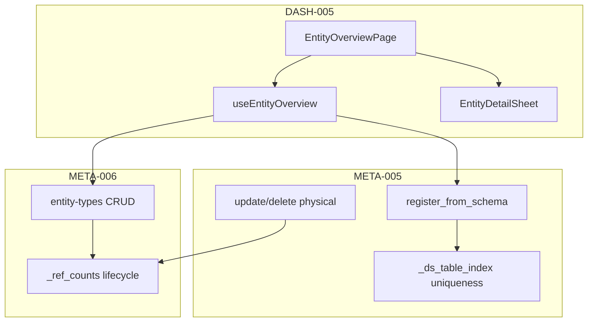

# M8 实体元数据与总览页收官设计 — META-005 / META-006 / DASH-005

```yaml
date: 2026-07-06
milestone: M8
round_target: docs/superpowers/evolution/2026-07-06-round-target-m8-completion.md
base_branch: dev-auto
prd_ids: [META-005, META-006, DASH-005]
ui_design_skill: .agents/skills/b-design-system-tailadmin-radix/SKILL.md
status: design
prior_kickoff: docs/superpowers/specs/2026-07-06-m7-conn008-m8-entity-kickoff-design.md
```

## 1. 批量主题与子项映射

| # | 子项 | PRD ID | 模块 | 执行顺序 | 主攻薄弱维 | 用户感知 |
|---|------|--------|------|:--------:|------------|----------|
| 1 | 物理表元数据登记收官 | META-005 | `metadata/physical/` | 1 | 用户价值 **86%**；完整度 **94%** | 物理表可登记/查询/更新/删除；schema 导入与 dataSource+表唯一性可靠 |
| 2 | 实体类型 schema 配置收官 | META-006 | `metadata/entity/` | 2 | 用户价值 **86%**；完整度 **94%** | 类型 schema CRUD 与登记实体关联一致；引用计数生命周期闭合 |
| 3 | 实体总览页 FR-6.2 收官 | DASH-005 | `fe/pages/admin/entities/` | 3 | 交互体验 **84%**；完整度 **92%** | 侧栏实体总览可按类型浏览、下钻详情；空/错/权限态引导清晰 |

**依赖链**：META-005 CRUD + 唯一性 → META-006 引用计数与映射同步 → DASH-005 消费 API 并补交互收官。

**续作策略**：基于 `dev-auto`（已合并 PR #215 kickoff）；**禁止**重复 `register-from-schema` / `physicalTableFqn` / `EntityOverviewPage` 骨架；本轮仅闭合 plan `[ ]` 与 round-target 验收缺口。

**r231 已交付（本轮不重复）**：

| 域 | 已有能力 |
|----|----------|
| META-005 | `register_from_schema`、`GET ?entityTypeCode=`、`POST` 直登、`GET ?fqn=`、r62/r65 ACL+probe |
| META-006 | entity-types CRUD、validate、query-bindings、`physicalTableFqn` 映射、`_ref_counts` |
| DASH-005 | `EntityOverviewPage` 骨架、`/admin/entities/overview` 路由、侧栏分组、vitest 三态 smoke |

## 2. 现状与缺口（范围框定内已读）

| 项 | r231 现状 | 本轮缺口 |
|----|-----------|----------|
| `physical/service.py` | register/list/get；`tableFqn` 唯一 | **无 PUT/DELETE**；**无 `(dataSourceId, schema, table)` 复合唯一**；register-from-schema 未持久化 source 三元组 |
| `entity/service.py` | `increment_reference`；delete type 查 `_ref_counts` | physical **删除/改绑**未 `decrement_reference`；改 `entityTypeCode` 未迁移计数 |
| `docs/api/README.md` | 仅登记 register-from-schema + list filter | **缺** `POST/GET/PUT/DELETE /physical-tables` 完整行 |
| `EntityOverviewPage.tsx` | 类型 pill + 表格 + 下钻 Dashboard；311 行 | **无行级详情**；空态无引导链；**无权限 vitest**；未抽 hook；`entityTypeRef` 与 Tab 未校验 |
| `plan.md` §M8 | META-005/006/DASH-005 仍 `[ ]` | P5 勾选三行 |
| PRD 远期子项 | GOV 引用释放、跨组件口径、lineage | **非目标**（见 §3） |

**真理源优先级**：`round-target` > `plan.md` §M8 > `prd/F11-META.md` · `F07-DASH.md` > `docs/services/*` > `layout.md` > b-design-system skill。

## 3. 非目标（明确不做）

- M9 DASH-006 主题分析；M13 META-001~004 Dataset/术语树；M7 连接器；DASH-004（已勾）
- GOV catalog 引用释放、lineage 全链路（PRD META-005/006 远期 companion）
- DASH-005 PRD「跨组件口径一致」全链路（留 companion；本轮仅闭合页内 `count` 与 physical `total` 一致）
- 全新 GlobalFilterBar；Playwright E2E；Alembic migration（physical/entity 仍内存 store L1）
- Admin 实体类型/物理表**编辑表单页**（登记仍经 API/数据源 schema；FE 仅消费+引导）
- 修改 `goal.md`；创建/改结构 `plan.md`（P5 仅勾选已有 `- [ ]` 行）

## 4. 范围框定文件清单（14）

| 路径 | 子项 | 动作 |
|------|:----:|------|
| `backend/app/metadata/physical/schemas.py` | META-005 | 修改：`PhysicalTableUpdateIn`；`PhysicalTableOut` 增可选 `sourceSchema`/`sourceTable` |
| `backend/app/metadata/physical/service.py` | META-005 | 修改：复合唯一索引、`update_physical_table`、`delete_physical_table` |
| `backend/app/metadata/physical/errors.py` | META-005 | 修改：新错误码 `META_PHYSICAL_DS_TABLE_CONFLICT` |
| `backend/app/metadata/entity/service.py` | META-006 | 修改：physical 删/改绑时 `decrement_reference`/`increment_reference` 对称 |
| `backend/app/api/v1/metadata.py` | META-005,006 | 修改：`PUT/DELETE /physical-tables/{fqn}` |
| `tests/test_meta_dash_m8_r232.py` | META-005,006 | 新建：收官 pytest（≥8 用例） |
| `fe/src/pages/admin/entities/useEntityOverview.ts` | DASH-005 | 新建：查询编排 + 选中行状态 |
| `fe/src/pages/admin/entities/EntityDetailSheet.tsx` | DASH-005 | 新建：行级详情 Sheet |
| `fe/src/pages/admin/entities/EntityOverviewPage.tsx` | DASH-005 | 修改：空态引导、详情下钻、抽 hook |
| `fe/src/pages/admin/entities/entities-overview.smoke.test.tsx` | DASH-005 | 修改：+4 vitest（权限/空表/下钻/Tab 切换） |
| `docs/api/README.md` | 全部 | 修改：physical-tables CRUD 全路由登记 |
| `docs/services/metadata.md` | META-005,006 | 修改：M8 收官锚点 + 错误码 |
| `docs/services/dashboard.md` | DASH-005 | 修改：FE 收官锚点 |
| `fe/src/lib/queryKeys.ts` | DASH-005 | 修改：仅当新增 query key 时需要（预期零或 +1） |

## 5. PRD 8 维薄弱项对齐

| PRD ID | 薄弱维 | 本轮设计对策 |
|--------|--------|--------------|
| META-005 | 用户价值 86%；完整度 94% | 补 PUT/DELETE + `(dataSourceId,schema,table)` 唯一；register-from-schema 端到端 + 越权/冲突 pytest |
| META-006 | 用户价值 86%；完整度 94% | physical 生命周期与 `_ref_counts` 对称；登记→类型→删 physical→删 type 链 pytest |
| DASH-005 | 交互体验 84%；完整度 92% | 详情 Sheet、空态链数据源、错误/权限/下钻 vitest；页内 stat `count` 对齐 physical `total` |

## 6. 方案比选（摘要）

### 6.1 META-005 物理表 CRUD 补全

| 方案 | 结论 |
|------|------|
| A 内存 store 增 `update`/`delete` + 复合键 `_ds_table_index` | **采用**（最小 diff，对齐 L1） |
| B Alembic ORM 落库 | 否决（非目标） |
| C 仅文档宣称 CRUD 已完成 | 否决（plan 验收要求可测） |

### 6.2 复合唯一性键

| 方案 | 结论 |
|------|------|
| A `register_from_schema` 写入 `sourceSchema`+`sourceTable`；索引 `(dataSourceId, sourceSchema, sourceTable)` → 409 `META_PHYSICAL_DS_TABLE_CONFLICT` | **采用** |
| B 仅依赖 `tableFqn` 冲突 | 否决（无法满足 round-target dataSourceId+schema/table 语义） |

### 6.3 DASH-005 实体详情下钻

| 方案 | 结论 |
|------|------|
| A 表格行「详情」→ Radix `Sheet` 展示 columns + 类型 attributes + 主下钻 Dashboard | **采用**（FR-6.2「详情筛选」最小可感知） |
| B 新路由 `/admin/entities/:fqn` | 否决（超框定、IA 未登记） |
| C 仅保留 Dashboard navigate | 否决（交互体验薄弱维未改善） |

## 7. 分项设计

### 7.1 META-005 — 物理表元数据登记收官

#### 7.1.1 数据模型扩展

`PhysicalTableOut` / store 记录增可选字段（仅 `register_from_schema` 写入；直登 `POST` 可为 null）：

| 字段 | 类型 | 说明 |
|------|------|------|
| `sourceSchema` | string? | DS-004 schema 参数快照 |
| `sourceTable` | string? | DS-004 table 参数快照 |

内存索引：`_ds_table_index: dict[tuple[str,str,str], str]` → `tableFqn`（dataSourceId 字符串化 + schema/table 小写）。

#### 7.1.2 服务方法

| 方法 | 行为 |
|------|------|
| `register_from_schema` | 登记前查 `_ds_table_index`；冲突 → 409 `META_PHYSICAL_DS_TABLE_CONFLICT`；成功写入 index |
| `register_physical_table` | 保持 `tableFqn` 409；不写入 ds index（直登路径） |
| `update_physical_table(fqn, payload, user)` | admin/analyst ACL；可改 `displayName`、`entityTypeCode`；改绑时旧 type `decrement_reference`、新 type `increment_reference` + `bind_entity_type_code` |
| `delete_physical_table(fqn, user)` | admin/analyst ACL；若有 `entityTypeCode` 则 `decrement_reference`；清理 `_store` 与 `_ds_table_index` |

#### 7.1.3 路由

| 方法 | 路径 | 行为 |
|------|------|------|
| PUT | `/api/v1/metadata/physical-tables/{fqn}` | 200 `PhysicalTableOut` |
| DELETE | `/api/v1/metadata/physical-tables/{fqn}` | 204 |

保留既有：`POST` 直登、`POST register-from-schema`、`GET` list/`?fqn=`、`POST validate`。

#### 7.1.4 验收标准（可测试）

- [ ] register-from-schema 201 → GET `?fqn=` 200 且含 `sourceSchema`/`sourceTable`
- [ ] 同 `dataSourceId+schema+table` 二次 register-from-schema → 409 `META_PHYSICAL_DS_TABLE_CONFLICT`
- [ ] 重复 `tableFqn` 直登 → 409 `META_PHYSICAL_CONFLICT`（r62 回归）
- [ ] PUT 改 `displayName` → 200；改 `entityTypeCode` 后 GET list filter 正确
- [ ] DELETE 已登记表 → 204；再 GET → 404 `META_PHYSICAL_NOT_FOUND`
- [ ] viewer PUT/DELETE → 403 `META_PHYSICAL_FORBIDDEN`
- [ ] `probe_*` 与 r65 回归不回归

### 7.2 META-006 — 实体类型 schema 配置收官

#### 7.2.1 引用计数生命周期

| 事件 | `_ref_counts` |
|------|---------------|
| `register_from_schema` 带 `entityTypeCode` | `increment_reference`（已有） |
| `create_entity_type` + `physicalTableFqn` 绑表 | `increment_reference`（已有） |
| `update_physical_table` 改绑 type | 旧 type decrement；新 type increment |
| `delete_physical_table` | 若有关联 type → decrement |
| `delete_entity_type` | `_ref_counts>0` → 409 `META_ENTITY_TYPE_IN_USE`（已有） |

#### 7.2.2 pytest 主链（`test_meta_dash_m8_r232.py`）

1. 创建 type → register-from-schema → DELETE physical → DELETE type → 204
2. register 两张表同 type → DELETE type → 409 `META_ENTITY_TYPE_IN_USE`
3. PUT type 换 `physicalTableFqn` → GET query-bindings 仍合法
4. POST validate 非法 attribute → 422 `META_ENTITY_TYPE_INVALID_ATTR`（r54 回归锚点）

#### 7.2.3 验收标准（可测试）

- [ ] 登记→删 physical→删 type 全链 ≥4 HTTP 断言
- [ ] 有登记引用时删 type → 409
- [ ] unknown `physicalTableFqn` on create → 422（r231 回归）
- [ ] mapping conflict → 409（r231 回归）
- [ ] `docs/api/README.md` entity-types 行无变更需求（已登记）

### 7.3 DASH-005 — 实体总览页 FR-6.2 收官

#### 7.3.1 路由 IA（不变）

```
/admin/entities/overview → EntityOverviewPage
```

与 `layout.md` §3 `/entities/overview`（Admin 前缀 `/admin`）及 `admin-nav.tsx` 已对齐。

#### 7.3.2 页面结构（收官后）

| 区域 | 组件 | 数据 / 行为 |
|------|------|-------------|
| 页头 | `AdminPageShell` | title「实体总览」 |
| 类型选择 | `ScrollArea` + `Button` pill（保持 r231）或 `@/components/ui/tabs` | GET `/api/v1/metadata/entity-types`；切换 invalidate physical query |
| Dashboard 选择 | `Select` | GET dashboards + `.../entity-overview` |
| 口径提示 | `Badge` variant light | 当 `overview.entityTypeRef !== activeType` 显示「配置实体类型与当前 Tab 不一致」 |
| 统计卡片 | `Card` grid | `statCards`；`metricKey===count` 显示 `physicalQuery.data.total` |
| 实体表格 | `Card` + table | GET `physical-tables?entityTypeCode=` |
| 行操作 | `Button`「详情」+ `Button`「下钻」 | 详情 → `EntityDetailSheet`；下钻 → `/admin/dashboards/{targetDashboardId}` |
| 详情 Sheet | `EntityDetailSheet` | 展示 `tableFqn`、`dataSourceId`、columns 列表、类型 `attributes`；主按钮「下钻至 Dashboard」 |

#### 7.3.3 状态矩阵（收官补全）

| 态 | 表现 |
|----|------|
| loading | Skeleton（类型行、卡片、表格） |
| empty types | 「请先配置实体类型」 |
| empty physical | 「暂无登记的实体表」+ `Link`「前往数据源浏览 schema」→ `/admin/datasources` |
| error | `ErrorBanner` + `mapApiError` + 重试 |
| 权限 | 非 admin/analyst → 「无权查看实体总览」 |
| 无 drill 目标 | 「下钻」disabled + `title` 提示「请先在 Dashboard 配置实体总览下钻目标」 |

#### 7.3.4 Hook 拆分

`useEntityOverview.ts`：封装 entityTypes / physical / dashboards / overview 四个 query、`activeType`、`selectedRow`、`canRead`；页面文件 ≤300 行。

#### 7.3.5 vitest 验收（`entities-overview.smoke.test.tsx`）

| ID | 场景 |
|----|------|
| T-DASH-005-01 | mock 全量 → Tab/表格/卡片渲染（已有） |
| T-DASH-005-02 | empty entity types（已有） |
| T-DASH-005-03 | error + 重试（已有） |
| T-DASH-005-04 | viewer 角色 → 「无权查看实体总览」 |
| T-DASH-005-05 | empty physical → 引导文案 + datasources 链接 |
| T-DASH-005-06 | 点击「详情」→ Sheet 含 tableFqn |
| T-DASH-005-07 | 点击「下钻」→ `navigate` 断言（MemoryRouter + mock navigate） |

#### 7.3.6 验收标准（可测试）

- [ ] `/admin/entities/overview` 可访问；侧栏高亮
- [ ] vitest ≥7 用例全绿
- [ ] `pnpm run check:design` PASS
- [ ] desktop + mobile 截图 QA（P4）：empty physical、详情 Sheet 打开态、权限态

## 8. UI 设计交付

**ui_design_skill**: `.agents/skills/b-design-system-tailadmin-radix/SKILL.md`

### 8.1 页面信息架构

- **导航层级**：Admin 壳层 → 侧栏「主题与实体」→「实体总览」→ 主内容 `max-w-(--breakpoint-2xl)`（`AdminPageShell`）
- **主内容密度**：类型 pill 行 + Dashboard Select 工具条；统计 `grid gap-4 sm:grid-cols-2 lg:grid-cols-4`；表格标准密度
- **空态**：无 type / 无 physical 分级文案；physical 空态含可点击 `Link` 至数据源列表
- **加载态**：首屏与 Tab 切换 Skeleton；Sheet 打开时 columns 区 Skeleton
- **错误态**：分区 `ErrorBanner`（types / overview / physical 独立重试）
- **权限态**：整页 Card 居中「无权查看实体总览」

### 8.2 视觉层级

- **主操作**：行内「下钻」`Button variant="outline" size="sm"`；Sheet 底部「下钻至 Dashboard」`Button` default
- **次操作**：「详情」outline；Dashboard `Select`；类型 pill
- **承载**：统计 `Card`；表格 `Card` + `overflow-x-auto`；详情 `Sheet`（Radix）；口径警告 `Badge` color warning

### 8.3 组件映射

| 用途 | 复用 | 新建/补封装 |
|------|------|-------------|
| 页壳 | `AdminPageShell` | — |
| 详情浮层 | `@/components/ui/sheet` | `EntityDetailSheet` |
| 表格 | `Card` + table（README 无 DataTableCard 登记） | — |
| 错误条 | 对齐 `DatasourceListPage` `ErrorBanner` 模式 | 可抽 `fe/src/components/admin/ErrorBanner.tsx`（仅当第三处复用时） |
| 数据编排 | — | `useEntityOverview.ts` |
| 禁止 | 原生 button/input；手写 Modal portal | — |

### 8.4 Token 与密度

- 语义色：active pill `border-brand-500 bg-brand-50 text-brand-600`；警告 Badge `warning`；错误 `error-*` Banner
- 间距：区块 `space-y-6`；Sheet `p-4 md:p-6`；表格 `px-4 py-3`
- 圆角：`rounded-xl` 卡片/Sheet；`rounded-lg` Select
- 字号：表头 `text-theme-sm font-medium`；Sheet 标题 `text-title-sm`
- 图标：侧栏 lucide `Layers` `size-6`；Sheet 关闭 `size-4`

### 8.5 响应式与可访问性

- **桌面**：4 列统计；表格全宽；Sheet `sm:max-w-lg`
- **窄屏**：统计 2 列；表格横向滚动；类型 pill `ScrollArea`
- **键盘**：pill `focus-visible:ring-2`；Sheet 关闭与下钻可 Tab 聚焦
- **aria**：表格 `aria-label="登记物理表"`；Select `aria-label="选择 Dashboard"`；Sheet `aria-labelledby`
- **长文本**：`displayName`/`tableFqn` `truncate` + `title` tooltip

### 8.6 视觉 QA 清单（P4）

- [ ] desktop light：Tab/卡片/表格/Sheet 对齐
- [ ] mobile light：Sheet 全宽；表格可横向 scroll
- [ ] empty physical + 权限 + error 三态截图
- [ ] dark mode：Card/Sheet/Banner 无色彩漂移
- [ ] `check:design` PASS；无 hex 硬编码

## 9. 总体架构



## 10. P5 文档同步（实现后）

| 文档 | 动作 |
|------|------|
| `docs/automate/prd/F11-META.md` | META-005/006 勾 M8 收官验收（GOV 子项保持 `[ ]` companion） |
| `docs/automate/prd/F07-DASH.md` | DASH-005 勾 FE 收官（跨组件口径保持 `[ ]` companion） |
| `docs/automate/plan.md` | §M8 三行 META-005/006/DASH-005 勾选 |
| `docs/api/README.md` | physical-tables PUT/DELETE + 复合唯一错误码 |
| `docs/services/metadata.md` · `dashboard.md` | M8 r232 收官锚点 |
| `docs/ui/layout.md` | 仅 IA 变更时（预期无） |

## 11. 风险与缓解

| 风险 | 缓解 |
|------|------|
| 复合唯一与 `tableFqn` 直登路径不一致 | 仅 register-from-schema 写 index；文档注明直登不参与 ds 三元组唯一 |
| `_ref_counts` 漂移 | 删/改绑集中经 `physical/service` 单点维护 |
| EntityOverviewPage 超 300 行 | 强制抽 `useEntityOverview` + `EntityDetailSheet` |
| PRD 远期子项未勾导致 plan 争议 | P5 仅勾 plan 三 ID；PRD 内 GOV/跨组件行保持 companion 明示 |

## 12. Self-review 清单

- [x] 覆盖 round-target 三子项 META-005 / META-006 / DASH-005
- [x] 文件清单 14 项；模块 3（backend metadata + fe entities + docs）
- [x] 无 TBD/TODO 占位
- [x] PRD 8 维薄弱项逐 ID 对策
- [x] kickoff 续作边界与禁止重复实现
- [x] `ui_design_skill` 已记录 + 完整「UI 设计交付」六节
- [x] 非目标与 M9/M13/GOV 边界显式
- [x] 每项验收标准可测试
