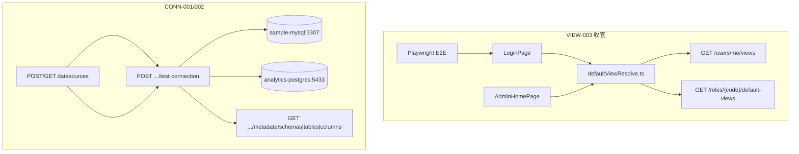

# M-FE-3 收官 + M3 关系型连接器设计 — VIEW-003 / CONN-001 / CONN-002

```yaml
date: 2026-07-06
milestone: M-FE-3（收官）+ M3
round_target: docs/superpowers/evolution/2026-07-06-round-target-view-003-m3-conn.md
base_branch: dev-auto
prd_ids: [VIEW-003, CONN-001, CONN-002]
ui_design_skill: .agents/skills/b-design-system-tailadmin-radix/SKILL.md
status: design
```

## 1. 批量主题与子项映射

| # | 子项 | PRD ID | 执行顺序 | 主攻薄弱维 | 用户感知 |
|---|------|--------|:--------:|------------|----------|
| 1 | VIEW-003 收官（Playwright E2E + 用户覆盖边缘 + plan 收口） | VIEW-003 | 1 | 完整度 **94%**；交互 **86%**；测试覆盖（补浏览器路径） | 消费账号登录后稳定进入角色默认 Dashboard；有个人视图时优先进入；无默认时有明确降级 |
| 2 | MySQL 连接器 compose 集成验收 | CONN-001 | 2 | 用户价值 **82%**；完整度 **92%** | 管理员对真实 MySQL 建源、连通性测试与 Schema 浏览可用 |
| 3 | PostgreSQL 连接器 compose 集成验收 | CONN-002 | 3 | 用户价值 **82%**；完整度 **92%** | 管理员对真实 PG 建源、连通性测试与 Schema 浏览可用 |

**依赖链**：VIEW-003（FE 收官，无阻塞）→ CONN-001/002（共享 `integration_env` compose 夹具与测试文件骨架，可同 Task 批处理）。

**上轮已交付（本轮不重复实现）**：

- `defaultViewResolve.ts` + `LoginPage`/`AdminHomePage` 集成 + vitest smoke（M-FE-3 r203）
- `MysqlConnector` / `PostgresConnector` 方言实现 + mock 单测（`test_datasources_l1.py` · `test_datasources_companion_r25.py` · r23/r24 质量测）
- `ConnectorRegistry` 注册 `mysql` / `postgresql`；`DatasourceFormPage` 已展示类型选项

## 2. 现状与约束（范围框定内已读）

| 项 | 现状 |
|----|------|
| `fe/src/lib/defaultViewResolve.ts` | 已实现角色 `default-views` 链解析（含 `inheritFromRoleId` 递归，深度 8）；**未**读取 `GET /users/me/views` |
| `fe/package.json` | **无** Playwright 依赖与 `e2e` 脚本 |
| `fe/e2e/` | **不存在** |
| `LoginPage.tsx` | 登录成功后 `resolveDefaultDashboardPath` → `navigate(resolved ?? from)` |
| `AdminHomePage.tsx` | 非平台管理员消费用户 resolve 后 `<Navigate>`；`null` 降级 `/admin/dashboards` |
| `DashboardListPage.tsx` | 已有「暂无 Dashboard」空态 |
| `docker-compose.yml` | `sample-mysql`（3307）+ `analytics-postgres`（5433）healthcheck 就绪 |
| `tests/conftest.py` `integration_env` | 检测 3307+5433 端口；仅返回 `analytics_url`；无连接器专用夹具 |
| `mysql.py` / `postgres.py` | 连通性测试 + `list_schemas/tables/columns` 已实现；**无** compose 实库集成测 |
| PRD `F04-CONN` | CONN-001/002 验收「type 已注册且 UI 可选」「连通性+schema+只读查询」仍 `[ ]`；mock 路径已绿 |
| PRD `F09-VIEW` VIEW-003 | M-FE-3 默认视图 `[x]`；Playwright E2E 与 M7 RLS 全链路仍 `[ ]` |
| `plan.md` §M-FE-3 | VIEW-003 唯一 `[ ]`；§M3 CONN-001/002 `[ ]` |

**范围框定模块**（3）：`fe/`（VIEW-003 E2E + defaultView 边缘）+ `backend/app/datasources/dialects/`（CONN 集成验收，方言代码预期无改动）+ `tests/`（pytest compose 集成 + vitest/Playwright）。

**真理源优先级**：`round-target` > `plan.md` §M-FE-3 / §M3 > `prd/F09-VIEW.md` · `F04-CONN.md` > b-design-system skill > `docs/services/datasources.md`。

**类型命名约定**：注册类型 canonical 为 `mysql` 与 `postgresql`（`PostgresConnector.type`）；round-target 文案「postgres」均映射为 `postgresql`，不新增别名。

## 3. 非目标（明确不做）

- 用户个人视图覆盖 **管理 UI**（创建/编辑/删除 override 页面；BE API 已存在）
- M7 RLS/ACL 端到端（PRD VIEW-003 末项，远期）
- 只读查询（QUERY）新对接或 SQL 执行扩展（CONN PRD 子项，非 round-target 验收）
- 组织树 UI（AUTH-002）、地图/热力/KPI（DASH-003）、VIEW-001 协议大改
- Dataset 语义层、M13 冻结项、M6/M7 远期 stub
- 修改 `goal.md`；创建/改结构 `plan.md`（P5 仅勾选已有 `- [ ] <prd ID>:` 行）
- 方言实现大改或新增连接器类型

## 4. 范围框定文件清单（≤18 主文件）

| 路径 | 子项 | 动作 |
|------|:----:|------|
| `fe/src/lib/defaultViewResolve.ts` | VIEW-003 | 修改：用户覆盖优先解析 + 边缘守卫 |
| `fe/src/lib/defaultViewResolve.test.ts` | VIEW-003 | 修改：覆盖/环/深度/403 边缘单测 |
| `fe/playwright.config.ts` | VIEW-003 | 新建：Playwright 配置 |
| `fe/e2e/login-default-dashboard.spec.ts` | VIEW-003 | 新建：登录→默认 Dashboard 浏览器 smoke |
| `fe/package.json` | VIEW-003 | 修改：devDep `@playwright/test` + `test:e2e` 脚本 |
| `fe/pnpm-lock.yaml` | VIEW-003 | 修改：锁文件 |
| `tests/test_connectors_compose_r207.py` | CONN-001,002 | 新建：compose 实库集成测 |
| `tests/conftest.py` | CONN-001,002 | 修改：增 `connector_compose_env` 夹具（mysql+pg 连接参数） |
| `docs/automate/prd/F09-VIEW.md` | VIEW-003 | P5：勾选 Playwright companion 验收项 |
| `docs/automate/prd/F04-CONN.md` | CONN-001,002 | P5：勾选 compose 集成验收项 |
| `docs/automate/plan.md` | 全项 | P5：§M-FE-3 VIEW-003 + §M3 CONN-001/002 勾选 |
| `docs/services/datasources.md` | CONN | P5：注明 compose 集成测路径（若锚点变化） |

> **文件预算**：12 行主文件（含 lockfile）。方言 `mysql.py`/`postgres.py` **预期零改动**；若集成测暴露缺陷，允许在对应方言文件内最小修复并计入预算。

## 5. PRD 8 维薄弱项对齐

| PRD ID | 薄弱维 | 本轮设计对策 |
|--------|--------|--------------|
| VIEW-003 | 完整度 94% | Playwright E2E 闭合浏览器路径；分片 + plan 勾选；用户覆盖边缘单测/E2E |
| VIEW-003 | 交互 86% | 登录重定向优先用户覆盖；无默认降级 `/admin/dashboards` 已有空态；加载 Skeleton 保持 |
| VIEW-003 | 测试覆盖 100%（维） | 补 Playwright + vitest 边缘用例（维分数已高，本轮补缺口而非重复 mock smoke） |
| CONN-001 | 用户价值 82% | compose `sample-mysql` 端到端：CRUD → test_connection → metadata schemas/tables/columns |
| CONN-001 | 完整度 92% | 集成测断言结构化 `ok`/`code`；失败路径不在本轮（mock 已覆盖） |
| CONN-002 | 用户价值 82% | compose `analytics-postgres` 对称集成路径 |
| CONN-002 | 完整度 92% | 与 MySQL 对称；`information_schema` 过滤行为保持现有实现 |

## 6. 方案比选（摘要）

### 6.1 用户视图覆盖与默认解析优先级

| 方案 | 说明 | 结论 |
|------|------|------|
| A FE 先 `GET /users/me/views`，有项则取首项（或 `name==="默认"`）`dashboardId`，否则走角色链 | 无新 BE；对齐 FR-VIEW-4「用户可覆盖」；L1 内存 store 顺序即插入序 | **采用** |
| B 新增 `GET /me/effective-default-view` 聚合端点 | 超出 round-target FE+tests 框定 | 否决 |
| C 仅角色链，忽略用户覆盖 | 不满足 round-target「用户视图覆盖边缘」 | 否决 |

### 6.2 Playwright E2E 运行模式

| 方案 | 说明 | 结论 |
|------|------|------|
| A Playwright + `page.route()` mock `/auth/login`、`/me`、`/roles/.../default-views`；`webServer` 启 Vite dev | CI 稳定、无全栈依赖；验证真实浏览器导航与登录表单交互 | **采用** |
| B 全栈 compose + 真实后端 seed | 最重；P4 历史因无 postgres seed 跳过截图 | 否决（辅：可选 local manual） |
| C 仅 vitest 不加 Playwright | 不满足 round-target 显式 Playwright 要求 | 否决 |

### 6.3 MySQL/PG 集成验收

| 方案 | 说明 | 结论 |
|------|------|------|
| A 新文件 `test_connectors_compose_r207.py` + `@pytest.mark.integration` + compose 端口检测 skip | 对齐 `test_ingestion_e2e.py` 模式；不破坏 CI 默认 mock 绿 | **采用** |
| B 强制 CI 启 compose | 超 round-target；增加运维负担 | 否决 |
| C 仅复跑 mock 单测 | 不闭合「真实 MySQL/PG 实例」验收 | 否决 |

## 7. 总体架构



## 8. 分项设计与验收标准

### 8.1 VIEW-003 — 登录默认视图收官

#### 8.1.1 `defaultViewResolve.ts` 扩展

**解析优先级**（自上而下，首个命中返回）：

1. **用户覆盖（companion）**：`GET /api/v1/users/me/views`
   - 若 `items` 非空：优先 `name === "默认"` 的项；否则取 `items[0]`
   - 若 `dashboardId` 非空 → `/admin/dashboards/{dashboardId}`
   - 403/404/网络错误：记录 `console.warn`，继续步骤 2（不阻断登录）
2. **角色默认链**（现有逻辑）：按 `roleCodes` 顺序 `GET /roles/{code}/default-views` → `dashboardId` 或 `inheritFromRoleId` 递归（`MAX_INHERIT_DEPTH=8`，`visited` 防环）
3. 全部未命中 → `null`

**导出签名不变**：

```typescript
export async function resolveDefaultDashboardPath(roleCodes: string[]): Promise<string | null>
```

#### 8.1.2 边缘场景（须单测覆盖）

| 场景 | 期望 |
|------|------|
| 用户有 override + 角色有 default | 进入 override 的 `dashboardId` |
| `me/views` 空数组 | 走角色链 |
| `inheritFromRoleId` 成环 | 该分支返回 `null`，尝试下一角色 |
| 继承深度 > 8 | 停止递归，返回 `null` |
| 某角色 403/404 | 跳过继续下一 `roleCode` |
| 全部 `null` + 消费用户 | `AdminHome` → `/admin/dashboards`；`LoginPage` → `from`（默认 `/admin`） |

#### 8.1.3 Playwright E2E

**文件**：`fe/e2e/login-default-dashboard.spec.ts`

**配置**：`fe/playwright.config.ts`

- `testDir: './e2e'`
- `baseURL: 'http://127.0.0.1:5173'`
- `webServer`: `pnpm dev --host 127.0.0.1 --port 5173`，`reuseExistingServer: !process.env.CI`
- `use`: `{ trace: 'on-first-retry' }`

**用例 T-VIEW-E2E-001**（mock 路径）：

1. `page.route('**/api/v1/auth/login', ...)` → 200 + `{ accessToken, tokenType, expiresIn }`
2. `page.route('**/api/v1/me', ...)` → `{ roles: ['viewer'] }`
3. `page.route('**/api/v1/users/me/views', ...)` → `{ items: [] }`
4. `page.route('**/api/v1/roles/viewer/default-views', ...)` → `{ dashboardId: 'd-smoke-1', inheritFromRoleId: null }`
5. 访问 `/login`；填写用户名/密码；提交
6. 断言 `page.url()` 含 `/admin/dashboards/d-smoke-1`

**用例 T-VIEW-E2E-002**（用户覆盖优先）：

- mock `me/views` 返回 `{ items: [{ dashboardId: 'd-override', name: '我的看板' }] }`
- 断言导航至 `/admin/dashboards/d-override`（即使角色 default 不同）

**脚本**：`package.json` 增 `"test:e2e": "playwright test"`；P4 验证命令含 `cd fe && pnpm test:e2e`（exit 0）。

#### 8.1.4 VIEW-003 可测试验收清单

- [ ] `defaultViewResolve.test.ts`：用户覆盖优先、环、深度、403 跳过 ≥4 新用例
- [ ] Playwright T-VIEW-E2E-001/002 exit 0
- [ ] 既有 vitest smoke（`AdminHome.smoke.test.tsx` T-VIEW-003-01）仍绿
- [ ] `pnpm run check:design` 无新增漂移
- [ ] P5：`plan.md` §M-FE-3 VIEW-003 勾选；`F09-VIEW.md` 增 Playwright companion 项 `[x]`（M7 全链路项保持 `[ ]`）

---

### 8.2 CONN-001 — MySQL compose 集成

#### 8.2.1 夹具 `connector_compose_env`（`tests/conftest.py`）

```python
@pytest.fixture(scope="session")
def connector_compose_env():
    if not (_port_open("127.0.0.1", 3307) and _port_open("127.0.0.1", 5433)):
        pytest.skip("compose not running — docker compose up -d sample-mysql analytics-postgres")
    return {
        "mysql": {
            "host": "127.0.0.1", "port": 3307,
            "database": "sample_db", "username": "sample", "password": "sample",
        },
        "postgresql": {
            "host": "127.0.0.1", "port": 5433,
            "database": "analytics", "username": "vitalspan", "password": "vitalspan",
        },
    }
```

#### 8.2.2 集成用例（`tests/test_connectors_compose_r207.py`）

标记 `@pytest.mark.integration`；复用 `ds_l1_sqlite_env` 元库模式（sqlite 内存 `data_sources` 表）。

| ID | 步骤 | 断言 |
|----|------|------|
| T-CONN-R207-M01 | `MysqlConnector().test_connection(**mysql)` | `ok is True`；`latency_ms >= 0` |
| T-CONN-R207-M02 | `open_connection` + `list_schemas` | 含 `sample_db` |
| T-CONN-R207-M03 | `list_tables(sample_db)` | 含 `dirty_orders` |
| T-CONN-R207-M04 | `list_columns(sample_db, dirty_orders)` | 含 `id`/`product_name` 列 |
| T-CONN-R207-M05 | HTTP：`POST /datasources` type=mysql → `POST .../test-connection` → `GET .../metadata/schemas` | 201/200；schemas 非空 |

#### 8.2.3 CONN-001 可测试验收清单

- [ ] `registry.get("mysql")` 含 `schema_browser`（回归，mock 已有）
- [ ] T-CONN-R207-M01~M05 compose up 时 exit 0；compose down 时 skip 不失败
- [ ] P5：`F04-CONN.md` CONN-001「连通性+schema」`[x]`；`plan.md` §M3 CONN-001 勾选

---

### 8.3 CONN-002 — PostgreSQL compose 集成

对称 MySQL，使用 `connector_compose_env["postgresql"]` 与 `PostgresConnector` / `type=postgresql`。

| ID | 步骤 | 断言 |
|----|------|------|
| T-CONN-R207-P01 | `test_connection` | `ok is True` |
| T-CONN-R207-P02 | `list_schemas` | 含 `public`；不含 `pg_catalog` |
| T-CONN-R207-P03 | HTTP metadata 链 | schemas → tables → columns 200 |

#### 8.3.1 CONN-002 可测试验收清单

- [ ] T-CONN-R207-P01~P03 compose up 时 exit 0
- [ ] 与 CONN-001 共享测试文件；总新增用例 ≥8
- [ ] P5：`F04-CONN.md` CONN-002 + `plan.md` §M3 CONN-002 勾选

---

## 9. UI 设计交付（VIEW-003 · Playwright 触及 FE）

`ui_design_skill`: `.agents/skills/b-design-system-tailadmin-radix/SKILL.md`

### 9.1 页面信息架构

| 路由 | 导航层级 | 主内容区 | 态 |
|------|----------|----------|-----|
| `/login` | 全屏居中（无侧栏） | `Card` `max-w-md` 登录表单 | 默认 / 提交 loading「登录中…」/ 错误 `role="alert"` 红框 |
| `/admin`（消费用户） | 壳层 index → 立即重定向 | 重定向前仅 `Skeleton` 占位 | loading → Navigate |
| `/admin/dashboards/{id}` | 壳层 > Dashboard 消费 | `max-w-(--breakpoint-2xl)` 全宽 view | 由既有 Dashboard 页承载 |

**无默认降级**：`/admin/dashboards` 列表页已有「暂无 Dashboard」— 本轮不新增页面，仅在 design 记录降级路径。

### 9.2 视觉层级

- **主操作**：登录页「登录」`Button variant="primary"` 全宽 `h-11`
- **次操作**：无（单表单页）
- **承载**：`Card variant="outlined" elevation={2}` 浮于 `bg-gray-50` / `dark:bg-gray-950` 全屏底

### 9.3 组件映射

| 场景 | 复用 | 禁止 |
|------|------|------|
| 登录表单 | `@/components/ui/button` · `card` · `input` · `label` | 原生 `<button>`/`<input>` |
| 重定向 loading | `@/components/ui/skeleton` | 全屏空白无反馈 |
| E2E 断言 | 现有文案「登录 VitalSpan」「登录中…」 | 新增未登记文案 |

### 9.4 Token 与密度

- 背景：`bg-gray-50` / `dark:bg-gray-950`（页面底）；卡片 `Card` 语义边框
- 错误态：`border-error-500` · `bg-error-50` · `text-error-700`（暗色 `error-500/15`）
- 间距：表单 `grid gap-4`；页边 `p-4`
- 字号：`text-title-sm`（标题）· `text-theme-sm`（描述/错误）

### 9.5 响应式与可访问性

- 登录卡 `w-full max-w-md`；`min-h-screen` 垂直居中
- 输入 `autoComplete`/`autoFocus` 保持；提交按钮 `disabled` + 文案切换
- 错误区 `role="alert"`；图标 `aria-hidden`
- 窄屏（375px）：E2E viewport 断言表单无横向溢出、按钮不被裁切

### 9.6 视觉 QA 清单（P3/P4）

| 检查项 | desktop 1280 | mobile 375 |
|--------|:------------:|:----------:|
| 登录卡居中、无大面积无意义空白 | ✓ | ✓ |
| 主按钮可读、无文字裁切 | ✓ | ✓ |
| 错误态边框/对比度（可 route mock 401） | ✓ | 可选 |
| 重定向后 Dashboard 壳层 framing 正常 | ✓ | ✓ |
| `check:design` exit 0 | 全局 | — |

截图路径（P4）：`docs/superpowers/evolution/p4-screenshots/view-003-login-{desktop,mobile}.png`（若全栈不可用，Playwright 内置 screenshot 附在验证报告）。

---

## 10. 验证命令（P4 参考）

```bash
# FE
cd fe && pnpm run check:design && pnpm test && pnpm test:e2e

# BE（默认 CI）
cd backend && ruff check . && pytest

# BE 集成（compose up 时）
cd backend && pytest ../tests/test_connectors_compose_r207.py -m integration -v
```

**回归门控**：`test_datasources_l1.py` + `test_datasources_companion_r25.py` + `test_datasources_quality_r23.py` + `test_datasources_quality_r24.py` 全绿；fe vitest 既有 129+ 用例不回归。

---

## 11. 风险与缓解

| 风险 | 缓解 |
|------|------|
| CI 无 compose 导致集成测全 skip | 接受；与 `test_ingestion_e2e` 一致；P4 主路径 mock 全绿即可 |
| Playwright 首装浏览器下载慢 | `npx playwright install chromium` 写入 P3 setup；仅 chromium |
| 用户覆盖 L1 无「默认」标记 | 约定 `name==="默认"` 优先，否则 `items[0]`；文档写入 spec |
| `postgresql` vs `postgres` 命名漂移 | 全栈统一 `postgresql`；不改注册 type |
