# M12 收官批 — 报表调度、批量导入、用户视图、浏览器兼容与 CAT-07 审计

```yaml
date: 2026-07-07
milestone: M12
round_target: docs/superpowers/evolution/2026-07-07-round-target-m12-batch1.md
base_branch: dev-auto
prd_ids: [RPT-005, RPT-007, VIEW-003, NFR-006, CAT-007]
ui_design_skill: .agents/skills/b-design-system-tailadmin-radix/SKILL.md
status: design
```

## 1. 批量主题与子项映射

本轮为 **M12 三期最后一节收官批**（plan §M12 余 **5 项 `[ ]`**），闭合报表定时调度、批量新增报表、用户视图覆盖合并验收、NFR-05 浏览器与推送、CAT-07 组织行为审计类；完成后满足 **P3-SMOKE** 前置条件。

| # | 子项 | PRD ID | 模块 | 顺序 | 主攻薄弱维 | 用户感知 |
|---|------|--------|------|:----:|------------|----------|
| 1 | 报表调度 FR-3.2 | RPT-005 | `reports/scheduler/` | 1 | 用户价值 **86%**；完整度 **90%** | Admin 为报表模板配置 cron；可手动触发；运行历史与失败信息可查 |
| 2 | 批量新增报表 FR-6.4 | RPT-007 | `reports/batch/` + FE | 2 | 用户价值 **86%**；完整度 **90%** | Admin 批量导入报表定义；结果摘要；部分失败可定位行号 |
| 3 | 用户视图覆盖 FR-VIEW-4（合并验收） | VIEW-003 | `views/` + `fe/` | 3 | 性能 **88%**；完整度 **96%→plan 可勾** | 个人设置管理默认 Dashboard 覆盖；登录优先用户覆盖再回落角色默认 |
| 4 | NFR-05 浏览器与消息推送 | NFR-006 | `core/nfr/` + FE smoke | 4 | 用户价值 **84%**（M12 五 ID 最低） | 平台声明主流浏览器矩阵；关键路径 compat smoke；站内推送骨架可创建/查询状态 |
| 5 | CAT-07 组织行为审计类 | CAT-007 | `governance/catalog/cat07/` | 5 | 用户价值 **84%**；架构健康 **88%** | 附录 E CAT-07 经 catalog m12-probe 可发现；ACL 受控执行 workno 行为查询 |

**依赖链**：RPT-005 APScheduler 注册与执行历史 → RPT-007 批量导入可挂接同一 catalog 节点校验 → VIEW-003 与 RPT 无硬依赖可并行 → NFR-006 / CAT-007 独立，末位回归门控合入 `test_m12_batch1_r238.py`。

**上轮已交付（本轮不重复实现）**：

- RPT-005 L1/companion：cron 校验、FSM、`POST/GET schedules`、`execute` mock/semi-real、`delivery.py` 重试模拟、`revisionSnapshot`（r53/r57/r58）
- RPT-007 L1/companion：`POST /reports/batch` 幂等、部分失败 `rolledBackCount`、`artifact` ACL、batch perf probe（r54/r55/r58）
- VIEW-003 M-FE-3：`defaultViewResolve` 用户 > 角色优先链、Playwright E2E 6/6、`POST/GET /users/me/views`（r203/r207）
- NFR-006 companion：`browser_matrix`、`push_channels` mock 降级、`GET browser-matrix`、`POST push-probe`（r46/r51）
- CAT-007 L1/companion：`GET /workno/behavior`、scope ACL、`probe_workno_behavior_budget_ms`（r60/r64）；`appendix_e.py` 已登记 CAT-07 taxonomy

**PRD / plan 漂移注记**：

| 项 | 分片状态 | plan §M12 | 本轮处理 |
|----|----------|-----------|----------|
| VIEW-003 | 分片多 `[x]`（M-FE-3 已勾） | 仍 `[ ]`「合并验收」 | 补个人设置 UI + DELETE/PUT + M12 合并 pytest/vitest；P5 勾选 plan |
| RPT-005/007 | 分片「部分实现 companion」 | `[ ]` | 补 APScheduler 实触发、列表/历史、Admin UI、plan 主流程勾选 |
| NFR-006 | 矩阵/推送 mock `[x]` | `[ ]` | 补声明文档、FE compat smoke、推送 create/status 骨架 API |
| CAT-007 | workno API `[x]`；审计联动 `[ ]` | `[ ]` | 补 m12-probe handler；**不**做真实 audit store |

**真理源优先级**：`round-target` > `plan.md` §M12 > `prd.md` hub + 分片 > `docs/services/` > `docs/api/README.md`。

## 2. 现状与约束（范围框定内已读）

| 项 | 现状 |
|----|------|
| `reports/scheduler/service.py` | 内存 `_schedules`；create/get/transition；**无** list、**无** APScheduler job 注册 |
| `reports/scheduler/executor.py` | mock/semi-real 执行；内存 `_EXECUTION_LOG`；**无**按 schedule 列历史、**无** retry API |
| `ingestion/scheduler.py` | `BackgroundScheduler` + `CronTrigger.from_crontab` 范式可参考 |
| `api/v1/reports/__init__.py` | schedules CRUD 片段式路由；**无** `GET /schedules` 列表 |
| `reports/batch/service.py` | JSON body 批量创建完整；**无** FE 导入 UI |
| `views/store.py` | `add_user_override`；**无** update/delete |
| `api/v1/views.py` | GET/POST `me/views`；**无** PUT/DELETE |
| `AccountSettingsPage.tsx` | 壳层占位；**无**个人视图区块 |
| `defaultViewResolve.ts` | 用户覆盖优先已实现；偏好 `name==="默认"` |
| `core/nfr/browser_matrix.py` | UA 探测 + 矩阵常量完整 |
| `core/nfr/push_channels.py` | `dispatch_push_mock` 单次探测；**无** notification 实体 CRUD |
| `governance/catalog/cat07/` | service/probe；**无** `handler.py`、**无** m12-probe 路由 |
| `gov.py` | CAT-04~06 已有 `m11-probe`；CAT-07 缺对称路由 |

**范围框定模块**（3）：`backend/app/reports/` + `backend/app/views/` & `fe/src/` + `backend/app/core/nfr/` & `governance/catalog/cat07/`。

## 3. 非目标（明确不做）

- M13 冻结项（Dataset、设计器、信创连接器全量、治理工单全流程）
- 分布式任务队列（Celery/RQ）、真实 SMTP/对象存储投递、SMS/邮件供应商集成
- Word/PDF 真实排版引擎、异步导出全链路
- Playwright 全浏览器矩阵 E2E（本轮 vitest feature detection + pytest HTTP smoke 替代）
- VIEW-003 M7 RLS/ACL 端到端、多租户隔离深化、DB 持久化迁移（Alembic）
- CAT-007 真实审计日志采集管道、跨系统 trace、fe 行为审计大盘
- 修改 `goal.md`；创建/改结构 `plan.md`（P5 仅勾选已有 `- [ ] <prd ID>:` 行）

## 4. 范围框定文件清单（≤20 主文件）

| 路径 | 子项 | 动作 |
|------|:----:|------|
| `backend/app/reports/scheduler/jobs.py` | RPT-005 | 新建：APScheduler 注册/刷新（镜像 `ingestion/scheduler.py`） |
| `backend/app/reports/scheduler/acl.py` | RPT-005 | 新建：viewer 只读 / admin+owner 写 / `RPT_SCHEDULE_FORBIDDEN` |
| `backend/app/reports/scheduler/service.py` | RPT-005 | 修改：list_schedules、owner 登记、transition→refresh job |
| `backend/app/reports/scheduler/executor.py` | RPT-005 | 修改：执行历史索引、retry_execution、失败 errorMessage |
| `backend/app/reports/scheduler/schemas.py` | RPT-005 | 修改：ScheduleListOut、ExecutionHistoryOut、RetryOut |
| `backend/app/api/v1/reports/__init__.py` | RPT-005, RPT-007 | 修改：list/history/retry 路由；batch 保持 |
| `backend/app/reports/batch/service.py` | RPT-007 | 修改：批内 `name` 去重预检；结构化 `failures[]` 含 `index`+`code` |
| `fe/src/pages/admin/reports/components/SchedulePanel.tsx` | RPT-005 | 新建：cron 表单 + FSM + 手动执行 + 历史表 |
| `fe/src/pages/admin/reports/components/BatchImportPanel.tsx` | RPT-007 | 新建：JSON 上传预览 + 导入结果摘要 |
| `fe/src/pages/admin/reports/ReportTemplatesPage.tsx` | RPT-005, RPT-007 | 修改：详情区增「调度」「批量导入」Tab |
| `backend/app/views/store.py` | VIEW-003 | 修改：`update_user_override` / `remove_user_override` |
| `backend/app/views/user_override.py` | VIEW-003 | 修改：update/delete 域逻辑 + 默认名守卫 |
| `backend/app/api/v1/views.py` | VIEW-003 | 修改：PUT/DELETE `me/views/{id}` |
| `fe/src/pages/admin/account/components/UserViewsSection.tsx` | VIEW-003 | 新建：列表/创建/设默认/删除 |
| `fe/src/pages/admin/account/AccountSettingsPage.tsx` | VIEW-003 | 修改：嵌入 UserViewsSection |
| `backend/app/core/nfr/notifications.py` | NFR-006 | 新建：内存 notification create/get + `dispatch_push_mock` 挂钩 |
| `backend/app/api/v1/nfr.py` | NFR-006 | 修改：POST/GET notifications；browser-matrix 文档链接字段 |
| `fe/src/lib/browserCompat.ts` | NFR-006 | 新建：feature detection + `checkBrowserCompat()` |
| `backend/app/governance/catalog/cat07/handler.py` | CAT-007 | 新建：`run_cat07_catalog_probe`（对齐 cat06 handler） |
| `backend/app/api/v1/gov.py` | CAT-007 | 修改：`GET .../workno-behavior/m12-probe` |

**测试与文档（不计入 20 主文件预算，P3/P5 同步）**：

| 路径 | 说明 |
|------|------|
| `tests/test_m12_batch1_r238.py` | ≥30 断言，五 ID 合一套件 + r237/r64/r51 回归引用 |
| `fe/src/lib/browserCompat.test.ts` | NFR-006 vitest compat smoke |
| `fe/src/pages/admin/account/UserViewsSection.smoke.test.tsx` | VIEW-003 vitest |
| `fe/src/pages/admin/reports/SchedulePanel.smoke.test.tsx` | RPT-005 vitest |
| `docs/nfr/browser-compatibility.md` | NFR-006 浏览器矩阵声明（P5） |
| `docs/api/README.md` | 新路由登记（P5） |
| `docs/services/reports.md` · `views.md` · `nfr.md` · `governance.md` | 域边界更新（P5） |

## 5. PRD 8 维薄弱项对齐

| PRD ID | 薄弱维 | 本轮设计对策 |
|--------|--------|--------------|
| RPT-005 | 用户价值 86% | Admin 调度 Tab：cron 可配置、手动执行按钮、历史表展示 status/error |
| RPT-005 | 完整度 90% | APScheduler 实 job + list/history/retry API；pytest FSM+ACL；plan 勾选 |
| RPT-007 | 用户价值 86% | BatchImportPanel：JSON 文件 → 预览行数 → 导入摘要（成功/失败/回滚） |
| RPT-007 | 完整度 90% | 批内重名预检 + `failures[]` 行级定位；pytest happy+partial |
| VIEW-003 | 性能 88% | `resolveDefaultDashboardPath` 保持单次 `me/views` 请求；UserViewsSection 列表分页 limit 20 |
| VIEW-003 | 完整度 96%→plan | M12 合并验收 pytest + vitest + 个人设置 CRUD；P5 plan §M12 勾选 |
| NFR-006 | 用户价值 84% | `browser-compatibility.md` 可引用矩阵；FE `checkBrowserCompat` 登录前软提示 |
| NFR-006 | 完整度 90% | notifications create/status API + push-probe 联动；pytest path smoke |
| CAT-007 | 用户价值 84% | m12-probe 返回 taxonomy 含 CAT-07 + behavior 样本可查 |
| CAT-007 | 架构健康 88% | handler 与 gov 路由对称 cat04~06；probe 预算 ≤50ms |

## 6. 方案比选（摘要）

### 6.1 RPT-005 — 定时触发

| 方案 | 说明 | 结论 |
|------|------|------|
| **A 复用 APScheduler BackgroundScheduler** | `jobs.py` 在 `transition→scheduled` 时 `add_job(semi_real_execute_schedule, CronTrigger)` | **采用** — 与 `ingestion/scheduler.py` 一致；L1 内存 store 足够 |
| B 仅文档声明 cron，不注册 job | 无真实 tick | 否决 — round-target 要求「定时调度可配置可感知」 |
| C 引入 Celery/Redis 队列 | 超范围 | 否决 |

### 6.2 RPT-007 — 批量导入载体

| 方案 | 说明 | 结论 |
|------|------|------|
| **A 保持 JSON API，FE 解析文件 POST 现有 `/batch`** | 无新 content-type；幂等 Key 由 FE 生成 UUID | **采用** |
| B 新增 multipart zip 解析 | 超 round-target 估文件数 | 否决 |
| C CSV 转换层 | FR-6.4 未强制 CSV | 否决（文档示例 JSON only） |

### 6.3 VIEW-003 — 个人设置入口

| 方案 | 说明 | 结论 |
|------|------|------|
| **A 扩展 `AccountSettingsPage` + `UserViewsSection`** | 路由已存在 `/admin/account/settings`；符合政企「账号设置」心智 | **采用** |
| B 新建顶级「我的视图」导航项 | 改 `layout.md` IA，超范围 | 否决 |
| C 仅 API 无 UI | 不满足 round-target FE 入口 | 否决 |

### 6.4 NFR-006 — 推送骨架

| 方案 | 说明 | 结论 |
|------|------|------|
| **A 内存 `NotificationRecord` + POST create 触发 `dispatch_push_mock`** | 与 GOV publish notifications 模式一致 | **采用** |
| B 复用 gov publish notifications | 域边界混乱 | 否决 |
| C 真实 WebPush | 超范围 | 否决 |

### 6.5 CAT-007 — probe 路由

| 方案 | 说明 | 结论 |
|------|------|------|
| **A `GET /gov/catalog/workno-behavior/m12-probe` + handler** | 对齐 CAT-04~06 `m11-probe` 命名；m12 轮次用 m12-probe | **采用** |
| B 扩展现有 `GET /workno/behavior` 加 probe 查询参数 | 混淆 IF-02 业务 API | 否决 |

## 7. 子项详细设计

### 7.1 RPT-005 — 报表调度

**目标**：闭合 FR-3.2 主流程——cron 配置 → 调度激活 → 自动/手动执行 → 历史与重试。

#### 7.1.1 `scheduler/jobs.py`

```python
# 伪代码契约
def get_report_scheduler() -> BackgroundScheduler: ...
def refresh_schedule_jobs() -> None:
    # 遍历 status=="scheduled" 的 row，add_job(
    #   semi_real_execute_schedule,
    #   CronTrigger.from_crontab(row["cron"], timezone=row["timezone"]),
    #   id=str(schedule_id),
    #   kwargs={...},
    #   replace_existing=True,
    # )
def register_job_on_transition(schedule_id, row) -> None: ...  # scheduled 时调用
def remove_job_on_cancel(schedule_id) -> None: ...
```

- 进程内单例；`main.py` lifespan 可选 `scheduler.start()`（与 ingestion 同模式，若已有则复用启动钩子）
- job 执行使用系统 actor `UserContext(id="schedule-system", roles=["admin"])`

#### 7.1.2 `scheduler/acl.py`

| 动作 | admin | catalog owner | viewer | 其他 |
|------|-------|---------------|--------|------|
| list/get schedules | ✓ | ✓（自己的） | ✓ 只读 | 403 |
| create/transition/execute | ✓ | ✓（自己的 catalog 节点） | ✗ | 403 |
| list executions | ✓ | ✓ owner | ✓ 只读 | 403 |
| retry | ✓ | ✓ owner | ✗ | 403 |

错误码：`RPT_SCHEDULE_FORBIDDEN`（403）。

#### 7.1.3 `service.py` 扩展

| 函数 | 契约 |
|------|------|
| `list_schedules(actor, *, catalog_node_id?, limit, offset)` | 返回 `{items, total}`；默认 limit 50 |
| `create_schedule` | 增 `owner_id=actor.id`；登记 catalog 节点 owner 校验 |
| `transition_schedule` | `scheduled` 时 `register_job_on_transition`；`cancelled` 时 `remove_job` |

#### 7.1.4 `executor.py` 扩展

| 函数 | 契约 |
|------|------|
| `_append_history(schedule_id, out, *, error_message?)` | 维护 `_HISTORY: dict[UUID, list[ExecutionRecord]]` |
| `list_executions(schedule_id, limit, offset)` | 按 `executedAt` 降序 |
| `retry_execution(execution_id, idempotency_key, actor)` | 仅当末次 `status` 含 `degraded`/`failed`；新 executionId；`parentExecutionId` 链接 |
| semi-real 失败路径 | `delivery_mock=fail` → `status=semi_real_failed` + `errorMessage` |

#### 7.1.5 API（`reports/__init__.py`）

| Method | Path | 说明 |
|--------|------|------|
| GET | `/api/v1/reports/schedules` | 列表；query `catalogNodeId` 可选 |
| GET | `/api/v1/reports/schedules/{id}/executions` | 运行历史 |
| POST | `/api/v1/reports/schedules/executions/{executionId}/retry` | Header `Idempotency-Key` 必填 |

现有 `POST .../execute` 保持不变；执行后写入 history。

#### 7.1.6 验收标准（可测试）

- [ ] `POST schedules` + transition `schedule` 后 APScheduler `get_jobs()` 含对应 id
- [ ] `POST .../execute` 与 cron tick 均产生 history 记录
- [ ] retry 对 degraded 执行返回新 execution，`parentExecutionId` 指向原记录
- [ ] viewer 调用 transition → 403 `RPT_SCHEDULE_FORBIDDEN`
- [ ] pytest：`T-RPT-R238-005-01~08`（FSM、ACL、history、retry、probe ≤35ms 回归）

---

### 7.2 RPT-007 — 批量新增报表

**目标**：Admin 可感知批量导入；API 校验与错误回执完备。

#### 7.2.1 `batch/service.py` 增量

| 规则 | 说明 |
|------|------|
| 批内重名 | 同一 payload 内 `name` 重复 → 422 `RPT_BATCH_DUPLICATE_NAME`（index 列表） |
| 模板引用 | `parent_id` 不存在 → 现有 404；`template_kind` 非法 → 422 |
| ACL | 非 admin 且非 parent folder owner → 403 `RPT_BATCH_FORBIDDEN`（复用 catalog acl） |
| 输出 | 保留 `createdNodeIds`；增 `failures: [{index, code, message}]`；`rolledBackCount` 不变 |

#### 7.2.2 FE `BatchImportPanel.tsx`

- 接受 `.json` 文件；客户端 `JSON.parse` 校验结构 `{ items: [...] }`
- 预览：表格列 name / parentId / templateKind / 行号
- 主操作「导入」：`POST /api/v1/reports/batch` + `Idempotency-Key: crypto.randomUUID()`
- 结果区：成功数、失败行、回滚数；失败行可展开 `code`+`message`（`mapApiError`）

#### 7.2.3 验收标准

- [ ] 10 项 batch happy path 201 + `createdNodeIds.length===10`
- [ ] 第 3 项故意非法 extension → 部分失败 + `rolledBackCount` + `failures[2].index===2`
- [ ] 重复 Idempotency-Key + 同 body → `idempotentReplay: true`
- [ ] FE vitest：文件解析错误、空 items、成功摘要渲染
- [ ] pytest：`T-RPT-R238-007-01~06`

---

### 7.3 VIEW-003 — 用户视图覆盖（M12 合并验收）

**目标**：FR-VIEW-4 全链路可感知——个人设置 CRUD + 登录解析优先级 + plan 合并勾选。

#### 7.3.1 BE 扩展

| API | 契约 |
|-----|------|
| PUT `/api/v1/users/me/views/{id}` | 可改 `name`/`dashboardId`/`layout`；冲突 409 |
| DELETE `/api/v1/users/me/views/{id}` | 204；不存在 404 |
| GET resolve（无新路由） | 继续 FE `defaultViewResolve`：`name==="默认"` 优先，否则首项 |

`create_override`：若用户无视图且 `name` 省略，默认 `"默认"`。

#### 7.3.2 FE `UserViewsSection.tsx`

- 列表：`DataTable` 风格（复用 `Card` + `Table` 组件）；列：名称、Dashboard ID、操作
- 创建：Dialog 表单——Dashboard 下拉（`GET /api/v1/dashboards` 已有列表 API 或手填 UUID）；名称默认「默认」
- 操作：「设为默认」（PUT 改名默认 + 其他改名备份）、删除（AlertDialog 确认）
- 空态：「尚未配置个人默认视图，将使用角色默认」
- 加载/错误：Skeleton + ErrorBanner（对齐 `ReportTemplatesPage`）

#### 7.3.3 解析链（不改动核心语义）

优先级保持不变：**用户覆盖（默认名 > 首项）> 角色 default-views 链 > `/admin/dashboards` 降级**。

#### 7.3.4 验收标准

- [ ] pytest：用户 A 两条 override，resolve 逻辑通过 API+store 单测；DELETE 后回落角色默认
- [ ] vitest：`defaultViewResolve` 回归 + UserViewsSection smoke
- [ ] Playwright E2E **回归**（已有 `login-default-dashboard.spec.ts` 6/6，P4 全量再跑，本轮不新增用例除非 CRUD 阻断登录路径）
- [ ] P5：`plan.md` §M12 VIEW-003 勾选 + PRD 补「个人设置 UI」验收行

---

### 7.4 NFR-006 — 浏览器与消息推送

#### 7.4.1 文档 `docs/nfr/browser-compatibility.md`

- 表格：Chrome/Edge/Firefox/Safari 最低版本（与 `SUPPORTED_BROWSER_MATRIX` 一致）
- 声明 IE11 unsupported
- 关键路径：登录、Dashboard 列表、报表模板页
- 链接 `GET /api/v1/nfr/browser-matrix`

#### 7.4.2 `browserCompat.ts`

```typescript
export type CompatResult = { supported: boolean; status: string; warnings: string[] };
export function checkBrowserCompat(): CompatResult;
// 检测：Promise、fetch、ResizeObserver、CSS.supports('color', 'var(--x)')
// 可选：解析 navigator.userAgent 调后端 browser-matrix（登录页软 Banner，非阻断）
```

vitest：mock UA chrome 90+ → supported；IE UA → unsupported。

#### 7.4.3 `notifications.py` + API

| 字段 | 类型 |
|------|------|
| id | UUID |
| channel | `browser` \| `wecom` \| `dingtalk` |
| message | str |
| status | `pending` → `delivered` \| `degraded` \| `failed` |
| createdAt | ISO8601 |
| delivery | PushDispatchResult 摘要 |

| Method | Path |
|--------|------|
| POST | `/api/v1/nfr/notifications` body `{message, channel?}` |
| GET | `/api/v1/nfr/notifications/{id}` |

create 时调用 `dispatch_push_mock` 更新 status；内存 store + `clear_notifications()` 测试钩子。

#### 7.4.4 pytest path smoke

- `GET /health` + `GET /nfr/browser-matrix` + `POST /nfr/notifications` + `GET .../{id}` 链路
- 带 Chrome UA 请求 browser-matrix → `overallStatus=supported`
- `T-NFR-R238-006-01~06`

---

### 7.5 CAT-007 — 组织行为审计类

#### 7.5.1 `cat07/handler.py`

```python
class Cat07CatalogProbeOut(BaseModel):
    category_code: str = "CAT-07"
    taxonomy_registered: bool
    behavior_probe_ok: bool
    acl_ready: bool
    sample_workno: str
    behavior_count: int
    elapsed_ms: float

def run_cat07_catalog_probe(actor: UserContext) -> Cat07CatalogProbeOut:
    # 1. appendix_e taxonomy 含 CAT-07
    # 2. query_behavior("EMP1001", ...) 成功
    # 3. probe_workno_behavior_budget_ms().ok
    # 4. set_user_workno_scope 可调用 → acl_ready
```

#### 7.5.2 路由

`GET /api/v1/gov/catalog/workno-behavior/m12-probe` → `run_cat07_catalog_probe`

viewer 跨 scope：`set_user_workno_scope(viewer, EMP1001)` 后查询 `EMP2002` → 403（回归 r64）。

#### 7.5.3 验收标准

- [ ] m12-probe 200 + `categoryCode=CAT-07` + `behaviorProbeOk=true`
- [ ] enterprise viewer forbidden 403 `CAT07_FORBIDDEN`
- [ ] `elapsedMs` 探测 budget
- [ ] pytest：`T-CAT-R238-007-01~05`

---

## 8. 架构总览

```mermaid
flowchart TB
    subgraph RPT005 [RPT-005 Scheduler]
        UI1[SchedulePanel] --> API1[reports/schedules API]
        API1 --> SVC1[scheduler/service]
        SVC1 --> JOB[scheduler/jobs APScheduler]
        JOB --> EXEC[scheduler/executor]
        EXEC --> DEL[delivery.py]
    end
    subgraph RPT007 [RPT-007 Batch]
        UI2[BatchImportPanel] --> API2[POST /reports/batch]
        API2 --> BATCH[batch/service]
    end
    subgraph VIEW003 [VIEW-003 Views]
        UI3[UserViewsSection] --> API3[users/me/views CRUD]
        API3 --> STORE[views/store]
        LOGIN[defaultViewResolve] --> API3
    end
    subgraph NFR006 [NFR-006 NFR]
        DOC[browser-compatibility.md]
        FE_BC[browserCompat.ts] --> API4[nfr/browser-matrix]
        API5[nfr/notifications] --> PUSH[push_channels mock]
    end
    subgraph CAT007 [CAT-007 CAT]
        API6[gov/.../m12-probe] --> H7[cat07/handler]
        H7 --> W7[workno/behavior]
    end
```



## 9. 测试策略

| 套件 | 门槛 |
|------|------|
| `tests/test_m12_batch1_r238.py` | ≥30 新断言，覆盖五 ID 主路径 |
| 回归 | `test_m11_batch3_r237` + `test_nfr_cat_r64` + `test_nfr_gov_conn_r51` 相关子集全绿 |
| FE vitest | 新增/修改 smoke + `defaultViewResolve` 回归；目标与当前基线 +6 用例 |
| FE check:design | 全量 PASS |
| ruff | clean |

**禁止**：删除旧测试套件；Playwright 全浏览器矩阵。

## 10. UI 设计交付

`ui_design_skill`: `.agents/skills/b-design-system-tailadmin-radix/SKILL.md`

### 10.1 页面信息架构

| 页面 | 导航层级 | 主内容区 | 状态 |
|------|----------|----------|------|
| 报表模板 · 调度 Tab | `/admin/reports/templates` → 选中模板 → Tab「调度」 | `max-w-(--breakpoint-2xl)` 内双栏：左 cron+FSM 表单，右执行历史表 | 空：未配置调度 CTA「创建调度」；加载 Skeleton；错误 ErrorBanner；viewer 只读禁用主操作 |
| 报表模板 · 批量导入 Tab | 同上 → Tab「批量导入」 | 单栏 Card：上传区 + 预览表 + 结果摘要 | 空：拖拽/选择 JSON；解析失败字段级 Alert；部分失败 amber 摘要块 |
| 账号设置 · 个人视图 | `/admin/account/settings` | 现有面包屑下新增 `UserViewsSection` Card | 空态文案；无权限隐藏创建按钮；删除 AlertDialog |

### 10.2 视觉层级

- **主操作**：`Button` default——「保存调度」「立即执行」「开始导入」「保存个人视图」
- **次操作**：`Button` outline——「暂停」「取消调度」「下载 JSON 样例」
- **危险操作**：删除个人视图、`variant="destructive"` + AlertDialog
- **承载**：调度/导入/个人视图均用 `Card` + `CardHeader`/`CardContent`；历史与预览用 `Table`；cron 用 `Input` + `Select`（时区）

### 10.3 组件映射

| 需求 | 复用 | 新建/扩展 |
|------|------|-----------|
| 页面壳 | `AdminPageShell` | — |
| 错误条 | `ReportTemplatesPage` 的 `ErrorBanner` 模式 | 抽到共有或本地复制（同 PR 禁止第三套样式） |
| 表单 | `Input`, `Select`, `Label`, `RequiredLabel` | — |
| 表格 | `@/components/ui/table` | — |
| 上传 | `Input type="file"` + `Button` | `BatchImportPanel` 封装 |
| 确认删除 | `AlertDialog` | — |
| Toast | `sonner` 仅全局成功/失败 | 字段错误禁 toast |

### 10.4 Token 与密度

- 语义色：`brand-500` 主按钮；`success-*` 导入成功；`warning-*` 部分失败；`error-*` 失败行
- 背景：Card `bg-white dark:bg-white/[0.03]`；边框 `border-gray-200 dark:border-gray-800`
- 间距：Card `p-6`；表行 `py-3`；表单项 `gap-4`
- 圆角：`rounded-2xl` 卡片；`rounded-lg` 输入
- 字号：`text-theme-sm` 表体；`text-title-sm` 区块标题
- 图标：`lucide-react` `size-4`——Clock（调度）、Upload（导入）、LayoutDashboard（视图）

### 10.5 响应式与可访问性

- 桌面：调度双栏 `lg:grid-cols-2`；移动单栏堆叠
- 窄屏：历史表 `overflow-x-auto`；操作列 sticky 可选
- 键盘：Dialog 焦点陷阱；Tab 顺序 表单→主按钮
- `aria-label`：文件上传「选择批量导入 JSON 文件」；执行按钮「手动执行报表调度」
- 长文本：失败 `message` 用 `line-clamp-2` + `title` tooltip

### 10.6 视觉 QA 清单

- [ ] Desktop（≥1280px）：三页面截图——调度 Tab、批量导入结果态、个人视图列表
- [ ] Mobile（375px）：调度表单堆叠无横向滚动；个人视图操作可触达
- [ ] Dark mode：三页面各 1 张，检查边框/文字对比
- [ ] 状态：加载 Skeleton、空态、错误 Banner、部分失败 warning 摘要
- [ ] 检查项：对齐、留白、主/次按钮层级、无 hex 硬编码（`check:design` PASS）

---

## 11. 文档同步（P5 清单）

| 变更 | 文档 |
|------|------|
| schedules list/history/retry | `docs/api/README.md` |
| notifications API | `docs/api/README.md` |
| m12-probe | `docs/api/README.md` |
| me/views PUT/DELETE | `docs/api/README.md` |
| 调度/batch 域边界 | `docs/services/reports.md` |
| 用户覆盖 CRUD | `docs/services/views.md` |
| 浏览器声明 + notifications | `docs/services/nfr.md` · `docs/nfr/browser-compatibility.md` |
| CAT-07 handler | `docs/services/governance.md` |
| plan §M12 五 ID | `docs/automate/plan.md` 勾选 |
| PRD 分片验收 | `F08-RPT` · `F09-VIEW` · `F15-NFR` · `F14-CAT` |

---

## 12. Spec Self-Review

| 检查项 | 结果 |
|--------|------|
| 覆盖 round-target 五子项 | 通过 |
| 未超出范围框定（≤3 模块、≤20 主文件） | 通过（20 主文件） |
| 无 TBD/TODO 占位 | 通过 |
| UI 设计交付完整 | 通过（§10） |
| 与 PRD 8 维薄弱项对齐 | 通过（§5） |
| 非目标明确 | 通过（§3） |
| 内部一致性 | 通过 |
