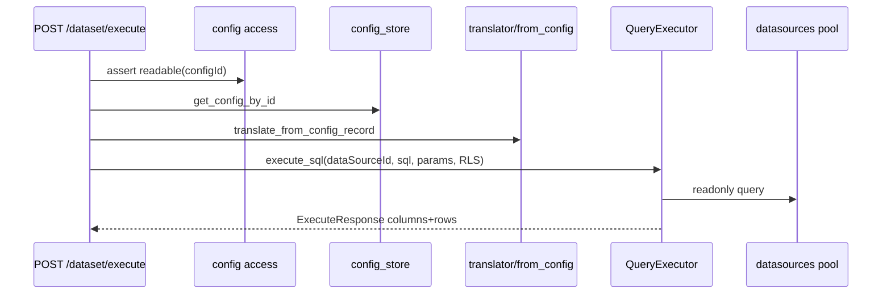

# Design Spec: M-FINAL · F-C 收官（GaussDB）+ F-D 查询链奠基（QUERY-007~009）

```yaml
date: 2026-07-07
round: r243
round_target: docs/superpowers/evolution/2026-07-07-round-target-mfinal-fc2-fd-kickoff.md
prd_ids: [CONN-022, QUERY-007, QUERY-008, QUERY-009]
phase: P1
ui_design_skill: .agents/skills/b-design-system-tailadmin-radix/SKILL.md
scope_file_count: 17
```

---

## 1. 批量主题与子项映射

| # | 子项 | PRD ID | 模块 | 执行顺序 | 主攻薄弱维 | 用户感知 |
|---|------|--------|------|:--------:|------------|----------|
| 1 | GaussDB companion 收官 | CONN-022 | `datasources/dialects/gaussdb.py` + `fe/` | 1 | 用户价值 84%→Admin 可选建源；性能 88%→只读探针 | 数据源类型含 GaussDB；表单字段/hints 正确；连通性测试与只读探针可验收 |
| 2 | 配置元模型 F-D 存储闭环 | QUERY-007 | `query/config_store/` | 2 | 安全性 88%→owner 隔离；用户价值 84%→Dataset 配置可持久化 | 平台可保存 `dataset_query` 语义配置；非法 payload 拦截；租户/owner 访问控制 |
| 3 | 存储配置→SQL 翻译衔接 | QUERY-008 | `query/translator/` + API | 3 | 用户价值 84%→配置可翻译；性能 88%→翻译 P95 smoke | 已存配置经 API 产出参数化 SQL；不完整配置返回 `QUERY_TRANSLATE_*` |
| 4 | Dataset 配置查询端到端路径 | QUERY-009 | `query/dataset/` + API | 4 | 完整度 88%→端到端可验收；用户价值 84%→Dataset 可出数 | `dataSourceId` + `configId` 走通 存储→翻译→执行→结果集（mock 执行链）；RLS/鉴权与 sql 路径一致 |

**依赖链**：CONN-022 `probe_readonly_sql` + FE hints → QUERY-007 `dataset_query` 类型 + owner 守卫 → QUERY-008 `translate_from_config` → QUERY-009 `execute_dataset_from_config` → `tests/test_mfinal_fd_r243.py` 集成链 → docs 锚点 → r242/r57/r33 回归门控。

**STUCK**：四 ID 均为本轮首次入选（CONN-022 上轮留批）；无连续未过轮次。

**上轮已交付（本轮不重复骨架）**：
- CONN-022：r38 L1 types catalog + r39 `GAUSSDB_*` 错误域 / columns limit / HTTP metadata 链（`test_query_meta_conn_r38/r39`）
- QUERY-007：r32 migration 0015 + `config_store` upsert/list/get；r33 256KB / 409 乐观锁
- QUERY-008：r38 `POST /query/translate` 三方言；r39 算子白名单与注入守卫
- QUERY-009：r53 内置 dataset ACL + validate/routing；r57 execute-plan 四步 stub 链

---

## 2. 上下文与问题陈述

### 2.1 当前痛点

| 子项 | 已有 | plan F-D/F-C 未勾原因 | 本轮缺口 |
|------|------|----------------------|----------|
| CONN-022 | 后端 L1 + companion mock 链完整 | PRD「UI 可选」「只读查询」未勾 | 无 `probe_readonly_sql`；`CONNECTOR_FIELD_HINTS` 无 `gaussdb`；`test_mfinal_fc_r242` 未覆盖 |
| QUERY-007 | 通用 config upsert 已实现 | F-D 需语义层 Dataset 配置真理源 | 无 `dataset_query` 类型契约；无 owner 级访问控制；无 F-D 集成 pytest 簇 |
| QUERY-008 | 独立 `TranslateRequest` API | F-D 需与存储配置衔接 | 无「configId → SQL」路径；设计器/ Dataset 无法引用已存配置 |
| QUERY-009 | 内置 `demo-orders` stub + execute-plan | F-D 需 `dataSourceId` + 配置出数 | 无 007+008 串联真实执行入口；execute-plan 非结果集 |

### 2.2 方案对比（brainstorming · Automation 覆盖）

**CONN-022**

| 方案 | 描述 | 结论 |
|------|------|------|
| A（推荐） | `probe_readonly_sql` + 扩 `test_mfinal_fc_r242` + FE hints（同 r242 五型范式） | **选用** |
| B | 扩展 `query/dialects` gaussdb 别名 + execute 集成 | 超模块框定；否决 |
| C | 仅 FE hints 无 probe | 无法满足 plan/PRD 只读集成测；否决 |

**QUERY-007~009 链**

| 方案 | 描述 | 结论 |
|------|------|------|
| A（推荐） | 新增 `dataset_query` config_type；`translate_from_config`；`POST /dataset/execute` 四步链（load→translate→execute_sql→response） | 最小增量闭合 F-D 前三项；不引入 `meta` 第四域 | **选用** |
| B | 新建 `metadata` Dataset ORM + META-004 先行 | 超 round-target（META 留批次 2）；否决 |
| C | 仅文档勾选 plan，不补执行链 | 无法满足 P4-SMOKE 前置；否决 |

---

## 3. 范围框定

### 3.1 模块（3）

| 模块 | 路径 | 职责 |
|------|------|------|
| 方言 companion | `backend/app/datasources/dialects/` | GaussDB 只读探针 |
| 查询语义链 | `backend/app/query/` | config_store / translator / dataset execute |
| Admin FE | `fe/src/pages/admin/datasources/` | GaussDB 表单 hints + smoke |

### 3.2 文件列表（17）

| 文件 | 子项 | 变更 |
|------|------|------|
| `backend/app/datasources/dialects/gaussdb.py` | CONN-022 | 新增 `probe_readonly_sql`（`connection.execute("SELECT 1")`，psycopg 委托） |
| `tests/test_mfinal_fc_r242.py` | CONN-022 | 追加 GaussDB ≥5 用例（types + probe + readonly-guard + HTTP test 无密码） |
| `fe/src/pages/admin/datasources/DatasourceFormPage.tsx` | CONN-022 | 扩展 `CONNECTOR_FIELD_HINTS.gaussdb` |
| `fe/src/pages/admin/datasources/datasource-form.smoke.test.tsx` | CONN-022 | 追加 GaussDB 选型 smoke（port 5432 + PG 风格库名标签） |
| `backend/app/query/config_store/schemas.py` | QUERY-007 | 新增 `dataset_query` 至 `ALLOWED_CONFIG_TYPES`；`DatasetQueryConfigPayload` Pydantic 校验器 |
| `backend/app/query/config_store/service.py` | QUERY-007 | `assert_config_access(record, actor)` owner/admin 守卫；list 非 admin 过滤 `owner_id` |
| `backend/app/query/config_store/access.py` | QUERY-007 | **新建** 访问控制 helper（≤40 行，避免 service 超 200 行） |
| `backend/app/api/v1/query_configs.py` | QUERY-007/008 | GET 接入 access 守卫；新增 `POST /{config_id}/translate` |
| `backend/app/query/translator/from_config.py` | QUERY-008 | **新建** `translate_from_config_record(record) → TranslateResponse` |
| `backend/app/query/dataset/schemas.py` | QUERY-009 | 新增 `DatasetExecuteRequest` / `DatasetExecuteResponse` |
| `backend/app/query/dataset/execute_config.py` | QUERY-009 | **新建** `execute_dataset_from_config(session, user, req)` 四步链 |
| `backend/app/api/v1/query.py` | QUERY-009 | 新增 `POST /query/dataset/execute` |
| `tests/test_mfinal_fd_r243.py` | QUERY-007~009 | **新建** ≥18 断言（config CRUD + translate + execute 链 + 非法输入 + owner 403） |
| `docs/api/README.md` | 全部 | 登记 translate-from-config、dataset/execute 路由 |
| `docs/services/query.md` | QUERY-007~009 | F-D r243 锚点与 In/Out 更新 |
| `docs/services/datasources.md` | CONN-022 | GaussDB probe + FE 可选 r243 状态 |
| `docs/automate/prd/F04-CONN.md` / `F05-QUERY.md` | 全部 | **P5 对账**（非 P3） |

**不在范围**：META-001~004（第四域 `metadata/`）；F-E 设计器 UI；F-G CONN-023~027；真实 GaussDB compose；translator 扩展 gaussdb/dm/trino 方言；修改 `goal.md` / `plan.md` 结构；新增 migration（复用 `query_config_records` 表）；Admin Dataset 配置器全页 UI。

---

## 4. CONN-022 — GaussDB companion

### 4.1 `probe_readonly_sql`

对齐 Kingbase / r242 范式：

```python
def probe_readonly_sql(self, connection: Any) -> bool:
  connection.execute("SELECT 1")
  return True
```

委托 `PostgresConnector.open_connection` 返回 psycopg 连接；不新建驱动分支。

### 4.2 集成测增量（`test_mfinal_fc_r242.py`）

| ID | 断言 |
|----|------|
| T-CONN-R242-022-01 | `export_type_catalog` 含 `gaussdb`，`displayName` 含「GaussDB」，`category=relational` |
| T-CONN-R242-022-02 | mock psycopg connection → `GaussdbConnector().probe_readonly_sql(conn)` True；`execute("SELECT 1")` |
| T-CONN-R242-022-03 | `POST /datasources/test` type=gaussdb mock 失败 → 响应无 `password` |
| T-CONN-R242-022-04 | `POST /query/readonly-guard` connectorType=gaussdb sql=SELECT 1 → 200 ok |
| T-CONN-R242-022-05 | `probe_test_connection_budget_ms` ≤ 现有 OceanBase 同级预算（可选 smoke，与 r242-020-05 同模式） |

**compose**：无 GaussDB 镜像 → 全部 mock；不新增 skip 占位除非沿用 r242 文件末尾模式。

### 4.3 8 维对齐

| 维 | 目标 |
|----|------|
| 用户价值 84% | FE 可选 + types 断言 → PRD「UI 可选」可勾 |
| 性能 88% | probe 预算 smoke（mock，≤30ms 级） |
| 测试覆盖 98% | +5 pytest |
| 安全性 88% | HTTP test 凭证不落响应（复用 r242-017-03 模式） |

---

## 5. QUERY-007 — 配置元模型 F-D 存储

### 5.1 `dataset_query` 配置契约

新增 `ALLOWED_CONFIG_TYPES` 成员：`dataset_query`。

**Payload schema**（`DatasetQueryConfigPayload`，存入 `payload` JSON）：

| 字段 | 类型 | 必填 | 说明 |
|------|------|:----:|------|
| `dataSourceId` | UUID | ✓ | 目标数据源（与 ROUND-TARGET QUERY-009 对齐） |
| `connectorType` | string | ✓ | 方言键（L1：`mysql`/`postgresql`/`clickhouse`） |
| `schema` | string | ✓ | 模式名 |
| `table` | string | ✓ | 表名 |
| `columns` | string[] | ✓ | 非空、禁 `*` |
| `conditions` | object | — | 同 `TranslateConditions` |
| `limit` | int | — | 默认 `query_default_limit` |
| `offset` | int | — | 默认 0 |

**ref 约定**：`refType=dataset`，`refId` 为逻辑 Dataset UUID（占位，META-004 前由客户端生成）；允许 `refType=design_draft` 兼容设计器草稿。

**校验时机**：PUT upsert 时若 `configType=dataset_query`，对 `payload` 运行 `DatasetQueryConfigPayload.model_validate`；失败 → 422 `CONFIG_INVALID_DATASET_QUERY` + fields。

### 5.2 Owner 访问控制

| 操作 | admin | 非 admin |
|------|-------|----------|
| PUT upsert | 写入 `owner_id=actor.id` | 同左 |
| GET by id | 任意记录 | `owner_id` 为 null 或匹配 actor；否则 403 `CONFIG_ACCESS_FORBIDDEN` |
| GET list | 全量 | 过滤 `owner_id IS NULL OR owner_id = actor.id` |

实现：`config_store/access.py` 导出 `assert_config_readable(actor, record)`；`query_configs.py` GET 路由调用。

### 5.3 验收 pytest（`test_mfinal_fd_r243.py` 子集）

| ID | 断言 |
|----|------|
| T-QUERY-R243-007-01 | PUT `dataset_query` 合法 payload → 200 + revision=1 |
| T-QUERY-R243-007-02 | PUT 缺 `dataSourceId` → 422 `CONFIG_INVALID_DATASET_QUERY` |
| T-QUERY-R243-007-03 | viewer GET 他人 owner 记录 → 403 |
| T-QUERY-R243-007-04 | admin GET 他人记录 → 200 |
| T-QUERY-R243-007-05 | payload 256KB 边界仍走既有 `CONFIG_PAYLOAD_TOO_LARGE`（回归 r33） |

---

## 6. QUERY-008 — 配置→SQL 翻译衔接

### 6.1 `translate_from_config_record`

**模块**：`backend/app/query/translator/from_config.py`

```
load record.config_type == "dataset_query"
  → DatasetQueryConfigPayload.validate(record.payload)
  → build TranslateRequest(connectorType, schema, table, columns, conditions, limit, offset)
  → translate_config_to_sql(request)
  → TranslateResponse
```

**错误映射**：

| 条件 | code |
|------|------|
| config_type 非 `dataset_query` | `QUERY_TRANSLATE_INVALID_CONFIG` 422 |
| payload 缺字段 | `QUERY_TRANSLATE_INVALID_CONFIG` 422 + fields |
| 方言不支持 | `QUERY_TRANSLATE_UNSUPPORTED_DIALECT` 422 |
| 字段不在 registry | `QUERY_TRANSLATE_UNKNOWN_FIELD` 422 |

### 6.2 API

`POST /api/v1/query/configs/{config_id}/translate`

- 鉴权：Bearer + `assert_config_readable`
- 响应：`TranslateResponse`（与 `/query/translate` 同形）
- 无 body；参数来自存储 payload

### 6.3 验收 pytest

| ID | 断言 |
|----|------|
| T-QUERY-R243-008-01 | 存 mysql `dataset_query` → translate → SQL 含反引号 + `%(p0)s` |
| T-QUERY-R243-008-02 | 非法 operator → 422 `QUERY_TRANSLATE_INVALID_OPERATOR` |
| T-QUERY-R243-008-03 | `configType=query_conditions` → 422 `QUERY_TRANSLATE_INVALID_CONFIG` |
| T-QUERY-R243-008-04 | `probe_translate_from_config_budget_ms` ≤15ms smoke（mock，无 DB round-trip） |

### 6.4 与既有执行路径衔接

`translate_from_config_record` 产出 `(sql, parameters, connectorType)` 供 QUERY-009 调用 `QueryExecutor.execute_sql`；**不**在 translator 模块内执行。

---

## 7. QUERY-009 — Dataset 配置查询路径

### 7.1 架构



### 7.2 `DatasetExecuteRequest`

```json
{
  "dataSourceId": "<uuid>",
  "configId": "<uuid>",
  "parameters": {},
  "limit": 100,
  "offset": 0,
  "rls": { "enabled": true, "tableAlias": "t", "orgColumn": "org_id" }
}
```

**守卫**：
1. `config.payload.dataSourceId` 必须与 request `dataSourceId` 一致 → 否则 422 `QUERY_DATASET_CONFIG_MISMATCH`
2. `assert_visible` 数据源 ACL（复用 `query/service.py`）
3. `assert_config_readable` 配置 ACL
4. RLS 默认 enabled；dev 可关（与 sql 路径一致）
5. 合并 request `parameters` 覆盖 translate 产出（仅允许 registry 内绑定键；禁 `_sql`/`__proto__`）

### 7.3 `execute_dataset_from_config`

**模块**：`backend/app/query/dataset/execute_config.py`

步骤：
1. `get_config_by_id` + access
2. `translate_from_config_record`
3. 合并 parameters + `assert_safe_sql_parameters`（复用 readonly 模块）
4. `_executor.execute_sql(session, user, data_source_id, sql, parameters=..., limit, offset, rls_config, apply_rls=True)`
5. 返回 `DatasetExecuteResponse`（包装 `ExecuteResponse` + `configId` + `configRevision`）

**与 r53 内置 dataset 边界**：`POST /dataset/execute` 专用于 **configId 路径**；`demo-orders` 内置集仍走 `validate` / `execute-plan`；`resolve_query_path` **不修改**（避免破坏 r53 三路径契约）。`dataset/execute` 为 F-D 第四入口，文档注明与 builtin datasetId 正交。

### 7.4 Mock 执行集成测

| ID | 断言 |
|----|------|
| T-QUERY-R243-009-01 | 全流程：创建 DS mock + PUT dataset_query + POST execute → 200 + rows 非空（mock pool） |
| T-QUERY-R243-009-02 | configId/dataSourceId 不一致 → 422 `QUERY_DATASET_CONFIG_MISMATCH` |
| T-QUERY-R243-009-03 | viewer 无 DS ACL → 403 |
| T-QUERY-R243-009-04 | parameters 含 `_sql` → 422 `QUERY_DATASET_PLAN_INVALID_PARAMS`（复用错误码） |
| T-QUERY-R243-009-05 | admin RLS bypass → 仍 assert_visible；RLS 跳过与 sql 路径一致（回归 r27） |

**Mock 策略**：`unittest.mock.patch` `pool_manager.execute_readonly` 或 `QueryExecutor.execute_sql` 返回固定 2 行；**不**要求 compose。

### 7.5 8 维对齐

| 维 | 目标 |
|----|------|
| 完整度 88% | 007→008→009 单测文件端到端 ≥1 条 |
| 用户价值 84% | API 返回真实 `columns`/`rows` 结构 |
| 可靠性 94% | ACL + RLS 403/空集路径覆盖 |
| 性能 88% | translate smoke ≤15ms；execute-plan 预算不回归 |

---

## 8. UI 设计交付（CONN-022 · GaussDB）

`ui_design_skill`: `.agents/skills/b-design-system-tailadmin-radix/SKILL.md`

QUERY-007~009 本轮**无 Admin 新页面**；仅 CONN-022 触及 `DatasourceFormPage`。

### 8.1 页面信息架构

| 项 | 规格 |
|----|------|
| 导航 | `/admin/datasources/new` · `AdminPageShell`「新建数据源」 |
| 主内容 | `Card max-w-2xl mx-auto`（与 r242 一致，禁止扩宽） |
| 空态 | types API 失败回退 mysql（保持现状） |
| 加载态 | edit 模式 `Skeleton h-64` |
| 错误态 | 顶栏 `border-error-500 bg-error-50` + `mapApiError` |
| 权限态 | `RequirePlatformAdmin`（既有） |

### 8.2 视觉层级

| 元素 | 规则 |
|------|------|
| 主操作 | 「保存」`Button variant="primary"` 底栏全宽 |
| 次操作 | 「返回列表」`outline` 于 shell actions |
| GaussDB 辅助 | 类型 Select 下方可选一行 `text-theme-sm text-gray-500`：「GaussDB 兼容 PostgreSQL 协议，默认端口 5432」 |

### 8.3 组件映射

| 需求 | 组件 |
|------|------|
| 类型下拉 | 既有 `Select` |
| 端口/库名 | 既有 `Input` + `Label` |
| 测试 | vitest RTL smoke（扩展现有 `datasource-form.smoke.test.tsx`） |

**禁止**：手写 dropdown；页面内新 Button/Input 样式；新建 Alert 组件。

### 8.4 Token 与密度

- 字段 `gap-4`；host/port `sm:grid-cols-2`
- 辅助文案 `text-theme-sm text-gray-500 dark:text-gray-400`
- 提交前 `pnpm run check:design` 无新增 hex

### 8.5 `CONNECTOR_FIELD_HINTS` 增量

```typescript
gaussdb: {
  port: "5432",
  databaseLabel: "数据库 / Schema",
  usernameLabel: "用户名",
},
```

### 8.6 响应式与可访问性

- 桌面：与现表单同布局
- 窄屏：host/port 堆叠（既有 grid 断点）
- Select：`combobox` role；选项含 displayName「GaussDB」
- 长标签「数据库 / Schema」：Label 允许换行，Input 不截断

### 8.7 视觉 QA 清单

| 检查项 | desktop | mobile |
|--------|:-------:|:------:|
| 选 GaussDB 后 port=5432 | ✓ | ✓ |
| 库名 Label 含 Schema | ✓ | ✓ |
| 辅助说明不挤压主表单 | ✓ | ✓ |
| 错误条不遮挡类型 Select | ✓ | ✓ |
| dark 模式辅助文案可读 | ✓ | —（smoke 覆盖 light；P4 可 spot-check） |

**P3/P4**：`check:design` + vitest smoke；headless 云环境截图可选 skip（与 r242 一致，RTL smoke 替代）。

---

## 9. 测试与回归门控

| 套件 | 期望 |
|------|------|
| `test_mfinal_fc_r242.py` | 原 25 passed + GaussDB ≥5 → ≥30 passed |
| `test_mfinal_fd_r243.py` | 新建 ≥18 passed |
| `test_meta_design_r33.py` | QUERY-007 回归全绿 |
| `test_query_meta_conn_r38/r39.py` | QUERY-008 回归全绿 |
| `test_dash_rpt_query_nfr_r53/r57.py` | QUERY-009 builtin 路径不回归 |
| `ruff` + `fe vitest` + `check:design` | exit 0 |

---

## 10. 文档同步（P3/P5）

| 变更 | 文档 |
|------|------|
| `POST /query/configs/{id}/translate` | `docs/api/README.md` |
| `POST /query/dataset/execute` | `docs/api/README.md` |
| F-D 链路与边界 | `docs/services/query.md` |
| GaussDB probe + FE | `docs/services/datasources.md` |
| PRD 勾选 | `F04-CONN.md` CONN-022；`F05-QUERY.md` QUERY-007~009（**P5**） |
| plan 勾选 | F-C CONN-022；F-D QUERY-007~009（**P5**，禁止改结构） |

---

## 11. 非目标（明确不做）

- META-001~004 术语/主题树/维度/Dataset ORM CRUD
- F-E 设计器画布、工单、发布 UI
- F-G CONN-023~027
- translator 注册 gaussdb/dm/trino 方言
- 真实 GaussDB / 信创 compose E2E
- 修改 `goal.md`
- 新增 Alembic migration
- 替换 r53 内置 `demo-orders` 为 DB 持久化 Dataset

---

## 12. PRD 8 维薄弱项对齐汇总

| PRD ID | 薄弱维 | 设计闭合 |
|--------|--------|----------|
| CONN-022 | 用户价值 84%、性能 88% | FE hints + probe + types 断言 |
| QUERY-007 | 用户价值 84%、安全性 88% | `dataset_query` 持久化 + owner 403 链 |
| QUERY-008 | 用户价值 84%、性能 88% | config→translate API + ≤15ms smoke |
| QUERY-009 | 用户价值 84%、完整度 88% | execute 返回 rows + 端到端 mock 集成测 |

---

## 13. Spec self-review

- [x] 覆盖 round-target 四子项
- [x] 17 文件 ≤18 上限；3 模块
- [x] 无 TBD/TODO 占位
- [x] CONN-022 与 QUERY 链无模块冲突
- [x] UI 设计交付完整（GaussDB only）
- [x] 与 r242/r38/r53/r57 既有交付边界清晰
- [x] 禁止生产代码（本文档仅设计）

**下轮建议**：F-D 批次 2 → META-001~004；或并行 F-G CONN-023~024。
